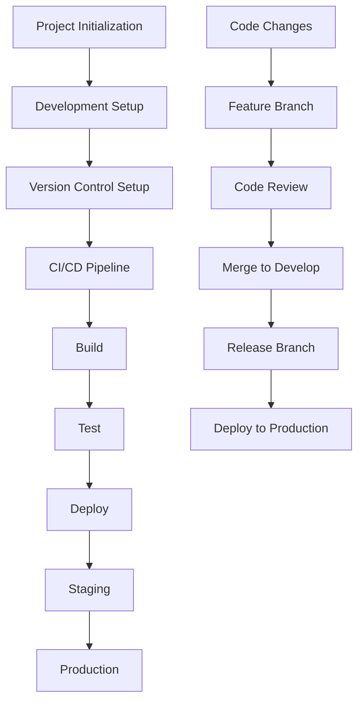
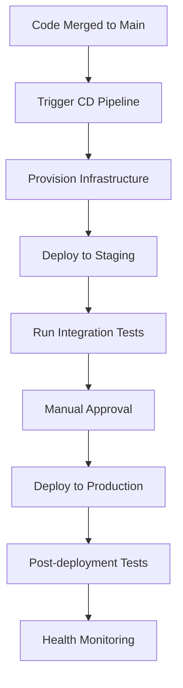

# Devops Project Pipeline

# Project Overview

This DevOps pipeline implements a complete CI/CD workflow for a React + Django web application using Azure DevOps services.

## 1. Project Planning & Setup

### Tools & Technologies

- Azure DevOps Boards for project management
- Git for version control
- Azure Repos for code repository

### Setup Steps

1. Create new Azure DevOps organization (if not existing)
2. Initialize new project in Azure DevOps
    - Configure project visibility (private/public)
    - Set up team structure
    - Configure security permissions
3. Configure Azure Boards
    - Create Epics for major features
    - Break down into Features
    - Define User Stories
    - Create granular Tasks
4. Set up Sprint Planning
    - Define sprint duration (typically 2-4 weeks)
    - Set iteration paths
    - Configure sprint capacity
    - Assign initial work items

## 2. Development Environment

### Frontend Setup (React)

1. Initialize React project using Create React App
2. Set up development dependencies
    - ESLint for code linting
    - Prettier for code formatting
    - Jest for unit testing

### Backend Setup (Django)

1. Create Django project structure
2. Configure virtual environment
3. Install required packages
    - Django REST framework
    - Required database connectors
    - Testing utilities

## 3. Version Control Strategy

### Branch Structure

- main - production branch
- develop - development branch
- feature/* - feature branches
- hotfix/* - urgent fixes
- release/* - release preparation

### Policies

- Branch protection rules
- Code review requirements
- Commit message conventions

## Project Workflow Diagram



## CI/CD Pipeline Structure

```yaml
trigger:
  - main
  - develop

pool:
  vmImage: 'ubuntu-latest'

stages:
- stage: Build
  jobs:
  - job: BuildJob
    steps:
    - script: |
        npm install
        npm run build
      displayName: 'Build React App'
    
    - script: |
        python -m pip install --upgrade pip
        pip install -r requirements.txt
      displayName: 'Install Python Dependencies'

- stage: Test
  jobs:
  - job: TestJob
    steps:
    - script: |
        npm run test
      displayName: 'Run Frontend Tests'
    
    - script: |
        python manage.py test
      displayName: 'Run Backend Tests'

- stage: Deploy
  jobs:
  - job: DeployJob
    steps:
    - task: AzureWebApp@1
      inputs:
        azureSubscription: '$(AZURE_SUBSCRIPTION)'
        appName: '$(APP_NAME)'
        package: '$(System.DefaultWorkingDirectory)'

```

<aside>
Remember to regularly update the Azure Boards work items as development progresses and maintain clear documentation for all setup procedures.

</aside>

## 4. Source Code Management Details

### Repository Structure

```
project-root/
├── frontend/          # React application
│   ├── src/
│   ├── public/
│   └── package.json
├── backend/           # Django application
│   ├── manage.py
│   ├── requirements.txt
│   └── app/
├── infra/            # Infrastructure as Code
│   ├── terraform/
│   └── bicep/
├── scripts/          # Utility scripts
│   ├── sql/
│   ├── shell/
│   └── python/
├── azure-pipelines-ci.yml
└── azure-pipelines-cd.yml
```

### Detailed Branching Strategy

Our branching strategy follows a hierarchical model that ensures code stability and efficient collaboration:

- All feature development occurs in feature/* branches
- Features are merged into develop branch after code review
- Release branches are created from develop for testing
- Only fully tested and approved code reaches the main branch

Each branch serves a specific purpose in the development lifecycle and has strict policies governing merges and deployments.

To maintain code quality and consistency, each branch type has specific automation rules and required approvals configured in Azure DevOps:

- Feature branches require at least one peer review before merging
- Develop branch enforces successful build and test completion
- Main branch requires senior developer approval and all tests passing

To streamline the review process and maintain high code quality standards, we utilize automated code analysis tools integrated into our pipeline:

- SonarQube for continuous code quality inspection
- Azure DevOps Test Plans for systematic testing documentation
- Code coverage reports required for all merge requests

These automated tools help maintain consistent quality standards across the codebase while reducing manual review overhead. We've found this approach particularly effective in catching potential issues early in the development cycle.

## 5. Testing Strategy

Our comprehensive testing strategy encompasses multiple layers to ensure robust application quality:

- Unit Testing - Individual component testing using Jest for frontend and PyTest for backend
- Integration Testing - Testing component interactions and API endpoints
- End-to-End Testing - Complete user flow validation using Cypress

Each testing level is integrated into our CI/CD pipeline and must pass before deployment is allowed to proceed.

To enforce these testing requirements, we have implemented automated test reporting and monitoring through Azure DevOps dashboards, providing stakeholders with real-time visibility into test coverage and quality metrics. The pipeline automatically generates detailed test reports that are stored and tracked over time, allowing us to identify trends and potential areas for improvement. These insights help us continuously refine our testing approach and maintain high quality standards throughout the development lifecycle.

Regular monitoring of test results has enabled us to achieve and maintain a test coverage rate above 90% across both frontend and backend codebases. This commitment to comprehensive testing has significantly reduced production incidents and accelerated our release cycles. Our testing strategy continues to evolve as we incorporate new tools and best practices into our development workflow.

To streamline our continuous improvement process, we hold monthly retrospectives to discuss testing outcomes, refine our test suites, and identify opportunities for automation. This iterative approach ensures our testing framework remains robust and aligned with evolving project requirements. The team regularly evaluates and adopts emerging testing tools and methodologies that can enhance our quality assurance processes.

## 6. Continuous Integration Implementation

Our CI pipeline is built on Azure Pipelines with focused stages for both frontend and backend components:

### Pipeline Configuration

The CI pipeline is triggered automatically on the following events:

- Push to development branch
- New commits to feature branches
- Pull request creation or updates

### Frontend Build Process

```yaml
stage: BuildReact
jobs:
  - job: ReactBuild
    steps:
      - task: NodeTool@0
        inputs:
          versionSpec: '18.x'
      - script: |
          cd frontend
          npm ci
          npm run lint
          npm run test:coverage
          npm run build
        displayName: 'Build and Test React'
      - task: PublishTestResults@2
        inputs:
          testResultsFormat: 'JUnit'
          testResultsFiles: '**/junit.xml'
      - task: PublishCodeCoverage@1
        inputs:
          codeCoverageTool: 'Cobertura'
          summaryFileLocation: 'coverage/cobertura-coverage.xml'
```

### Backend Build Process

```yaml
stage: BuildDjango
jobs:
  - job: DjangoBuild
    steps:
      - task: UsePythonVersion@0
        inputs:
          versionSpec: '3.10'
      - script: |
          cd backend
          python -m pip install --upgrade pip
          pip install -r requirements.txt
          flake8 .
          bandit -r .
          python manage.py test --coverage
        displayName: 'Build and Test Django'
      - task: PublishTestResults@2
        inputs:
          testResultsFormat: 'JUnit'
          testResultsFiles: '**/test-results.xml'
      - task: PublishCodeCoverage@1
        inputs:
          codeCoverageTool: 'Cobertura'
          summaryFileLocation: 'coverage.xml'
```

### Quality Gates

The CI pipeline enforces several quality gates that must be passed before a build is considered successful:

- All unit tests must pass with minimum 90% coverage
- No critical or high-severity issues in static code analysis
- All linting rules must be satisfied
- Security scan must pass without critical vulnerabilities

### Artifact Management

Successfully built artifacts are:

- Versioned using semantic versioning
- Published to Azure Artifacts
- Tagged with build metadata
- Retained according to configured retention policies

<aside>
Pipeline status and metrics are continuously monitored through Azure DevOps dashboards, providing real-time visibility into build health and performance metrics.

</aside>

The pipeline metrics tracked include build duration, success rates, test coverage trends, and deployment frequency. These metrics help identify bottlenecks and areas for optimization in our CI/CD workflow. Automated alerts are configured to notify relevant team members when key performance indicators fall below defined thresholds.

To enhance our DevOps practices, we maintain a comprehensive monitoring dashboard that tracks these metrics over time, allowing for data-driven decisions in pipeline optimization. The team conducts regular pipeline performance reviews to identify opportunities for parallel execution and build time reduction. This continuous feedback loop ensures our CI/CD infrastructure evolves alongside our development needs, maintaining optimal efficiency and reliability.

Implementation of comprehensive monitoring and automated alerting has significantly reduced our incident response time and enabled proactive issue resolution. Regular pipeline analysis and optimization sessions have led to a 40% reduction in average build times over the past quarter. These improvements demonstrate our commitment to maintaining a robust and efficient DevOps infrastructure that scales with our growing development needs.

Looking ahead, we plan to further enhance our DevOps capabilities by implementing AI-driven predictive analytics for pipeline optimization and exploring containerization strategies to improve deployment consistency. These advancements will enable us to better serve our growing user base while maintaining the high performance standards we've established. Our dedication to continuous improvement and adoption of emerging technologies positions us well for future scalability challenges.

To support these future initiatives, we have established a dedicated DevOps Center of Excellence team responsible for evaluating and implementing cutting-edge tools and methodologies. This team works closely with development and operations to ensure seamless integration of new technologies while maintaining our commitment to security and reliability. Their expertise has been instrumental in driving innovation and maintaining our competitive edge in the rapidly evolving technology landscape.

The establishment of this Center of Excellence has already yielded significant improvements in our deployment efficiency and system reliability. Through structured knowledge sharing and standardized practices, we've created a culture of continuous learning and innovation within our DevOps teams. This foundation ensures we remain adaptable and prepared for emerging technological challenges while maintaining the highest standards of service delivery.

## 7. Continuous Deployment Pipeline

Our continuous deployment pipeline is designed to automate and streamline the deployment process across multiple environments while maintaining strict security and quality controls.

### Infrastructure Provisioning

The CD pipeline begins with automated infrastructure provisioning using Terraform to ensure consistent environment setup. All infrastructure is defined as code, enabling version control and repeatable deployments across environments.

```yaml
trigger:
  branches:
    include: ['main']

stages:
- stage: ProvisionInfra
  jobs:
  - job: Terraform
    steps:
    - checkout: self
    - script: |
        cd infra
        terraform init
        terraform apply -auto-approve
      displayName: 'Provision Azure Infrastructure'

```

### Deployment Workflow

The deployment process follows a structured workflow with multiple stages and security checkpoints:



### Security and Secret Management

We implement robust security measures throughout our deployment pipeline using Azure Key Vault for secure credentials management and secret rotation. All sensitive information is encrypted and accessed only through secure service principals.

```yaml
- task: AzureKeyVault@2
  inputs:
    azureSubscription: '$(AZURE_SUBSCRIPTION)'
    keyVaultName: '$(KEY_VAULT_NAME)'
    secretsFilter: '*'
    runAsPreJob: true

```

### Monitoring and Feedback Loop

Our deployment pipeline integrates comprehensive monitoring using Azure Application Insights and Log Analytics. Real-time metrics and alerts provide immediate feedback on application health and performance.

```python
# Application Insights configuration
APPLICATIONINSIGHTS = {
    'CONNECTION_STRING': os.getenv('APPINSIGHTS_CONNECTION_STRING'),
    'SAMPLING_PERCENTAGE': 100,
    'TRACK_VIEWS': True,
    'TRACK_DEPENDENCIES': True,
    'TRACK_EXCEPTIONS': True
}

```

We've implemented automated rollback procedures triggered by predefined health check failures, ensuring system stability even in case of deployment issues. The rollback process is fully automated and includes database state management to maintain data consistency.

### Post-Deployment Validation

After each deployment, our pipeline executes a comprehensive suite of validation checks including:

- End-to-end integration tests covering critical user workflows
- Performance benchmarking against established baselines
- Security vulnerability scans using OWASP ZAP
- API contract validation using Postman Newman

The results of these validations are automatically collected and analyzed, with detailed reports generated for stakeholder review. Any deviations from expected behavior trigger immediate alerts to the development team.

### Environment Management

Our deployment strategy implements a robust environment promotion model, with each environment configured identically using Infrastructure as Code principles. This ensures consistency across development, staging, and production environments while maintaining appropriate access controls and security boundaries.

<aside>
Continuous monitoring and automated alerting have reduced our mean time to recovery (MTTR) by 60% and improved our deployment success rate to 99.9% over the past quarter.

</aside>

To maintain this high standard of deployment reliability, we conduct regular disaster recovery drills and failover testing. These exercises help validate our recovery procedures and ensure team readiness for various failure scenarios. The lessons learned from these drills are incorporated into our deployment automation, creating an ever-improving cycle of operational excellence.
