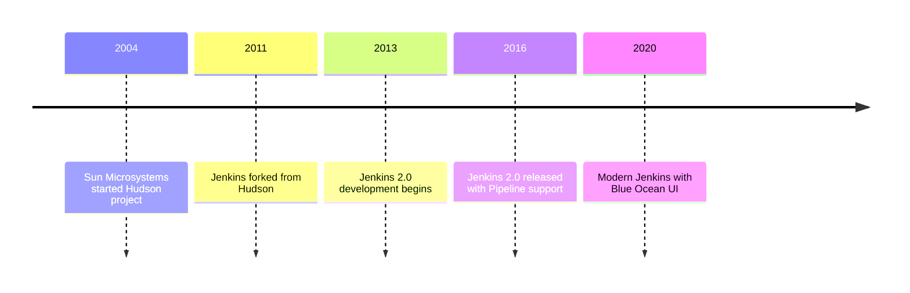
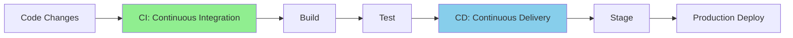
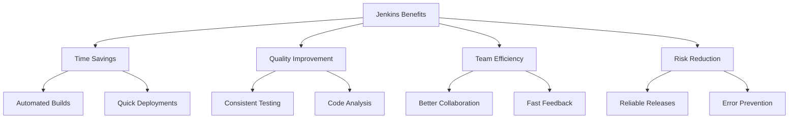
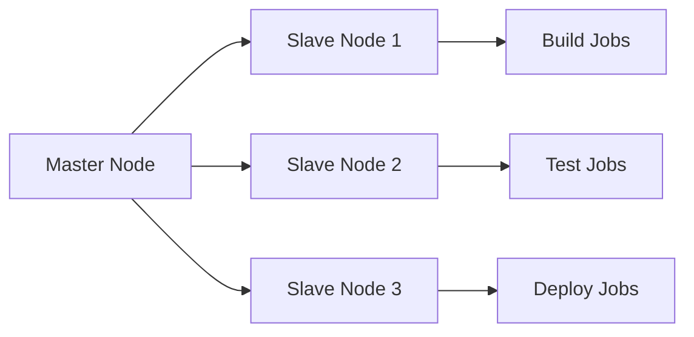

# Jenkins Notes

# 1. Introduction to Jenkins

## What is Jenkins?

Jenkins is an open-source automation server that helps automate various parts of software development related to building, testing, and deploying software. It facilitates continuous integration and continuous delivery (CI/CD) by allowing developers to integrate code changes more frequently and reliably.

Key features of Jenkins include:

- Easy installation and configuration on various operating systems
- Rich plugin ecosystem with over 1500 plugins
- Distributed build architecture
- Web interface for easy management
- Built-in support for version control systems

## History and Evolution of Jenkins

Jenkins was born from the Hudson project in 2011. Here's its evolutionary timeline:



## Continuous Integration (CI) vs Continuous Deployment (CD)

Understanding the difference between CI and CD is crucial for implementing Jenkins effectively:



### Continuous Integration (CI)

CI is the practice of automatically integrating code changes from multiple contributors into a single software project. It involves:

- Automated building of software
- Running unit tests
- Running integration tests
- Code quality checks

### Continuous Deployment (CD)

CD extends CI by automatically deploying all code changes to a testing or production environment after the build stage. It includes:

- Automated deployment to staging
- Automated testing in staging
- Automated deployment to production
- Post-deployment testing

## Benefits of Using Jenkins

Jenkins offers numerous advantages for development teams:

<aside>
Time and Cost Savings

</aside>

- Reduces manual intervention in build and deployment processes
- Decreases time spent on repetitive tasks
- Minimizes deployment errors

<aside>
Improved Code Quality

</aside>

- Early detection of code issues
- Consistent code quality checks
- Automated testing ensures reliability

<aside>
Enhanced Team Productivity

</aside>

- Faster feedback loops
- Better collaboration between teams
- Streamlined development workflow



## Jenkins Architecture

Jenkins follows a master-slave architecture that enables distributed builds and testing across multiple machines. This architecture allows for efficient resource utilization and parallel execution of jobs.



# 2. Installation and Setup

## System Requirements for Jenkins

Before installing Jenkins, ensure your system meets these minimum requirements:

- Java Runtime Environment (JRE) 8 or Java Development Kit (JDK) 11
- 256MB of RAM (recommended: 4GB+)
- 1GB of drive space (10GB+ recommended for Jenkins and Docker)
- Processor: 1GHz or higher

## Installing Jenkins on Windows

Follow these steps to install Jenkins on Windows:

1. Download the Jenkins Windows installer (.msi) from [jenkins.io](http://jenkins.io)
2. Run the installer with administrator privileges
3. Select installation directory and port number (default: 8080)
4. Install required Windows services

```powershell
# Start Jenkins service using PowerShell
Start-Service Jenkins

# Stop Jenkins service
Stop-Service Jenkins

# Check Jenkins service status
Get-Service Jenkins

```

## Installing Jenkins on Linux

Installation steps for Linux (Ubuntu/Debian):

```bash
# Add Jenkins repository key
wget -q -O - https://pkg.jenkins.io/debian-stable/jenkins.io.key | sudo apt-key add -

# Add Jenkins repository
sudo sh -c 'echo deb https://pkg.jenkins.io/debian-stable binary/ > /etc/apt/sources.list.d/jenkins.list'

# Update package index
sudo apt-get update

# Install Jenkins
sudo apt-get install jenkins

# Start Jenkins service
sudo systemctl start jenkins

# Enable Jenkins to start at boot
sudo systemctl enable jenkins

```

## Running Jenkins in Docker

Docker provides a simple way to run Jenkins in a container:

```bash
# Pull the official Jenkins Docker image
docker pull jenkins/jenkins:lts

# Run Jenkins container
docker run -d \
  -p 8080:8080 \
  -p 50000:50000 \
  -v jenkins_home:/var/jenkins_home \
  -v /var/run/docker.sock:/var/run/docker.sock \
  --name jenkins \
  jenkins/jenkins:lts

```

## Setting up Jenkins as a Service

Configure Jenkins to run as a system service for better management:

```bash
# Create systemd service file
sudo nano /etc/systemd/system/jenkins.service

[Unit]
Description=Jenkins Automation Server
After=network.target

[Service]
User=jenkins
ExecStart=/usr/bin/java -jar /usr/share/jenkins/jenkins.war
Restart=always

[Install]
WantedBy=multi-user.target

```

## Jenkins Web UI Overview

After installation, access Jenkins through its web interface:

- **Dashboard:** Main page showing jobs, builds, and system status
- **New Item:** Create new jobs/projects
- **People:** Manage users and permissions
- **Build History:** View all build records
- **Manage Jenkins:** Configure system settings, plugins, and security

<aside>
Initial Setup Note: When first accessing Jenkins, you'll need the initial admin password. Find it at:

</aside>

```bash
# Windows
C:\Program Files (x86)\Jenkins\secrets\initialAdminPassword

# Linux
sudo cat /var/lib/jenkins/secrets/initialAdminPassword

# Docker
docker exec jenkins cat /var/jenkins_home/secrets/initialAdminPassword

```

After entering the initial password, Jenkins will guide you through:

- Installing suggested plugins
- Creating the first admin user
- Configuring the instance URL
- Setting up security measures

# 3. Jenkins Configuration

## Initial Setup and Admin Unlock

When first accessing Jenkins, you'll need to complete these initial setup steps:

1. Retrieve the initial admin password from the specified location
2. Choose between installing suggested plugins or selecting specific ones
3. Create the first admin user with full permissions
4. Configure the Jenkins URL for system access

```bash
# Retrieve initial admin password
sudo cat /var/lib/jenkins/secrets/initialAdminPassword

# Default Jenkins ports
HTTP: 8080
JNLP: 50000
```

## Configuring System Settings

Access system configurations through "Manage Jenkins" > "Configure System". Key areas include:

- System Message: Set dashboard message for all users
- # of executors: Configure concurrent build capacity
- Jenkins URL: Set the external URL for your instance
- Email Notification: Configure SMTP settings
- Global properties: Define system-wide variables

## Managing Users and Security

Jenkins security configuration is crucial for protecting your CI/CD pipeline:

- Security Realm Configuration
    - Jenkins' own user database
    - LDAP authentication
    - Active Directory
    - OAuth 2.0
- Authorization Strategies
    - Matrix-based security
    - Project-based Matrix Authorization
    - Role-based Authorization Strategy
    - LDAP/Active Directory group-based authorization

```groovy
// Example security configuration in Groovy
jenkins.model.Jenkins.instance.setSecurityRealm(
    new hudson.security.HudsonPrivateSecurityRealm(true)
)

def strategy = new hudson.security.ProjectMatrixAuthorizationStrategy()
strategy.add(Jenkins.ADMINISTER, "admin")
strategy.add(Jenkins.READ, "authenticated")
jenkins.model.Jenkins.instance.setAuthorizationStrategy(strategy)

```

## Configuring Tools

Jenkins requires proper tool configuration for building and testing. Configure these through "Manage Jenkins" > "Global Tool Configuration":

### JDK Configuration

Configure multiple JDK versions:

```groovy
// Tool configuration example
tool type: 'jdk', name: 'JDK11', version: '11.0.12'
tool type: 'jdk', name: 'JDK8', version: '1.8.0_292'

```

### Maven Configuration

Set up Maven for Java project builds:

```xml
<settings>
  <localRepository>${user.home}/.m2/repository</localRepository>
  <interactiveMode>true</interactiveMode>
  <offline>false</offline>
</settings>

```

### Gradle Configuration

Configure Gradle for building Java/Android projects:

```groovy
// Gradle tool configuration
gradle {
    name 'Gradle 7.2'
    installSource 'Download from gradle.org'
    gradleVersion '7.2'
}

```

### Git Configuration

Set up Git for source code management:

```bash
# Configure Git in Jenkins
git config --global user.name "Jenkins"
git config --global user.email "jenkins@example.com"

# Test Git configuration
git config --list
```

## Global Environment Variables and Path Setup

Environment variables are crucial for Jenkins operations. Configure them through:

- System Properties
- Global Properties in Jenkins Configuration
- Environment Variable Injection Plugin

Common environment variables include:

```bash
# Jenkins Home
JENKINS_HOME=/var/lib/jenkins

# Java Home
JAVA_HOME=/usr/lib/jvm/java-11-openjdk

# Maven Home
M2_HOME=/usr/share/maven

# Node.js configuration
NODE_HOME=/usr/local/node
PATH=$PATH:$NODE_HOME/bin

# Docker configuration
DOCKER_HOST=unix:///var/run/docker.sock

```

<aside>
Best Practices for Environment Variables:
• Use credentials binding for sensitive data
• Implement variable hierarchy (global vs. project-specific)
• Document all custom variables
• Regular audit of environment variables

</aside>

Configure environment variables in pipeline:

```groovy
pipeline {
    environment {
        MAVEN_OPTS = '-Xmx2048m'
        GRADLE_OPTS = '-Dorg.gradle.daemon=false'
        DOCKER_REGISTRY = 'registry.example.com'
    }
    stages {
        stage('Build') {
            steps {
                sh 'echo $MAVEN_OPTS'
                sh 'echo $GRADLE_OPTS'
                sh 'echo $DOCKER_REGISTRY'
            }
        }
    }
}
```

# 4. Jenkins Jobs and Pipelines

## Freestyle vs Pipeline Projects

Jenkins offers two main types of projects:

- **Freestyle Projects:** Traditional, web-UI configured jobs with simple, linear workflows
- **Pipeline Projects:** Code-based, programmable workflows supporting complex CI/CD scenarios

Comparison of project types:

| Feature | Freestyle | Pipeline |
| --- | --- | --- |
| Configuration | GUI-based | Code-based |
| Version Control | Limited | Full (Jenkinsfile) |
| Complexity Support | Simple workflows | Complex workflows |
| Reusability | Limited | High (shared libraries) |

## Creating and Configuring Freestyle Jobs

Steps to create a freestyle job:

1. Click "New Item" in Jenkins dashboard
2. Select "Freestyle project" and enter a name
3. Configure source code management
4. Set up build triggers
5. Add build steps
6. Configure post-build actions

```bash
# Example build steps for a Java project
mvn clean install
java -jar target/application.jar

```

## Build Triggers

Jenkins supports various build triggers:

- SCM Triggers
    - Triggered when changes are detected in source code
    - Supports multiple SCM systems (Git, SVN, etc.)
    
    ```groovy
    triggers {
        githubPush()
        pollSCM('H/15 * * * *')
    }
    ```
    
- Polling Configuration
    - Regular checking of repository for changes
    - Uses cron syntax for scheduling
    
    ```bash
    # Check every 15 minutes
    H/15 * * * *
    
    # Check every day at midnight
    0 0 * * *
    ```
    

## Parameterized Jobs

Parameters allow dynamic job execution with variable inputs:

- **String Parameters:** Text input values
- **Choice Parameters:** Dropdown selection options
- **Boolean Parameters:** Checkbox options
- **File Parameters:** File uploads

```groovy
parameters {
    string(name: 'DEPLOY_ENV', defaultValue: 'staging', description: 'Deployment Environment')
    choice(name: 'REGION', choices: ['us-east-1', 'us-west-2', 'eu-west-1'], description: 'AWS Region')
    booleanParam(name: 'RUN_TESTS', defaultValue: true, description: 'Run Test Suite')
}

```

## Introduction to Jenkins Pipelines

Jenkins Pipeline is a suite of plugins supporting implementation and integration of continuous delivery pipelines:

- Defines the entire build/deploy process in code
- Supports complex real-world CD requirements
- Enables pipeline as code through Jenkinsfile

## Scripted vs Declarative Pipelines

Jenkins offers two pipeline syntax options:

| Feature | Scripted Pipeline | Declarative Pipeline |
| --- | --- | --- |
| Syntax | Groovy-based | Predefined structure |
| Learning Curve | Steeper | Easier |
| Flexibility | More flexible | More structured |
| Error Handling | Custom implementation | Built-in |

## Jenkinsfile Creation and Best Practices

Guidelines for creating effective Jenkinsfiles:

- **Version Control:** Always store Jenkinsfile in source control
- **Modularity:** Use shared libraries for common functionality
- **Error Handling:** Implement proper error handling and notifications
- **Documentation:** Include comments and documentation within the pipeline code

```groovy
// Example Declarative Pipeline
pipeline {
    agent any
    
    environment {
        MAVEN_OPTS = '-Xmx3072m'
    }
    
    stages {
        stage('Build') {
            steps {
                sh 'mvn clean package'
            }
        }
        
        stage('Test') {
            steps {
                sh 'mvn test'
            }
            post {
                always {
                    junit '**/target/surefire-reports/*.xml'
                }
            }
        }
        
        stage('Deploy') {
            when {
                branch 'main'
            }
            steps {
                sh './deploy.sh'
            }
        }
    }
    
    post {
        success {
            emailext subject: 'Build Successful',
                     body: 'The build has completed successfully',
                     to: 'team@example.com'
        }
        failure {
            emailext subject: 'Build Failed',
                     body: 'The build has failed',
                     to: 'team@example.com'
        }
    }
}
```

# 5. Plugins and Integrations

## Understanding Jenkins Plugin Architecture

Jenkins plugins are built on a robust architecture that extends core functionality:

- **Extension Points:** Core interfaces that plugins can implement
- **Plugin Dependencies:** Hierarchical relationship between plugins
- **Plugin Lifecycle:** Start, stop, and update mechanisms
- **Security Model:** Permission and authentication framework

## Installing and Managing Plugins

Steps for plugin management:

1. Navigate to "Manage Jenkins" > "Manage Plugins"
2. Choose between Available, Installed, Updates, and Advanced tabs
3. Select desired plugins and click "Install without restart" or "Download now and install after restart"
4. Monitor installation progress and handle any dependencies

```groovy
// Example plugin installation via Jenkins CLI
jenkins-cli.jar install-plugin pipeline-model-definition checkstyle git

```

## Must-Have Plugins

- Git Plugin
    - Integrates Git version control
    - Supports branch and merge operations
    - Manages credentials and SSH keys
    
    ```groovy
    git branch: 'main',
        credentialsId: 'git-credentials',
        url: 'https://github.com/organization/repository.git'
    ```
    
- Pipeline Plugin
    - Implements CI/CD workflows as code
    - Supports both Declarative and Scripted syntax
    - Provides visualization of pipeline execution
- Email Extension Plugin
    - Advanced email notification system
    - Supports HTML content and attachments
    - Configurable triggers and recipients
    
    ```groovy
    emailext body: 'Build Status: ${BUILD_STATUS}',
             subject: 'Pipeline Status',
             to: 'team@example.com'
    ```
    
- Docker Plugin
    - Manages Docker containers as build agents
    - Supports Docker image building and publishing
    - Integrates with Docker registries
    
    ```groovy
    docker.build("my-image:${env.BUILD_NUMBER}")
    docker.withRegistry('https://registry.example.com', 'credentials-id') {
        docker.image("my-image:${env.BUILD_NUMBER}").push()
    }
    ```
    
- Blue Ocean Plugin
    - Modern, visual pipeline editor
    - Enhanced visualization of pipeline execution
    - Improved pipeline debugging capabilities

## Integrating Jenkins with Git/GitHub

Configure Git integration with these steps:

1. Install Git plugin and related dependencies
2. Configure Git credentials in Jenkins
3. Set up repository URL and branch specifications
4. Configure build triggers for Git events

```groovy
pipeline {
    agent any
    triggers {
        githubPush()
    }
    stages {
        stage('Checkout') {
            steps {
                git branch: 'main',
                    url: 'https://github.com/org/repo.git',
                    credentialsId: 'github-credentials'
            }
        }
    }
}

```

## Configuring Webhooks in GitHub

Set up GitHub webhooks for automated triggers:

1. Navigate to GitHub repository settings
2. Add webhook with Jenkins URL: [http://jenkins-url/github-webhook/](http://jenkins-url/github-webhook/)
3. Select events to trigger builds
4. Configure secret token for security

<aside>
Best Practices for Webhook Configuration:
• Use HTTPS for webhook endpoints
• Implement proper authentication
• Monitor webhook delivery logs
• Set up retry mechanisms for failed deliveries

</aside>

## Integrating with Slack, Email, and JIRA

- Slack Integration
    - Install Slack Notification Plugin
    - Configure Slack workspace and channel
    - Set up notification triggers
    
    ```groovy
    slackSend channel: '#jenkins-builds',
              message: "Build ${env.BUILD_NUMBER} - ${currentBuild.currentResult}",
              color: currentBuild.currentResult == 'SUCCESS' ? 'good' : 'danger'
    ```
    
- Email Integration
    - Configure SMTP settings in Jenkins
    - Set up email templates
    - Define notification triggers
    
    ```groovy
    emailext body: '${FILE,path="email-templates/build-status.html"}',
             subject: "Build ${env.BUILD_NUMBER} Status",
             to: '${DEFAULT_RECIPIENTS}'
    ```
    
- JIRA Integration
    - Install JIRA plugin
    - Configure JIRA site and credentials
    - Set up issue tracking and updates
    
    ```groovy
    jiraComment body: "Build ${env.BUILD_NUMBER} completed",
                issueKey: 'PROJ-123'
    ```
    

## **Module 6: Advanced Jenkins Pipelines**

### **1. Writing Multi-Stage Pipelines**

A **multi-stage pipeline** in Jenkins allows you to divide your CI/CD process into logical stages such as **Build**, **Test**, and **Deploy**. This improves readability, error isolation, and control over the pipeline flow.

Each `stage` block is defined within a `stages` block inside the `pipeline` directive. For example:

```groovy
groovy
CopyEdit
pipeline {
    agent any
    stages {
        stage('Build') {
            steps {
                echo 'Building...'
            }
        }
        stage('Test') {
            steps {
                echo 'Testing...'
            }
        }
        stage('Deploy') {
            steps {
                echo 'Deploying...'
            }
        }
    }
}

```

Benefits:

- Easier debugging of failures
- Modular structure for better pipeline maintenance
- Visual representation in Blue Ocean UI

---

### **2. Shared Libraries and Reusability**

**Shared Libraries** in Jenkins enable reusability of code across multiple pipelines. Instead of duplicating code in every Jenkinsfile, common functionality is abstracted into reusable functions stored in a central Git repository.

**Structure:**

```
diff
CopyEdit
(root)
+- vars/
|   +- myCustomStep.groovy
+- src/
|   +- org/example/MyUtils.groovy

```

**Usage:**

```groovy
groovy
CopyEdit
@Library('my-shared-library') _
myCustomStep()

```

Benefits:

- DRY principle (Don't Repeat Yourself)
- Centralized management of logic
- Easier to update and maintain

---

### **3. Using `input`, `when`, `parallel`, `post` Blocks**

### `input`

The `input` block pauses pipeline execution and waits for human intervention.

```groovy
groovy
CopyEdit
input {
    message "Approve deployment?"
    ok "Yes, deploy"
}

```

### `when`

Conditional execution of stages.

```groovy
groovy
CopyEdit
when {
    branch 'main'
}

```

### `parallel`

Run multiple steps or stages in parallel to reduce build time.

```groovy
groovy
CopyEdit
parallel {
    stage('Test on Linux') {
        steps { echo 'Testing on Linux' }
    }
    stage('Test on Windows') {
        steps { echo 'Testing on Windows' }
    }
}

```

### `post`

Define actions after each stage or the entire pipeline.

```groovy
groovy
CopyEdit
post {
    always {
        echo 'Cleanup'
    }
    success {
        echo 'Build succeeded'
    }
    failure {
        echo 'Build failed'
    }
}

```

---

### **4. Pipeline Syntax Generator**

Jenkins provides a **Pipeline Syntax Generator** UI tool that helps you generate correct pipeline step syntax.

- Navigate to: **Jenkins Dashboard > Your Job > Pipeline Syntax**
- Select a step (e.g., `checkout`, `sh`, `archiveArtifacts`)
- Fill in parameters
- Click **Generate Pipeline Script**

This tool is especially helpful when working with complex steps or unfamiliar syntax, and reduces human error.

---

### **5. Error Handling in Pipelines**

Proper error handling ensures that failures are captured and managed gracefully.

- **Try-Catch-Finally:**

```groovy
groovy
CopyEdit
steps {
    script {
        try {
            sh 'exit 1'
        } catch (e) {
            echo "Error: ${e}"
        } finally {
            echo "Always run"
        }
    }
}

```

- Use **post.failure**, **post.aborted** to handle failure events.
- Use `catchError(buildResult: 'UNSTABLE', stageResult: 'FAILURE')` for granular control.

Error handling helps maintain pipeline stability and provides clearer feedback in case of failures.

---

### **6. Artifacts Archiving and Fingerprinting**

Artifacts are files generated during the pipeline (e.g., binaries, test reports). Jenkins allows storing these using `archiveArtifacts`.

```groovy
groovy
CopyEdit
archiveArtifacts artifacts: '**/target/*.jar', fingerprint: true

```

- **Archiving** allows future builds or jobs to reuse artifacts.
- **Fingerprinting** generates a unique checksum to track the artifact across jobs and builds.

Benefits:

- Traceability of binaries
- Consistency across deployments
- Debugging and auditing support

## **Module 7: Jenkins and Docker**

### **1. Running Jenkins in Docker Containers**

Jenkins can be deployed inside a Docker container for easy setup, isolation, and scalability.

```bash
bash
CopyEdit
docker run -p 8080:8080 -p 50000:50000 jenkins/jenkins:lts

```

- **Benefits**:
    - Portable environment
    - Simplified upgrades
    - Isolated Jenkins master
- **Persistent Storage**:
    
    Use volumes to store Jenkins data:
    
    ```bash
    bash
    CopyEdit
    docker run -v jenkins_home:/var/jenkins_home ...
    
    ```
    

---

### **2. Using Docker Agents in Pipelines**

Docker agents allow Jenkins to spin up a container with specific tools for running pipeline steps.

```groovy
groovy
CopyEdit
pipeline {
    agent {
        docker {
            image 'maven:3.6.3-jdk-11'
            args '-v /root/.m2:/root/.m2'
        }
    }
    stages {
        stage('Build') {
            steps {
                sh 'mvn clean install'
            }
        }
    }
}

```

- Saves system dependencies
- Ensures consistent build environments

---

### **3. Building Docker Images in Jenkins**

Jenkins can build Docker images using Dockerfiles:

```groovy
groovy
CopyEdit
pipeline {
    agent any
    stages {
        stage('Build Docker Image') {
            steps {
                script {
                    docker.build('my-app-image')
                }
            }
        }
    }
}

```

- Useful in containerizing applications as part of CI/CD.

---

### **4. Pushing Images to Docker Hub or Private Registry**

After building the Docker image, push it to Docker Hub or a private registry:

```groovy
groovy
CopyEdit
docker.withRegistry('https://index.docker.io/v1/', 'docker-credentials-id') {
    docker.image('my-app-image').push('latest')
}

```

- Securely store credentials in Jenkins
- Use post-build actions to push only on successful builds

---

### **5. Docker inside Docker in Jenkins Jobs**

Running Docker inside a Jenkins Docker container (DinD) allows building and pushing Docker images.

Approaches:

- **Docker-in-Docker (`-privileged`)**
- **Docker socket mounting (`/var/run/docker.sock`)**

Security Note:

- Avoid `-privileged` in production
- Use socket mounting for safer access

---

## **Module 8: Jenkins and Kubernetes**

### **1. Introduction to Jenkins X (optional)**

**Jenkins X** is an opinionated CI/CD solution for Kubernetes, focused on automation and GitOps.

- Uses Tekton pipelines
- Supports preview environments
- Ideal for microservices and cloud-native applications

Note: Optional for users already proficient in Jenkins and Kubernetes separately.

---

### **2. Deploying Jenkins on Kubernetes**

Run Jenkins in a Kubernetes cluster using Helm or YAML files.

```bash
bash
CopyEdit
helm install jenkins jenkinsci/jenkins --set controller.serviceType=LoadBalancer

```

- Enables horizontal scaling
- Integrates with cluster-native services
- Stores data in persistent volumes (PVCs)

---

### **3. Configuring Jenkins to use Kubernetes Agents**

Use Kubernetes plugin to dynamically provision agents as pods:

```groovy
groovy
CopyEdit
pipeline {
    agent {
        kubernetes {
            label 'k8s-agent'
            defaultContainer 'jnlp'
        }
    }
}

```

- Auto-scale builds based on demand
- Configure container templates with custom tools

---

### **4. Helm Chart Deployment using Jenkins**

Use Helm in Jenkins pipelines to deploy applications to Kubernetes clusters:

```groovy
groovy
CopyEdit
sh 'helm upgrade --install my-app ./charts/my-app --namespace prod'

```

- Automates microservice releases
- Supports rollback and version control

---

### **5. CI/CD Pipelines for Microservices on K8s**

Build independent pipelines for each microservice:

- Build container
- Run tests
- Deploy to Dev/QA/Prod using Helm or kubectl

Use **GitOps**, **Helm**, and **Kustomize** for environment management.

---

## **Module 9: Jenkins CLI and Groovy Scripting**

### **1. Using Jenkins CLI for Job Automation**

The Jenkins CLI (`jenkins-cli.jar`) allows you to trigger jobs, install plugins, and manage Jenkins remotely.

```bash
bash
CopyEdit
java -jar jenkins-cli.jar -s http://localhost:8080/ build my-job

```

- Lightweight automation
- Useful for scripting job creation and execution

---

### **2. Running CLI Commands Securely**

- Use API tokens instead of passwords
- Restrict CLI usage to trusted users
- Encrypt communication using HTTPS

```bash
bash
CopyEdit
java -jar jenkins-cli.jar -s https://jenkins.example.com/ -auth user:api_token ...

```

---

### **3. Introduction to Groovy for Jenkins**

Groovy is the scripting language used for Jenkinsfiles and shared libraries.

Features:

- Dynamic typing
- Built-in collections
- Easy integration with Jenkins APIs

Example:

```groovy
groovy
CopyEdit
def sayHello(name) {
    echo "Hello, ${name}"
}

```

---

### **4. Writing Custom Scripts for Jenkins Jobs**

Use Groovy scripts to customize job behavior:

- Dynamic parameters
- Job chaining
- Condition-based builds

```groovy
groovy
CopyEdit
job('dynamic-job') {
    steps {
        shell('echo "Hello from Groovy script!"')
    }
}

```

---

### **5. Automating Jenkins Configs with Groovy DSL**

Use Job DSL Plugin or Configuration as Code (JCasC) for defining Jenkins setup in code.

Example Job DSL:

```groovy
groovy
CopyEdit
pipelineJob('my-pipeline') {
    definition {
        cps {
            script(readFileFromWorkspace('Jenkinsfile'))
        }
    }
}

```

- Improves reproducibility
- Version-controlled Jenkins configurations

---

## **Module 10: Jenkins Administration and Maintenance**

### **1. Backup and Restore Strategies**

- Backup `JENKINS_HOME` (jobs, configs, plugins, etc.)
- Use plugins like **ThinBackup** or scripts with `rsync`
- Store backups offsite (S3, FTP, etc.)

**Restore**:

- Stop Jenkins
- Replace with backup
- Restart Jenkins

---

### **2. Jenkins Logs and Monitoring**

- Logs stored at `/var/log/jenkins/jenkins.log`
- Use monitoring tools:
    - **Prometheus + Grafana**
    - **Datadog**
    - **New Relic**

Track:

- Job execution
- Queue size
- Agent availability

---

### **3. Scaling Jenkins with Master-Agent Setup**

- Master handles UI and orchestration
- Agents handle job execution

Types:

- **Static Agents**: Manually provisioned
- **Dynamic Agents**: Cloud auto-provisioned (Kubernetes, EC2)

Helps scale builds horizontally.

---

### **4. Securing Jenkins: Best Practices**

- Use HTTPS and secure reverse proxy
- Configure user roles via Matrix Authorization Strategy
- Disable CLI remoting
- Store secrets in credentials store or Vault
- Enable CSRF protection and audit logging

---

### **5. Performance Tuning and Optimization**

- Allocate more JVM heap memory
- Use `nginx`/`Apache` reverse proxy for caching
- Clean up old builds regularly
- Use lightweight agents for small jobs
- Archive fewer artifacts or compress them

---

### **6. Upgrading Jenkins Safely**

Steps:

1. Backup `JENKINS_HOME`
2. Read plugin compatibility notes
3. Test on staging environment
4. Download and install latest `.war` or update Docker image
5. Monitor logs after upgrade