# Azure DevOps Workflow — DevOps Development

End-to-end Azure DevOps workflow for **DevOps Development** projects (E-commerce, Retail, Airlines, Pharma): from idea to production with Boards, Repos, Pipelines, Artifacts, and full project flows.

---

## 1. Overview and End-to-End Notes

### Purpose

This workflow connects **planning**, **development**, **build**, **deploy**, and **operate** so that every change is traceable, testable, and reversible.

- **Plan** work in Azure Boards so that backlogs, sprints, and work items (epics, features, user stories, bugs, change requests) drive what gets built. Prioritization and acceptance criteria are visible to the whole team; for regulated industries, change requests and approvals are recorded in the same system.
- **Code** in Azure Repos using a clear branch strategy (e.g. main, develop, feature/*, release/*, hotfix/*) and pull requests. Branch policies ensure that no code reaches the main line without a passing build and review, reducing integration issues and keeping history clean for audit and rollback.
- **Build and test** in Azure Pipelines so that every merge triggers a consistent build, automated tests (unit, integration, e2e where applicable), and optional security scans (SAST, dependency checks). Build outputs are published as versioned artifacts so that deployments always use a known, reproducible build.
- **Deploy** through staged environments (Dev → Staging → Production) so that issues are caught early. Each stage can have different approval and gate rules; Production typically requires manual approval and optional health checks, ensuring that only validated builds go live.
- **Store** build outputs in Azure Artifacts (or pipeline artifacts) and track which artifact was deployed where. This enables rollback to a previous known-good version and supports compliance audits (e.g. “what was in production on date X?”).

### Key Principles

- **Pipeline as code:** Pipeline definitions live in YAML in the repository. Every change to the pipeline is versioned, reviewed via PR, and traceable. There is no “click-only” pipeline that drifts from what is in source control; secrets and environment-specific config come from variable groups and Key Vault, not from hardcoded values in YAML.
- **Environment parity:** Dev and Staging mirror Production in structure (same app type, same deployment mechanism) and configuration where possible. Secrets and environment-specific settings are injected at deploy time (e.g. from Azure Key Vault or variable groups) so that behavior is consistent and issues surface before Production.
- **Approval gates:** Production (and optionally Staging) require manual approval from designated roles and/or automated gates (e.g. “Invoke REST API” for health, “Query Work Items” for no open critical bugs). This prevents accidental or unauthorized production changes and enforces change windows in regulated contexts.
- **Rollback first-class:** Every release is designed to be reversible. Common patterns: re-run the pipeline with a previous build artifact, slot swap on App Service, or redeploy a previous release to deployment groups. The procedure is documented and tested so that support and development can execute rollback quickly during an incident.
- **Audit trail:** Work items in Boards are linked to commits and pipeline runs. Who approved a production deploy, which build was deployed, and when are recorded in Azure DevOps (and optionally exported for compliance). Logs are retained according to policy (e.g. GxP, PCI) so that inspections and post-incident reviews have evidence.

### Why This Flow Matters

- **Predictability:** Same path for every change (feature, hotfix, release) so teams know exactly what to do and what to expect.
- **Quality:** Automated tests and gates catch regressions before they reach Production; staging validates integration and config.
- **Safety:** Approvals and rollback reduce the risk and impact of bad releases; audit trail supports accountability and compliance.
- **Speed:** Once the path is established, developers can ship frequently without manual handoffs or ad-hoc scripts.

### Industries (Retail, E-commerce, Airlines, Pharma)

- **E-commerce / Retail:** Deploy windows avoid peak (e.g. Black Friday); payment and checkout pipelines follow PCI requirements (no secrets in code, audit of who deployed). Store and POS rollouts use deployment groups for phased rollout by region or pilot stores, with the ability to roll back only affected stores.
- **Airlines:** Change Advisory Board (CAB) and change windows align with reservation and booking systems; high availability is maintained by avoiding uncoordinated changes. Production approvals can require CAB sign-off or deployment only during defined maintenance windows.
- **Pharma:** GxP and 21 CFR Part 11 require change control, electronic signatures, and full auditability. Every production deploy is tied to a change request or approved work item; approvers are recorded; pipeline and Board history are retained for inspections.

---

## 2. Azure DevOps Components Used

| Component | Use in DevOps Development | Details and Tips |
|-----------|----------------------------|-------------------|
| **Azure Boards** | Epics, features, user stories, bugs; sprint planning; change requests (e.g. GxP); approval workflow; link to commits and pipelines. | Use area paths and iteration paths to separate teams or products. Link commits to work items with `AB#123` in commit messages so that Boards shows “Associated commits.” Use custom states (e.g. “Ready for deploy”) and approval workflows for change requests. For Pharma, attach validation evidence to the change request work item. |
| **Azure Repos** | Git repos; branch strategy (main, develop, feature/*, release/*, hotfix/*); PRs and branch policies; pipeline YAML. | Keep `main` (or `master`) as the integration branch that reflects production. Enforce branch policies on `main`: require PR, require build success, require at least one reviewer. Store pipeline YAML in the repo (e.g. `azure-pipelines.yml` or under `.azure/pipelines/`) so pipeline changes are reviewed like code. |
| **Azure Pipelines** | Build, test, security scan, deploy; multi-stage YAML; environments (Dev, Staging, Prod); approval gates; deployment groups (e.g. stores). | Use multi-stage YAML so Build → Deploy Dev → Deploy Staging → Deploy Production are in one pipeline; use `dependsOn` and environment approvals. For retail stores, create deployment groups per region and deploy in stages. Use variable groups and Key Vault task for secrets. |
| **Azure Artifacts** | Build outputs (packages, containers); promote only approved artifacts to production. | Publish build output in the Build stage (e.g. `PublishBuildArtifacts` or push to Azure Container Registry). Downstream deploy stages consume the same artifact; never rebuild for production from source at deploy time so that “what was tested” is “what is deployed.” |
| **Azure Test Plans** | Optional; manual/exploratory test cases linked to work items; test results in pipeline. | Useful for UAT and regression test plans; link test cases to user stories. Pipeline can publish test results so that Boards shows test status; for GxP, test evidence can be attached to the change request. |
| **Environments** | Dev, Staging, Production with approvals and checks (e.g. manual approval, Invoke REST API for health). | Create one environment per stage. On Production, add “Approvals and checks”: manual approval (required approvers), and optionally “Invoke REST API” to verify health before or after deploy. Use environment-specific variable groups for connection strings and app settings. |

---

## 3. High-Level Workflow (Flow)

```mermaid
flowchart LR
    subgraph Plan
        A[Backlog / Sprint] --> B[Work Item]
        B --> C[Branch + PR]
    end
    subgraph Code
        C --> D[Commit]
        D --> E[PR Review + Merge]
    end
    subgraph Build
        E --> F[Pipeline: Build]
        F --> G[Test + Scan]
        G --> H[Artifact]
    end
    subgraph Deploy
        H --> I[Deploy Dev]
        I --> J[Deploy Staging]
        J --> K[Approval]
        K --> L[Deploy Production]
    end
    L --> M[Monitor + Rollback if needed]
```



### Flow in Words

1. **Plan:** Create or select a work item (user story, bug, change request) in Boards; add acceptance criteria and assign to a sprint. For regulated releases, ensure change request is approved before development starts.
2. **Code:** Create a branch from main (or develop); implement the change with commits that reference the work item (e.g. `AB#123`). Open a PR into main; branch policy runs the build and requires at least one reviewer. Address feedback and merge (squash or merge commit per team policy).
3. **Build:** Pipeline is triggered on merge to main. It runs build, unit tests, and optionally integration tests and security scans. If any step fails, the pipeline fails and the artifact is not published; fix and push again. On success, the build output is published as an artifact (e.g. with the build ID for traceability).
4. **Deploy:** The same pipeline (or a release pipeline consuming the artifact) deploys to Dev automatically, then to Staging (auto or with one approval), then to Production. Production deployment waits for manual approval; approvers are notified. Optional checks (e.g. health endpoint) can run before or after deploy. Only the artifact produced by the Build stage is deployed—no rebuilding in deploy stages.
5. **Monitor:** After Production deploy, monitor using Application Insights and Azure Monitor (error rate, latency, custom metrics). If an issue is detected (alert or manual report), trigger the rollback procedure: re-run the pipeline with the previous build artifact, or use slot swap / redeploy previous release. Document the incident and any runbook updates in Boards.

### Decision Points and Failure Handling

- **PR build fails:** Developer fixes the code and pushes again; no merge until build passes and review is done.
- **Deploy to Staging fails:** Investigate (e.g. config, dependency, environment); fix in code or config and re-run from Build, or fix Staging manually and document. Do not approve Production until Staging is healthy.
- **Production approval rejected:** Deployment does not proceed; work item can be updated with reason; next deploy can be the same or a new build after fixes.
- **Post-deploy degradation:** Trigger rollback (previous artifact or slot swap); open or update incident in Boards; post-incident review and runbook update as needed.

---

## 4. Scenarios and Detailed Flows

### Scenario A: New Feature (E-commerce Checkout)

| Step | Action | Azure DevOps / Tool | Notes and Details |
|------|--------|----------------------|-------------------|
| 1 | Create feature work item | Boards: User Story "Checkout – new payment method" with acceptance criteria (e.g. "User can select new wallet option; PCI-compliant; no card data in logs"). | Add to backlog; prioritize; assign to sprint. Link to Epic "Checkout v2" if applicable. |
| 2 | Create branch | Repos: `feature/checkout-new-payment` from `main`. | Branch name can follow team convention (e.g. `feature/AB-123-checkout-new-payment` to tie to work item). |
| 3 | Develop and commit | Repos: Implement change; commit with message "Add wallet payment option AB#123". | Each commit can reference work item so Boards shows "Associated commits." Keep changes scoped to the story. |
| 4 | Open PR | Repos: PR from `feature/checkout-new-payment` into `main`. Branch policy: build must pass, at least 1 reviewer. | Add description and link work item (e.g. "Closes AB#123"). Request review from teammate or tech lead. |
| 5 | Build and test | Pipelines: On PR, YAML pipeline runs (trigger: pr, branch main). Steps: restore, build, unit test, security scan (e.g. dependency check). | If build or tests fail, fix and push; pipeline re-runs. No merge until green. For PCI, ensure no secrets in code and scan passes. |
| 6 | Merge | Repos: After approval, squash merge (or merge commit) into `main`. Pipeline triggers on push to `main`. | Build stage runs again; artifact produced is the one that will flow through Dev → Staging → Production. |
| 7 | Deploy to Dev | Pipelines: Stage "DeployDev" runs after Build; deploys artifact to Environment "Dev" (no approval). | Dev is for quick validation; same deployment mechanism as Staging/Prod (e.g. App Service slot or AKS). |
| 8 | Deploy to Staging | Pipelines: Stage "DeployStaging" runs after DeployDev; deploys same artifact to "Staging". | Optional: one approval for Staging. Smoke or integration tests can run here; validate payment flow in test mode. |
| 9 | Request production deploy | Pipelines: Stage "DeployProduction" waits for approval on Environment "Production". Approver gets notification. | Deploy only during agreed window if policy requires (e.g. avoid peak). Approver checks Staging health and release notes. |
| 10 | Approve and deploy | Boards/Pipelines: Approver approves in Pipelines (or via Boards if integrated). Pipeline deploys to Production (e.g. slot swap for zero-downtime). | Audit log records who approved and when. For App Service, deploy to staging slot then swap. |
| 11 | Validate and monitor | Application Insights: check error rate, latency, payment success metrics. Set alert for checkout failure spike. | If degradation is seen, trigger rollback (re-deploy previous build or swap slot back); document in Boards and runbook for PCI. |

**Rollback:** Re-run the same pipeline selecting the previous successful build (e.g. "Run new" → choose build), or use a dedicated rollback pipeline that deploys a specified build ID to Production. For App Service, swap back to the previous slot. Document the rollback in the related work item or incident for audit.

---

### Scenario B: Hotfix (Retail POS / Booking Outage)

| Step | Action | Azure DevOps / Tool | Notes and Details |
|------|--------|----------------------|-------------------|
| 1 | Create hotfix work item | Boards: Bug "POS sync failure in region X" (or link to existing Incident). Severity High/Critical; assign to dev. | If incident was opened by support, link Bug to Incident; use same work item for fix and closure. |
| 2 | Create hotfix branch | Repos: `hotfix/pos-sync-fix` from `main` (production-reflecting branch). | Branch from latest `main` so the fix is minimal and does not pull in unrelated work. |
| 3 | Fix and commit | Repos: Apply minimal code/config fix; commit message "Fix POS sync timeout AB#456". | Avoid refactoring or new features; only what is needed to resolve the outage. |
| 4 | PR with expedited review | Repos: Open PR from `hotfix/pos-sync-fix` to `main`. Same branch policy (build + 1 reviewer). | Tag reviewers for fast turnaround; title can include "[HOTFIX]" so it is prioritized. |
| 5 | Merge and build | Pipelines: On merge, full pipeline runs: build, test, publish artifact. | If tests fail, fix immediately; hotfix path should still satisfy quality gates. |
| 6 | Deploy to Staging | Pipelines: Deploy stage runs; same artifact deployed to Staging. Run smoke test (e.g. POS sync health check). | If Staging is representative of Production (e.g. same sync service), validate there before Production. |
| 7 | Deploy to Production | Pipelines: Request Production approval. For retail: optionally deploy first to deployment group "Region-X" (affected region only), validate, then deploy to remaining groups. | Use deployment groups so only affected stores get the fix first, or do full Production deploy if the fix is low-risk and urgent. |
| 8 | Post-incident | Boards: Mark Bug/Incident Resolved; add resolution notes. Create PIR task for P1/P2; link runbook update if new steps were learned. | Ensure runbook is updated so the same fix path is documented for future similar incidents. |

**Note:** For store/POS, use Azure DevOps deployment groups: register agents per store or region, then in the pipeline deploy to "Pilot-Stores" first, validate, then "Region-A", "Region-B", etc. Rollback can target the same deployment group(s) with the previous artifact.

---

### Scenario C: Pharma / GxP Release (Clinical Trial System)

| Step | Action | Azure DevOps / Tool | Notes and Details |
|------|--------|----------------------|-------------------|
| 1 | Change request | Boards: Create Change Request (CR) work item with description, risk assessment, and validation plan. Submit for GxP approval workflow. | Quality/compliance reviews and approves (or rejects) before any implementation. All subsequent work is tied to this CR. |
| 2 | Approval to implement | Boards: CR state set to "Approved for implementation"; assign to development lead. | Only after formal approval does development start; no "implement first, approve later" for GxP. |
| 3 | Branch and develop | Repos: Create branch (e.g. `release/clinical-2025-02` or `feature/AB-789-clinical-update`) from `main`. All commits reference the CR work item (e.g. AB#789). | Single CR can have multiple PRs; all must link back to the same CR for traceability. |
| 4 | PR and build | Repos: PR into `main` (or into release branch that later merges to `main`). Branch policy: build + tests + reviewers; no bypass. Pipelines: build, unit test, integration test, security scan. | No direct pushes to protected branches; every change is reviewed and built. Test evidence (e.g. automated test results) is linked to the CR. |
| 5 | Deploy to Dev / Validation | Pipelines: Deploy to Environment "Dev". CSV (Computer System Validation) or UAT can be performed here; test cases from Test Plans executed and results attached to CR. | Document which build was deployed and what was tested; attach screenshots or export test results to the CR work item for inspection. |
| 6 | Deploy to Staging | Pipelines: Deploy to "Staging" with approval (e.g. QA). Capture evidence: pipeline run ID, approver, timestamp. | Staging should mirror Production configuration (without production data); final validation before Production. |
| 7 | Production deploy request | Pipelines: Stage "DeployProduction" waits for approval. Environment "Production" has required approvers (e.g. QA lead, compliance). | Deploy only during approved change window; approvers verify that CR is approved and validation is complete. |
| 8 | Approve and deploy | Pipelines: Approvers sign off in Azure DevOps; pipeline deploys the same artifact that was validated. Audit log in Pipelines and Boards shows who approved and when. | Electronic signature is captured via Azure DevOps approval; retain logs for the required retention period (e.g. per 21 CFR Part 11). |
| 9 | Post-release | Boards: CR state set to "Closed" or "Released"; all related PRs and pipeline runs remain linked. Export or retain audit trail for inspections. | Ensure pipeline run history and Board history are retained and exportable; document in SOP how to retrieve "what was deployed when and by whom." |

**Audit:** Every production deploy must be attributable: who requested, who approved, what build/artifact, and when. Use Boards for CR approval and Pipelines Environment approval history; do not allow production deploy without going through the defined pipeline and approvals.

---

### Scenario D: Phased Rollout (Store POS / Multi-Region)

| Step | Action | Azure DevOps / Tool | Notes and Details |
|------|--------|----------------------|-------------------|
| 1 | Release created | Pipelines: Build stage produces one artifact. Release is that artifact; in YAML, use multiple deploy stages (or jobs) that target different deployment groups. | Same binary/config for all regions; only the target (deployment group) changes. Optionally use one pipeline with parameters (e.g. region) or separate stages per region. |
| 2 | Deploy to pilot stores | Pipelines: Deploy stage "DeployPilot" targets deployment group "Pilot-Stores" (e.g. 5–10 stores). Run health check step after deploy (e.g. Invoke REST API or script that checks POS sync). | Pilot stores should be representative (e.g. different geographies or store sizes). If health check fails, fail the stage and do not proceed. |
| 3 | Validate pilot | Manual: Store ops or support validate key flows (e.g. sale, sync, refund). Automated: Dashboard or script checks error rates for pilot stores. If failure → rollback pilot only (re-deploy previous artifact to "Pilot-Stores"). | Document validation results; if rollback is needed, fix the issue and re-run from Build before deploying to more regions. |
| 4 | Deploy to Region A | Pipelines: Deploy stage "DeployRegionA" targets deployment group "Region-A". Optional: manual approval before this stage so business confirms pilot success. | Region A might be the next largest set of stores; approval can be same as Production approvers or a designated release manager. |
| 5 | Deploy to Region B, C, … | Pipelines: Repeat with stages "DeployRegionB", "DeployRegionC", etc., each targeting the corresponding deployment group. Optional approval between regions for high-risk releases. | Each stage consumes the same artifact; only the deployment group changes. You can use a matrix or parameterized job to reduce duplication in YAML. |
| 6 | Rollback if needed | Pipelines: If a region shows issues after deploy, run a rollback pipeline (or re-run deploy stage) that deploys the **previous** build artifact to the affected deployment group(s) only. | Do not roll back all regions unless necessary; targeted rollback reduces blast radius and keeps other regions on the new version. |

**Flow:** Use Azure DevOps **deployment groups**: register each store (or a representative set per region) as agents in a deployment group. In the pipeline, use the "Deployment group job" and select the group. Store-to-group mapping can be maintained in Boards, a CMDB, or tags so that targeting is clear for operations.

---

## 5. Full Project Flow (Idea to Production)

### Phase 1: Planning (Azure Boards)

- **Epic** created for each major initiative (e.g. "Checkout v2", "POS Sync Upgrade") so that progress can be tracked at a high level. Epics are broken into **Features** and **User Stories** (or product backlog items) with clear acceptance criteria. All items are prioritized in the backlog and optionally grouped into **Sprint** or release trains.
- **Sprint planning:** Stories are assigned to iterations; capacity and dependencies are considered. For regulated industries, a **Change Request** (Pharma) or **CAB** (Airlines) may be required before work starts; the CR or CAB outcome is recorded in Boards.
- **Definition of Done** is agreed and visible (e.g. code review, tests passing, no critical bugs, documentation/runbook updated). Work is not marked "Done" until the change is merged and (per policy) deployed to the appropriate environment.
- **Deliverables:** Prioritized backlog, sprint plan, and (where applicable) approved change request with validation plan.

### Phase 2: Development (Azure Repos)

- **Branch strategy:** Typically `main` (or `master`) reflects production; optional `develop` for integration. Feature work uses short-lived branches (e.g. `feature/*`, `release/*`, `hotfix/*`) or trunk-based development with small, frequent PRs. Branch naming can include work item ID (e.g. `feature/AB-123-description`).
- **Commit:** Every commit should reference the work item (e.g. `AB#123` in the message) so that Boards shows "Associated commits" and the commit appears in the work item history. This supports traceability and audit.
- **PR:** Pull requests are opened from the feature/hotfix branch into `main`. Branch policy on `main` requires that the build succeeds and at least one reviewer approves. No direct push to `main`; all changes flow through PR. Build runs on every PR so that merge is only allowed when the pipeline is green.
- **Deliverables:** Merged code in `main`, with all changes linked to work items and reviewed.

### Phase 3: Build and Test (Azure Pipelines)

- **Trigger:** Pipeline runs on push to `main` (and usually on PR to `main`). Optionally restrict to certain paths (e.g. only run when `src/` or `*.csproj` changes) to save time.
- **Stages and steps:** Build stage: restore dependencies, compile, run unit tests, run integration tests (if applicable), run security scans (e.g. SAST, dependency/OWASP check). On success, publish the build output as an artifact (e.g. package, container image, or drop folder). Version the artifact by build ID so that every deploy can be traced to a specific build.
- **Artifact:** Stored in Azure Artifacts (e.g. NuGet, npm, Maven) or as a pipeline artifact. Only builds that pass all steps produce an artifact; downstream deploy stages consume this artifact and do not rebuild from source, so "what was tested" is exactly "what is deployed."
- **Deliverables:** A versioned, published artifact ready for deployment to Dev, Staging, and Production.

### Phase 4: Deploy (Azure Pipelines + Environments)

- **Environments:** Create Azure DevOps Environments for Dev, Staging, and Production. Dev typically has no approval (auto-deploy after Build). Staging may have no approval or one approval. Production has **manual approval** (required approvers) and optionally **checks** (e.g. "Invoke REST API" to call a health endpoint, or "Query Work Items" to ensure no open critical bugs).
- **Deploy:** The same multi-stage pipeline (or a release pipeline that consumes the build artifact) deploys to each environment in order: Dev → Staging → Production. Deployment uses the same artifact for all environments; target-specific config (connection strings, feature flags) comes from variable groups or Key Vault. Deploy mechanism can be App Service (slot swap), AKS (kubectl or Helm), or deployment groups for physical stores/regions.
- **Gates:** Use Environment "Approvals and checks" to enforce who can approve Production and whether automated checks must pass. Approvers receive a notification when a deployment is waiting; audit log records who approved and when.
- **Deliverables:** Application (or service) deployed to Dev, Staging, and (after approval) Production, with full traceability of build and approver.

### Phase 5: Operate and Rollback

- **Monitor:** Use Application Insights and Azure Monitor to track error rate, latency, and business metrics. Configure alerts (e.g. error rate above threshold, dependency failure) so that the team is notified when the service degrades.
- **Rollback:** When a bad release is detected, execute the rollback procedure: re-run the pipeline with the **previous** successful build (select that build when starting a new run), or use a dedicated rollback pipeline that takes a build ID and deploys it to Production. For App Service, alternatively swap the deployment slot back to the previous version. Document the rollback in the related work item or incident and update the runbook if the procedure was changed.
- **Post-release:** Close the work items that were delivered; update runbooks and documentation if behavior or ops procedures changed. If an incident occurred (e.g. rollback), conduct a Post-Incident Review (PIR) and capture learnings in Boards and the runbook.
- **Deliverables:** Stable production service; incidents and rollbacks documented; runbooks and alerts kept up to date.

---

## 6. Pipeline YAML Structure (Reference)

The following is a simplified multi-stage YAML pipeline. Customize build steps (e.g. Node, Java, Docker) and deploy steps (e.g. Azure Web App, AKS, deployment group) to match your stack.

```yaml
# Simplified multi-stage pipeline for DevOps Development
trigger:
  branches: { include: [main] }
pr: [main]

pool: vmImage: 'ubuntu-latest'

stages:
# ---- Build: compile, test, publish artifact ----
- stage: Build
  jobs:
  - job: Build
    steps:
    - task: UseDotNet@2
      inputs: { packageType: 'sdk', version: '6.x' }
    - script: dotnet build --configuration Release
    - script: dotnet test --configuration Release
    - task: PublishBuildArtifacts@1
      inputs:
        PathtoPublish: '$(Build.ArtifactStagingDirectory)'
        ArtifactName: 'drop'
        publishLocation: 'Current'

# ---- Deploy Dev: automatic ----
- stage: DeployDev
  dependsOn: Build
  jobs:
  - deployment: DeployDev
    environment: 'Dev'
    strategy: { runOnce: { deploy: { steps: [/* deploy steps */] } } }

# ---- Deploy Staging: optional approval ----
- stage: DeployStaging
  dependsOn: DeployDev
  jobs:
  - deployment: DeployStaging
    environment: 'Staging'
    strategy: { runOnce: { deploy: { steps: [/* deploy steps */] } } }

# ---- Deploy Production: approval required in Azure DevOps UI ----
- stage: DeployProduction
  dependsOn: DeployStaging
  jobs:
  - deployment: DeployProduction
    environment: 'Production'  # Add "Approvals" in Environment settings
    strategy: { runOnce: { deploy: { steps: [/* deploy steps */] } } }
```

**Notes:**

- **Build:** Use `DownloadBuildArtifacts` or reference the artifact by name in deploy jobs so the same artifact is deployed everywhere. For containers, build and push the image in Build, then deploy by tag in each deploy stage.
- **Environments:** In Azure DevOps, go to Pipelines → Environments → Production → "Approvals and checks" to add "Approvals" (required approvers) and optional "Invoke REST API" or "Query Work Items."
- **Secrets:** Do not put connection strings or API keys in YAML. Use variable groups (linked to Key Vault if desired) and reference variables in the pipeline. Use the "Azure Key Vault" task or variable group linked to Key Vault to pull secrets at runtime.
- **Rollback:** To roll back, run the same pipeline with "Run new" and select a **previous** successful run's build (e.g. from the Runs list, open a past run and use "Run new" from that run so the same artifact is used), or create a separate "Rollback" pipeline that takes a build ID as parameter and deploys that artifact to Production (with approval).

---

## 7. Checklist for DevOps Development Workflow

- [ ] **Branch policy on `main`:** Build must succeed and at least one reviewer must approve; no direct push. This ensures every change is reviewed and tested before it reaches the main line.
- [ ] **Pipeline as YAML in repo:** Pipeline definition lives in the repository (e.g. `azure-pipelines.yml`); no secrets in YAML. Use variable groups and Azure Key Vault for connection strings and keys.
- [ ] **Environments Dev, Staging, Production created:** Each has its own Environment in Azure DevOps; Production has "Approvals" (and optionally other checks) configured.
- [ ] **Rollback procedure documented and tested:** Team knows how to re-deploy a previous build (same pipeline with previous run, or dedicated rollback pipeline) or slot swap; procedure is in the runbook and has been practiced.
- [ ] **Work items linked to commits and pipeline runs:** Commits reference work items (e.g. `AB#123`); work items show associated commits and (if configured) pipeline runs for full audit trail.
- [ ] **Industry-specific:** GxP change control and electronic signatures (Pharma); change windows and CAB (Airlines); PCI-safe handling and peak-aware deploys (E-commerce); deployment groups for phased store rollout (Retail).

---

*This workflow aligns with the 30 DevOps Development projects (E-commerce, Retail, Airlines, Pharma) described in `devops-development.md`.*
