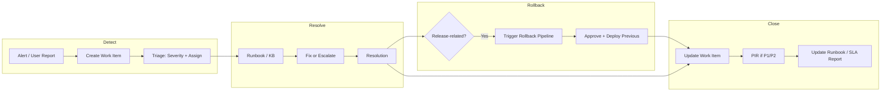

# Azure DevOps Workflow — DevOps Support

End-to-end Azure DevOps workflow for **DevOps Support** (E-commerce, Retail, Airlines, Pharma): incident management, runbooks, escalation, rollback support, and integration with Pipelines and Boards.

---

## 1. Overview and End-to-End Notes

### Purpose

Support workflow ensures that **incidents are captured, triaged, resolved, and improved upon** in a consistent, auditable way, with rollback available when the root cause is a recent release.

- **Triage** incidents using Azure Boards so that every incident is a work item (Bug or custom "Incident") with severity (e.g. P1–P4), assignment, and optional SLA timers. Triage includes deciding who works on it, what runbook or knowledge-base article applies, and whether escalation is needed.
- **Resolve** using runbooks and knowledge base so that responders follow a repeatable, documented path. Runbooks are linked from the work item or service tag so that the right steps are easy to find. Resolution can be a config fix, code hotfix, rollback, or escalation to L2/L3 or vendor—all documented in the work item.
- **Escalate** when the incident is beyond L1 capability or requires another team (e.g. development, GDS, compliance). Escalation path and time are recorded in Boards so that SLA and accountability are clear.
- **Rollback** when the root cause is a recent deployment: support or on-call requests or triggers a rollback via Azure Pipelines (re-deploy previous artifact or slot swap) with approval, instead of making ad-hoc production changes. This keeps production changes traceable and reversible.
- **Communicate** status to stakeholders via status page, Teams/Slack, or email, and capture a **Post-Incident Review (PIR)** for P1/P2. Retain evidence in Boards and pipeline logs for compliance (e.g. GxP, PCI).

### Key Principles

- **Single place for incidents:** All incidents are logged as work items (Bug or custom "Incident") in Azure Boards. Severity, SLA (response and resolution time), assignment, and resolution are tracked in one system so that reporting (MTTR, MTTA, volume by service) and audit are straightforward.
- **Runbooks in repo or wiki:** Runbooks live in Azure Repos (e.g. `/runbooks/` as markdown) or Azure DevOps Wiki so they are versioned and reviewable. Link runbooks from the work item template or from a service/area tag so that responders open the right runbook quickly.
- **Pipeline for rollback:** The support team can request or trigger a rollback through Azure Pipelines (with Production approval), rather than logging into production and changing things manually. This keeps "who did what when" in the pipeline audit log and avoids direct production access where policy forbids it.
- **Audit trail:** Who responded, when they were assigned, what actions were taken (documented in work item comments), and any post-incident actions (PIR, runbook update, CAPA) are captured in Boards and, where required (GxP/PCI), in audit logs (e.g. pipeline approval history, change log).

### Why This Flow Matters

- **Consistency:** Every incident follows the same path (create → triage → runbook → resolve/escalate → close → PIR when needed), so nothing is lost and SLAs can be measured.
- **Speed:** Runbooks and linked pipelines reduce time to diagnose and fix; rollback via pipeline is faster and safer than ad-hoc production changes.
- **Accountability:** Assignments, escalation, and approvals are visible in Boards and Pipelines; compliance and management can see who did what and when.
- **Improvement:** PIR and runbook updates feed back into development and operations so that the same incident type is less likely to recur.

### Industries

- **E-commerce:** Checkout and payment incidents are often P1; handling must be PCI-safe (no card data in tickets; access and changes audited). Status page and post-incident summary keep business and customers informed.
- **Retail:** Store POS and network issues are common; deployment groups allow rollback by region or pilot store so that only affected stores are reverted. Peak periods (e.g. Black Friday) may have enhanced coverage and pre-defined rollback owners.
- **Airlines:** Booking and GDS incidents affect revenue and operations; CAB and change windows may constrain when fixes or rollbacks are allowed. Coordination with revenue management and airport ops is often needed and documented in the work item.
- **Pharma:** Clinical and regulatory systems require compliance and inspection readiness; every incident is documented in Boards, and any production change (including rollback) goes through the pipeline with approval so that evidence is retained for audit.

---

## 2. Azure DevOps Components Used

| Component | Use in DevOps Support | Details and Tips |
|-----------|------------------------|------------------|
| **Azure Boards** | Incidents as work items (Bug or custom "Incident"); severity; assignment; SLA; escalation; PIR and follow-up tasks; change requests (CAB). | Use a custom work item type "Incident" if you want distinct fields (e.g. Severity, SLA Response, SLA Resolution, Runbook URL). Use area path or tags for service (e.g. Checkout, POS, Booking). Link related items (e.g. Bug to Incident, PIR task to Incident). For CAB, use approval workflow or manual tracking in work item. |
| **Azure Repos** | Runbooks as markdown (and optional scripts); versioned; link from Boards or Wiki. | Store runbooks under `/runbooks/` or a dedicated repo; use clear naming (e.g. `checkout-outage.md`, `pos-sync-failure.md`). Link from work item description or a "Runbook" field. Changes to runbooks go through PR so they are reviewed. |
| **Azure Pipelines** | Rollback pipeline (re-deploy previous artifact or slot swap); optional "support request" pipeline (e.g. run script, clear cache, restart app). | Rollback pipeline: manual trigger; parameters for BuildId/ReleaseId and optionally Environment; deploy that artifact to Production (with approval). Support/on-call can be in the Production environment approvers list so they can approve rollback without waiting for dev. |
| **Azure DevOps Wiki** | Knowledge base; runbooks; FAQs; link from work items. | Wiki can hold the same runbook content (or link to Repos). Use a "Support" or "Runbooks" section and link from Incident template. Good for FAQs and "how to escalate" so L1 can find everything in one place. |
| **Environments** | Production (and Staging) with approval; support or on-call role in approvers for emergency rollback. | Create Environment "Production" and add "Approvals" with required approvers. Include support lead or on-call in approvers so that rollback can be approved 24/7 without blocking on dev. Optionally use a separate "Rollback" environment with same target but different approvers if policy differs. |
| **Integrations** | Azure Monitor, Application Insights (alerts → create work item or trigger runbook); PagerDuty/Opsgenie (optional). | Use Logic App or Azure Monitor action group to create a work item in Boards when an alert fires (e.g. error rate > 5%). Optionally integrate with PagerDuty/Opsgenie for on-call rotation and escalation; link PagerDuty incident to Boards work item for single source of truth. |

---

## 3. High-Level Support Workflow (Flow)

### Flow in Words

1. **Detect:** An alert from Azure Monitor or Application Insights (e.g. error rate spike, dependency failure), or a user/customer report, triggers creation of a work item in Boards. Create an "Incident" or "Bug" with a clear title (e.g. "Checkout – payment timeout"). Set severity (P1–P4) based on impact (e.g. P1 = full outage, P2 = major degradation) and assign to on-call or L1. If integrated, the alert can auto-create the work item with a link to the alert.
2. **Triage:** The assignee (on-call or L1) confirms severity and ownership, opens the linked runbook or KB article for the affected service, and starts the SLA timer (response time: time to first meaningful action; resolution time: time to restore service or mitigate). If the incident is outside L1 scope, escalate immediately and document escalation time in the work item.
3. **Resolve:** Follow the runbook steps: check recent deployments, check dependencies, verify config, etc. If the cause is a recent release, decide between rollback and fix-forward. If rollback: trigger the rollback pipeline (select previous build), get approval, and execute. If fix-forward: apply config change or prepare hotfix; document every action in the work item comments. If the issue requires L2/L3 or vendor, reassign or add comments and document escalation.
4. **Rollback (when deploy-related):** When root cause is a bad deployment, request rollback. The designated approver (e.g. on-call or support lead) runs the rollback pipeline, selects the last known good build/artifact, and approves deployment to Production. After deploy, validate health (e.g. Application Insights); document the rollback run and outcome in the work item.
5. **Close:** Mark the work item Resolved/Closed; add resolution notes (root cause, actions taken, runbook used). For P1/P2, create a PIR task or schedule a PIR meeting; link it to the work item. Update the runbook if new steps or scenarios were discovered, and update SLA/MTTR reports.

### Decision Points and Failure Handling

- **Severity unclear:** Default to higher severity until confirmed; adjust when impact is known. Document the change in the work item.
- **Runbook does not fit:** Follow the closest runbook and document deviations; after the incident, update the runbook or create a new one so the next time the path is clear.
- **Rollback fails:** If the rollback pipeline fails (e.g. deployment error), escalate to dev/ops and document. Consider manual rollback only if policy allows and actions are logged; otherwise fix-forward (hotfix) and deploy through the normal pipeline.
- **SLA at risk:** Escalate earlier; add more people or move to fix-forward/rollback quickly. Document in work item for SLA reporting.

---

## 4. Scenarios and Detailed Flows

### Scenario A: P1 Incident (E-commerce Checkout Down)

| Step | Action | Azure DevOps / Tool | Notes and Details |
|------|--------|----------------------|-------------------|
| 1 | Alert or report | Azure Monitor or Application Insights alert (e.g. checkout error rate > 10%), or support/customer report. | Alert can be configured to create a work item automatically (Logic App or action group); otherwise L1 or on-call creates it immediately. |
| 2 | Create incident | Boards: New work item "Incident – Checkout down"; type Incident or Bug; severity P1; assign to on-call; set area path "Checkout." | Start SLA timer (response: e.g. 15 min; resolution: e.g. 1 hour for P1). Add description and any alert link. |
| 3 | Notify and triage | If using PagerDuty/Opsgenie, page on-call; open runbook "Checkout outage" from Wiki or Repos (link in work item or service tag). | Runbook steps might include: check Application Insights for errors, check dependency health, check recent deployments. Document "runbook started" in work item. |
| 4 | Check recent deploys | Pipelines: Open Pipelines → checkout service → Recent runs. Note the last successful Production deploy (build ID and time). Compare with alert time. | If a deploy happened shortly before the alert, suspect release-related; otherwise investigate config, dependency, or external provider. |
| 5 | Decide: rollback or fix-forward | If recent deploy is suspected: trigger rollback pipeline. Else: fix-forward (e.g. config change, feature flag, or hotfix). Document decision in work item. | For checkout, rollback is often preferred when a deploy is clearly correlated with the outage to restore revenue quickly. |
| 6 | Execute rollback | Pipelines: Run "Rollback-Checkout" pipeline (manual); parameter: previous build ID (or "last successful"). Select Production; submit. Approver (support/on-call) approves. Pipeline deploys previous artifact (or slot swap). | Approval is required so that rollback is auditable; on-call or support lead should be in approvers so they can approve without waiting for dev. |
| 7 | Validate | Application Insights: Check checkout error rate and latency; confirm they return to normal. Update work item: "Rollback completed; metrics restored." | If metrics do not improve, rollback may be incomplete (e.g. cache, multiple components) or root cause is not deploy; escalate or continue runbook. |
| 8 | Status update | Update status page (e.g. "Checkout restored"); post in Teams/Slack with short summary; add comment to work item with customer-facing message. | Keep status page and internal comms in sync so business and support have one source of truth. |
| 9 | Resolve and PIR | Boards: Set work item to Resolved; add resolution notes (root cause: e.g. "Bad deploy; rollback to build X"). Create PIR task and link; schedule PIR. Update runbook if needed. SLA and MTTR are derived from work item timestamps. | PIR should cover what happened, what was done, what will be done (runbook, pipeline, or code fix) so the same failure is less likely. |

**Rollback pipeline:** Triggered manually from Pipelines (or optionally from a custom Board action). Inputs: target environment (e.g. Production), build ID or "previous successful" to deploy. Production environment has approval; support/on-call are approvers so rollback can be executed 24/7.

---

### Scenario B: Store POS / Network Issue (Retail)

| Step | Action | Azure DevOps / Tool | Notes and Details |
|------|--------|----------------------|-------------------|
| 1 | Store reports issue | Boards: New work item "POS/Network – Store #X or Region Y"; set severity by impact (e.g. one store = P3, whole region = P2). Area path "POS" or "Stores." | Capture store IDs or region name so deployment group targeting is clear for rollback. |
| 2 | Assign and runbook | Assign to L1; open runbook "POS sync failure" or "Network failover" from Wiki/Repos (linked by area or tag). | Runbooks for POS often include: verify store connectivity, check last sync time, check pipeline last deploy for that region. |
| 3 | Remote checks | Runbook: In Pipelines, check last deploy to deployment group "Region Y" (or "Store-X"). In monitoring (if available), check store sync status or agent health. | If the issue started right after a deploy to that group, treat as release-related and consider rollback for that group only. |
| 4 | Escalate if needed | If issue is not fixable remotely (e.g. hardware, local network), reassign to field IT or vendor; add comment with escalation time and reason. | Document so SLA and MTTR are accurate (e.g. "Escalated to field at HH:MM; ETA from vendor."). |
| 5 | Rollback (if deploy) | If root cause is a bad deploy to "Region Y": run the release pipeline (or rollback pipeline) with the **previous** build artifact, and set target to deployment group "Region Y" only. Approve and execute. | Do not roll back all regions unless necessary; targeted rollback limits impact and keeps other stores on the new version. |
| 6 | Close and report | Boards: Resolve work item; add resolution notes. Update runbook if a new pattern was found (e.g. "If sync fails after deploy to region, run rollback for that group"). Report store impact and resolution time for ops and management. | Use work item history for MTTR and volume-by-service reporting. |

**Deployment groups:** In Azure DevOps, register agents per store or per region and add them to deployment groups (e.g. "Region-Y", "Pilot-Stores"). The rollback (or release) pipeline deploys the previous artifact only to the chosen deployment group(s), so only affected stores are reverted.

---

### Scenario C: Booking System Incident (Airlines)

| Step | Action | Azure DevOps / Tool | Notes and Details |
|------|--------|----------------------|-------------------|
| 1 | Booking failure / availability error | Boards: Create "Incident – Booking" (or Bug); set P1 if full booking down, P2 if partial (e.g. one channel). Assign to on-call; set area "Booking." | Start SLA; notify stakeholders (revenue, ops) if P1 so they can prepare customer comms and alternatives. |
| 2 | Runbook and correlation | Open runbook "Booking failures" from Wiki/Repos. Check Application Insights (errors, dependency calls) and Pipelines (recent release to booking service). | Correlate timeline: if deploy preceded the incident, consider rollback; if external (GDS, network), escalate and document. |
| 3 | Escalate to GDS / revenue | Boards: Add comment with findings; assign or link work item to revenue management or airport ops if impact is cross-team. Document escalation time. | Airlines often need coordination with GDS provider and revenue; keep one work item as the single record and link others. |
| 4 | Rollback or fix | If release-related: run rollback pipeline with approval (respect change window if applicable). If not: coordinate with dev or GDS for fix; document ETA and workaround in work item. | For booking, change windows may restrict when rollback can run; document "rollback scheduled for HH:MM" if not immediate. |
| 5 | CAB / communication | If any change (including rollback) was made during the incident, document in work item for CAB. Follow up with CAB if required by policy. | Ensures change control is satisfied and future similar incidents have a clear precedent. |
| 6 | Resolve and PIR | Boards: Resolve work item; add root cause and actions. For P1, create and link PIR task; update runbook and SLA/MTTR report. | PIR should capture coordination with GDS/revenue and any runbook or process improvements. |

---

### Scenario D: Pharma Clinical/Regulatory System Issue

| Step | Action | Azure DevOps / Tool | Notes and Details |
|------|--------|----------------------|-------------------|
| 1 | Incident reported | Boards: Create "Incident – Clinical/Regulatory" (or Bug); set severity; assign to support/on-call; add compliance tag or flag if inspection-relevant. | All incidents on clinical/regulatory systems are treated as potential audit items; document from the start. |
| 2 | Runbook (no bypass) | Follow runbook from Wiki/Repos only; do not make ad-hoc production changes outside change control. Document every step and outcome in work item comments. | Runbook should align with SOPs; any deviation must be documented and justified for audit. |
| 3 | Escalate to clinical/regulatory | If the incident risks compliance or inspection readiness, escalate to clinical or regulatory; document escalation time and reason in work item. | Ensures regulatory team can assess impact and advise; all communication is part of the audit trail. |
| 4 | Fix or rollback | If deploy-related: execute rollback **only** via pipeline, with required approval. Pipeline audit log provides who approved and when; do not bypass for "speed." | Evidence of approval and deployment is retained in Azure DevOps; export or retain per GxP retention policy. |
| 5 | Corrective action | Boards: If a CAPA or corrective action is required, create a linked work item (e.g. "CAPA – Clinical incident YYYY-MM-DD") and link to the incident. Assign to appropriate owner. | Ensures follow-up is tracked and does not get lost; inspectors can trace from incident to CAPA. |
| 6 | Resolve and retain | Boards: Resolve incident with full resolution notes. Retain work item and all comments; retain pipeline run history for the rollback (if any) for the required period. Export or archive as per SOP for inspections. | Do not delete or alter resolved work items; they are part of the quality and compliance record. |

---

## 5. Full Project Flow (Support Lifecycle)

### Phase 1: Preparation (Ongoing)

- **Runbooks:** Author and maintain runbooks in Repos (e.g. `/runbooks/checkout-outage.md`) or in Azure DevOps Wiki. Each runbook should cover: when to use it, prerequisites, step-by-step actions (including "check recent deploy," "trigger rollback pipeline," "validate health"), and when to escalate. Link runbooks from the work item template (e.g. "Runbook" field or description) or from area path/service tag so that creating an incident for "Checkout" shows the right runbook link.
- **Board setup:** Define work item types (at minimum Bug; optionally custom "Incident" with fields like Severity, SLA Response, SLA Resolution, Runbook URL). Add severity (P1–P4) and optional SLA fields (response time, resolution time). Use area paths or tags for services (Checkout, POS, Booking, Clinical) so that assignment rules and reporting by service work. For CAB (Airlines) or change control (Pharma), use approval workflows or linked Change Request work items.
- **Pipeline:** Build and test rollback pipeline(s) per service or per environment. Pipeline takes a build ID (or "previous successful") and deploys that artifact to the target environment (Staging optional, Production with approval). Add support lead or on-call to the Production environment approvers so that rollback can be approved without waiting for development. Document how to run the rollback (e.g. "Pipelines → Rollback-Checkout → Run new → select build ID").
- **Integrations:** Configure Azure Monitor or Application Insights alerts to create a work item in Boards when an alert fires (e.g. via Logic App or Azure DevOps REST API). Optionally integrate with PagerDuty or Opsgenie for on-call rotation and escalation; link external incidents to Boards so there is one source of truth for SLA and PIR.

**Deliverables:** Runbooks published and linked; Board configured with types, severity, SLA, and areas; rollback pipeline(s) tested and documented; alert → work item (and optional paging) working.

### Phase 2: Detection and Triage

- **Input:** An incident is detected either by an alert (Azure Monitor, Application Insights) or by a user/customer report (support ticket, phone, Teams). If the alert is configured to create a work item, the work item is created automatically with a link to the alert; otherwise the first responder creates it.
- **Create work item:** Create a work item of type Incident (or Bug) with a clear title (e.g. "Checkout – payment timeout"). Set severity (P1–P4) based on impact: P1 = full outage or critical business impact; P2 = major degradation; P3 = partial or single service; P4 = minor. Set area path to the affected service (e.g. Checkout, POS). Assign to on-call or to the support queue. Add a short description and, if applicable, the alert link or ticket ID.
- **SLA:** Start the SLA timer. Response time = time until first meaningful action (e.g. runbook started, assignee acknowledged); resolution time = time until the incident is resolved or mitigated. Track these in the work item (custom fields or tags) or in an integration (e.g. PagerDuty); report on MTTA and MTTR regularly.

**Deliverables:** Every incident has a work item with severity, assignment, and SLA started; triage is consistent and measurable.

### Phase 3: Resolution

- **Runbook:** The assignee opens the linked runbook (from the work item or service tag) and follows the steps. Steps typically include: verify impact, check recent deployments (Pipelines), check dependencies and config, decide rollback vs fix-forward, execute rollback or fix, validate. Document every action and outcome in the work item comments (e.g. "Checked Pipelines; last deploy at 14:00; rollback triggered.").
- **Fix:** Resolution can be a config change (documented and, where required, done via change process), a rollback (via pipeline only), a code hotfix (delivered through the development pipeline and then deployed), or escalation to L2/L3 or vendor. For GxP and PCI, do not make ad-hoc production changes; use the pipeline and approval so that evidence is retained.
- **Escalation:** If the incident cannot be resolved at the current level, reassign or add a comment and @mention the next level; document the escalation time and reason. The work item remains the single record; SLA continues until resolution.

**Deliverables:** Resolution path is documented in the work item; all actions are traceable; escalation is visible and timed.

### Phase 4: Rollback (When Applicable)

- **Decide:** If the root cause is identified as a recent deployment (e.g. deploy at 14:00, incident started at 14:05), decide to roll back. Document the decision and the build to roll back to in the work item.
- **Trigger:** Run the rollback pipeline from Pipelines (manual run). Select the previous successful build (or enter the build ID). Target environment: Production (or the affected deployment group for retail). Submit the run; the pipeline will wait for approval.
- **Approve:** A designated approver (on-call or support lead, configured in the Production environment) approves the deployment. Approval is recorded in Azure DevOps (who, when).
- **Execute:** The pipeline deploys the selected artifact to Production (or the selected deployment group). After deploy, validate health (e.g. Application Insights, health endpoint). Document in the work item: "Rollback completed; build X deployed; metrics restored."

**Deliverables:** Rollback is executed through the pipeline with approval; work item and pipeline audit log provide full evidence.

### Phase 5: Close and Improve

- **Resolve work item:** Set the work item state to Resolved (or Closed). Add resolution notes: root cause, actions taken (including rollback if applicable), and runbook used. This allows future reporting (MTTR, root cause by type) and audit.
- **PIR:** For P1 and P2 incidents, create a Post-Incident Review task or schedule a PIR meeting. Link the PIR to the incident work item. In the PIR, document: what happened, what was done, what could be improved (runbook, pipeline, monitoring, code), and any follow-up work items (e.g. "Update runbook," "Add alert," "Fix bug AB#789"). PIR outcomes can be added as comments or a linked document.
- **Runbook and SLA:** If the incident revealed a new scenario or a gap in the runbook, update the runbook (via PR if in Repos) and publish. Update SLA/MTTR reports and share with management and DevOps development so that pipeline, monitoring, and service improvements are prioritized.

**Deliverables:** Incidents closed with clear resolution; P1/P2 have PIR and follow-ups; runbooks and reports are updated; feedback loop to development is in place.

---

## 6. Board and Pipeline Integration (Reference)

### Work Item (Incident) Fields

- **Title:** Short, searchable description (e.g. "Checkout down – payment timeout"). Include service and symptom so that similar incidents can be found later.
- **Severity:** P1, P2, P3, P4 (or Critical, High, Medium, Low). Define criteria per organization (e.g. P1 = full outage or revenue impact > X; P2 = major feature down; etc.).
- **Area path:** Set to the affected service or system (Checkout, POS, Booking, Clinical) so that runbooks and reports can filter by area. Optionally use **Tags** (e.g. "checkout", "payment") for extra filtering.
- **SLA:** Optional custom fields for "SLA Response" and "SLA Resolution" (target minutes per severity). Actual response/resolution can be computed from work item history (e.g. created → first comment; created → resolved) or from an integration.
- **Runbook:** A hyperlink field or description section with the URL to the runbook (Wiki page or Repos file). Alternatively, use a shared "Runbook" field that is set by area path (e.g. template for "Checkout" incidents includes link to checkout runbook).
- **Related pipeline run:** After rollback, add a comment with the pipeline run URL (e.g. "Rollback run: https://dev.azure.com/org/project/_build/results?buildId=12345") or use a custom "Rollback Run" field. This links the incident to the exact deploy for audit and PIR.

### Rollback Pipeline (Concept)

- **Trigger:** Manual only. Optionally allow "Run new" from a previous pipeline run so the user can re-run with the same parameters (e.g. previous build). Parameters: **BuildId** (or "PreviousSuccessfulBuild"), **Environment** (e.g. Production), and for deployment groups **DeploymentGroup** (e.g. Region-Y).
- **Stages:** (1) Optionally deploy the selected artifact to Staging and run a quick health check. (2) Deploy the same artifact to Production (or the specified deployment group). Production deployment uses the Environment "Production," which has an approval gate.
- **Approvers:** In Azure DevOps, open Pipelines → Environments → Production → Approvals and checks. Add "Approvals" and add the support lead and/or on-call group as required approvers so that rollback can be approved 24/7 without waiting for development. Optionally add a check (e.g. "Invoke REST API" to verify the build ID is not older than N days) to prevent accidental rollback to a very old version.

### Severity and SLA (Example)

| Severity | Response (e.g. first action) | Resolution (e.g. restore or mitigate) |
|----------|-------------------------------|----------------------------------------|
| P1       | 15 min                         | 1 hour                                 |
| P2       | 30 min                         | 4 hours                                |
| P3       | 4 hours                        | 1 business day                         |
| P4       | 1 business day                 | 1 week                                 |

Adjust to your organization; track actual MTTA and MTTR from work item timestamps and report regularly.

---

## 7. Checklist for DevOps Support Workflow

- [ ] **All incidents logged in Boards** with severity, assignment, and (where applicable) SLA. No "tribal" handling without a work item so that volume, MTTR, and root cause are measurable.
- [ ] **Runbooks in Repos or Wiki** and linked from work item template or service/area so that responders always have a starting point. Runbooks are updated after incidents when new steps or scenarios are found.
- [ ] **Rollback pipeline(s) available and tested** for each service or environment that can be rolled back. Support or on-call can **request** (e.g. by running the pipeline) and **approve** rollback so that Production rollback does not depend on dev availability.
- [ ] **SLA and MTTR tracked and reported** (e.g. from work item history or integration). Report by severity and by service so that gaps and trends are visible.
- [ ] **PIR process for P1/P2** with a defined owner and template (what happened, what was done, what will be done). Runbook and pipeline improvements from PIR are fed back to development and operations.
- [ ] **Industry alignment:** PCI-safe handling and no card data in tickets (E-commerce); GxP and full documentation for audit (Pharma); CAB and change window awareness (Airlines); deployment groups for targeted store/region rollback (Retail).

---

*This workflow aligns with the 30 DevOps Support projects in `devops-support.md`.*
