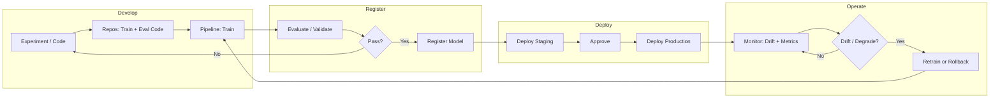

# Azure DevOps Workflow — MLOps & LLMOps

End-to-end Azure DevOps workflow for **MLOps and LLMOps** (E-commerce, Retail, Airlines, Pharma): experiment tracking, training pipelines, model registry, deployment, drift monitoring, A/B testing, rollback; and for LLMOps: prompt versioning, RAG, guardrails.

---

## 1. Overview and End-to-End Notes

### Purpose

This workflow connects **experimentation**, **training**, **validation**, **registration**, **deployment**, and **monitoring** so that ML and LLM changes are reproducible, governed, and reversible.

- **ML lifecycle:** Data scientists experiment in Azure ML (or locally) with code and config in Repos. When ready, a **training pipeline** in Azure DevOps triggers an Azure ML training job (script, data reference, compute) and produces a model artifact. The pipeline then **evaluates** the model (accuracy, business metrics) and, if it passes, **registers** it in the Azure ML model registry. A **deployment pipeline** (or the same pipeline in later stages) deploys a **specific model version** to Staging and then to Production (real-time or batch endpoint). **Monitoring** (Application Insights, Azure ML drift) detects degradation or drift and triggers **retraining** or **rollback** so that production always runs a known-good model or prompt version.
- **Governance:** Code (training, evaluation), data references, and model versions are versioned and traceable. Promotion to production goes through approval gates (automated validation and/or manual approval). A bad model can be reverted by deploying the previous model version via a **rollback pipeline**, so bad models do not stay in production.
- **LLMOps:** For LLM-based features (chatbots, rebooking, catalog enrichment, sentiment), **prompts** and **RAG** configs (chunking, index, retrieval rules) are stored in Repos and versioned. A pipeline **evaluates** prompts (relevance, safety, PII) and **deploys** a prompt/RAG version to Staging and Production. **Guardrails** (content filters, PII handling) are enforced at runtime; **rollback** reverts to a previous prompt/RAG version via the same pipeline and approval pattern as model rollback.

### Key Principles

- **Reproducibility:** Training and evaluation run from code in Azure Repos; the pipeline checks out a specific commit and uses declared data references (path, version) and compute. Model and run IDs are logged so that "what code and data produced this model" can be reproduced and audited.
- **Registry as source of truth:** The Azure ML model registry holds every promoted model version. Production deployment always consumes a **specific version** from the registry; there is no "latest" in production without an explicit deploy of that version. This makes rollback and audit clear: "Production is on model version X."
- **Quality gates:** Before a model (or prompt) is promoted, automated validation runs: accuracy, business metrics (e.g. NDCG, MAPE, false positive rate), and optional safety checks. The pipeline fails if thresholds are not met. Production deploy may also require manual approval (Environments) so that only validated and approved models go live.
- **Drift and retraining:** Data drift (input distribution change) and model performance drift (accuracy or business metric degradation) are monitored (Azure ML, Application Insights, or custom dashboards). When drift exceeds a threshold, an alert triggers a decision: **retrain** (run the training pipeline with fresh data) or **rollback** (deploy the previous model version) until a new model is ready.

### Why This Flow Matters

- **Consistency:** Every model and prompt follows the same path (train → evaluate → register → deploy → monitor), so nothing goes live without validation and approval.
- **Safety:** Bad models or prompts can be reverted quickly via rollback pipeline; A/B tests allow comparing new vs current before full rollout.
- **Auditability:** Code, data, and model versions are linked; pipeline and registry logs support compliance (GxP, PCI) and post-incident analysis.
- **Iteration:** Data science and product can ship model and prompt improvements frequently because the path is automated and reversible.

### Industries

- **E-commerce:** Recommendations, search ranking, fraud, and dynamic pricing use ML; A/B tests and conversion/engagement metrics guide promotion. Fraud models require PCI-safe handling (no card data in training logs; access and deploy audited).
- **Retail:** Demand forecasting, markdown, labor, and assortment use batch or real-time models; deployment groups can be used for phased rollout. Seasonal and promotional retraining are scheduled or triggered by data events.
- **Airlines:** Revenue management, crew pairing, delay prediction, and rebooking LLM; revenue and operational metrics define success. Model and prompt changes may align with CAB and change windows.
- **Pharma:** Clinical trial optimization, drug safety, quality/deviation, and supply chain models require GxP validation, full lineage (code, data, model version), and auditability for inspections. Approval in Boards and pipeline is standard.

---

## 2. Azure DevOps and Azure ML Components

| Component | Use in MLOps / LLMOps | Details and Tips |
|-----------|------------------------|------------------|
| **Azure Boards** | Work items for experiments, model release requests, approval tasks; link to pipeline runs and registry. | Use work items to request a model release (e.g. "Model release – Recommendation v2"); attach validation report or link to pipeline run. For GxP, use Board approval workflow before Production deploy. Link work item to the pipeline run that performed the deploy for audit. |
| **Azure Repos** | Training code (e.g. `train.py`), evaluation scripts (`evaluate.py`), prompt templates, RAG config (chunking, index schema); all versioned and referenced by the pipeline. | Pipeline checks out Repos at a specific ref (branch or commit); training and evaluation run from this code so that every model/run is tied to a commit. For LLMOps, store prompts under `/prompts/` and RAG config under `/rag/`; version with code. |
| **Azure Pipelines** | Training pipeline: trigger (schedule, manual, or event); submit Azure ML job; evaluate; register model. Deploy pipeline: deploy model version to Staging → Production (with approval). Rollback pipeline: deploy a chosen previous model version to Production. | Use multi-stage YAML: Train → Evaluate → Register → DeployStaging → DeployProduction. Parameters: data path/version, compute size, model name. For LLMOps, add stages to build RAG index and deploy prompt + config. |
| **Azure Artifacts** | Optional: publish evaluation reports (e.g. JSON, HTML) or packaged prompt bundles; coordinate with Azure ML run artifacts. | Useful when you want evaluation reports to be versioned and visible outside Azure ML; most model artifacts live in Azure ML registry. |
| **Environments** | Staging and Production for model (or prompt) endpoints; Production has manual approval. Optional: separate "Canary" environment for A/B. | Create Environment "Production" and add Approvals (e.g. MLOps lead, data science); optional "Invoke REST API" to verify endpoint health after deploy. |
| **Azure ML** | Experiments and runs (training jobs); model registry (versions, tags); endpoints (real-time, batch); drift monitoring (data and model); compute (training clusters, batch). | Pipeline uses Azure ML CLI or REST to submit training job, wait for run, register model from run output. Deploy stage uses Azure ML to deploy a specific model version to an endpoint. Drift is configured in Azure ML and can trigger alerts or retraining. |
| **Azure OpenAI / AI Search** | LLMOps: deploy model (e.g. gpt-4) and use from app; RAG with AI Search (index, chunking, retrieval); prompt and guardrail config deployed from Repos. | Pipeline deploys or updates prompt version and RAG index; guardrails (content filter, PII) are configured via config file or API. Version prompt and config in Repos so rollback is "deploy previous commit." |

---

## 3. High-Level MLOps Workflow (Flow)

### Flow in Words (MLOps)

1. **Develop:** Data scientists experiment in Azure ML or locally; code and config are in Repos. When ready, the training script and evaluation script are committed; the pipeline will run them in a reproducible way.
2. **Train:** The pipeline checks out Repos and submits an Azure ML training job (script, data reference, compute). The run produces a model artifact (and optionally metrics). The pipeline waits for the run to complete.
3. **Evaluate and register:** The pipeline runs the evaluation script (or Azure ML evaluation) against the trained model. If metrics meet thresholds (e.g. accuracy, NDCG), the pipeline registers the model in the Azure ML registry with a version and tags. If not, the pipeline fails and no new version is registered.
4. **Deploy:** The pipeline deploys the newly registered model version to a Staging endpoint and runs smoke/validation tests. After approval, it deploys the same version to the Production endpoint. Production always points to a specific model version (no "floating latest").
5. **Monitor and iterate:** Application Insights and Azure ML monitor latency, errors, and drift. If drift or degradation is detected, the team either triggers retraining (run the training pipeline again with fresh data) or rollback (run the rollback pipeline to deploy the previous model version to Production). Retrained models go through the same evaluate → register → deploy flow.

### LLMOps Additions

- **Prompts and RAG:** Prompts (and optional RAG config: chunking, index name, retrieval params) are stored in Repos (e.g. `/prompts/`, `/rag/`). The pipeline checks out a commit, runs evaluation (relevance, safety, PII checks), and deploys the prompt version and RAG index to Staging, then to Production with approval. Production uses a specific prompt/RAG version so that rollback is "deploy previous version."
- **Evaluation:** Before promotion, the pipeline runs automated evaluation (e.g. relevance score, safety filters, PII detection). The pipeline fails if evaluation does not meet thresholds. Guardrails (content filter, PII redaction) are enforced at runtime in the application or via Azure OpenAI/AI Search config.
- **Rollback:** To roll back a bad prompt or RAG change, run the deploy pipeline (or a dedicated rollback pipeline) with a **previous** commit or version; deploy that version to Production with approval. Same audit and approval pattern as model rollback.

### Decision Points and Failure Handling

- **Evaluation fails:** Pipeline fails; do not register or deploy. Fix training (data, hyperparameters, code) and re-run the pipeline.
- **Staging validation fails:** Do not approve Production; fix model or evaluation and re-run from Train.
- **Drift or degradation in production:** Decide retrain vs rollback. If rollback: run rollback pipeline with previous model version; then investigate and retrain or fix. If retrain: run training pipeline; new model goes through full evaluate → register → deploy flow before replacing current production.

---

## 4. Scenarios and Detailed Flows

### Scenario A: New Recommendation Model (E-commerce)

| Step | Action | Azure DevOps / Azure ML | Notes and Details |
|------|--------|-------------------------|-------------------|
| 1 | Experiment | Data scientists run experiments in Azure ML (or locally); log metrics (e.g. NDCG, recall); code and config in Repos. | Experiments are exploratory; production path starts when code is committed and pipeline is run. Use Azure ML experiment tracking to compare runs. |
| 2 | Training pipeline | Pipeline: checkout Repos (branch or commit); submit Azure ML training job with script path, data reference (e.g. blob path + version), and compute. Wait for run to complete. | Data version and compute size are in pipeline variables or config so that the run is reproducible. Run ID is captured for lineage. |
| 3 | Evaluate | Pipeline: run evaluation script (e.g. on holdout set: NDCG, CTR proxy, diversity). Compare to baseline or threshold. Fail pipeline if below threshold. | Threshold can be "no regression vs current production" or a fixed minimum. Evaluation runs in pipeline or as a second Azure ML job. |
| 4 | Register | Pipeline: register the model artifact from the training run in Azure ML registry with a new version and tags (e.g. `candidate`, `experiment=rec-v2`). | Only successful evaluation leads to registration; registry is the single source of truth for deployable models. |
| 5 | Deploy staging | Pipeline: deploy the new model version to the Staging endpoint (real-time). Run smoke test (e.g. invoke endpoint with sample request; check latency and format). | Staging is used for integration and manual QA; same endpoint type as Production. |
| 6 | A/B or canary | Optional: deploy the new model as a second endpoint (e.g. "recommendation-v2"); application or gateway routes a percentage of traffic to v2. Log variant and outcome (e.g. add-to-cart) for analysis. | Compare conversion and engagement over a defined window; decide promote vs rollback based on metrics. |
| 7 | Deploy production | Pipeline: deploy the same model version to the Production endpoint (or switch traffic to v2 if A/B). Production environment requires approval (e.g. MLOps, product). | After deploy, Production serves this model version until the next deploy or rollback. |
| 8 | Monitor | Application Insights: latency, errors, and business metrics (e.g. recommendation CTR, conversion). Azure ML: data drift and model performance drift. Set alerts; if drift or degradation is detected, trigger retrain or rollback. | Retrain: run training pipeline with fresh data. Rollback: run rollback pipeline to deploy the previous model version to Production. |

**Rollback:** Run the rollback pipeline; select the previous model version from the registry (e.g. by version number or tag); deploy that version to the Production endpoint. Approval is required. Document in Boards or incident work item.

---

### Scenario B: Retrain and Promote (Retail Demand Forecast)

| Step | Action | Azure DevOps / Azure ML | Notes and Details |
|------|--------|-------------------------|-------------------|
| 1 | Trigger | Pipeline is triggered on a schedule (e.g. weekly) or by an event (e.g. new data in blob; Azure Data Factory or event grid). Pipeline parameters may include data path/date range. | Ensures forecasts are updated regularly from fresh data (e.g. sales, promotions, seasonality). |
| 2 | Train | Pipeline: checkout Repos; submit Azure ML training job with script and approved dataset (path and version). Training produces a forecast model; run and model are logged in Azure ML. | Dataset should be from an approved source (e.g. data lake with governance); version is recorded for audit. |
| 3 | Validate | Pipeline: run validation (e.g. MAPE, bias by segment) on a validation set or backtest. Fail pipeline if metrics are below threshold or worse than current production. | Prevents bad forecast models from reaching downstream replenishment or planning systems. |
| 4 | Register | Pipeline: register the new model in Azure ML registry with version and tag (e.g. "candidate-demand-v2"). | Downstream deploy or batch job will consume this version. |
| 5 | Deploy batch | Pipeline: deploy to Azure ML batch endpoint (or export model/artifacts for a downstream system like replenishment). Production deploy stage requires approval. | Batch endpoint is invoked on a schedule or by downstream process; no real-time serving. |
| 6 | Monitor | Monitor forecast accuracy (e.g. vs actuals) and drift (e.g. feature drift). Next cycle: if metrics are good, continue retraining on schedule; if degradation, trigger rollback (deploy previous model version) and investigate. | Retail often has seasonal and promotional patterns; retraining frequency and triggers should match business cycle. |

---

### Scenario C: Model Rollback (Revenue or Fraud)

| Step | Action | Azure DevOps / Azure ML | Notes and Details |
|------|--------|-------------------------|-------------------|
| 1 | Detect | Monitoring (Application Insights, dashboard, or Azure ML) shows a drop in revenue metric (e.g. conversion, revenue per session) or a spike in false positives (e.g. fraud model blocking good users). Alert fires or team notices. | Correlate with recent model deploy time; if deploy was recent, suspect model. |
| 2 | Decide | Team (MLOps, data science, product) decides to roll back. Identify the last known good model version from the registry (e.g. the version that was in Production before the current one). | Document decision and version in work item or incident. |
| 3 | Rollback pipeline | Run the "Rollback-Model" pipeline (manual). Input: model version (e.g. version 5) or run ID. Target: Production endpoint for the affected service (e.g. recommendation, fraud). | Pipeline resolves the model from registry and deploys it to the Production endpoint. |
| 4 | Approve | Production environment has an approval gate; on-call or MLOps approves the rollback deployment. | Ensures rollback is auditable and not accidental. |
| 5 | Deploy | Pipeline deploys the selected model version to Production. Validate health (latency, error rate, and optionally business metric) to confirm recovery. | If metrics do not recover, the issue may be data or downstream; escalate and investigate. |
| 6 | Post-incident | Boards: create or update incident work item; document root cause and rollback. Schedule PIR. Plan retrain or fix (e.g. data bug, feature bug) and re-release through the normal train → evaluate → register → deploy flow. | Do not skip evaluation when re-releasing; ensure the fix is validated before going to Production again. |

---

### Scenario D: A/B Test New Ranking Model (Search)

| Step | Action | Azure DevOps / Azure ML | Notes and Details |
|------|--------|-------------------------|-------------------|
| 1 | Deploy second endpoint | Pipeline: after evaluation and registration, deploy the new ranking model as a **second** endpoint (e.g. "search-ranking-v2") alongside the current Production endpoint (v1). Do not replace v1 yet. | Both endpoints are live; application or gateway will decide which one to call per request. |
| 2 | Traffic split | Application or API gateway: route a percentage of traffic (e.g. 10%, then 50%) to the v2 endpoint. Log the variant (v1 vs v2) and outcome (e.g. click, conversion) for each request so that metrics can be compared. | Use a consistent period (e.g. 1–2 weeks) and sufficient sample size before deciding. |
| 3 | Evaluate | In a pipeline or dashboard: compare CTR, conversion, and relevance (e.g. NDCG) for v1 vs v2 over the evaluation window. Apply statistical significance if needed. | Decision criteria should be defined in advance (e.g. "v2 wins if conversion lift > 2% with 95% confidence"). |
| 4 | Promote or rollback | If v2 wins: update application to route 100% traffic to v2; optionally retire the v1 endpoint and update Production to point to the new model (single endpoint). If v2 loses: route 0% to v2; optionally run rollback pipeline or leave v2 endpoint in place but unused until decommissioned. | Document outcome and model version in Boards for future reference. |

---

### Scenario E: LLMOps — Prompt and RAG Update (Customer Service Chatbot)

| Step | Action | Azure DevOps / Azure | Notes and Details |
|------|--------|----------------------|-------------------|
| 1 | Update prompt / RAG | Edit prompt template (e.g. `prompts/chatbot-system.md`) or RAG config (e.g. chunking, index name) in Repos. Commit and open PR; after review, merge. | Version control ensures every production prompt/RAG version is tied to a commit; rollback is "deploy previous commit." |
| 2 | Pipeline | Pipeline: on merge (or manual), checkout Repos; run evaluation (e.g. relevance on sample queries, safety and PII checks). Fail if score is below threshold or if PII/safety check fails. | Evaluation can be scripted (e.g. call model with test set and score) or use Azure AI Studio evaluation. |
| 3 | Deploy staging | Pipeline: deploy prompt version and RAG index (or config) to Staging (e.g. Azure OpenAI + AI Search staging). Run manual QA or automated smoke tests (e.g. send sample questions and check format and guardrails). | Staging should use same guardrails (content filter, PII) as Production. |
| 4 | Deploy production | After approval (Environment "Production"), pipeline deploys prompt and RAG config to Production. Guardrails (content filter, PII handling) are enabled. | Production now serves this prompt/RAG version until the next deploy or rollback. |
| 5 | Monitor | Application Insights: latency, errors, and content filter triggers. If issues (e.g. inappropriate responses, high latency): run rollback pipeline to deploy the previous prompt/RAG version to Production; investigate and fix before re-releasing. | Same rollback pattern as model: "deploy previous version" with approval. |

---

### Scenario F: Pharma — GxP Model Release (Clinical Trial or Drug Safety)

| Step | Action | Azure DevOps / Azure ML | Notes and Details |
|------|--------|-------------------------|-------------------|
| 1 | Train and validate | Pipeline: training runs on an approved dataset (path and version documented); validation (e.g. accuracy, sensitivity/specificity) runs in the pipeline. Validation report is produced and stored (e.g. pipeline artifact or Azure ML). Full audit trail: code ref, data ref, run ID. | No bypass of validation; pipeline fails if validation fails. |
| 2 | Board approval | Create work item "Model release – Clinical/Safety" (or use Change Request). Attach validation report and pipeline run link. Approval workflow in Boards: QA and/or compliance approve before Production deploy. | Evidence is in the work item and linked pipeline run for inspection. |
| 3 | Register | Pipeline: register model in Azure ML registry with metadata (dataset path/version, run ID, validation summary). Version is immutable. | Registry is the source of truth; production deploy will use this exact version. |
| 4 | Deploy | Pipeline: deploy to Production only after Board approval. Production environment has required approvers; who approved and when are recorded in Azure DevOps audit log. Deploy uses the approved model version only. | No ad-hoc deploy; every production model is traceable to an approved work item and pipeline run. |
| 5 | Operate | Monitor model performance and drift (Azure ML, Application Insights). Any change (retrain, rollback) is done via pipeline with approval and documented in work item and pipeline history. Retain logs and evidence per GxP retention policy for inspections. | Retrain and rollback follow the same governance: approval and audit trail. |

---

## 5. Full Project Flow (MLOps / LLMOps Lifecycle)

### Phase 1: Experiment and Code

- **Experiment:** Data scientists run experiments in Azure ML (or locally) with different features, hyperparameters, or architectures; they log metrics and compare runs. Code and config are in Repos so successful experiments can be reproduced. When ready for production, training and evaluation scripts are finalized and committed.
- **Training script:** Entry script (e.g. `train.py`) and dependencies (e.g. `requirements.txt`) are in Repos. The pipeline submits this to Azure ML with data reference (path, version) and compute; all inputs are declared for reproducibility.
- **Evaluation script:** Metrics and business rules (e.g. NDCG, MAPE, false positive rate); pipeline runs it after training and **fails the pipeline** if below threshold so bad models are never registered or deployed.

**Deliverables:** Training and evaluation code in Repos; data reference and compute documented; pipeline can run training and evaluation reproducibly.

### Phase 2: Training Pipeline

- **Trigger:** Schedule (e.g. weekly), manual, or event (e.g. new data in blob). Parameters: data path/version, compute size, model name, optional branch.
- **Steps:** Checkout Repos → submit Azure ML training job (script, data reference, compute) → wait for run → capture run ID and model artifact path for the next stage.
- **Artifacts:** Model artifact from the run; optional evaluation report published to Artifacts or Azure ML. Pipeline history shows which code and data were used.

**Deliverables:** Completed training run with model artifact and run ID; full traceability.

### Phase 3: Validation and Registry

- **Evaluate:** Pipeline runs evaluation script (or Azure ML evaluation job) against the trained model; fail pipeline if metrics are below threshold or regress vs baseline.
- **Register:** On success, register model in Azure ML registry with version and tags (e.g. `environment=staging`, `experiment=rec-v2`). Optionally attach validation summary. Registry is the single source of truth for deployable models.
- **Approval:** For regulated (e.g. Pharma), use Board work item "Model release" with approval and attach validation report and pipeline run link before Production deploy.

**Deliverables:** New model version in registry (only if validation passed); optional Board approval for regulated releases.

### Phase 4: Deploy

- **Staging:** Pipeline deploys the registered model version to Staging endpoint (real-time or batch); run smoke test. Optionally deploy as second endpoint for A/B.
- **Production:** After manual approval (Environment "Production"), deploy the same model version to Production endpoint. Production always points to a specific version; no "floating latest."
- **LLMOps:** Same flow for prompt/RAG: deploy prompt version and RAG config to Staging → validate → Production with approval; guardrails enabled in config.

**Deliverables:** Model (or prompt/RAG) deployed to Staging and Production with full traceability.

### Phase 5: Monitor and Iterate

- **Monitor:** Application Insights and Azure ML (latency, errors, data drift, model performance drift); business metrics in dashboard or alerts.
- **Drift:** When drift or degradation exceeds threshold, alert fires; team decides **retrain** (run training pipeline with fresh data; new model goes through full flow) or **rollback** (deploy previous model version via rollback pipeline). Document in Boards or incident.
- **Retrain:** Trigger training pipeline; new model goes through same validate → register → deploy flow.
- **Rollback:** Rollback pipeline takes model version (or run ID) as input; deploys that version to Production with approval; document in work item and audit log.

**Deliverables:** Production model/prompt monitored; drift and incidents trigger retrain or rollback; all changes documented and auditable.

---

## 6. Pipeline and Registry (Reference)

### Training Pipeline (Concept)

- **Stages:** (1) Train: Checkout Repos; submit Azure ML training job; wait; capture run ID and model path. (2) Evaluate: Run evaluation script/job; fail if below threshold. (3) Register: Register model in Azure ML registry with version and tags. (4) Deploy Staging: Deploy to Staging; smoke test. (5) Deploy Production: Deploy same version to Production; Environment "Production" has approval.
- **Parameters:** Data path or date range, compute size, model name, optional branch/commit. Use variable groups or Key Vault for secrets.

### Rollback Pipeline (Concept)

- **Trigger:** Manual only. Parameters: **Model version** (or run ID), **Endpoint name** (e.g. "recommendation-prod"), optional Environment.
- **Steps:** Resolve model from Azure ML registry (by version or run ID) → deploy to specified endpoint. Production environment has approval so who/when is recorded. For LLMOps, parameter = commit or version of prompt/RAG; pipeline deploys that version.

### Model Registry (Azure ML)

- **Versions:** Each successful train run that passes evaluation registers a **new** version (e.g. 1, 2, 3). Do not overwrite; production always pins a version (e.g. "Production is on version 5") so rollback is unambiguous.
- **Tags:** e.g. `environment=production`, `experiment=recommendation-v2`, `run_id=xxx` for filtering and traceability. Optionally store validation summary and data path in metadata for lineage.

### LLMOps Artifacts

- **Repos:** `/prompts/`, `/rag/` (config, chunking rules); evaluation scripts. All versioned with code; pipeline checks out a specific commit and deploys that version.
- **Deploy:** Pipeline copies prompt and RAG config to deployment target (e.g. Azure OpenAI + AI Search); guardrails (content filter, PII) via config. Production uses a single deployed version; rollback = deploy previous commit/version with approval.

---

## 7. Checklist for MLOps / LLMOps Workflow

- [ ] **Training and evaluation code in Repos** and pipeline runs training in Azure ML with traceable data and code versions (commit, data path/version). No production models from ad-hoc runs; everything through the pipeline.
- [ ] **Model registry is the source of truth**; deployment pipeline always consumes a **specific** model version. Production does not use "latest" without an explicit deploy of that version.
- [ ] **Validation gates** before promotion; pipeline fails if metrics below threshold. Production deploy has **approval** (Environment "Production").
- [ ] **Rollback pipeline implemented and tested**; team can deploy previous model (or prompt) version to Production with approval; procedure documented.
- [ ] **Drift and performance monitored** (Azure ML, Application Insights); retraining and rollback process documented and practiced.
- [ ] **LLMOps:** Prompts and RAG versioned in Repos; evaluation (relevance, safety, PII) before production; guardrails at runtime; rollback for prompt/RAG same as model rollback.
- [ ] **Industry:** GxP (Pharma) lineage and Board approval; PCI (E-commerce fraud) for fraud models; CAB (Airlines) where required.

---

*This workflow aligns with the 30 MLOps & LLMOps projects in `mlops-llmops.md`.*
