# Healthcare Application Support and Compliance

## Azure DevOps Project Overview

| Attribute | Value |
|-----------|--------|
| **Project Type** | Application Support, Compliance & Governance |
| **Organization** | Azure DevOps Org |
| **Area Path** | Healthcare / Support |
| **Iteration** | Sprint-based (2 weeks) |

**What this project is:** This Azure DevOps project supports **healthcare applications** and **compliance**. It covers incident and problem management, change and release management (CAB), compliance scanning and evidence collection (e.g. HIPAA/HITECH), and runbooks/knowledge base. Work is tracked in Boards; pipelines run compliance scans, evidence collection, and runbook deployment. The goal is 99.9% uptime and audit-ready compliance.

---

## 1. Project Objectives

**Explanation:** Objectives define why the project exists: keep healthcare apps up and compliant, support users via incidents and changes, and automate evidence for auditors. Each objective drives specific Features and pipelines (e.g. compliance → Compliance-Scan and Evidence-Collection).

**Detailed objectives flow (how goals connect):**

1. **99.9% uptime (HIPAA-aligned SLAs)** → Incident management Feature; P1/P2 SLA tracking; runbooks for fast resolution; monitoring and alerting.
2. **Continuous compliance (HIPAA, HITECH)** → Compliance & Audit Feature; Compliance-Scan pipeline (daily); Evidence-Collection pipeline (weekly); work items for findings.
3. **L2/L3 support, incident & change control** → Incident & Problem Management; Change & Release Management; integration with ServiceNow/Teams; CAB approval for prod changes.
4. **Track and remediate security/audit items** → Compliance Tasks in Boards; remediation linked to scans; exception reporting.
5. **Document and automate evidence** → Evidence-Collection pipeline; artifacts attached to work items; audit pack for auditors.

- Maintain 99.9% uptime for healthcare applications (HIPAA-aligned SLAs)
- Ensure continuous compliance with HIPAA, HITECH, and regional healthcare regulations
- Provide L2/L3 support, incident management, and change control
- Track and remediate security findings and audit items
- Document and automate compliance evidence collection

**Objectives flow**

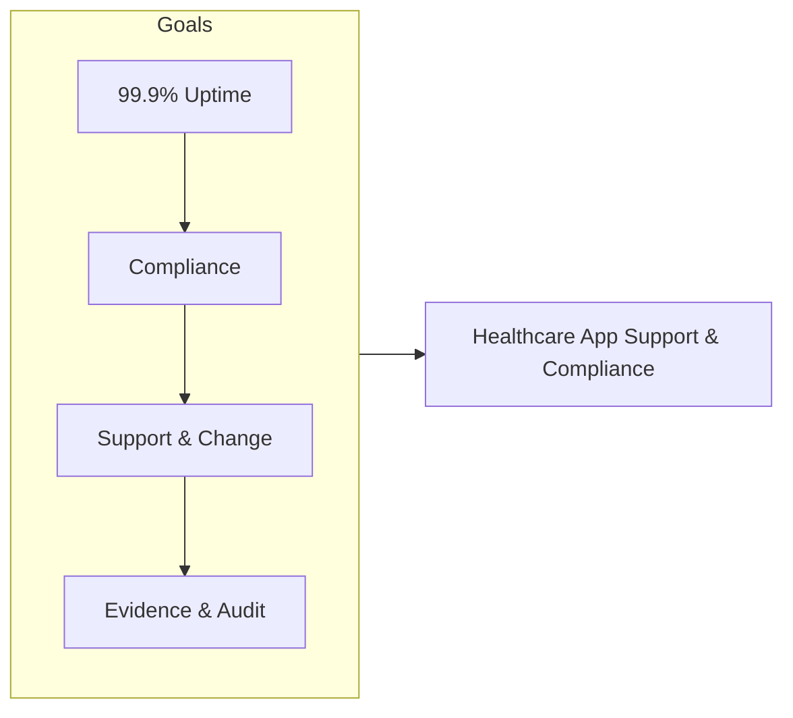

---

## 2. Azure DevOps Structure

### Repositories

| Repo | Purpose |
|------|---------|
| `healthcare-app-support` | Runbooks, playbooks, support scripts |
| `healthcare-compliance` | Compliance policies, checklists, evidence automation |
| `healthcare-monitoring` | Alert rules, dashboards, runbook automation (e.g., Logic Apps / ARM) |

**Explanation:** Repos hold runbooks, compliance logic, and monitoring config. Support and compliance teams change runbooks and scripts; pipelines deploy them or run scans. Monitoring repo feeds alerting and dashboards so production is observable and automation is versioned.

**Detailed repository flow (step-by-step):**

1. **healthcare-app-support** — Runbooks and scripts are edited in branches; PR triggers Runbook-Deploy (or validation). Merge deploys to Azure Automation or Wiki. Support uses these for incident resolution.
2. **healthcare-compliance** — Policies, checklists, and evidence scripts. Compliance-Scan pipeline runs scripts (e.g. Azure Policy, custom checks); Evidence-Collection pipeline gathers logs/config and attaches to work items. Outputs feed Boards and audit pack.
3. **healthcare-monitoring** — Alert rules and dashboard definitions (e.g. ARM, Logic Apps). Changes deployed via pipeline to Azure; alerts create incidents or link to Boards.
4. **Flow:** Change in repo → PR → validation/deploy pipeline → Production or Wiki/Automation. All changes auditable via commit and pipeline history.

**Repository flow**

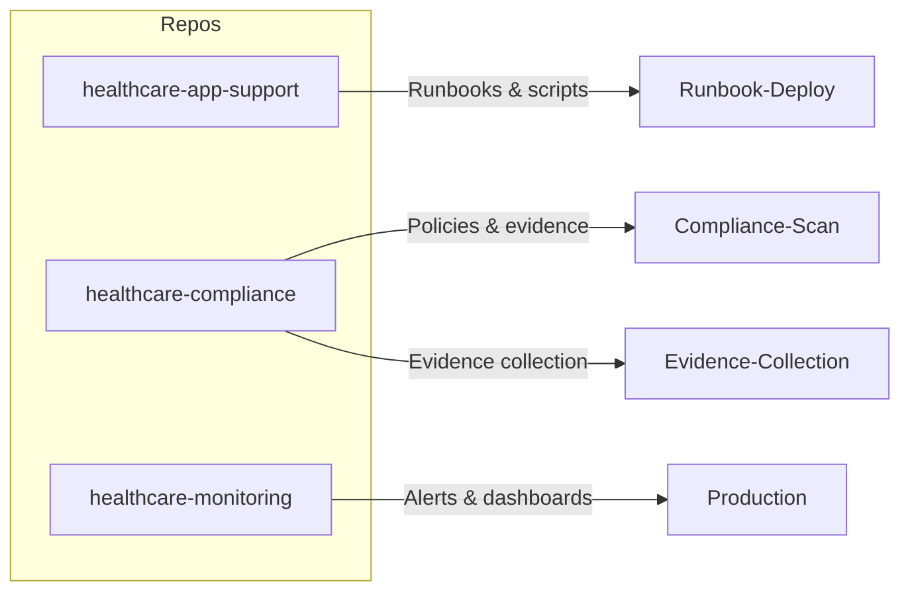

### Boards (Work Item Hierarchy)

```
Epic: Healthcare Application Support & Compliance
├── Feature: Incident & Problem Management
│   ├── User Story: Triage and resolve P1/P2 incidents within SLA
│   ├── User Story: Root cause analysis and post-mortem documentation
│   └── Task: Integrate ServiceNow/Teams with Azure DevOps
├── Feature: Change & Release Management
│   ├── User Story: CAB-approved change workflow in Azure DevOps
│   └── Task: Change calendar and maintenance windows
├── Feature: Compliance & Audit Readiness
│   ├── User Story: Automated evidence collection for HIPAA controls
│   ├── User Story: Audit trail and access logging
│   └── Task: Compliance dashboard and exception reporting
└── Feature: Support Runbooks & Knowledge Base
    ├── User Story: Runbook execution from Azure DevOps / Azure Automation
    └── Task: Knowledge base articles and escalation paths
```

**Explanation:** Boards organize support and compliance work. Epic is the container; Features group incidents, changes, compliance, and runbooks. Incidents and changes arrive as Bugs or Tasks (from ServiceNow or manually); compliance findings create Tasks. Work flows from New → Active → Resolved → Closed with assignees and SLA tracking.

**Detailed board flow (step-by-step):**

1. **Incident** — Created from alert or ServiceNow; Bug or Task linked to Epic/Feature (e.g. Incident & Problem Management). Severity (P1/P2) set; SLA timer starts. Assigned to on-call or L2.
2. **Triage** — Owner selects runbook or escalates. May create Problem for RCA. Work item state: Active.
3. **Resolution** — Runbook executed; fix applied. Work item updated with resolution notes. State: Resolved.
4. **Change request** — New work item or link to external CR. CAB approval tracked; link required in release pipeline for prod. After deploy, CR closed.
5. **Compliance** — Compliance-Scan creates or updates Tasks for violations. Owner remediates or documents exception. Evidence-Collection attaches evidence to work items. Tasks closed when compliant or accepted.
6. **Closure** — Post-incident review done; runbook updated if needed; work item Closed. Audit trail: who, when, what.

**Board hierarchy flow**

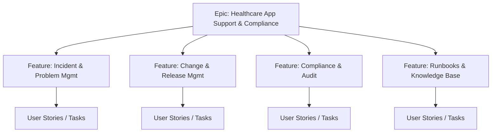

### Pipelines

| Pipeline | Trigger | Purpose |
|----------|---------|---------|
| `Compliance-Scan` | Schedule (daily) | Run compliance checks (e.g., Azure Policy, custom scripts), publish results to Boards |
| `Evidence-Collection` | Schedule (weekly) | Collect logs, config snapshots, access reviews; attach to compliance work items |
| `Runbook-Deploy` | Manual / PR | Deploy/update runbooks and automation to production |
| `Support-Release` | Branch policy | Deploy support tooling and scripts to support environment |

**Explanation:** Pipelines automate compliance and runbook delivery. Compliance-Scan and Evidence-Collection run on schedule and push results to Boards; Runbook-Deploy and Support-Release deploy content after PR/merge. No manual deployment of runbooks or compliance scripts to production.

**Detailed pipeline flow (step-by-step):**

1. **Compliance-Scan (daily)** — Trigger: schedule. Steps: Run Azure Policy or custom scripts against target subscriptions; compare to baseline; create or update Compliance Tasks in Boards with severity and link. Output: Board updated; dashboard of open findings.
2. **Evidence-Collection (weekly)** — Trigger: schedule. Steps: Pull logs (e.g. Activity, Key Vault access); config snapshots; access reviews; store in blob or attach to work items. Output: Evidence pack; links in compliance work items.
3. **Runbook-Deploy (PR/manual)** — Trigger: PR merge or manual. Steps: Publish runbooks to Wiki or Azure Automation account. Output: Runbooks available to support; version tracked.
4. **Support-Release (branch policy)** — Trigger: merge to main (or support branch). Steps: Deploy support scripts/tooling to Support-Staging or Production. Output: Support environment updated; audit log.

**Pipeline flow**

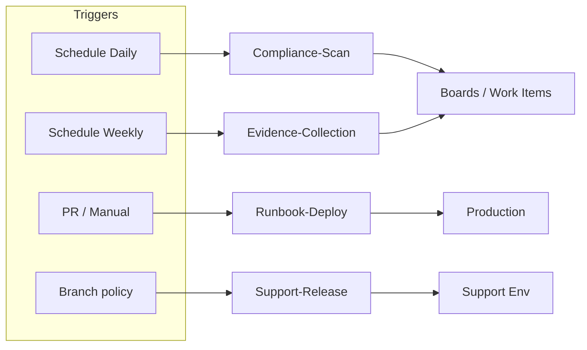

### Environments

| Environment | Use |
|-------------|-----|
| **Support-Dev** | Test runbooks and scripts |
| **Support-Staging** | Validate compliance scans and evidence |
| **Production** | Live healthcare apps; read-only for support automation |

**Explanation:** Support-Dev is for testing runbooks and scripts without touching production. Support-Staging validates compliance scans and evidence against production-like data. Production is read-only for automation (no destructive changes from pipelines); changes go through CAB and change process.

**Detailed environment flow (step-by-step):**

1. **Support-Dev** — Runbooks and scripts tested here first. Pipelines can deploy here on PR or merge. No production data; safe to fail.
2. **Support-Staging** — Compliance scans and evidence collection validated here (e.g. same scripts, staging subscription). Ensures evidence pack and scan logic work before relying on prod.
3. **Production** — Live healthcare apps. Support automation (e.g. read-only checks, runbook execution via Azure Automation) may run against prod, but deploy pipelines (Runbook-Deploy, Support-Release) that change prod require approval. All prod changes tied to change request.

**Environment promotion flow**

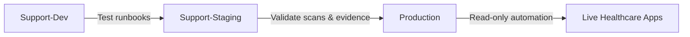

---

## 3. End-to-End Project Flow

```
[Support Request / Incident]
        │
        ▼
┌───────────────────┐     ┌─────────────────────┐
│ Azure DevOps      │────▶│ Create Bug/Incident  │
│ Boards / Service  │     │ Link to Epic/Feature │
│ Now Integration   │     └──────────┬──────────┘
└───────────────────┘                │
                                     ▼
                        ┌────────────────────────┐
                        │ Triage → Assign →      │
                        │ Runbook / Resolution   │
                        └────────────┬───────────┘
                                     │
        ┌────────────────────────────┼────────────────────────────┐
        ▼                            ▼                            ▼
┌───────────────┐          ┌─────────────────┐          ┌─────────────────┐
│ Change        │          │ Compliance      │          │ Knowledge       │
│ Request (CAB) │          │ Scan / Evidence │          │ Base Update     │
│ → Pipeline    │          │ → Boards        │          │ → Wiki / Repo   │
└───────────────┘          └─────────────────┘          └─────────────────┘
        │                            │                            │
        ▼                            ▼                            ▼
┌───────────────────────────────────────────────────────────────────────────┐
│                    Release / Deploy (Guarded by Approval)                  │
│                    Audit log → Compliance Evidence                         │
└───────────────────────────────────────────────────────────────────────────┘
```

**End-to-end flow (Mermaid)**

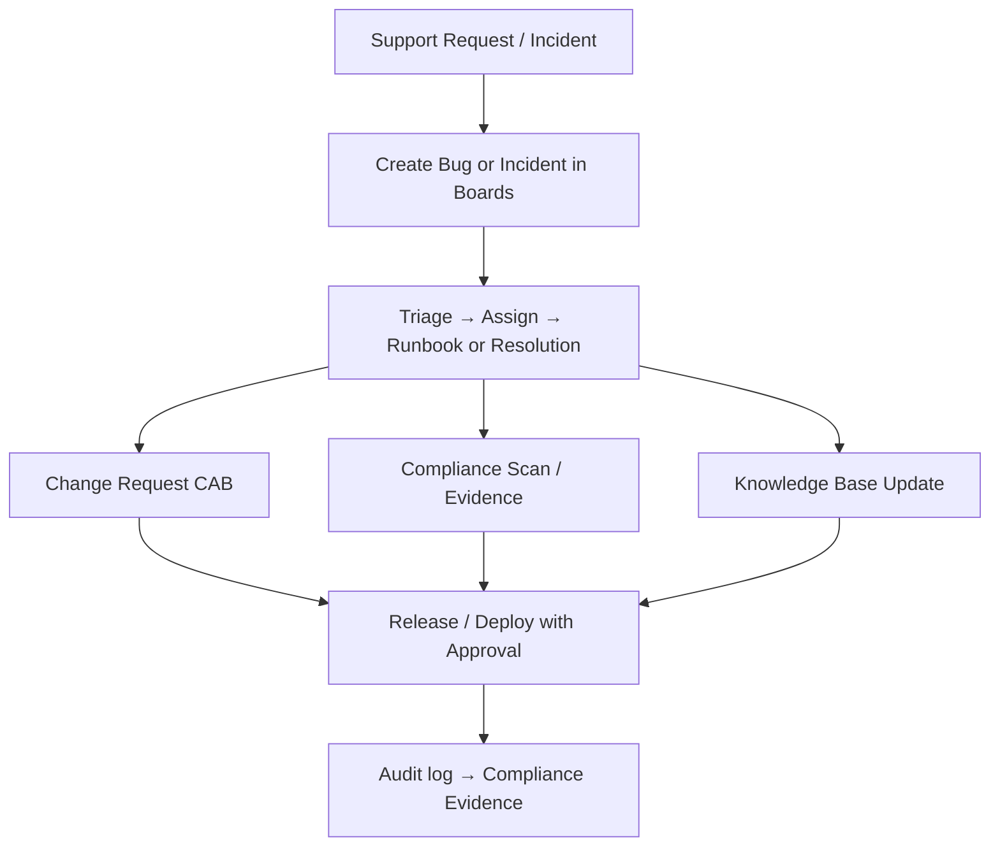

**Detailed end-to-end flow (step-by-step):**

1. **Trigger** — Support request (user ticket), incident (alert/ServiceNow), change request (CAB), or scheduled run (Compliance-Scan, Evidence-Collection). Creates or updates work item in Boards.
2. **Triage** — Assign owner; set severity/SLA; link to Epic/Feature. Decide: runbook, escalation, or change request.
3. **Execute** — For incident: run runbook or script; for change: run pipeline (Runbook-Deploy, Support-Release) after approval; for compliance: Compliance-Scan or Evidence-Collection runs on schedule. Outputs: resolved incident, deployed runbook, or updated Board/evidence.
4. **Validate** — Confirm incident resolved, change successful, or evidence complete. If not, retry or escalate.
5. **Approve** — For prod change: CAB approves. For compliance: sign-off on evidence pack. If denied, work returns to requester.
6. **Release** — Runbook-Deploy or Support-Release runs; runbooks/scripts go to production. Audit log records who and when.
7. **Verify** — Monitor app health; confirm no regression; attach evidence to work items for audit.
8. **Close** — Work item closed; PIR or runbook updated. Evidence stored for auditors.
9. **Feedback** — Incidents → runbook improvements; compliance failures → remediation backlog; PIR → process Tasks.

---

## 4. Key Deliverables & Acceptance Criteria

| Deliverable | Acceptance Criteria |
|-------------|----------------------|
| Incident SLA dashboard | P1/P2 resolution times visible in Azure DevOps / Power BI |
| Compliance evidence pack | Automated weekly pack; mapped to HIPAA controls |
| Runbook library | All critical runbooks in repo; executable via Azure Automation / DevOps |
| Change calendar | Integrated with Boards; CAB approvals tracked |
| Audit-ready documentation | Access logs, change history, compliance scan results in one place |

**Deliverables flow**

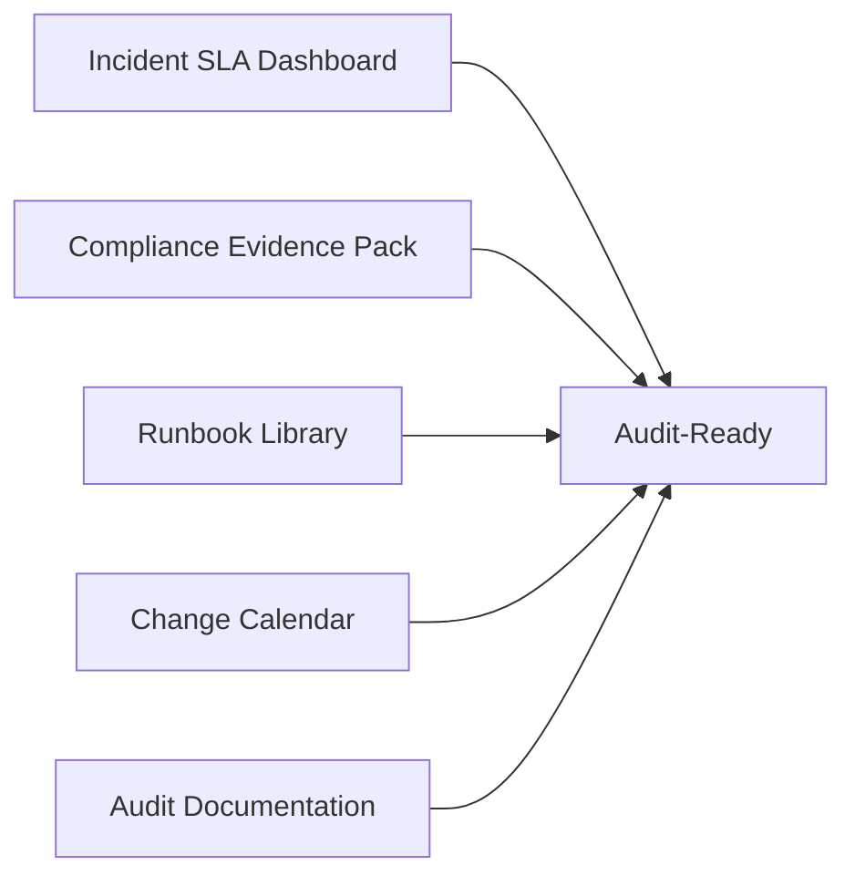

**Explanation:** Deliverables are the concrete outputs that define success: SLA visibility, evidence for auditors, runbooks, change calendar, and audit-ready docs. Each has acceptance criteria so the team and auditors agree when it is complete.

**Detailed deliverables flow (how each is produced):**

1. **Incident SLA dashboard** — Data from Boards (resolution times) and/or ServiceNow; pipeline or report aggregates P1/P2 resolution times. Acceptance: dashboard visible in Azure DevOps or Power BI; SLA breach visible.
2. **Compliance evidence pack** — Evidence-Collection pipeline runs weekly; outputs stored and mapped to HIPAA controls. Acceptance: automated pack; controls mapped; attached to work items or audit folder.
3. **Runbook library** — Runbooks in repo; Runbook-Deploy publishes to Wiki or Azure Automation. Acceptance: critical scenarios covered; executable or documented; versioned.
4. **Change calendar** — CAB dates and approved changes in Boards or linked system; release pipeline checks CR. Acceptance: calendar visible; approvals tracked.
5. **Audit-ready documentation** — Access logs, change history, compliance scan results in one place (Wiki, blob, or artifact). Acceptance: auditor can access; evidence current.

---

## 5. Phases & Timeline (Example)

| Phase | Duration | Focus |
|-------|----------|--------|
| **Phase 1: Foundation** | 4–6 weeks | Repos, Boards structure, incident/change work item types, basic pipelines |
| **Phase 2: Compliance Automation** | 4–6 weeks | Compliance scan pipeline, evidence collection, dashboard |
| **Phase 3: Runbooks & Integration** | 4 weeks | Runbook repo, Azure Automation/Logic Apps, ServiceNow/Teams integration |
| **Phase 4: Steady State** | Ongoing | Sprint cadence, SLA reporting, audit support |

**Phases timeline flow**

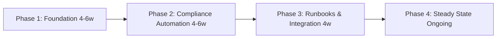

**Explanation:** Phases order the work: first foundation (Boards, repos, pipelines), then compliance automation, then runbooks and integrations, then steady state. Each phase has a duration and focus; adjust to org capacity.

**Detailed phase flow (what happens in each phase):**

1. **Phase 1: Foundation (4–6 weeks)** — Create repos and Boards structure; define incident/change work item types; set up basic pipelines (e.g. Runbook-Deploy, Support-Release). Outcome: support work tracked; runbooks deployable.
2. **Phase 2: Compliance Automation (4–6 weeks)** — Implement Compliance-Scan and Evidence-Collection pipelines; wire to Boards; build compliance dashboard. Outcome: daily scan; weekly evidence; findings in Boards.
3. **Phase 3: Runbooks & Integration (4 weeks)** — Populate runbook repo; Azure Automation or Logic Apps for execution; ServiceNow/Teams integration for incident creation. Outcome: runbooks executable; incidents flow into Boards.
4. **Phase 4: Steady State (Ongoing)** — Sprint cadence; SLA reporting; audit support; runbook and compliance pipeline improvements. Outcome: continuous compliance and support.

---

## 6. Azure DevOps Artifacts & Links

- **Wiki:** Healthcare support playbooks, compliance control mapping
- **Service connections:** Azure (production read + automation account), Service Now (optional)
- **Variable groups:** Compliance scan targets, evidence storage paths (secrets in Azure Key Vault linked)
- **Permissions:** Support team (Contributors), Compliance/Audit (Readers + specific area path)

**Artifacts & links flow**

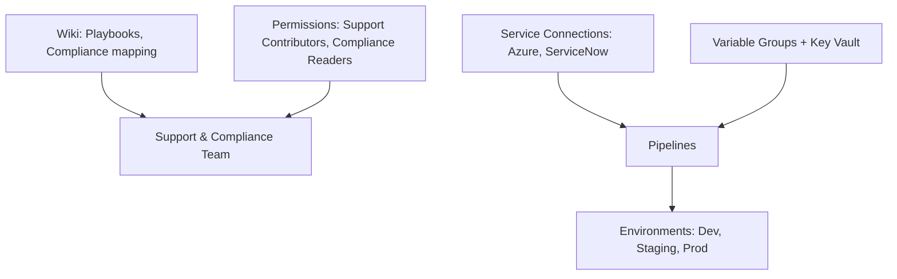

**Explanation:** Wiki is the single place for playbooks and compliance mapping. Service connections let pipelines access Azure and (optionally) ServiceNow. Variable groups and Key Vault hold scan targets and evidence paths. Permissions ensure support can contribute and compliance/audit can read without changing production blindly.

**Detailed artifacts flow (how they connect):**

1. **Wiki** — Playbooks index, compliance control mapping, escalation matrix. Updated when runbooks or controls change. Linked from work items or notifications.
2. **Service connections** — Azure (read + automation account for runbooks); ServiceNow (if used) for incident sync. Pipelines use these to deploy and query.
3. **Variable groups** — Compliance scan targets, evidence storage paths; secrets in Key Vault linked to variable group. Pipelines reference by name.
4. **Permissions** — Support: Contributors on support/compliance repos. Compliance/Audit: Readers + specific area path. CAB: Approvers on Production environment. Ensures only authorized roles approve prod changes.

---

## 7. End-to-End Flow (Complete)

### 7.1 Flow Phases (Trigger → Closure)

| Phase | Name | Description |
|-------|------|-------------|
| 0 | **Prerequisites** | Repos, service connections, Boards area path, runbook structure, ServiceNow/Teams integration (if used). |
| 1 | **Trigger** | Incident (ServiceNow/alert), Change Request (CAB), Compliance scan (schedule), or Runbook update (PR). |
| 2 | **Triage / Plan** | Assign owner; set severity/SLA; link to Epic/Feature; decide runbook or escalation. |
| 3 | **Execute** | Run runbook, execute pipeline (Compliance-Scan, Evidence-Collection, Runbook-Deploy), or perform change. |
| 4 | **Validate** | Verify resolution (incident closed), compliance findings remediated, or change successful. |
| 5 | **Approve** | CAB approval for changes; compliance sign-off for evidence pack; no approval for incident-only resolution. |
| 6 | **Release / Deploy** | Deploy runbooks or support tooling to production (Runbook-Deploy pipeline); change goes live. |
| 7 | **Verify / Operate** | Monitor app health; confirm no regression; evidence attached to work items. |
| 8 | **Close / Document** | Work item closed; PIR/runbook updated; audit evidence stored. |
| — | **Feedback** | Incidents → runbook improvements; compliance failures → backlog; PIR → process tasks. |

**Complete flow phases diagram**

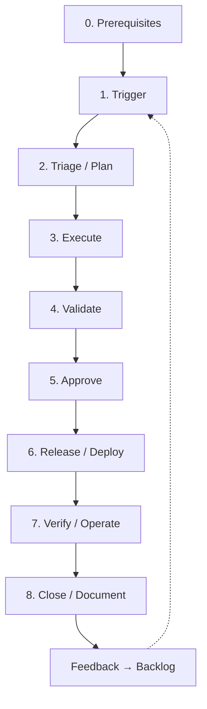

**Explanation (complete flow):** The complete flow runs from prerequisites (repos, connections, Boards) through trigger, triage, execute, validate, approve, release, verify, and close. Feedback (incidents, compliance failures, PIR) creates new work and improves runbooks.

**Detailed complete flow (step-by-step):**

1. **Prerequisites** — Repos, service connections, Boards area path, runbook structure, and (if used) ServiceNow/Teams integration exist. Without these, work cannot be tracked or automated.
2. **Trigger** — Incident (ServiceNow/alert), change request (CAB), schedule (Compliance-Scan, Evidence-Collection), or PR (runbook update). Creates or updates work item.
3. **Triage/Plan** — Assign owner; set SLA; link to Epic/Feature; choose runbook or escalation. Ensures path to resolution is clear.
4. **Execute** — Run runbook, execute pipeline (Compliance-Scan, Evidence-Collection, Runbook-Deploy), or perform change. Output: logs, artifacts, updated resources or Board.
5. **Validate** — Verify incident resolved, compliance finding remediated, or change successful. If not, retry or escalate.
6. **Approve** — For prod change: CAB approves. For evidence pack: compliance sign-off. If denied, requester notified; work reverted or updated.
7. **Release/Deploy** — Runbook-Deploy or Support-Release runs; runbooks or scripts go to production. Audit log records deployment.
8. **Verify/Operate** — Monitor app health; confirm no regression; attach evidence to work items. Alerts may create new incidents.
9. **Close/Document** — Work item closed; PIR or runbook updated; evidence stored. Audit trail complete.
10. **Feedback** — Incidents → runbook improvements; compliance failures → remediation Tasks; PIR → process improvements. These feed new triggers.

### 7.2 Roles & Responsibilities (RACI)

| Role | R | A | C | I |
|------|---|---|---|---|
| On-Call / L2 Support | Triage, run runbook, resolve incident | — | SME, Security | Stakeholders |
| Change Requester | Submits change, provides details | — | — | On approval status |
| CAB / Approver | — | Approve production changes | — | On change calendar |
| Compliance Owner | Runs evidence collection, remediates findings | Evidence pack sign-off | Legal, Audit | Audit team |
| Platform/DevOps | Maintain runbooks, pipelines, integrations | Pipeline correctness | Support | On release |

### 7.3 Per-Phase Detail

| Phase | Trigger | Inputs | Actions | Outputs | Success criteria | Failure path |
|-------|---------|-------|--------|--------|------------------|--------------|
| **Trigger** | Alert, CR, schedule, PR | Alert payload, CR form, branch | Create/link work item in Boards | Bug, Task, or Change Request | Work item created and linked | Retry integration; manual create if needed |
| **Triage** | New work item | Work item, runbook index | Assign; set SLA; pick runbook or escalate | Assigned owner; severity; runbook ref | Owner and path defined | Escalate to L3; create Problem for RCA |
| **Execute** | Assignment | Runbook, scripts, pipeline | Run runbook or pipeline (Compliance-Scan, Evidence-Collection, etc.) | Logs, artifacts, updated resources | Pipeline/work completed | Retry; rollback if change; incident for outage |
| **Validate** | Execution done | Logs, health checks | Verify app up, compliance pass, evidence present | Validation result | Criteria met | Re-execute or remediate; do not close |
| **Approve** | Validation pass (for changes) | CR, test results | CAB reviews; approves or rejects | Approval decision | Approved for prod (or rejected with reason) | Reject → requester updates; re-submit |
| **Release** | Approval (or no approval for runbook-only) | Approved CR, pipeline | Run Runbook-Deploy or Support-Release | Deploy logs; audit trail | Deploy succeeded | Rollback runbook; post-incident |
| **Verify** | Post-deploy | Monitoring, evidence store | Check health; attach evidence to work item | Updated work item; evidence link | No regression; evidence attached | Rollback or hotfix; new incident if needed |
| **Close** | Verify pass | All above | Close work item; update wiki/runbook | Closed item; docs updated | Item closed; audit trail complete | Reopen if issue found |

### 7.4 Decision Points & Approval Gates

| Gate | When | Who | Condition to proceed | If denied |
|------|------|-----|----------------------|-----------|
| **Production change** | Before deploy to Production | CAB | Change Request approved; runbook/plan reviewed | Work item reverted to Proposed; requester notified |
| **Compliance evidence** | Before audit | Compliance Owner | Evidence pack complete; mapped to controls | Remediation tasks created; deadline set |
| **Runbook publish** | Before Runbook-Deploy to prod | Tech Lead (optional) | Runbook reviewed; tested in Support-Dev | PR feedback; no merge until fixed |

**Decision points & approval gates flow**

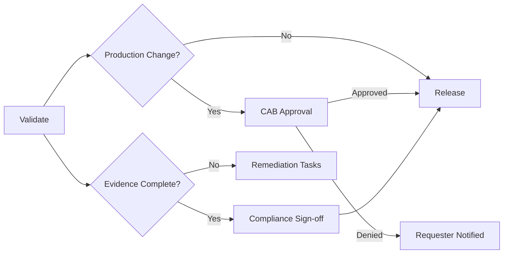

### 7.5 Rollback & Escalation

- **Rollback:** For failed changes: run rollback steps in runbook or redeploy previous version via pipeline; create incident if production impact. For runbook deploy: redeploy previous runbook version from repo.
- **Escalation:** Unresolved incident → L3 / Platform; unresolved compliance finding → Compliance Owner + Security; CAB rejection → Change Requester with reason; re-submit when ready.

### 7.6 Feedback Loops

- **Incidents** → Post-incident review → Tasks (runbook update, fix defect, improve monitoring).
- **Compliance-Scan failures** → Compliance Tasks in Boards → Remediation → Evidence-Collection.
- **CAB rejections** → Feedback to requester; process improvement backlog if recurring.
- **SLA breaches** → Dashboard and report; retrospective → process and tooling improvements.

### 7.7 Prerequisites (Before Starting)

- Azure DevOps project and area path created; Epic/Feature structure in place.
- Repos `healthcare-app-support`, `healthcare-compliance`, `healthcare-monitoring` created; branch policies if needed.
- Service connections: Azure (read + automation account); ServiceNow (if integrated).
- Variable groups and Key Vault references for compliance targets and evidence paths.
- Environments: Support-Dev, Support-Staging, Production (read-only for automation).
- Permissions: Support (Contributors), Compliance (Contributors on compliance repo; Readers elsewhere), CAB (Approvers on Production).

### 7.8 Definition of Done (Overall)

- Incident: Resolved, PIR done, runbook/wiki updated if needed, work item closed.
- Change: Deployed, verified, change request closed, audit log retained.
- Compliance: Evidence collected and attached, findings remediated or accepted with exception, work item closed.
- Runbook: Merged, deployed via pipeline, tested in target environment, doc updated.
