# DevOps Platform Development and Automation

## Azure DevOps Project Overview

| Attribute | Value |
|-----------|--------|
| **Project Type** | Platform Engineering, Internal Tooling, Automation |
| **Organization** | Azure DevOps Org |
| **Area Path** | DevOps Platform |
| **Iteration** | Sprint-based (2 weeks) |

**What this project is:** This Azure DevOps project builds and runs the **internal DevOps platform**: reusable pipeline templates, self-service onboarding (repo + pipeline + envs), shared infra (agent pools, service connections) as code, and governance/observability. Platform engineers develop templates and onboarding; consuming teams use templates and request onboarding. Work is tracked in Boards under DevOps Platform; iterations are 2-week sprints.

---

## 1. Project Objectives

**Explanation:** Objectives define why the platform exists: standardize CI/CD, reduce time-to-production, and enforce governance while making adoption visible. Each goal drives Features (templates, onboarding, guardrails, observability) and pipelines (Templates-CI, Onboarding-App, Platform-Metrics).

**Detailed objectives flow (how goals connect):**

1. **Build and maintain platform** → Templates repo; Bicep for shared infra; pipelines for template and infra lifecycle. Outcome: single place for templates and shared resources.
2. **Self-service pipelines and provisioning** → Onboarding-App pipeline; parameterized creation of repo + pipeline + envs. Outcome: new teams get CI/CD in hours, not weeks.
3. **Reusable templates and guardrails** → Mandatory gates in templates (lint, test, scan); Azure Policy for platform-created resources. Outcome: quality and cost controls enforced.
4. **Reduce time-to-production** → Measured by onboarding time and pipeline success rate. Outcome: adoption dashboard and SLA.
5. **Platform SLAs and adoption metrics** → Platform-Metrics pipeline; dashboard for usage, failures, adoption. Outcome: data for platform roadmap and support.

- Build and maintain an internal DevOps platform (self-service pipelines, templates, shared infra)
- Automate provisioning of CI/CD, environments, and guardrails across teams
- Provide reusable pipeline templates, task groups, and extension-like capabilities
- Reduce time-to-production for new applications and teams
- Establish platform SLAs, versioning, and adoption metrics

**Objectives flow**

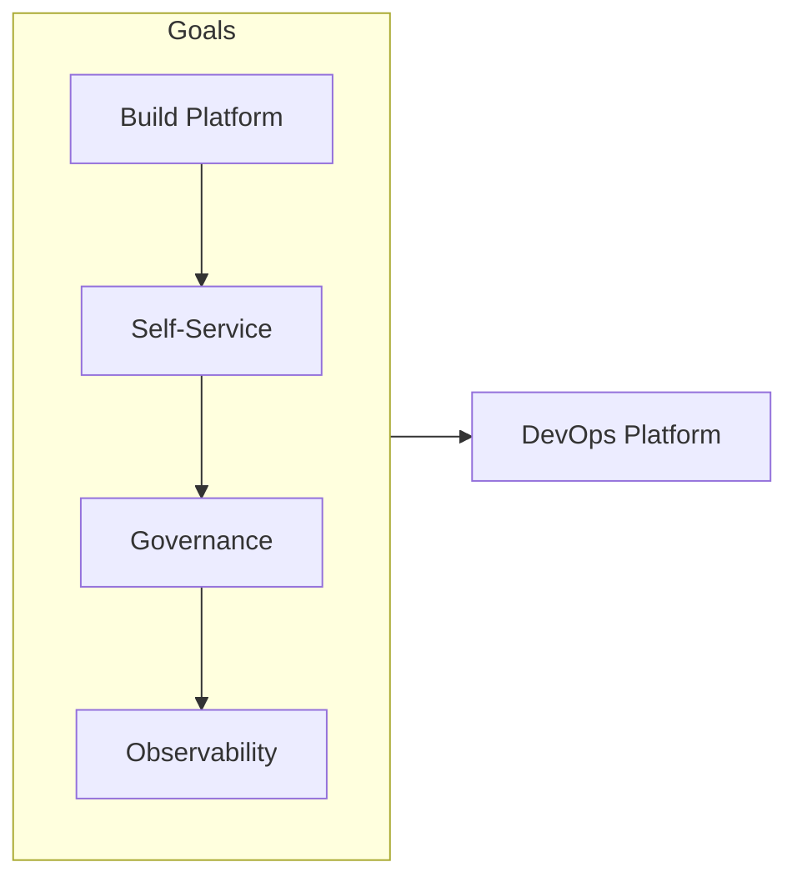

---

## 2. Azure DevOps Structure

### Repositories

| Repo | Purpose |
|------|---------|
| `devops-platform-templates` | YAML pipeline templates, stages, jobs (build, test, deploy) |
| `devops-platform-scripts` | PowerShell/Bash scripts for provisioning, validation, cleanup |
| `devops-platform-docs` | Platform runbooks, adoption guide, API/template docs |
| `devops-platform-bicep` | Bicep/ARM for shared infra (agent pools, service connections, envs) |

**Explanation:** Repos hold the platform’s source of truth: templates (YAML), scripts (PowerShell/Bash), docs, and Bicep for shared infra. Changes flow through PR and pipelines; Templates-CI validates templates; Onboarding-App consumes templates and creates new repos/pipelines.

**Detailed repository flow (step-by-step):**

1. **devops-platform-templates** — Platform engineers edit YAML templates in a branch; PR triggers Templates-CI (lint + template-consumer test). Merge triggers Templates-Release; consuming projects use new version. No direct edit by app teams.
2. **devops-platform-scripts** — Scripts used inside templates or onboarding; versioned and tested via Templates-CI or Onboarding-App. Deployed or referenced by pipelines.
3. **devops-platform-docs** — Runbooks, adoption guide, template API. Updated when templates or process change; linked from Wiki or onboarding.
4. **devops-platform-bicep** — Shared infra (agent pools, service connections, envs). Platform-Infra-Deploy runs on merge or schedule; applies to Platform-Dev, Staging, or Shared-Services. Outcome: infra as code; repeatable.
5. **Onboarding-App** — Triggered manually with parameters (team, app name, language, envs). Reads templates and scripts; creates repo, pipeline, variable groups, and optionally envs. Outcome: new team unblocked.

**Repository flow**

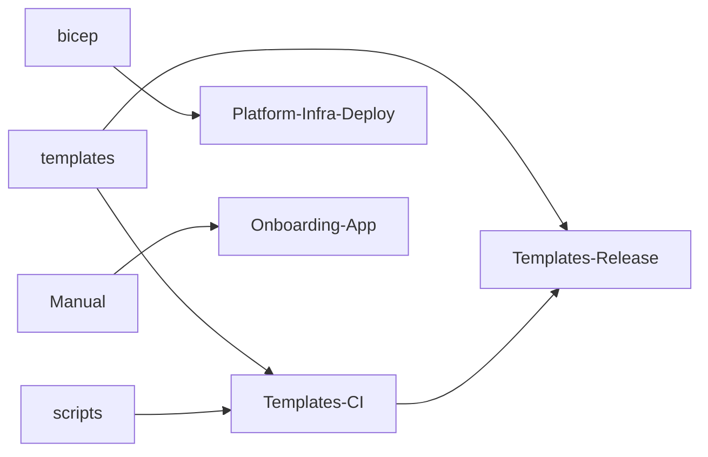

### Boards (Work Item Hierarchy)

```
Epic: DevOps Platform Development & Automation
├── Feature: Pipeline Templates & Reusability
│   ├── User Story: Standardized build template (build, test, package)
│   ├── User Story: Multi-environment deploy template (dev → prod)
│   └── Task: Template parameters and variable group design
├── Feature: Self-Service Provisioning
│   ├── User Story: "New app onboarding" pipeline (repo + pipeline + envs)
│   ├── User Story: Environment provisioning (Azure, AKS, etc.) from pipeline
│   └── Task: Approval gates and quota controls
├── Feature: Platform Governance & Guardrails
│   ├── User Story: Mandatory security/quality gates in templates
│   ├── User Story: Cost and tagging policies for platform-created resources
│   └── Task: Azure Policy integration
└── Feature: Platform Observability & Adoption
    ├── User Story: Dashboard for pipeline usage, failures, adoption
    └── Task: Export metrics to Log Analytics / Power BI
```

**Explanation:** Boards organize platform work. Epic is the container; Features group templates, onboarding, governance, and observability. User Stories and Tasks are created for new template capabilities, onboarding improvements, or platform infra. Work flows from backlog → active → closed; adoption and failures feed backlog.

**Detailed board flow (step-by-step):**

1. **New template or onboarding need** — Create User Story under appropriate Feature (e.g. Pipeline Templates). Describe acceptance criteria (params, consumer test).
2. **Development** — Branch in devops-platform-templates; implement; open PR. Templates-CI runs; reviewer approves. Merge to main.
3. **Release** — Templates-Release runs on merge; template version available. Consuming projects can update. Optionally notify teams.
4. **Onboarding request** — Trigger Onboarding-App with params; or create Task to track request. Outcome: new repo + pipeline; Task closed when team confirms.
5. **Platform infra** — Bicep change in devops-platform-bicep; Platform-Infra-Deploy runs. Work item linked; closed when deploy and validation done.
6. **Observability** — Platform-Metrics runs daily; dashboard updated. Failures or low adoption create backlog items for platform team.

**Board hierarchy flow**

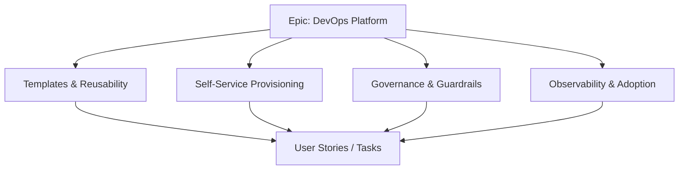

### Pipelines

| Pipeline | Trigger | Purpose |
|----------|---------|---------|
| `Templates-CI` | PR to `devops-platform-templates` | Lint, test template usage (e.g., template-consumer test pipeline) |
| `Templates-Release` | Merge to main | Publish template version; optionally notify consuming projects |
| `Platform-Infra-Deploy` | Manual / schedule | Deploy shared infra (agent pools, service connections, envs) via Bicep |
| `Onboarding-App` | Manual (parameterized) | Create repo, pipeline, and starter env for a new app/team |
| `Platform-Metrics` | Schedule (daily) | Collect pipeline runs, adoption; publish to dashboard |

**Explanation:** Pipelines automate template quality, release, onboarding, and platform infra. Templates-CI blocks bad template changes; Onboarding-App creates new projects; Platform-Metrics feeds the adoption dashboard. No manual template publish or onboarding.

**Detailed pipeline flow (step-by-step):**

1. **Templates-CI (on PR)** — Trigger: PR to devops-platform-templates. Steps: Lint YAML; run a consumer pipeline that extends the template (build/test). Fail if template breaks consumer. Output: pass/fail; reviewer uses to approve.
2. **Templates-Release (on merge)** — Trigger: merge to main. Steps: Optionally version template; notify consuming projects. Output: template available; optional notification.
3. **Platform-Infra-Deploy** — Trigger: manual or schedule. Steps: Deploy Bicep to Platform-Dev, Staging, or Shared-Services. Approval on Shared-Services. Output: agent pools, connections, envs updated.
4. **Onboarding-App** — Trigger: manual with parameters (app name, repo name, language, envs). Steps: Create repo from starter; create pipeline from template; wire variable groups and service connections. Output: new repo + pipeline; team can run CI/CD.
5. **Platform-Metrics** — Trigger: daily. Steps: Query pipeline runs, template usage, failure rate; publish to dashboard or artifact. Output: adoption and health visible.

**Pipeline flow**

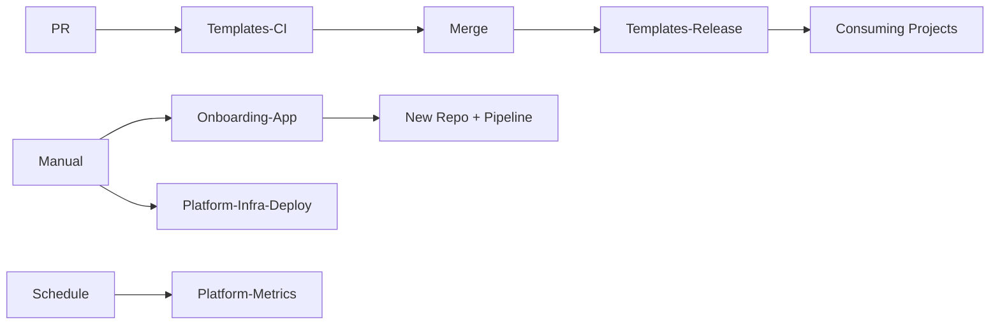

### Environments

| Environment | Use |
|-------------|-----|
| **Platform-Dev** | Test new templates and scripts |
| **Platform-Staging** | Validate against sample apps before rollout |
| **Shared-Services** | Production shared infra (agents, connections); change-controlled |

**Explanation:** Platform-Dev is for testing new templates and scripts without affecting teams. Platform-Staging validates against sample apps before rollout. Shared-Services is production shared infra (agent pools, service connections); change-controlled and approval-gated so platform changes don’t break all teams.

**Detailed environment flow (step-by-step):**

1. **Platform-Dev** — Platform engineers test template and script changes here. Pipelines can deploy or run consumer tests. No impact on real app teams.
2. **Platform-Staging** — Pre-production validation; sample apps use templates here. Ensures template works before release. Optional approval.
3. **Shared-Services** — Production shared infra. Platform-Infra-Deploy to here requires approval. Used by all consuming teams. Change with care; runbook for rollback.
4. **Promotion path:** Template change → Templates-CI (PR) → Merge → Templates-Release. Infra change → Platform-Infra-Deploy to Dev → Staging → Shared-Services (with approval). Onboarding creates new repo/pipeline; envs may be Dev/Staging/Prod per team.

**Environment promotion flow**

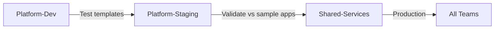

---

## 3. End-to-End Project Flow

```
[New Template / Feature Request]
        │
        ▼
┌─────────────────────────────────────────────────────────────────┐
│ Azure DevOps Boards: Epic → Feature → User Story → Task          │
│ Branch: feature/<feature-name> in devops-platform-templates      │
└─────────────────────────────────────────────────────────────────┘
        │
        ▼
┌───────────────────┐     ┌─────────────────────┐
│ Templates-CI      │────▶│ Lint + Test         │
│ (on PR)           │     │ Template consumer   │
└───────────────────┘     └──────────┬──────────┘
                                      │
                                      ▼
                        ┌────────────────────────┐
                        │ Code Review → Merge    │
                        │ Templates-Release      │
                        └────────────┬───────────┘
                                     │
        ┌────────────────────────────┼────────────────────────────┐
        ▼                            ▼                            ▼
┌───────────────┐          ┌─────────────────┐          ┌─────────────────┐
│ Consuming     │          │ Platform-Infra  │          │ Onboarding-App  │
│ projects use  │          │ Deploy (Bicep)  │          │ (new app/team)  │
│ new template  │          │ → Shared envs   │          │ → Repo+Pipeline │
└───────────────┘          └─────────────────┘          └─────────────────┘
        │                            │                            │
        ▼                            ▼                            ▼
┌───────────────────────────────────────────────────────────────────────────┐
│              Platform-Metrics: Adoption, Failures, SLA                     │
│              Wiki / Docs updated with template version and usage           │
└───────────────────────────────────────────────────────────────────────────┘
```

**End-to-end flow (Mermaid)**

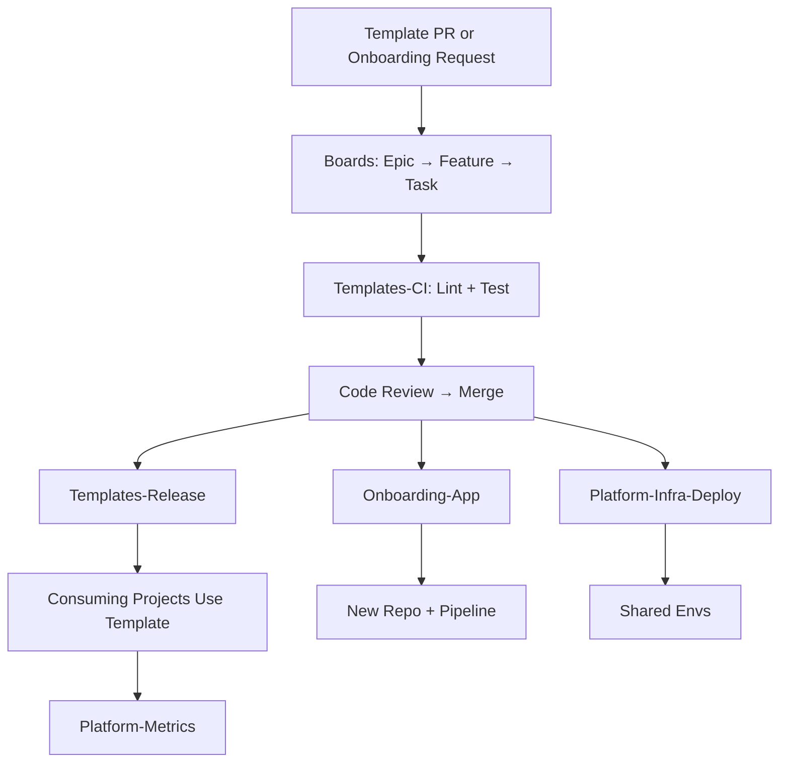

**Detailed end-to-end flow (step-by-step):**

1. **Request** — New template capability or onboarding request. Captured as User Story or onboarding run.
2. **Template flow** — Branch in devops-platform-templates → PR → Templates-CI (lint + consumer test) → Code review → Merge → Templates-Release. Consuming projects pick up new version.
3. **Onboarding flow** — Requester runs Onboarding-App with params (app name, repo, language, envs). Pipeline creates repo, pipeline, variable groups. Team gets link and docs; runs first build/deploy.
4. **Infra flow** — Change in devops-platform-bicep → Platform-Infra-Deploy to Dev/Staging/Shared-Services. Shared-Services requires approval. Outcome: agent pools, connections, envs updated.
5. **Feedback** — Platform-Metrics runs daily; adoption and failures visible. Failures or requests feed backlog; platform team iterates.

---

## 4. Key Deliverables & Acceptance Criteria

| Deliverable | Acceptance Criteria |
|-------------|----------------------|
| Pipeline template library | Versioned templates in repo; consumed by ≥ N app pipelines |
| Self-service onboarding | New app gets repo + pipeline + dev env within 1 day (or defined SLA) |
| Platform infra as code | Agent pools, service connections, envs defined in Bicep; deployable via pipeline |
| Governance gates | Templates enforce scan, test, approval steps; configurable per env |
| Adoption dashboard | Pipeline runs, template usage, failure rate visible in Azure DevOps / Power BI |

**Deliverables flow**

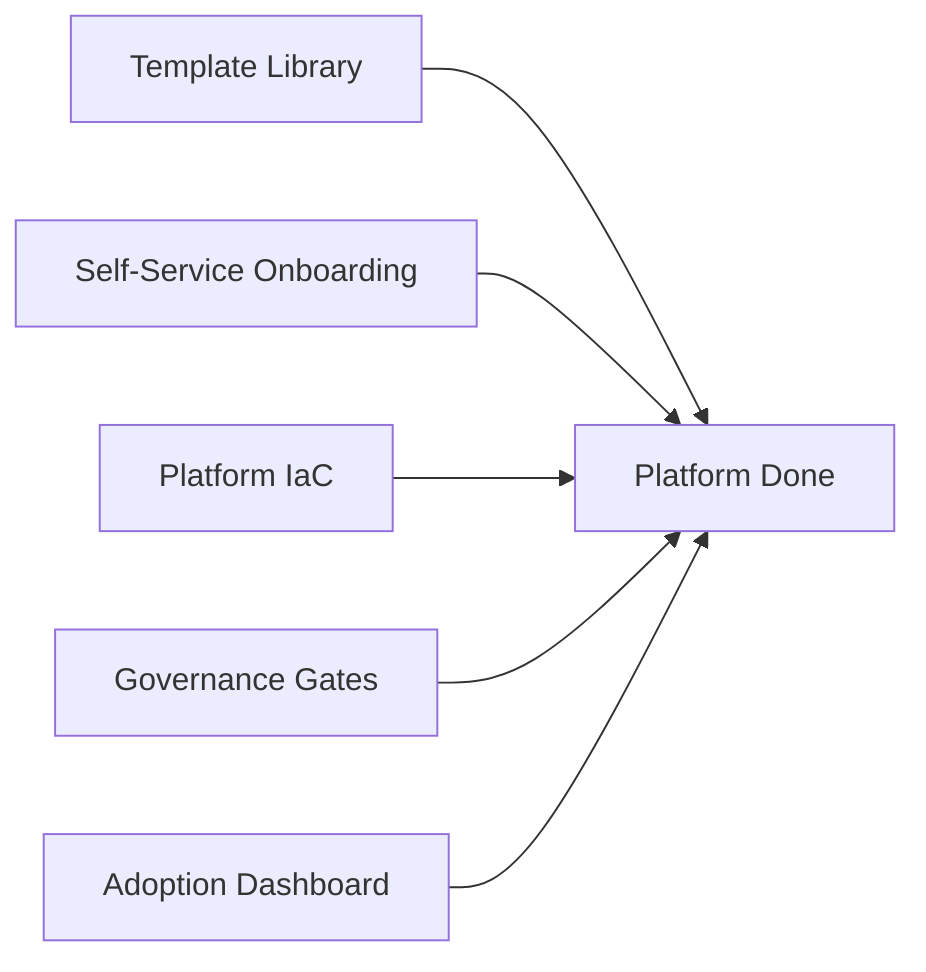

**Explanation:** Deliverables are the concrete outputs: template library, self-service onboarding, platform IaC, governance gates, and adoption dashboard. Each has acceptance criteria so platform and stakeholders agree when the platform is “done” for a given scope.

**Detailed deliverables flow (how each is produced):**

1. **Template library** — Built in devops-platform-templates; versioned via merge and Templates-Release. Acceptance: N+ app pipelines consume templates; params documented.
2. **Self-service onboarding** — Onboarding-App pipeline; params and docs in Wiki. Acceptance: new app gets repo + pipeline + dev env within SLA (e.g. 1 day).
3. **Platform infra as code** — Bicep in devops-platform-bicep; Platform-Infra-Deploy. Acceptance: agent pools, connections, envs deployable via pipeline; no manual creation.
4. **Governance gates** — Mandatory steps in templates (scan, test, approval); configurable per env. Acceptance: templates enforce gates; exceptions documented.
5. **Adoption dashboard** — Platform-Metrics pipeline; dashboard in Azure DevOps or Power BI. Acceptance: pipeline runs, template usage, failure rate visible.

---

## 5. Phases & Timeline (Example)

| Phase | Duration | Focus |
|-------|----------|--------|
| **Phase 1: Template Foundation** | 4–6 weeks | Build + deploy templates; document params; first consumer |
| **Phase 2: Self-Service & Infra** | 4–6 weeks | Onboarding pipeline; Bicep for shared infra; guardrails |
| **Phase 3: Governance & Observability** | 4 weeks | Mandatory gates, Azure Policy, metrics pipeline, dashboard |
| **Phase 4: Scale & Iterate** | Ongoing | More templates, more teams, platform SLA and versioning |

**Phases timeline flow**

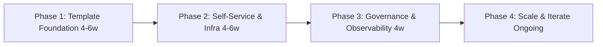

**Explanation:** Phases order the work: first templates and first consumer, then self-service and infra, then governance and observability, then scale and iterate. Timelines are examples; adjust to org capacity.

**Detailed phase flow (what happens in each phase):**

1. **Phase 1: Template Foundation (4–6 weeks)** — Build build/deploy templates; document params; get first consumer pipeline using templates. Outcome: templates in use; Templates-CI and Release working.
2. **Phase 2: Self-Service & Infra (4–6 weeks)** — Onboarding-App pipeline; Bicep for shared infra; deploy to Platform-Dev/Staging. Outcome: new teams can onboard; shared infra as code.
3. **Phase 3: Governance & Observability (4 weeks)** — Mandatory gates in templates; Azure Policy; Platform-Metrics and dashboard. Outcome: quality and cost controls; adoption visible.
4. **Phase 4: Scale & Iterate (Ongoing)** — More teams onboarded; template versioning and SLA; onboarding feedback loop. Outcome: platform is BAU; continuous improvement.

---

## 6. Azure DevOps Artifacts & Links

- **Wiki:** Template catalog, parameter reference, onboarding runbook
- **Service connections:** Azure (subscription(s) for platform infra), optional GitHub
- **Variable groups:** Platform env names, ARM/Bicep params (secrets in Key Vault)
- **Permissions:** Platform team (Build Admin, Release Admin); consumers (use templates only; no edit to platform repos)

**Artifacts & links flow**

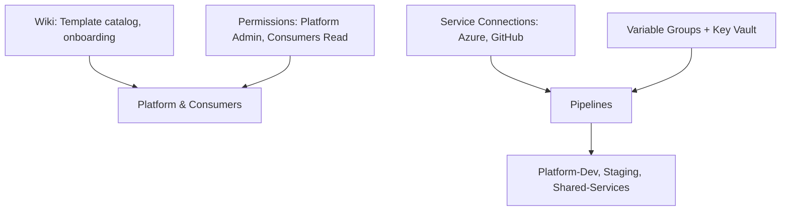

**Explanation:** Wiki holds template catalog and onboarding runbook. Service connections (Azure, optional GitHub) let pipelines deploy and create repos. Variable groups and Key Vault supply platform params. Permissions ensure platform team can change templates and infra; consumers can only run their pipelines and use templates.

**Detailed artifacts flow (how they connect):**

1. **Wiki** — Template catalog, parameter reference, onboarding runbook. Updated when templates or process change. Linked from onboarding and notifications.
2. **Service connections** — Azure (platform infra subscriptions); GitHub (if onboarding creates GitHub repos). Pipelines use these to deploy Bicep and create repos.
3. **Variable groups** — Platform env names, Bicep params; secrets in Key Vault. Referenced by Platform-Infra-Deploy and Onboarding-App.
4. **Permissions** — Platform team: Build/Release Admin (edit templates, run onboarding, deploy infra). Consumers: run their pipelines only; read templates; no edit to platform repos. Ensures platform stability.

---

## 7. End-to-End Flow (Complete)

### 7.1 Flow Phases (Trigger → Closure)

| Phase | Name | Description |
|-------|------|-------------|
| 0 | **Prerequisites** | Repos (templates, scripts, Bicep, docs); service connections; shared envs; onboarding pipeline. |
| 1 | **Trigger** | PR to template repo, or manual run of Onboarding-App pipeline (team/app name, language, envs). |
| 2 | **Triage / Plan** | Template: assign reviewer; link to Feature. Onboarding: validate inputs; check quota. |
| 3 | **Build / Execute** | Templates-CI (lint, test consumer); or Onboarding-App creates repo + pipeline + env. |
| 4 | **Validate** | Template: consumer pipeline runs successfully. Onboarding: new pipeline runs at least once. |
| 5 | **Approve** | Code review for templates; optional approval for onboarding (if policy requires). |
| 6 | **Release** | Merge template → Templates-Release; or onboarding output handed to team. Platform-Infra-Deploy if infra change. |
| 7 | **Verify / Operate** | Consuming teams use new template; Platform-Metrics tracks adoption and failures. |
| 8 | **Close / Document** | Work item closed; Wiki updated with template version and usage. |
| — | **Feedback** | Adoption metrics → backlog; template failures → fix in platform repo; onboarding feedback → improve pipeline. |

**Complete flow phases diagram**

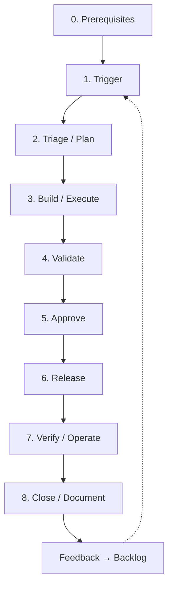

**Explanation (complete flow):** The complete flow runs from prerequisites through trigger (PR or onboarding request), triage, build (Templates-CI or Onboarding-App), validate, approve, release, verify (consuming teams use template; metrics collected), and close. Feedback (adoption, failures, onboarding feedback) feeds backlog and improves templates and onboarding.

**Detailed complete flow (step-by-step):**

1. **Prerequisites** — Repos (templates, scripts, Bicep, docs); service connections; shared envs; Onboarding-App pipeline and parameter schema. Without these, platform cannot operate.
2. **Trigger** — PR to template repo or manual run of Onboarding-App with params. Creates pipeline run and (for PR) work item.
3. **Triage/Plan** — For PR: assign reviewer; link to Feature. For onboarding: validate params; check quota. Ensures request is valid.
4. **Build/Execute** — Templates-CI (lint + consumer test) or Onboarding-App (create repo + pipeline). Output: template validated or new repo/pipeline created.
5. **Validate** — Template: consumer pipeline runs. Onboarding: new pipeline runs at least once. Failure → fix and re-run.
6. **Approve** — Code review for template PR; optional approval for onboarding (if policy requires). If denied, address feedback and re-submit.
7. **Release** — Merge template → Templates-Release; or handover onboarding output to team. Platform-Infra-Deploy if infra change. Outcome: template available or team unblocked.
8. **Verify/Operate** — Consuming teams use template; Platform-Metrics tracks adoption and failures. Dashboard updated. Issues → backlog.
9. **Close/Document** — Work item closed; Wiki updated with template version or onboarding outcome. Done.
10. **Feedback** — Adoption metrics and template failures → backlog; onboarding feedback → improve pipeline and docs. Feeds new triggers.

### 7.2 Roles & Responsibilities (RACI)

| Role | R | A | C | I |
|------|---|---|---|---|
| Platform Engineer | Develop templates, run onboarding, maintain infra | Template correctness | Security, App teams | Stakeholders |
| App Team / Requester | Request onboarding; consume templates | — | — | On onboarding status |
| Reviewer | Review template PRs | — | — | — |
| Approver (optional) | Approve onboarding or infra deploy | Yes (if gate) | — | — |

### 7.3 Per-Phase Detail

| Phase | Trigger | Inputs | Actions | Outputs | Success criteria | Failure path |
|-------|---------|-------|--------|--------|------------------|--------------|
| **Trigger** | PR or onboarding request | Branch, or app name/env list | Create work item; start pipeline | Work item; pipeline run | Pipeline triggered | Fix inputs; retry |
| **Triage** | New PR or request | Work item | Assign reviewer; validate params | Assigned; validated | Ready for build | Reject invalid request |
| **Build** | PR merge or run | Repo content, params | Templates-CI or Onboarding-App | Build artifacts; new repo+pipeline | CI passes; repo created | Fix code/params; re-run |
| **Validate** | Build done | Artifacts | Run consumer pipeline; run new app pipeline once | Validation result | All green | Fix template or onboarding |
| **Approve** | Validation pass | PR, results | Code review; optional approval | Approval | Approved | Address feedback; re-submit |
| **Release** | Approval/merge | Merged code | Templates-Release; handover to team; Platform-Infra-Deploy if needed | Released template; team has pipeline | Template available; team unblocked | Rollback merge; fix and re-release |
| **Verify** | Post-release | Consuming pipelines | Platform-Metrics; adoption dashboard | Metrics, dashboard | Adoption visible; no critical failures | Fix template; communicate to teams |
| **Close** | Verify OK | All above | Close work item; update Wiki | Closed item; docs | Done | Reopen if issue |

### 7.4 Decision Points & Approval Gates

| Gate | When | Who | Condition to proceed | If denied |
|------|------|-----|----------------------|-----------|
| **Template merge** | After Templates-CI pass | Platform Engineer (reviewer) | Lint and consumer test pass | PR feedback; fix and re-push |
| **Onboarding (optional)** | Before creating prod resources | Platform Lead | Quota and naming OK | Reject with reason; requester adjusts |
| **Platform infra deploy** | Before apply to shared envs | Platform Lead | Bicep reviewed; no breaking change | Do not run pipeline |

**Decision points flow**

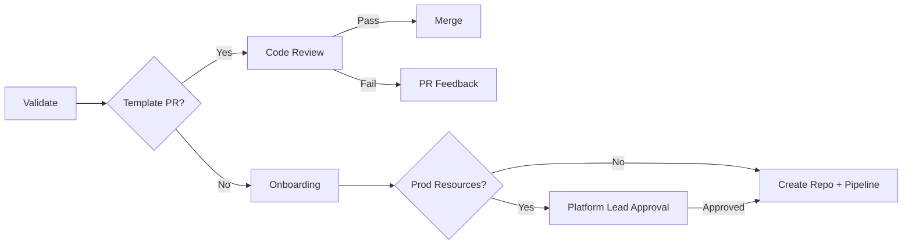

### 7.5 Rollback & Escalation

- **Rollback:** Template: revert merge; re-release previous version. Onboarding: delete created repo/pipeline if wrong; re-run with correct params. Infra: redeploy previous Bicep state.
- **Escalation:** Template breakage → Platform Engineer; onboarding failure → Platform + requesting team; infra issue → Platform Lead.

### 7.6 Feedback Loops

- **Platform-Metrics** → Adoption and failure rate → Backlog (fix templates, improve onboarding).
- **Consumer pipeline failures** → Work item to fix template or document breaking change.
- **Onboarding feedback** → Feature to improve self-service (params, docs, validations).

### 7.7 Prerequisites (Before Starting)

- Repos created; branch policies on template repo (PR required; Templates-CI required).
- Service connections for Azure (and GitHub if used); variable groups and Key Vault.
- Environments: Platform-Dev, Platform-Staging, Shared-Services; approval on Shared-Services if required.
- Onboarding-App pipeline and parameter schema; docs for requesting teams.
- Permissions: Platform (Build/Release Admin); consumers (run their pipelines only; read templates).

### 7.8 Definition of Done (Overall)

- Template: Merged; consumer test passed; Wiki updated with version and params.
- Onboarding: New repo and pipeline created; team can run pipeline; docs handed over.
- Infra: Bicep deployed; resources available; runbook updated if needed.
