# Multi-Cloud Migration and Modernization

## Azure DevOps Project Overview

| Attribute | Value |
|-----------|--------|
| **Project Type** | Migration, Cloud Modernization (Multi-Cloud) |
| **Organization** | Azure DevOps Org |
| **Area Path** | Migration / Multi-Cloud |
| **Iteration** | Sprint-based (2–4 weeks per wave) |

**What this project is:** This Azure DevOps project runs **multi-cloud migration and modernization**: moving workloads from on-prem or a single cloud to Azure, AWS, and (optionally) GCP, and modernizing apps (containers, serverless, PaaS). Work is organized in waves; each wave has discovery, IaC, app modernization, cutover, and validation. Pipelines deploy IaC per cloud and deploy modernized apps; cutover and rollback are runbook-driven.

---

## 1. Project Objectives

**Explanation:** Objectives define why the migration exists: move workloads to multi-cloud, modernize apps, keep CI/CD and governance consistent via Azure DevOps, and de-risk with waves and measurable progress. Each goal drives Features (discovery, wave planning, IaC, modernization, post-migration) and pipelines (Discovery-Assessment, Deploy-Azure/AWS/GCP, App-Modernize, Cutover-Validation).

**Detailed objectives flow (how goals connect):**

1. **Migrate workloads to multi-cloud** → Discovery-Assessment pipeline; IaC repos per cloud; Deploy-Azure/AWS/GCP pipelines. Outcome: workloads running in target clouds.
2. **Modernize applications** → app-modernization repo (Dockerfiles, Helm); App-Modernize-Build and Deploy. Outcome: containerized or PaaS apps in AKS/EKS/GKE.
3. **Consistent CI/CD and governance** → Azure DevOps as orchestrator; same pipeline pattern per cloud; approval gates and change request link. Outcome: one place for build/deploy and audit.
4. **De-risk via waves** → Wave planning in Boards; cutover checklist and rollback runbook; Cutover-Validation pipeline. Outcome: controlled cutovers; rollback tested.
5. **Measure progress** → Wave tracking in Boards; cost and performance baseline; optimization backlog. Outcome: migration progress and post-migration improvements visible.

**Objectives flow**

- Migrate workloads from on-premises and/or single cloud to multi-cloud (e.g., Azure, AWS, GCP)
- Modernize applications (containerization, serverless, PaaS) as part of migration
- Establish consistent CI/CD and governance across clouds using Azure DevOps as orchestrator
- De-risk migration via waves; measure progress (apps migrated, cost, performance)
- Document runbooks, rollback, and post-migration optimization

**Objectives flow**

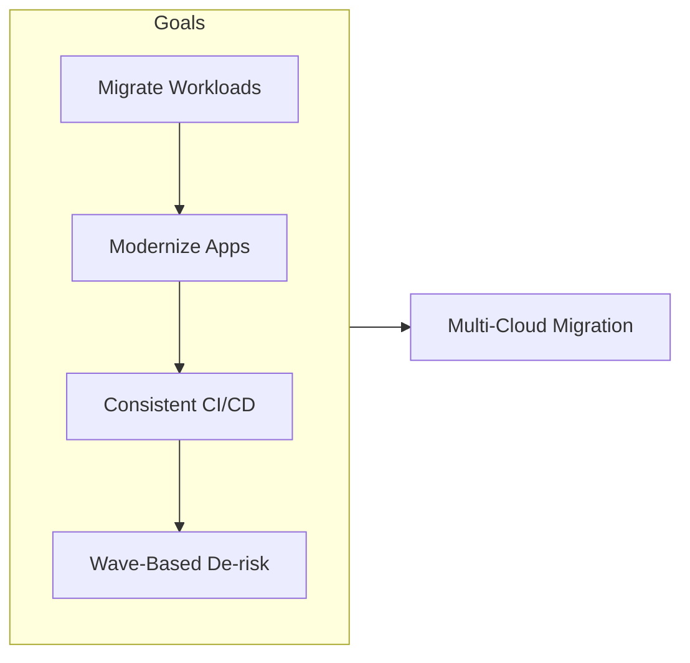

---

## 2. Azure DevOps Structure

### Repositories

| Repo | Purpose |
|------|---------|
| `migration-playbook` | Wave planning, checklists, decision trees, runbooks |
| `migration-automation` | Scripts for discovery, assessment, data sync, cutover |
| `migration-iac-azure` | Bicep/Terraform for Azure target state |
| `migration-iac-aws` | Terraform/CloudFormation for AWS target state |
| `migration-iac-gcp` | Terraform for GCP target state (if applicable) |
| `app-modernization` | Application refactor (e.g., container Dockerfiles, Helm charts) |

**Explanation:** Repos hold migration playbook, automation scripts, cloud-specific IaC, and app modernization assets. Playbook and automation feed discovery and cutover; IaC repos feed Deploy-* pipelines; app-modernization feeds App-Modernize-Build and Deploy. All changes versioned and deployable via pipelines.

**Detailed repository flow (step-by-step):**

1. **migration-playbook** — Wave plans, checklists, decision trees, runbooks. Updated per wave; cutover and rollback steps documented. Used by migration lead and engineers during cutover.
2. **migration-automation** — Scripts for discovery, assessment, data sync, cutover. Discovery-Assessment pipeline runs these; output to artifact or wiki. Linked to work items.
3. **migration-iac-azure / aws / gcp** — IaC per cloud. PR triggers plan (what-if/terraform plan); merge or manual triggers Deploy-Azure, Deploy-AWS, Deploy-GCP. Outcome: target state deployed per cloud.
4. **app-modernization** — Dockerfiles, Helm charts, refactored code. App-Modernize-Build (on PR) builds image; App-Modernize-Deploy deploys to AKS/EKS/GKE. Outcome: modernized app in target cloud.
5. **Flow:** Discovery → Assessment report → IaC and app changes in repos → Pipelines deploy → Cutover-Validation → Go-live or rollback.

**Repository flow**

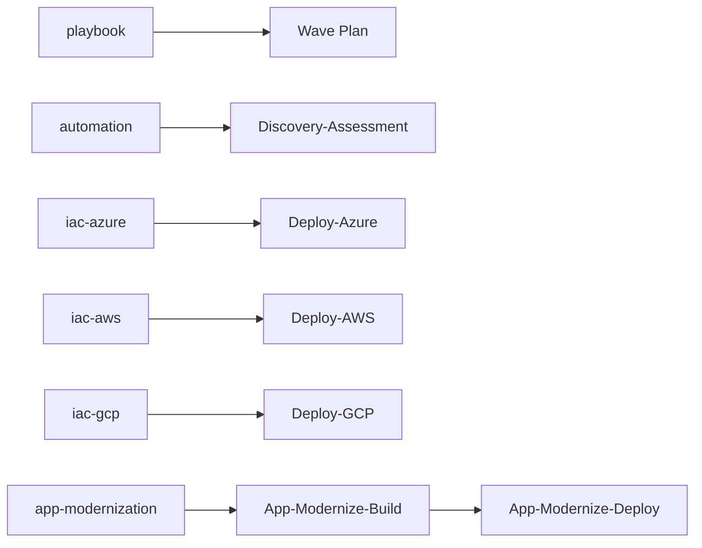

### Boards (Work Item Hierarchy)

```
Epic: Multi-Cloud Migration & Modernization
├── Feature: Discovery & Assessment
│   ├── User Story: Inventory apps, dependencies, data flows
│   ├── User Story: Cloud fit assessment (Azure vs AWS vs GCP)
│   └── Task: Automated discovery scripts; assessment report template
├── Feature: Wave Planning & Execution
│   ├── User Story: Wave N migration plan (apps, order, dependencies)
│   ├── User Story: Cutover checklist and rollback procedure
│   └── Task: Wave tracking in Boards (tags: wave-1, wave-2)
├── Feature: Target State IaC & Pipelines
│   ├── User Story: Deploy Azure landing zone / workload via pipeline
│   ├── User Story: Deploy AWS/GCP equivalent via pipeline
│   └── Task: Unified pipeline with cloud parameter (Azure | AWS | GCP)
├── Feature: Application Modernization
│   ├── User Story: Containerize app; deploy to AKS/EKS/GKE
│   ├── User Story: Replace legacy middleware with managed services
│   └── Task: Modernization runbook per app type
└── Feature: Post-Migration & Optimization
    ├── User Story: Cost and performance baseline; optimization backlog
    └── Task: Decommission source; update DNS, monitoring, docs
```

**Explanation:** Boards organize migration by wave and capability. Epic can represent the overall migration or a wave; Features group discovery, wave planning, IaC, modernization, and post-migration. User Stories and Tasks are created per app or per wave; tags (e.g. wave-1) help filter. Work flows from backlog → active → closed; cutover and decommission are explicit tasks.

**Detailed board flow (step-by-step):**

1. **Wave kickoff** — Create Epic for wave N; create Features (Discovery, Wave Planning, IaC, Modernization, Cutover). Assign wave lead and app owners.
2. **Discovery & assessment** — Create User Stories per app or group; run Discovery-Assessment; attach assessment report to work items. Cloud fit and dependencies documented.
3. **IaC and app work** — Create Tasks for IaC changes and app modernization. Link to wave Epic. PR and pipeline runs linked. State: Active.
4. **Cutover** — Create Task for cutover; checklist and rollback in playbook. Cutover-Validation run; result attached. State: Resolved when cutover successful.
5. **Post-migration** — Optimization backlog items; decommission tasks. Close when source retired and docs updated.
6. **Closure** — Wave Epic closed when all apps in wave cut over and validated. Playbook updated for next wave.

**Board hierarchy flow**

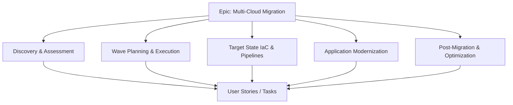

### Pipelines

| Pipeline | Trigger | Purpose |
|----------|---------|---------|
| `Discovery-Assessment` | Manual / schedule | Run discovery scripts; output to artifact or wiki |
| `Deploy-Azure` | Branch / manual | Deploy Azure target state (Bicep/Terraform) |
| `Deploy-AWS` | Branch / manual | Deploy AWS target state (Terraform/CF) |
| `Deploy-GCP` | Branch / manual | Deploy GCP target state (Terraform) |
| `App-Modernize-Build` | PR to app repo | Build container/image; push to ACR/ECR/GCR |
| `App-Modernize-Deploy` | After build | Deploy to AKS/EKS/GKE (env-specific) |
| `Cutover-Validation` | Manual | Post-cutover smoke tests; health checks |

**Explanation:** Pipelines automate discovery, IaC deploy per cloud, app build/deploy, and cutover validation. Discovery-Assessment runs on demand or schedule; Deploy-* pipelines apply IaC; App-Modernize-Build/Deploy build and deploy containers; Cutover-Validation runs after cutover to verify. No manual IaC apply or cutover verification outside pipeline/runbook.

**Detailed pipeline flow (step-by-step):**

1. **Discovery-Assessment** — Trigger: manual or schedule. Steps: Run discovery scripts (inventory, dependencies, data flows); produce assessment report; optionally create or update work items. Output: artifact or wiki; linked to Boards.
2. **Deploy-Azure / AWS / GCP** — Trigger: branch or manual. Steps: Checkout IaC repo; plan (optional); apply to dev/staging/prod in that cloud. Approval on prod. Output: target cloud resources updated.
3. **App-Modernize-Build** — Trigger: PR to app repo. Steps: Build container image; push to ACR/ECR/GCR; run validation tests. Output: image in registry; version tag.
4. **App-Modernize-Deploy** — Trigger: after build or manual. Steps: Deploy to AKS/EKS/GKE (env-specific). Approval on prod. Output: app running in target cloud.
5. **Cutover-Validation** — Trigger: manual after cutover. Steps: Run smoke tests, health checks, optional data checks. Output: pass/fail; attached to work item. Failure may trigger rollback runbook.

**Pipeline flow**

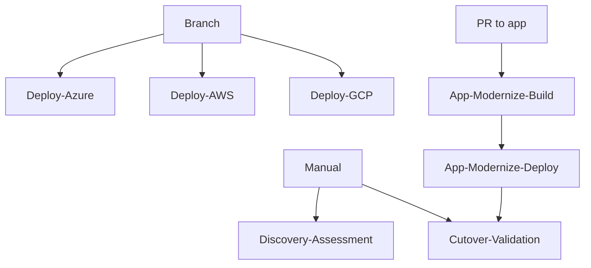

### Environments

| Environment | Use |
|-------------|-----|
| **Migration-Dev** | Test automation, IaC, and modernized app in dev |
| **Azure-Pilot** | Azure pilot workload |
| **AWS-Pilot** | AWS pilot workload |
| **GCP-Pilot** | GCP pilot (if used) |
| **Production (per cloud)** | Live migrated workloads; approval gates |

**Explanation:** Migration-Dev is for testing automation and IaC without production data. Azure-Pilot, AWS-Pilot, GCP-Pilot are pilot workloads per cloud. Production (per cloud) is the live target; approval gates protect production. Legacy is read-only source during migration.

**Detailed environment flow (step-by-step):**

1. **Migration-Dev** — Test discovery, IaC, and modernized app in dev subscriptions. No production data. Safe to fail.
2. **Azure-Pilot / AWS-Pilot / GCP-Pilot** — Pilot workload(s) per cloud. Validate IaC and app deploy before full wave. Optional approval.
3. **Production (per cloud)** — Live migrated workloads. Deploy-Azure/AWS/GCP and App-Modernize-Deploy to prod require approval and change request. Cutover switches traffic here.
4. **Legacy** — Source systems; read-only. Used for comparison during migration; decommissioned after wave sign-off.
5. **Promotion path:** Dev → Pilot (optional) → Production per cloud. Cutover is traffic/DNS switch to production; validation runs after cutover.

**Environment promotion flow**

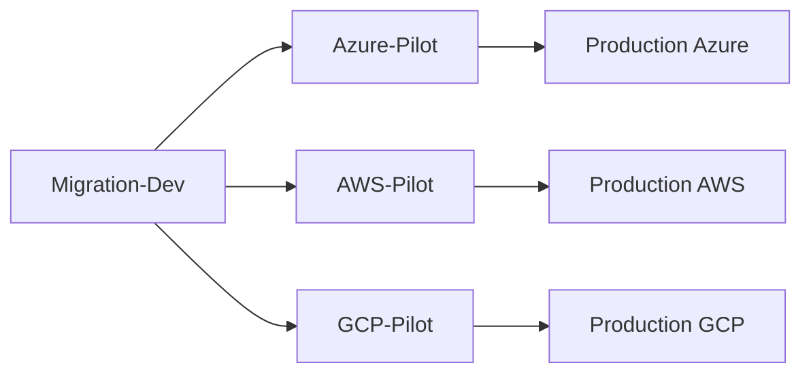

---

## 3. End-to-End Project Flow

```
[Wave Definition]
        │
        ▼
┌─────────────────────────────────────────────────────────────────┐
│ Boards: Epic (Wave N) → Feature (per app or group) → Stories     │
│ Migration playbook updated; cutover date set                      │
└─────────────────────────────────────────────────────────────────┘
        │
        ▼
┌───────────────────┐     ┌─────────────────────┐
│ Discovery &       │────▶│ Assessment Report   │
│ Assessment        │     │ Cloud fit; risks    │
└───────────────────┘     └──────────┬──────────┘
                                      │
        ┌─────────────────────────────┼─────────────────────────────┐
        ▼                             ▼                             ▼
┌───────────────┐           ┌─────────────────┐           ┌─────────────────┐
│ Deploy-Azure  │           │ Deploy-AWS       │           │ App-Modernize    │
│ (IaC)         │           │ (IaC)            │           │ Build & Deploy   │
└───────────────┘           └─────────────────┘           └─────────────────┘
        │                             │                             │
        └─────────────────────────────┼─────────────────────────────┘
                                      ▼
                        ┌────────────────────────┐
                        │ Cutover: Data sync,    │
                        │ DNS, cutover, validate │
                        └────────────┬───────────┘
                                     │
                                     ▼
                        ┌────────────────────────┐
                        │ Cutover-Validation     │
                        │ Post-Migration         │
                        │ Optimization backlog   │
                        └────────────────────────┘
```

**End-to-end flow (Mermaid)**

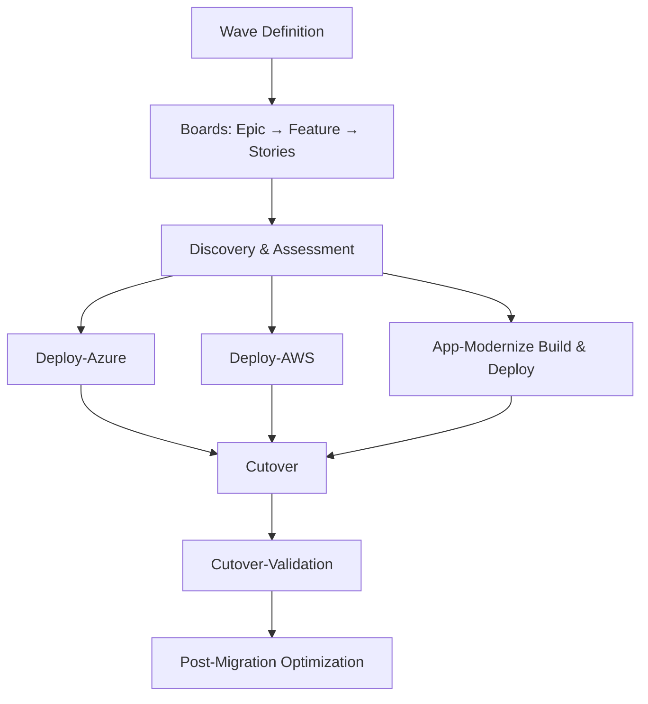

**Detailed end-to-end flow (step-by-step):**

1. **Wave definition** — Create Epic and Features in Boards; set cutover date; assign apps to wave. Update playbook.
2. **Discovery & assessment** — Run Discovery-Assessment pipeline; attach report to work items. Cloud fit and dependencies documented.
3. **IaC deploy** — Deploy-Azure, Deploy-AWS, Deploy-GCP run (dev → staging → prod per cloud). Target state standing in each cloud.
4. **App modernization** — App-Modernize-Build produces image; App-Modernize-Deploy deploys to AKS/EKS/GKE. Staging validated before prod.
5. **Cutover** — Execute cutover runbook: data sync, DNS/traffic switch. Run Cutover-Validation pipeline. Pass → go-live. Fail → rollback per runbook.
6. **Post-migration** — Monitor; optimization backlog; decommission source when stable. Update docs and handover to BAU.

---

## 4. Key Deliverables & Acceptance Criteria

| Deliverable | Acceptance Criteria |
|-------------|----------------------|
| Migration playbook | Wave template, checklists, rollback steps in repo/wiki |
| Discovery/assessment output | Automated or semi-automated; linked to work items |
| IaC per cloud | Azure, AWS, GCP target state deployable via Azure DevOps pipelines |
| Modernized app pipeline | Build once; deploy to chosen cloud (AKS/EKS/GKE) with approval |
| Wave tracking | Each app/wave has status in Boards; cutover and post-migration tasks closed |
| Runbooks | Cutover, rollback, and decommission documented and versioned |

**Deliverables flow**

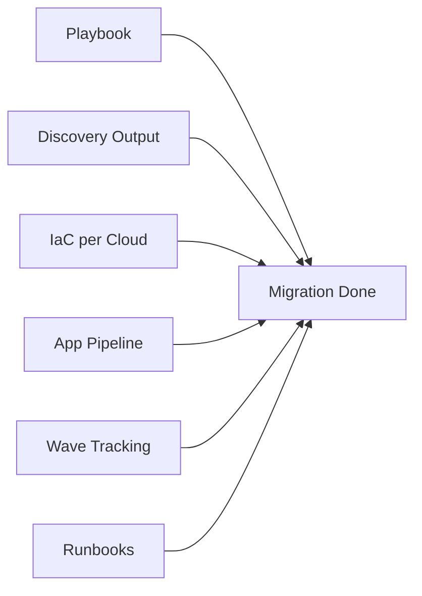

**Explanation:** Deliverables are the concrete outputs: playbook, discovery output, IaC per cloud, app pipeline, wave tracking, and runbooks. Each has acceptance criteria so migration lead and stakeholders agree when a wave or the migration is “done.”

**Detailed deliverables flow (how each is produced):**

1. **Migration playbook** — Written in migration-playbook repo; wave template, checklists, rollback steps. Acceptance: playbook in repo; cutover and rollback documented; used in at least one wave.
2. **Discovery/assessment output** — Produced by Discovery-Assessment pipeline; linked to work items. Acceptance: automated or semi-automated; report available per wave.
3. **IaC per cloud** — Azure, AWS, GCP target state in repos; deployable via Azure DevOps pipelines. Acceptance: each cloud deployable from pipeline; no manual resource creation for scope.
4. **Modernized app pipeline** — App-Modernize-Build and Deploy; build once, deploy to chosen cloud (AKS/EKS/GKE) with approval. Acceptance: app in target cloud; approval and rollback tested.
5. **Wave tracking** — Each app/wave has status in Boards; cutover and post-migration tasks closed. Acceptance: wave Epic and Tasks reflect current state.
6. **Runbooks** — Cutover, rollback, decommission in playbook repo; versioned. Acceptance: runbooks documented and executed in drill or cutover.

---

## 5. Phases & Timeline (Example)

| Phase | Duration | Focus |
|-------|----------|--------|
| **Phase 1: Foundation** | 4–6 weeks | Playbook, discovery scripts, IaC skeleton for each cloud, pipeline layout |
| **Phase 2: Pilot Wave** | 6–8 weeks | 1–2 apps; full flow discovery → IaC → modernize → cutover → validate |
| **Phase 3: Wave Rollout** | 8–12+ weeks | Repeat for each wave; refine playbook and automation |
| **Phase 4: Optimization & Decommission** | Ongoing | Cost/performance tuning; decommission source; handover to BAU |

**Phases timeline flow**

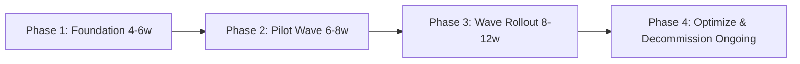

**Explanation:** Phases order the work: foundation (playbook, discovery, IaC skeleton, pipelines), then pilot wave (full flow for 1–2 apps), then wave rollout (repeat for each wave), then optimization and decommission. Timelines are examples; adjust to wave size and org capacity.

**Detailed phase flow (what happens in each phase):**

1. **Phase 1: Foundation (4–6 weeks)** — Playbook and wave template; discovery scripts; IaC skeleton per cloud; pipeline layout (Deploy-*, App-Modernize, Cutover-Validation). Outcome: can run discovery and deploy to dev in each cloud.
2. **Phase 2: Pilot Wave (6–8 weeks)** — Select 1–2 apps; full flow: discovery → IaC → modernize → cutover → validate. Refine playbook and automation. Outcome: first apps migrated; runbook and pipelines proven.
3. **Phase 3: Wave Rollout (8–12+ weeks)** — Repeat for each wave; same flow; cutover and rollback tested per wave. Outcome: bulk of apps migrated.
4. **Phase 4: Optimization & Decommission (Ongoing)** — Cost and performance tuning; decommission source; handover to BAU. Outcome: migration complete; steady state.

---

## 6. Azure DevOps Artifacts & Links

- **Wiki:** Migration playbook, wave calendar, cloud decision matrix, runbooks
- **Service connections:** Azure, AWS (OIDC/keys), GCP (if used); source system (e.g., on-prem agent)
- **Variable groups:** Per cloud (subscription, region, env names); secrets in Key Vault
- **Permissions:** Migration team (full); BAU teams (read playbook, limited pipeline run)

**Artifacts & links flow**

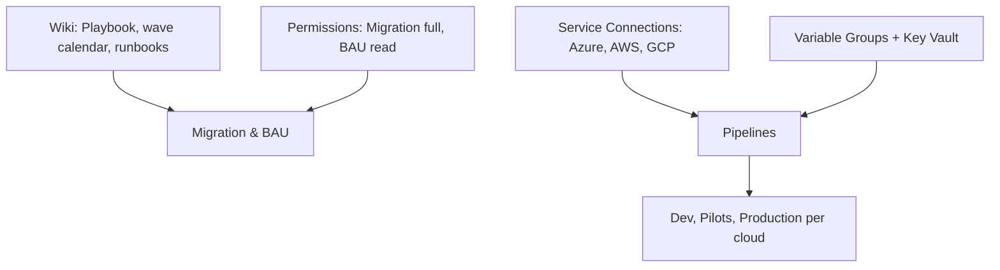

**Explanation:** Wiki holds playbook, wave calendar, cloud decision matrix, and runbooks. Service connections (Azure, AWS, GCP) let pipelines deploy IaC and apps. Variable groups per cloud and env supply subscription, region, and secrets (Key Vault). Permissions: migration team full access; BAU teams read playbook and limited pipeline run.

**Detailed artifacts flow (how they connect):**

1. **Wiki** — Migration playbook, wave calendar, cloud decision matrix, runbooks. Updated per wave. Linked from work items and notifications.
2. **Service connections** — Azure, AWS (OIDC/keys), GCP (if used); optional agent or connectivity to source for discovery. Pipelines use these to deploy and (if needed) run discovery.
3. **Variable groups** — Per cloud and env (subscription, region, env names); secrets in Key Vault. Referenced by Deploy-* and App-Modernize-Deploy.
4. **Permissions** — Migration team: full (repos, pipelines, approvals). BAU teams: read playbook; limited pipeline run (e.g. view, or run non-prod only as agreed). Ensures migration control while BAU can follow along.

---

## 7. End-to-End Flow (Complete)

### 7.1 Flow Phases (Trigger → Closure)

| Phase | Name | Description |
|-------|------|-------------|
| 0 | **Prerequisites** | Playbook repo; discovery scripts; IaC repos per cloud; pipeline layout; wave plan in Boards. |
| 1 | **Trigger** | Wave kickoff (Epic created); or PR to IaC/app-modernization repo. |
| 2 | **Triage / Plan** | Wave planning: assign apps to wave; dependencies; cutover date. Per app: assign owner; target cloud. |
| 3 | **Discovery & Assess** | Run Discovery-Assessment pipeline; produce inventory and cloud-fit report; link to work items. |
| 4 | **Build / Execute** | Deploy-Azure/AWS/GCP (IaC); App-Modernize-Build (container); App-Modernize-Deploy (to target K8s). |
| 5 | **Validate** | Cutover-Validation pipeline: smoke tests, data consistency checks; UAT sign-off per app. |
| 6 | **Approve** | Wave lead approves cutover; CAB if production; change request linked. |
| 7 | **Cutover / Release** | Execute cutover runbook: data sync, DNS/traffic switch, Cutover-Validation; go-live. |
| 8 | **Verify / Operate** | Monitor new environment; post-migration optimization backlog; decommission source when stable. |
| — | **Feedback** | Cutover issues → runbook update; wave retro → next wave improvements; metrics → dashboard. |

**Complete flow phases diagram**

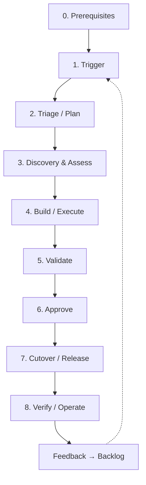

**Explanation (complete flow):** The complete flow runs from prerequisites through trigger (wave or PR), triage/plan, discovery, build (IaC and app), validate, approve (cutover approval), cutover/release, verify/operate, and close. Feedback (cutover issues, wave retro, metrics) feeds playbook and next wave.

**Detailed complete flow (step-by-step):**

1. **Prerequisites** — Playbook repo; discovery scripts; IaC repos per cloud; pipeline layout; wave plan in Boards. Without these, migration cannot start.
2. **Trigger** — Wave kickoff (Epic created) or PR to IaC/app-modernization. Creates work items or pipeline run.
3. **Triage/Plan** — Wave planning: assign apps to wave; dependencies; cutover date. Per app: assign owner; target cloud. Ensures scope and order are clear.
4. **Discovery & assess** — Run Discovery-Assessment; produce inventory and cloud-fit report; link to work items. Output: assessment report.
5. **Build/Execute** — Deploy-Azure/AWS/GCP (IaC); App-Modernize-Build and Deploy. Outcome: target state and app deployed in target cloud(s).
6. **Validate** — Cutover-Validation pipeline: smoke tests, data consistency (if applicable); UAT sign-off per app. Failure blocks cutover.
7. **Approve** — Wave lead or CAB approves cutover; change request linked. If denied, address gaps and re-submit.
8. **Cutover/Release** — Execute cutover runbook: data sync, DNS/traffic switch, Cutover-Validation. Go-live. If failure, rollback per runbook.
9. **Verify/Operate** — Monitor new environment; post-migration optimization backlog; decommission source when stable. Close wave Epic when complete.
10. **Feedback** — Cutover issues → runbook update; wave retro → next wave improvements; metrics → dashboard. Feeds new triggers.

### 7.2 Roles & Responsibilities (RACI)

| Role | R | A | C | I |
|------|---|---|---|---|
| Migration Lead | Wave plan; cutover approval | Wave success | BAU, Security | Stakeholders |
| App Owner | App-specific migration tasks; UAT | App cutover | Migration team | On status |
| Platform/Migration Engineer | Run discovery; IaC; pipelines; cutover execution | Technical delivery | Cloud SMEs | Migration Lead |
| CAB | — | Approve prod cutover | — | Cutover calendar |

### 7.3 Per-Phase Detail

| Phase | Trigger | Inputs | Actions | Outputs | Success criteria | Failure path |
|-------|---------|-------|--------|--------|------------------|--------------|
| **Trigger** | Wave start or PR | Epic, or branch | Create wave Epic; create app work items; or start pipeline | Work items; pipeline run | Wave/app scope clear | Refine scope; re-plan |
| **Triage / Plan** | Epic or app assigned | Playbook, dependencies | Assign owners; set cutover date; decide target cloud | Plan; cutover date | Plan agreed | Re-plan with stakeholders |
| **Discovery** | Plan done | Source list | Run Discovery-Assessment | Inventory; assessment report | Report linked to work items | Re-run with fixed scope |
| **Build** | Assessment done | IaC, app code | Deploy-Azure/AWS/GCP; App-Modernize-Build; App-Modernize-Deploy | Target env; running app | App running in target cloud | Fix IaC/code; re-run |
| **Validate** | Deploy done | Target env | Cutover-Validation; UAT | Test results; sign-off | All tests pass; UAT signed | Fix issues; re-validate |
| **Approve** | Validation pass | CR, test results | Wave lead / CAB approval | Approval | Approved for cutover | Address gaps; re-submit |
| **Cutover** | Approval | Runbook, DNS plan | Data sync; traffic switch; Cutover-Validation | Go-live | Traffic on new env; validation green | Rollback per runbook |
| **Verify** | Cutover done | Monitoring | Monitor; optimization backlog; decommission plan | Stable env; backlog items | No critical issues; source decommissioned when ready | Rollback or fix forward |
| **Close** | Stable operation | All above | Close wave Epic; update playbook | Closed Epic; updated docs | Wave complete | Reopen if issues |

### 7.4 Decision Points & Approval Gates

| Gate | When | Who | Condition to proceed | If denied |
|------|------|-----|----------------------|-----------|
| **Cutover approval** | After validation and UAT | Wave Lead / CAB | CR approved; rollback tested; runbook ready | Cutover postponed; gaps addressed |
| **IaC deploy (prod)** | Before prod infra deploy | Migration Lead | Terraform/Bicep reviewed; no destructive change | Do not run; fix and re-plan |
| **App deploy (prod)** | Before app go-live | App Owner + Migration | Staging sign-off; image/version tagged | Do not cutover |

**Decision points flow**

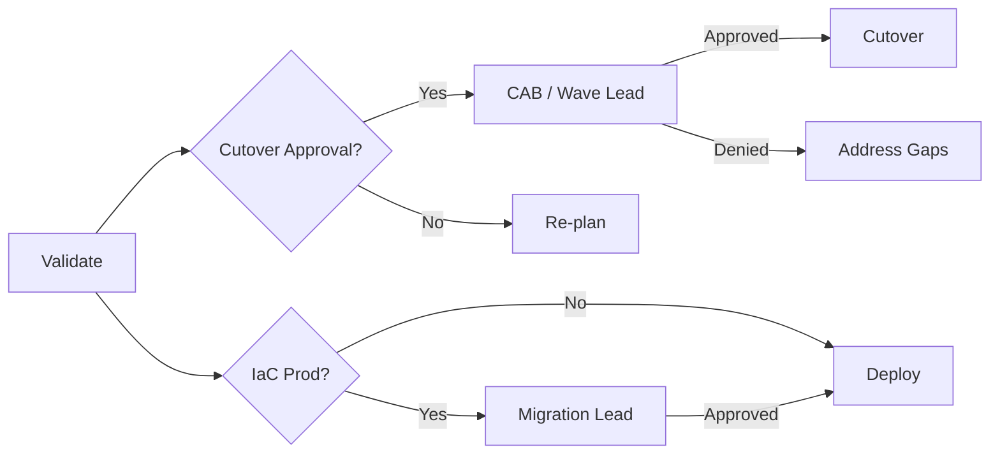

### 7.5 Rollback & Escalation

- **Rollback:** Per cutover runbook: revert DNS/traffic to source; stop sync to target; investigate. App rollback: redeploy previous image/version via pipeline. IaC: re-apply previous state if safe.
- **Escalation:** Cutover blocker → Migration Lead + App Owner; technical blocker → Platform Engineer; scope/date change → Migration Lead + stakeholders.

### 7.6 Feedback Loops

- **Cutover-Validation failures** → Runbook and pipeline updated; wave retro.
- **Post-migration issues** → Optimization backlog; runbook and monitoring improved.
- **Wave completion** → Playbook and templates updated for next wave.

### 7.7 Prerequisites (Before Starting)

- Migration playbook repo and wave template in Boards; discovery and IaC repos; pipelines for each cloud and app.
- Service connections: Azure, AWS, GCP; agent or connectivity to source for discovery.
- Variable groups per cloud and env; secrets in Key Vault.
- Cutover runbook and rollback procedure documented and tested (e.g., in pilot).
- Permissions: Migration team (full); BAU (read; limited run as agreed).

### 7.8 Definition of Done (Overall)

- Wave: All apps in wave cut over; Cutover-Validation green; rollback tested; playbook updated.
- App: Running in target cloud; UAT signed; monitoring in place; source decommissioned or planned.
- IaC: Deployed and drift-free; documented in playbook.
