# E-commerce Platform Infrastructure

## Azure DevOps Project Overview

| Attribute | Value |
|-----------|--------|
| **Project Type** | Infrastructure, E-commerce Platform |
| **Organization** | Azure DevOps Org |
| **Area Path** | E-commerce / Infrastructure |
| **Iteration** | Sprint-based (2 weeks) |

**What this project is:** This Azure DevOps project owns the **infrastructure layer** for an e-commerce platform: networking, compute (AKS or App Service), data (SQL/Cosmos, Redis), security (WAF, Key Vault), and DR. All infrastructure is defined as code (Bicep/Terraform) and deployed via pipelines. Work is tracked in Boards under the E-commerce/Infrastructure area path, with iterations aligned to 2-week sprints.

**Scope and boundaries**

- **In scope:** VNet and networking (subnets, NSGs, private endpoints, DNS); compute (AKS clusters, App Service plans, worker/queue tiers); data (Azure SQL or Cosmos DB, Redis cache, backup); security (WAF, TLS, Key Vault, managed identities); CDN and load balancing; monitoring (App Insights, Log Analytics); DR region and failover procedure; runbooks for scale-up, failover, and DR.
- **Out of scope (unless explicitly added):** Application code (owned by app teams); third-party SaaS (e.g. payment gateway config); end-user devices; non-e-commerce workloads in the same subscription.
- **Boundaries:** Infra team owns resource creation and configuration via IaC; app teams consume environments (deploy apps to AKS/App Service) but do not change infra repos or approve prod infra deploys.

**Stakeholders**

- **Infra/Platform team** — Implement and maintain IaC; run pipelines; maintain runbooks; approve or execute DR drills.
- **App teams** — Consume dev/staging/prod environments; report issues; request new envs or capacity via work items.
- **CAB / Release Manager** — Approve production and (if applicable) DR deploy; ensure change request is linked and what-if reviewed.
- **Security / Compliance** — Review security baseline and PCI scope; sign off on evidence pack.
- **Business / Product** — Define capacity and peak requirements; sign off on RTO/RPO and DR strategy.

**Success criteria (project level)**

- All in-scope infrastructure deployable from repo with no manual resource creation.
- Production and DR deploy require approval and (for prod) change request.
- Post-deploy smoke and DR drill pass; runbooks updated and versioned.
- Uptime and capacity meet business SLA; security baseline and (if applicable) PCI evidence pack complete.

**Key principles**

- **Everything as code:** No one-off portal changes for in-scope resources; all changes via PR and pipeline.
- **Environment parity:** Same IaC modules and topology for dev/staging/prod (parameterized); DR is same code, different region/subscription.
- **Approval and audit:** Prod deploy and DR drill gated; change request and pipeline run history retained for audit.
- **Runbooks and drills:** Operational procedures (scale, failover, DR) in repo; DR drill run at least quarterly and documented.

---

## 1. Project Objectives

**Explanation:** Objectives define *why* the project exists and what success looks like. Here we focus on (1) scalable and highly available infra for web, API, cart, payments, and inventory; (2) full IaC for repeatability and audit; (3) peak-load handling and DR; (4) security and compliance (e.g. PCI-DSS); and (5) environment parity so dev/staging mirror production. Each objective is measurable via deliverables and acceptance criteria.

**Business context:** E-commerce must support high traffic (including peak events like Black Friday), protect customer and payment data, and recover quickly from failures. Infra is the foundation: without scalable, secure, and recoverable infra, application teams cannot deliver. Objectives are ordered so that foundation (IaC, parity) comes first, then production and HA, then security and DR, then steady state.

**Success metrics (how we know objectives are met):**

- **Scalable/HA:** Auto-scale rules in place; multi-AZ/region where required; RTO/RPO documented and tested in DR drill.
- **IaC:** 100% of in-scope resources in Bicep/Terraform; zero manual creation for scope; pipeline run history for every deploy.
- **Peak/DR:** Capacity runbook executed at least once (e.g. pre–Black Friday); DR drill run quarterly; drill report and runbook updated.
- **Security/compliance:** WAF, TLS, private endpoints, Key Vault in place; no critical findings unaddressed; PCI evidence pack (if applicable) complete.
- **Parity:** Dev/staging/prod use same module set; only parameters (prefix, SKU, region) differ; topology documented in Wiki.

**Dependencies:** Objectives depend on: Azure subscription(s) and permissions; Azure DevOps project and service connections; variable groups and Key Vault; CAB and approval process for prod; business sign-off on RTO/RPO and DR strategy.

**Typical scenarios:** (1) **New capability** — Add Redis cache, new subnet, or WAF rule; full flow: work item → branch → PR → validate → merge → deploy dev → staging → prod (with approval). (2) **Peak preparation** — Run capacity runbook (scale-out); no code change if only scaling existing resources. (3) **DR drill** — Schedule Infra-DR-Drill; execute runbook; document results; update runbook if steps changed. (4) **Hotfix** — Urgent prod fix; still via PR and pipeline; expedited CAB approval; post-incident review.

**Detailed objectives flow (how goals connect):**

1. **Scalable, highly available infra** → Drives the choice of managed services (AKS, App Service, Azure SQL, Redis) and multi-AZ/region design. Measured by: auto-scale rules present; HA topology documented; RTO/RPO and DR drill result.
2. **IaC (Bicep/Terraform)** → All changes go through repos and pipelines; no manual resource creation for in-scope components. Measured by: pipeline runs for every env; what-if/plan in PR.
3. **Peak loads & DR** → Auto-scaling rules and capacity runbooks; DR region and failover procedure with quarterly drills. Measured by: runbook versioned; drill report and next drill date.
4. **Security & compliance** → WAF, TLS, private endpoints, Key Vault; PCI-DSS controls documented and automated where applicable. Measured by: security review; scan results; evidence pack.
5. **Environment parity** → Same Bicep/Terraform modules parameterized per environment (dev/staging/prod/DR) so behaviour is consistent. Measured by: single module set; parameter matrix in Wiki or variable groups.

- Provision and manage scalable, highly available infrastructure for e-commerce (web, API, cart, payments, inventory)
- Implement IaC (Bicep/Terraform) for repeatable, auditable deployments
- Support peak loads (e.g., Black Friday) via auto-scaling and capacity planning
- Integrate security (WAF, TLS, secrets) and compliance (PCI-DSS where applicable)
- Enable environment parity (dev, staging, production) and disaster recovery

**Objectives flow**

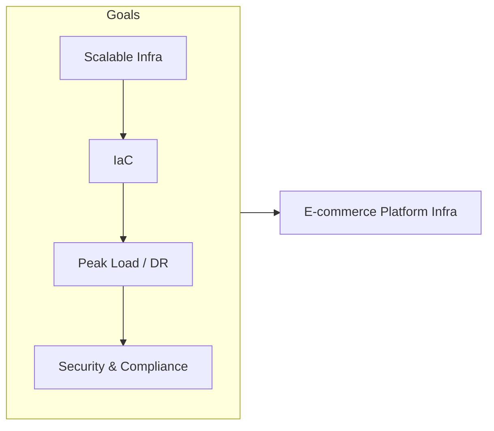

---

## 2. Azure DevOps Structure

### Repositories

| Repo | Purpose |
|------|---------|
| `ecommerce-infra-bicep` | Bicep/ARM for Azure (VNet, AKS/App Service, DB, Redis, CDN) |
| `ecommerce-infra-terraform` | Terraform for hybrid or multi-cloud (optional) |
| `ecommerce-pipelines` | Pipeline definitions for infra deploy and app deploy |
| `ecommerce-runbooks` | Operational runbooks (scale-up, failover, DR) |

**Explanation:** Repositories hold the source of truth for infrastructure and operations. `ecommerce-infra-bicep` (and optionally Terraform) defines all Azure resources; pipelines consume these repos to validate and deploy. Runbooks and pipeline YAML live in dedicated repos so changes are versioned and auditable. No one edits production resources directly in the Azure portal for in-scope components; all changes flow through a repo and a pipeline.

**Branch strategy**

- **main** — Production-ready state; protected; merge only via PR. Optionally used to trigger or gate production deploy (manual pipeline run still required with approval).
- **dev** — Integration branch for dev environment; merge from feature branches; may auto-trigger Infra-Deploy-Dev on merge.
- **feature/&lt;name&gt;** — Short-lived branches for changes (e.g. `feature/add-redis-cache`, `feature/waf-rule-fix`). Created from `dev` or `main`; PR into `dev` or `main` depending on policy.
- **hotfix/&lt;name&gt;** — For urgent production fixes; branch from `main`; PR into `main`; expedited review and CAB.

**What lives where**

- **ecommerce-infra-bicep:** Bicep modules (e.g. `modules/network.bicep`, `modules/compute.bicep`, `modules/data.bicep`, `modules/security.bicep`); main deployment file (e.g. `main.bicep`) that references modules; parameters files or use variable groups in pipeline. No secrets in repo; secrets in Key Vault and referenced by pipeline.
- **ecommerce-infra-terraform (optional):** Terraform modules and `main.tf`; `terraform.tfvars` or pipeline variables per env; state in Azure Storage backend. Used if hybrid or multi-cloud.
- **ecommerce-pipelines:** YAML for Infra-Validate, Infra-Deploy-Dev/Staging/Prod, Infra-DR-Drill; may reference Bicep repo as resource or use checkout. Variable group references; approval gates defined in YAML or Azure DevOps environment.
- **ecommerce-runbooks:** Markdown or script runbooks (e.g. `dr-failover.md`, `peak-scale-out.md`, `rollback-deploy.md`). Versioned; published to Wiki or Azure Automation by Runbook-Deploy or equivalent.

**Naming conventions**

- Branches: `feature/<short-description>`, `hotfix/<ticket-or-description>`, `dev`, `main`.
- Bicep: modules named by resource type or domain (e.g. `network.bicep`, `aks.bicep`); resources named via parameters (prefix + env + resource type) to avoid collisions.
- Work items: Linked to Epic "E-commerce Platform Infrastructure"; Feature names match capability (e.g. "Core Networking & Security"); User Story/Task titles descriptive (e.g. "Add Redis cache for session store").

**Detailed repository flow (step-by-step):**

1. **Developer/Infra engineer** creates a branch in `ecommerce-infra-bicep` (e.g. `feature/add-redis-cache`).  
   - **Inputs:** Work item ID (optional but recommended); requirement (e.g. "Add Redis for session store").  
   - **Actions:** Create branch from `dev`; add/edit Bicep modules or parameters; commit.  
   - **Outputs:** Branch with new/modified files.  
   - **Failure handling:** If branch policy requires work item link, PR will be blocked until link is added.

2. **PR is opened** → Pipeline `Infra-Validate` runs: Bicep lint, `what-if` (or Terraform plan), and checks for secrets in code.  
   - **Inputs:** PR source branch; target branch (e.g. `dev`); Bicep/Terraform files.  
   - **Actions:** Checkout; run `bicep build` and lint; run `what-if` against dev subscription (or Terraform plan); optional secret scan.  
   - **Outputs:** Pipeline status (pass/fail); what-if output in pipeline log (reviewers use to verify change set).  
   - **Failure handling:** Lint or what-if failure → fix in branch and push; re-run. Secret detected → remove secret, use variable group/Key Vault, re-push.

3. **After code review and merge** → Depending on branch or manual choice, `Infra-Deploy-Dev`, `-Staging`, or `-Prod` runs. Dev may auto-deploy on merge to `dev`; staging and prod require manual trigger and approval.  
   - **Inputs:** Merged commit; variable group for target env; service connection; (for prod) approval and change request link.  
   - **Actions:** Checkout merged branch; resolve variable group; run Bicep deploy (or Terraform apply) to target subscription/resource group.  
   - **Outputs:** Azure resources created/updated; pipeline run log; audit trail (who approved, when).  
   - **Failure handling:** Deploy failure → fix IaC (e.g. quota, naming); re-run. If prod already partially updated, consider rollback (re-deploy previous commit) and incident.

4. **Pipeline YAML** in `ecommerce-pipelines` references the Bicep repo and passes environment-specific parameters (prefix, SKUs, regions) from variable groups.  
   - **Inputs:** Repo resource (ecommerce-infra-bicep); variable group (e.g. `ecommerce-prod`); service connection.  
   - **Actions:** Pipeline stage checks out Bicep repo; passes variables to template deployment task.  
   - **Outputs:** Consistent deploy behaviour; no hardcoded env values in Bicep repo.  
   - **Failure handling:** Missing variable or connection → fix variable group or service connection; re-run.

5. **Runbooks** in `ecommerce-runbooks` are updated when new procedures (e.g. DR, peak scale-out) are added; `Infra-DR-Drill` pipeline may invoke or document runbook steps.  
   - **Inputs:** Runbook content (markdown/scripts); pipeline schedule or manual trigger for DR drill.  
   - **Actions:** For runbook update: PR and merge; optional publish to Wiki. For DR drill: run Infra-DR-Drill pipeline; execute steps from runbook; record results.  
   - **Outputs:** Runbook versioned; drill report (e.g. in Wiki or artifact).  
   - **Failure handling:** Drill step failure → document in report; update runbook with fix or clarification; re-drill if critical.

6. **Outputs (overall):** Deployed resources in Azure; pipeline run history and audit trail in Azure DevOps; runbook and drill report for operations and audit.

**Repository flow**

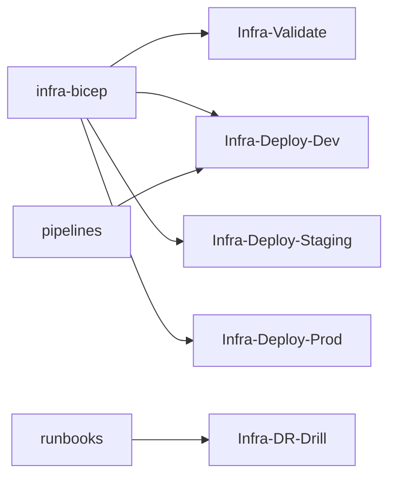

### Boards (Work Item Hierarchy)

```
Epic: E-commerce Platform Infrastructure
├── Feature: Core Networking & Security
│   ├── User Story: VNet, subnets, NSGs, private endpoints
│   ├── User Story: WAF and DDoS protection
│   └── Task: DNS and TLS certificate automation
├── Feature: Compute & Scaling
│   ├── User Story: AKS or App Service plan with auto-scale rules
│   ├── User Story: Queue/worker tier for orders and notifications
│   └── Task: Capacity runbook for peak events
├── Feature: Data & Cache
│   ├── User Story: Database (Azure SQL/Cosmos) with backup and HA
│   ├── User Story: Redis/cache layer for session and catalog
│   └── Task: Backup verification pipeline
├── Feature: Observability & DR
│   ├── User Story: Monitoring, alerting, dashboards (App Insights, Log Analytics)
│   └── User Story: DR region and failover procedure
└── Feature: Environment & Compliance
    ├── User Story: Dev/Staging/Prod parity via IaC
    └── Task: PCI-DSS scoped controls (if handling card data)
```

**Explanation:** Boards organize work hierarchically. The **Epic** is the top-level container (E-commerce Platform Infrastructure). **Features** group related capabilities (networking, compute, data, observability, compliance). **User Stories** and **Tasks** are the work items that teams pull into sprints. Every infra change or runbook update should be linked to an Epic or Feature so progress and scope are visible. Boards also drive reporting: burndown, velocity, and "work completed per Epic/Feature" for stakeholders.

**Work item types and states**

- **Epic** — State: New → In Progress → Done. Used for high-level initiative (e.g. "E-commerce Platform Infrastructure" or "Q1 Infra Foundation"). Child Features and Stories roll up.
- **Feature** — State: New → In Progress → Done. Groups User Stories and Tasks (e.g. "Data & Cache", "Observability & DR"). Used for backlog grouping and reporting.
- **User Story** — State: New → Active → Resolved → Closed. Represents a user-facing or capability outcome (e.g. "Add Redis cache for session store"). May have child Tasks.
- **Task** — State: New → Active → Resolved → Closed. Represents a concrete piece of work (e.g. "Implement Redis module in Bicep", "Update DR runbook"). Linked to parent Story or Feature.
- **Bug** — Used for defects (e.g. "WAF rule blocking valid traffic"); state flow same as Task. Optional: link to Epic/Feature for infra defects.

**Tags and queries**

- **Tags:** e.g. `env:prod`, `env:dev`, `peak`, `dr`, `security`, `compliance`. Use for filtering backlogs and reports.
- **Suggested queries:** "My open work" (assigned to me, state = Active); "Ready for CAB" (state = Resolved, env = prod, CR linked); "This sprint" (iteration = current); "Infra open items" (area path = E-commerce/Infrastructure, state <> Closed).

**Reporting:** Use Board views (Backlog, Board, Sprint) for daily standup; use Analytics or export to Power BI for velocity, cycle time, and Epic/Feature progress. Pipeline run history and environment deployment history complement Boards for "what was deployed when."

**Detailed board flow (how work moves):**

1. **New work** → Create a User Story or Task under the appropriate Feature (e.g. "Add Redis cache" under Data & Cache). Link to Epic.  
   - **Who:** Infra engineer or requester.  
   - **Inputs:** Requirement (from business, app team, or compliance).  
   - **Actions:** Create work item; set area path (E-commerce/Infrastructure); link to Feature and Epic; add description and acceptance criteria.  
   - **Outputs:** Work item in New or Active state.  
   - **Failure handling:** If area path or Epic missing, reporting will be incomplete; fix before moving to Active.

2. **Sprint planning** → Move items into the current iteration; assign owner.  
   - **Who:** Infra lead or team.  
   - **Inputs:** Backlog; capacity; priority.  
   - **Actions:** Set iteration on work items; assign to owner; optionally set story points or effort.  
   - **Outputs:** Sprint backlog populated; team knows what to work on.  
   - **Failure handling:** Overcommit → move lower-priority items to backlog or next sprint.

3. **Development** → Owner creates branch, implements Bicep/runbook, opens PR. Work item is linked in PR or commit.  
   - **Who:** Assigned owner.  
   - **Inputs:** Work item; repo and branch strategy.  
   - **Actions:** Create branch (e.g. `feature/add-redis-cache`); implement; open PR; in PR description or commit message add "AB#&lt;work-item-id&gt;" to link.  
   - **Outputs:** PR linked to work item; Infra-Validate runs.  
   - **Failure handling:** CI failure → fix and push; keep work item in Active until merge.

4. **Review & merge** → Reviewer approves; merge triggers pipeline. Work item state can move to "Resolved" or "Closed" when deploy and validation are done.  
   - **Who:** Reviewer (Infra engineer or lead).  
   - **Inputs:** PR; what-if output; code review.  
   - **Actions:** Approve PR; merge. Optionally move work item to Resolved when merge done.  
   - **Outputs:** Code in target branch; deploy pipeline may run (dev).  
   - **Failure handling:** Review feedback → owner updates branch; re-review.

5. **CAB/Change request** → For production, link the work item to a change request; approval gate in pipeline ensures CR is present before deploy.  
   - **Who:** Requester creates CR; CAB approves.  
   - **Inputs:** Work item; change request (in ITSM or Azure DevOps).  
   - **Actions:** Create or obtain CR; link CR to work item (or to pipeline run). Pipeline Infra-Deploy-Prod checks for approval and optionally CR link before deploy.  
   - **Outputs:** CR linked; CAB approval recorded.  
   - **Failure handling:** CR denied → address feedback; re-submit. Pipeline may block deploy if CR not in approved state.

6. **Closure** → When post-deploy validation and runbook updates are complete, close the work item and attach evidence (e.g. pipeline run, what-if output) if needed for audit.  
   - **Who:** Owner or lead.  
   - **Inputs:** Deploy success; smoke/test result; runbook updated if applicable.  
   - **Actions:** Move work item to Closed; add comment or attachment (pipeline run URL, what-if snippet); close CR if separate.  
   - **Outputs:** Work item closed; audit trail complete.  
   - **Failure handling:** If issue found post-close, reopen work item or create new Bug and link to original.

**Board hierarchy flow**

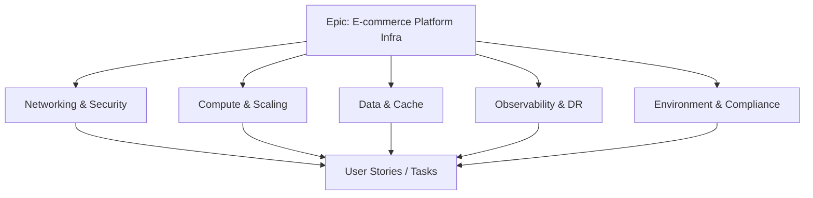

### Pipelines

| Pipeline | Trigger | Purpose |
|----------|---------|---------|
| `Infra-Validate` | PR | Validate Bicep/Terraform (what-if, plan); no deploy |
| `Infra-Deploy-Dev` | Merge to dev / manual | Deploy dev environment |
| `Infra-Deploy-Staging` | Manual + approval | Deploy staging |
| `Infra-Deploy-Prod` | Manual + approval | Deploy production; change request linked |
| `Infra-DR-Drill` | Schedule / manual | Run DR drill (failover test); document results |

**Explanation:** Pipelines automate validation and deployment. No one deploys infra by hand; every change goes through a pipeline. Validation runs on every PR to catch errors early; deploy pipelines are gated by environment (dev looser, prod strict with approval and change request). Pipeline anatomy: each pipeline has one or more stages (e.g. Validate, Deploy); stages have jobs (e.g. BicepDeploy); jobs have steps (checkout, Azure CLI or Bicep task, optional smoke). Failure in a step fails the job and (unless conditional) the stage; pipeline can be retried or fixed and re-run.

**Pipeline anatomy (typical)**

- **Stage 1: Validate (Infra-Validate)** — Job: LintAndWhatIf. Steps: checkout; Bicep build/validate; Azure CLI `az deployment sub what-if` (or Terraform plan); optional secret scan (e.g. grep for password, connection string). No deployment.
- **Stage 2: Deploy (Infra-Deploy-*)** — Job: DeployToEnv. Steps: checkout; Azure CLI or Bicep deployment task with variable group; deploy to subscription/resource group; optional post-deploy script (smoke). Approval gate (for prod) before this stage.
- **Stage 3: DR Drill (Infra-DR-Drill)** — Job: ExecuteDrill. Steps: checkout runbook or inline script; execute failover steps (e.g. switch traffic to DR); validate; execute failback; document results to artifact or Wiki.

**Failure handling (pipelines)**

- **Infra-Validate fails:** Do not merge; fix Bicep/Terraform or variable group and re-push. Common causes: syntax error, invalid reference, secret in code, what-if error (e.g. quota, naming).
- **Infra-Deploy-* fails:** Check pipeline log (resource error, permission, quota). Fix IaC or subscription and re-run. If prod was partially updated, consider rollback (re-deploy previous commit) and create incident.
- **Approval denied:** Requester updates change request or work item; re-request approval. Pipeline does not run deploy until approved.
- **Retention:** Keep pipeline run history for at least 30–90 days (configurable in project settings) for audit; artifact (e.g. drill report) retained per project retention policy.

**Detailed pipeline flow (step-by-step):**

1. **Infra-Validate (on PR)**  
   - **Trigger:** Pull request to `ecommerce-infra-bicep` (or Terraform repo). Branch policy can require this pipeline to pass before merge.  
   - **Steps:** Checkout repo → Bicep build/validate (or `terraform validate`) → Run `what-if`/`plan` against dev subscription (no apply) → Optionally check for secrets (grep or tool).  
   - **Inputs:** PR source branch; Bicep/Terraform files; variable group for dev (for what-if parameters).  
   - **Output:** Pipeline status (pass/fail); what-if output in log (reviewers use to verify change set). No deployment occurs.  
   - **Failure:** Fix lint/what-if/secret issue and re-push; do not merge until pass.

2. **Infra-Deploy-Dev**  
   - **Trigger:** Merge to `dev` branch or manual run with dev parameters.  
   - **Steps:** Checkout merged branch → Resolve dev variable group (subscription ID, resource group, prefix, SKUs) → Bicep deploy (or Terraform apply) to dev subscription/resource group. Optional: run smoke script (HTTP probe, DB connectivity).  
   - **Inputs:** Merged commit; dev variable group; Azure service connection.  
   - **Output:** Dev environment updated; pipeline run log.  
   - **Failure:** Fix IaC or subscription (quota, permissions); re-run. No approval required for dev.

3. **Infra-Deploy-Staging**  
   - **Trigger:** Manual with optional approval (e.g. Infra lead).  
   - **Steps:** Same as dev but with staging variable group and target subscription/resource group. Optional smoke or integration test.  
   - **Inputs:** Branch or commit (e.g. main or release branch); staging variable group; service connection.  
   - **Output:** Staging environment updated.  
   - **Failure:** Same as dev; optional approval does not block fix and re-run.

4. **Infra-Deploy-Prod**  
   - **Trigger:** Manual; **approval required** (e.g. Release Manager or CAB); change request must be linked (enforced in pipeline or environment approval).  
   - **Steps:** Approval gate (environment "Production") → Checkout → Prod variable group → Deploy to production subscription. Post-deploy smoke recommended.  
   - **Inputs:** Branch/commit; prod variable group; service connection; approval; change request ID or link.  
   - **Output:** Production infra updated; audit trail (approver, timestamp, CR).  
   - **Failure:** If deploy fails mid-way, rollback by re-running deploy with previous commit; create incident and post-incident review.

5. **Infra-DR-Drill**  
   - **Trigger:** Schedule (e.g. quarterly) or manual.  
   - **Steps:** Checkout runbook or use inline script; execute DR runbook steps (e.g. failover to DR region, validate health, fail back); record start/end time and result; publish drill report to artifact or Wiki.  
   - **Inputs:** Runbook (from repo or Wiki); DR subscription/region; service connection.  
   - **Output:** Drill report (pass/fail, duration, findings); runbook updated if steps changed.  
   - **Failure:** Document in report; update runbook; schedule re-drill if critical.

**Pipeline flow**

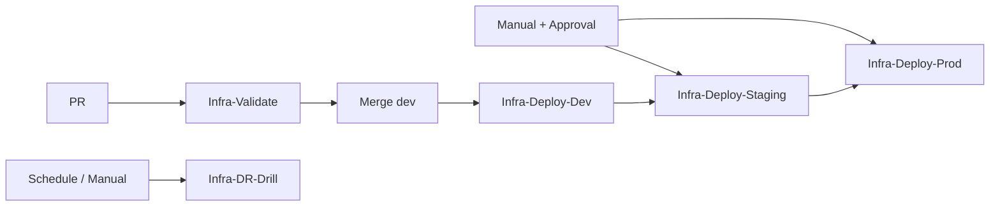

### Environments

| Environment | Use |
|-------------|-----|
| **Dev** | Day-to-day development; low cost |
| **Staging** | Pre-production; mirror prod config |
| **Production** | Live e-commerce; strict approvals |
| **DR** | Disaster recovery region; used in drills and real failover |

**Explanation:** Environments in Azure DevOps represent deployment targets and carry approval and protection rules. Dev is for daily changes with minimal gates; staging mirrors production for pre-release validation; production has strict approvals; DR is used only for drills or real failover. Pipeline stages target these environments so that promotions are explicit and auditable. Each environment can have: **Approvals** (user or group must approve before deploy); **Checks** (e.g. "Change request must be linked"); **Protection** (e.g. limit who can approve or deploy).

**Approval configuration (recommended)**

- **Dev:** No approval; optional check "Pipeline must have passed Infra-Validate on PR." Allows fast iteration.
- **Staging:** Optional approval (e.g. Infra lead) if org policy requires; or no approval. Optional check: "Branch must be main or release/*."
- **Production:** **Mandatory approval** (e.g. CAB, Release Manager). Check: "Work item or change request must be linked" (if supported). Ensures no prod deploy without review and CR.
- **DR:** **Mandatory approval** (e.g. Infra lead) for Infra-DR-Drill to production DR; prevents accidental drill. Optional: separate environment "DR-Drill" with approval vs "DR-Prod" for real failover only.

**Checks and protection**

- **Checks:** Invoke a logic or policy before deploy (e.g. "Change request approved in ITSM"). Can be custom (REST API) or out-of-box (approval, branch control).
- **Protection:** Use Azure DevOps permissions: "Approvers" role on Production environment for CAB only; "User" or "Reader" for others so they cannot approve. Limit "Queue build" to Infra/Release so only authorized users run prod deploy.

**Detailed environment flow (step-by-step):**

1. **Dev** — Used for all initial deploys and experiments. Typically no approval; pipeline can run on merge to `dev` or manual. Low-cost SKUs (e.g. B1, small Redis) and single region to save cost. **Inputs:** Merged dev branch or manual run. **Outputs:** Dev subscription/resource group updated. **Failure:** Fix and re-run; no approval gate to slow down.

2. **Staging** — After dev is validated, the same Bicep/Terraform is deployed to staging with staging parameters (production-like SKUs, same topology, possibly same region as prod but different resource group). Manual trigger or approval optional. Used for smoke tests and integration tests before production. **Inputs:** Branch (e.g. main); staging variable group; optional approval. **Outputs:** Staging environment updated. **Failure:** Fix IaC or config; re-run. Staging should mirror prod so issues are caught here.

3. **Production** — Deploy only after staging sign-off. **Approval required** (e.g. CAB); change request linked. Same IaC, prod variable group. Post-deploy smoke and monitoring checks. **Inputs:** Branch/commit; prod variable group; approval; change request. **Outputs:** Production subscription updated; audit trail. **Failure:** Rollback (re-deploy previous) if needed; incident and PIR. Production is protected; only authorized approvers and pipeline identity can deploy.

4. **DR** — Separate region (and possibly subscription). Used by `Infra-DR-Drill` pipeline and real failover runbook. Not used for normal feature deploys; only for DR drills and disaster recovery. **Inputs:** Runbook; DR subscription/region; approval for drill. **Outputs:** Drill report; DR region validated. **Failure:** Document in report; update runbook; no impact on prod if drill-only.

5. **Promotion path:** Code merge → Dev (auto or manual) → Staging (manual + optional approval) → Production (manual + mandatory approval). DR is independent (drill or failover only). No skip: do not deploy to prod without going through staging unless emergency (document and post-incident review).

**Environment promotion flow**

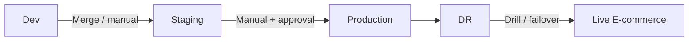

---

## 3. End-to-End Project Flow

```
[Infrastructure Change Request]
        │
        ▼
┌─────────────────────────────────────────────────────────────────┐
│ Boards: Epic → Feature → User Story → Task                        │
│ Branch: feature/<name> in ecommerce-infra-bicep                   │
└─────────────────────────────────────────────────────────────────┘
        │
        ▼
┌───────────────────┐     ┌─────────────────────┐
│ Infra-Validate    │────▶│ Lint, what-if, plan │
│ (on PR)           │     │ No secrets in code   │
└───────────────────┘     └──────────┬──────────┘
                                      │
                                      ▼
                        ┌────────────────────────┐
                        │ Code Review → Merge    │
                        │ Trigger env-specific   │
                        │ deploy pipeline        │
                        └────────────┬───────────┘
                                     │
        ┌────────────────────────────┼────────────────────────────┐
        ▼                            ▼                            ▼
┌───────────────┐          ┌─────────────────┐          ┌─────────────────┐
│ Infra-Deploy  │          │ Infra-Deploy     │          │ Infra-Deploy     │
│ Dev           │          │ Staging          │          │ Prod             │
│ (auto/manual) │          │ (approval)       │          │ (CAB + approval) │
└───────────────┘          └─────────────────┘          └─────────────────┘
        │                            │                            │
        └────────────────────────────┼────────────────────────────┘
                                      ▼
                        ┌────────────────────────┐
                        │ Post-deploy validation  │
                        │ Smoke tests; DR drill   │
                        │ Runbooks updated        │
                        └────────────────────────┘
```

**End-to-end flow (Mermaid)**

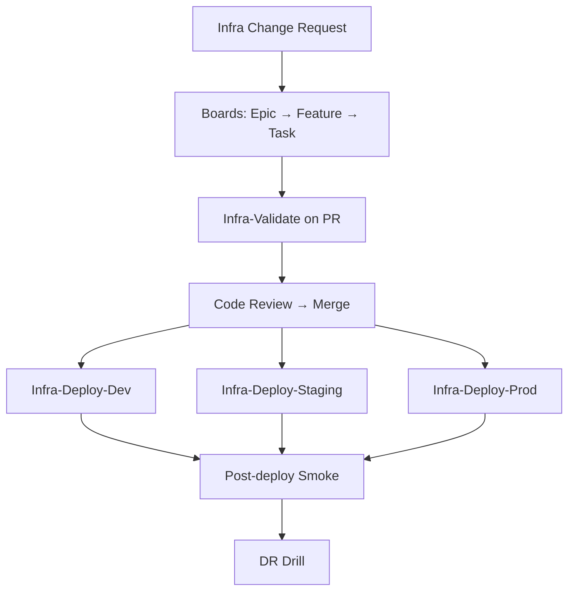

**Detailed end-to-end flow (step-by-step):**

1. **Request** — Business or technical need (e.g. add Redis, new subnet, WAF rule). Captured as User Story or Task in Boards under the right Feature and Epic.
2. **Plan** — Owner creates branch in `ecommerce-infra-bicep`, implements changes (modules, parameters). For production, a change request is created and linked.
3. **Validate** — Open PR → `Infra-Validate` runs (lint, what-if/plan). Fix any failures; get code review.
4. **Merge** — Merge to `dev` (or target branch). Triggers or enables deploy to Dev.
5. **Deploy Dev** — Run `Infra-Deploy-Dev` (auto on merge or manual). Verify resources in Azure portal or via smoke script.
6. **Deploy Staging** — When ready, run `Infra-Deploy-Staging` with approval if configured. Run smoke/integration tests.
7. **Deploy Production** — Request approval (CAB/Release Manager); link CR. Run `Infra-Deploy-Prod`. Post-deploy smoke and monitoring.
8. **Verify** — Confirm health (App Insights, Log Analytics, endpoint checks). Update runbooks if procedure changed. Close work item and CR.
9. **DR** — Periodically run `Infra-DR-Drill`; update DR runbook; document results for compliance.

---

## 4. Key Deliverables & Acceptance Criteria

| Deliverable | Acceptance Criteria |
|-------------|----------------------|
| IaC codebase | All environments deployable from repo; no manual resource creation for scope |
| Auto-scaling | Rules and runbooks for peak (e.g., Black Friday); tested in staging |
| High availability | Multi-AZ/region where required; RTO/RPO documented |
| Security baseline | WAF, private endpoints, Key Vault; scans in pipeline |
| DR runbook | Failover steps automated or documented; drill run quarterly |
| Compliance | PCI-DSS controls documented and automated where applicable |

**Deliverables flow**

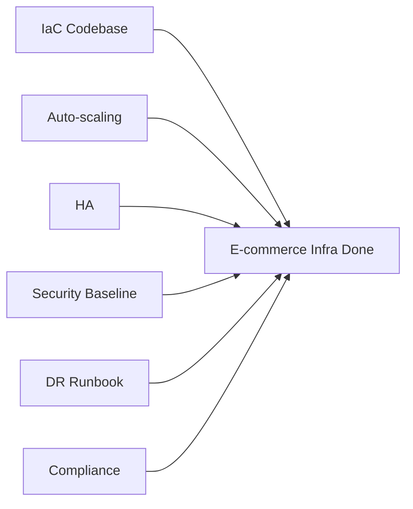

**Explanation:** Deliverables are the concrete outputs that define "done" for the project. Each has clear acceptance criteria so the team and stakeholders agree when a deliverable is complete. They feed into audit, operations, and future changes.

**Detailed deliverables flow (how each is produced):**

1. **IaC codebase** — Produced by implementing Bicep/Terraform in repo; acceptance: all envs deployable from repo, no manual resource creation for in-scope components. Verified by pipeline runs and peer review.
2. **Auto-scaling** — Defined in Bicep (e.g. AKS HPA, App Service scale rules) and/or runbooks for manual scale-out before peak. Acceptance: rules in place; tested in staging; runbook executed at least once in drill.
3. **High availability** — Multi-AZ/region where required; RTO/RPO documented. Acceptance: architecture doc and runbook; DR drill completed.
4. **Security baseline** — WAF, private endpoints, Key Vault; scans in pipeline. Acceptance: security review and scan results; no critical findings unaddressed.
5. **DR runbook** — Written in `ecommerce-runbooks`; steps for failover and failback. Acceptance: runbook versioned; drill run quarterly; results documented.
6. **Compliance** — PCI-DSS (if applicable): controls documented, evidence automated where possible. Acceptance: control list and evidence pack; exceptions documented.

---

## 5. Phases & Timeline (Example)

| Phase | Duration | Focus |
|-------|----------|--------|
| **Phase 1: Foundation** | 6–8 weeks | VNet, compute, DB, cache in IaC; dev and staging deploy pipelines |
| **Phase 2: Production & HA** | 4–6 weeks | Prod pipeline with approvals; HA and scaling; monitoring |
| **Phase 3: Security & DR** | 4 weeks | WAF, secrets, DR region, DR drill pipeline |
| **Phase 4: Steady State** | Ongoing | Capacity reviews, runbook updates, compliance evidence |

**Phases timeline flow**

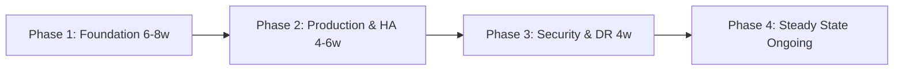

**Explanation:** Phases break the project into ordered stages so that foundation is built first, then production and HA, then security and DR, then steady state. Each phase has a duration and focus; timelines are examples and should be adjusted to org capacity.

**Detailed phase flow (what happens in each phase):**

1. **Phase 1: Foundation (6–8 weeks)** — Set up repos and branch strategy; implement core Bicep modules (VNet, compute, DB, cache); wire `Infra-Validate` and `Infra-Deploy-Dev`/`-Staging`. Outcome: dev and staging deployable from code; team can iterate safely.
2. **Phase 2: Production & HA (4–6 weeks)** — Add production pipeline with approval gate and change request link; implement HA (multi-AZ, replicas) and scaling; connect monitoring (App Insights, Log Analytics). Outcome: production deployable via pipeline; monitoring in place.
3. **Phase 3: Security & DR (4 weeks)** — Harden security (WAF, private endpoints, Key Vault); add DR region and failover runbook; implement `Infra-DR-Drill` pipeline; run first DR drill. Outcome: security baseline and DR procedure tested.
4. **Phase 4: Steady State (Ongoing)** — Regular capacity reviews; runbook updates; compliance evidence collection; quarterly DR drills. Outcome: infra maintained and improved continuously; audit-ready.

---

## 6. Azure DevOps Artifacts & Links

- **Wiki:** Architecture diagrams, runbooks, capacity planning, PCI scope
- **Service connections:** Azure (subscriptions for dev/staging/prod)
- **Variable groups:** Per environment (prefix, SKUs, regions); secrets in Key Vault
- **Permissions:** Platform/Infra team (Build/Release Admin); App teams (consume envs only)

**Artifacts & links flow**

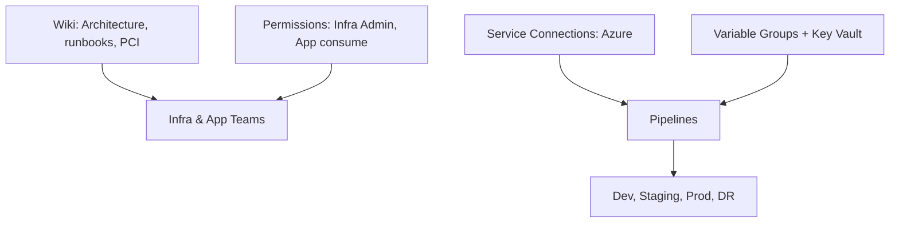

**Explanation:** Artifacts and links are the wiring that make pipelines and governance work. The Wiki holds architecture and runbooks; service connections let pipelines deploy to Azure; variable groups supply environment-specific values (secrets from Key Vault); permissions ensure only the right roles can approve prod or edit pipelines.

**Detailed artifacts flow (how they connect):**

1. **Wiki** — Single place for architecture diagrams, runbooks (or links to runbook repo), capacity planning, and PCI scope. Updated when infra or process changes. Pipelines or runbooks may reference Wiki URLs in notifications.
2. **Service connections** — Azure resource manager connection(s) to dev/staging/prod subscriptions. Pipelines use these to run Bicep/Terraform and deploy. Connection is scoped to the project or org; least privilege (e.g. contributor only on target subscription).
3. **Variable groups** — One per environment (e.g. `ecommerce-dev`, `ecommerce-prod`). Hold resource group names, prefixes, SKUs, regions. Link to Azure Key Vault for secrets (e.g. DB connection strings if ever needed in pipeline). Pipelines reference variable groups by name.
4. **Permissions** — Infra/Platform team: Build and Release admin (edit and run pipelines). App teams: consume environments only (e.g. deploy app to existing AKS); no edit to infra repos or prod approval. Approvers: release managers or CAB with "Approver" on Production environment.
5. **Environments** — Dev, Staging, Production, DR defined in Azure DevOps with optional approval and checks. Pipelines deploy to these; approval gates block prod until an approver approves and (if required) change request is linked.

---

## 7. End-to-End Flow (Complete)

### 7.1 Flow Phases (Trigger → Closure)

| Phase | Name | Description |
|-------|------|-------------|
| 0 | **Prerequisites** | Infra repo (Bicep); pipelines (validate, deploy per env); service connections; envs (Dev, Staging, Prod, DR). |
| 1 | **Trigger** | PR to ecommerce-infra-bicep (change request or feature); or scheduled DR drill. |
| 2 | **Triage / Plan** | Assign reviewer; link to Epic/Feature; confirm env (dev/staging/prod); change request for prod. |
| 3 | **Build / Execute** | Infra-Validate (what-if, lint) on PR; Infra-Deploy-* pipeline on merge or manual. |
| 4 | **Validate** | What-if review; post-deploy smoke (health endpoints, DB connectivity); DR drill run. |
| 5 | **Approve** | Code review for PR; CAB/approval for Prod and DR deploy. |
| 6 | **Release** | Infra-Deploy-Dev/Staging/Prod or Infra-DR-Drill; resources updated. |
| 7 | **Verify / Operate** | Monitoring and alerts; capacity review; runbook updated if needed. |
| 8 | **Close / Document** | Work item closed; change log; Wiki/runbook updated. |
| — | **Feedback** | Alerts → incident/backlog; DR drill findings → runbook; capacity → scaling backlog. |

**Complete flow phases diagram**

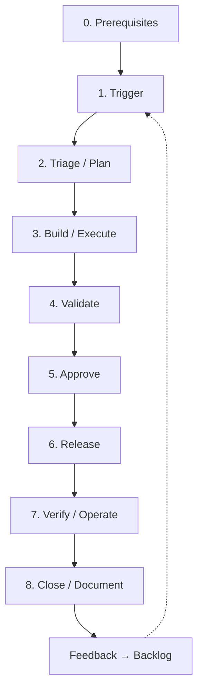

**Explanation (complete flow):** The complete flow runs from prerequisites through trigger, triage, build, validate, approve, release, verify, and close, with feedback feeding back into new work. Every infra change should pass through these phases so nothing is deployed without validation and approval where required.

**Detailed complete flow (step-by-step):**

1. **Prerequisites** — Repos exist; service connections and variable groups configured; environments (Dev, Staging, Prod, DR) created with approval on Prod; permissions set. Without these, pipelines cannot run or deploy.
2. **Trigger** — PR to infra repo or manual run of a deploy pipeline. Trigger creates a pipeline run and (for PR) starts validation.
3. **Triage/Plan** — Reviewer assigned; work item linked; for prod, change request created and linked. Ensures scope and approval path are clear.
4. **Build/Execute** — For PR: Infra-Validate runs (lint, what-if). For deploy: Infra-Deploy-* runs with selected environment parameters. Output is pipeline log and Azure resource changes.
5. **Validate** — What-if reviewed for PR; for deploy, post-deploy smoke (e.g. HTTP probe, DB connectivity). Failure stops promotion.
6. **Approve** — Code review for PR; for production deploy, CAB or Release Manager approves; change request in approved state. If denied, work returns to requester.
7. **Release** — Merge (for dev) or approval (for prod) triggers or allows the deploy step. Pipeline deploys Bicep/Terraform to target environment. Output: deploy log and audit trail.
8. **Verify/Operate** — Monitoring and runbooks used to confirm health. If regression, rollback (re-deploy previous commit) or hotfix. Runbooks updated if needed.
9. **Close/Document** — Work item and change request closed; Wiki or runbook updated. Evidence (pipeline run, what-if) retained for audit.
10. **Feedback** — Alerts create incidents or backlog items; DR drill findings update runbook; capacity reviews create optimization backlog. These feed new work items and thus new triggers.

### 7.2 Roles & Responsibilities (RACI)

| Role | R | A | C | I |
|------|---|---|---|---|
| Infra/Platform Engineer | Implement IaC; run pipelines; maintain runbooks | Infra correctness | Security, App teams | Stakeholders |
| Change Requester | Submit change; provide details | — | — | On approval status |
| CAB / Approver | — | Approve prod/DR deploy | — | Change calendar |
| App Team | Consume envs; report issues | — | — | On env availability |

### 7.3 Per-Phase Detail

| Phase | Trigger | Inputs | Actions | Outputs | Success criteria | Failure path |
|-------|---------|-------|--------|--------|------------------|--------------|
| **Trigger** | PR or manual run | Branch, or env choice | Create work item; start Infra-Validate or Infra-Deploy | Work item; pipeline run | Pipeline triggered | Fix branch/params |
| **Triage** | New PR or request | Work item | Assign reviewer; set target env; link CR for prod | Assigned; CR linked | Ready for build | Reject invalid |
| **Build** | PR or run | Bicep, params | Infra-Validate (what-if); or Infra-Deploy-* | Plan or deploy result | No errors; resources updated | Fix Bicep; re-run |
| **Validate** | Deploy or drill | Resources | Smoke tests; DR drill steps | Test result | Smoke green; drill completed | Fix config; re-deploy or re-drill |
| **Approve** | Validation pass | CR, what-if | Code review; CAB for prod | Approval | Approved | Address feedback; re-submit |
| **Release** | Approval (prod) or merge (dev) | Pipeline | Infra-Deploy-* or Infra-DR-Drill | Deploy log; audit trail | Deploy succeeded | Rollback (re-deploy previous); incident if needed |
| **Verify** | Post-deploy | Monitoring | Check alerts; capacity; runbook | Updated runbook if needed | No regression | Rollback or hotfix |
| **Close** | Verify OK | All above | Close work item; update Wiki | Closed item; docs | Done | Reopen if issue |

### 7.4 Decision Points & Approval Gates

| Gate | When | Who | Condition to proceed | If denied |
|------|------|-----|----------------------|-----------|
| **Prod deploy** | Before Infra-Deploy-Prod | CAB | Change request approved; what-if reviewed | Do not run; requester updates CR |
| **DR drill** | Before Infra-DR-Drill (prod DR) | Infra Lead | Drill plan reviewed; rollback clear | Postpone; update plan |
| **PR merge** | After Infra-Validate pass | Infra Engineer | What-if and lint OK | PR feedback; fix and re-push |

**Decision points flow**

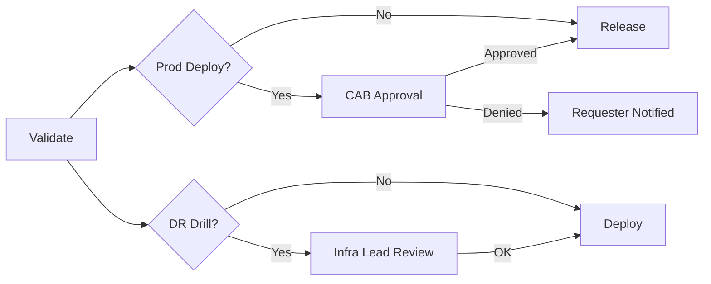

### 7.5 Rollback & Escalation

- **Rollback:** Re-run Infra-Deploy with previous commit (Bicep state) to restore prior resource state; document in runbook. For failed DR drill: no production impact; document findings.
- **Escalation:** Deploy failure → Infra Lead; production incident → On-call + CAB; capacity/performance → Backlog and architecture review.

### 7.6 Feedback Loops

- **Monitoring alerts** → Incident or backlog item; runbook updated if new scenario.
- **DR drill results** → Runbook and pipeline updated; next drill date set.
- **Capacity review** → Scaling and cost backlog; IaC updated for peak if needed.

### 7.7 Prerequisites (Before Starting)

- Repo ecommerce-infra-bicep with modules (network, compute, data, security); branch policies (PR + Infra-Validate).
- Pipelines: Infra-Validate, Infra-Deploy-Dev/Staging/Prod, Infra-DR-Drill; environments with approvals on Prod/DR.
- Service connections to Azure subscriptions (dev/staging/prod); variable groups and Key Vault.
- Runbooks: deploy, rollback, DR, peak scaling; Wiki with architecture and PCI scope.
- Permissions: Infra (Build/Release Admin); App teams (use envs only).

### 7.8 Definition of Done (Overall)

- Infra change: Bicep merged; pipeline deployed to target env; smoke passed; change request closed; runbook/Wiki updated if needed.
- DR drill: Drill run; results documented; runbook updated; next drill scheduled.
