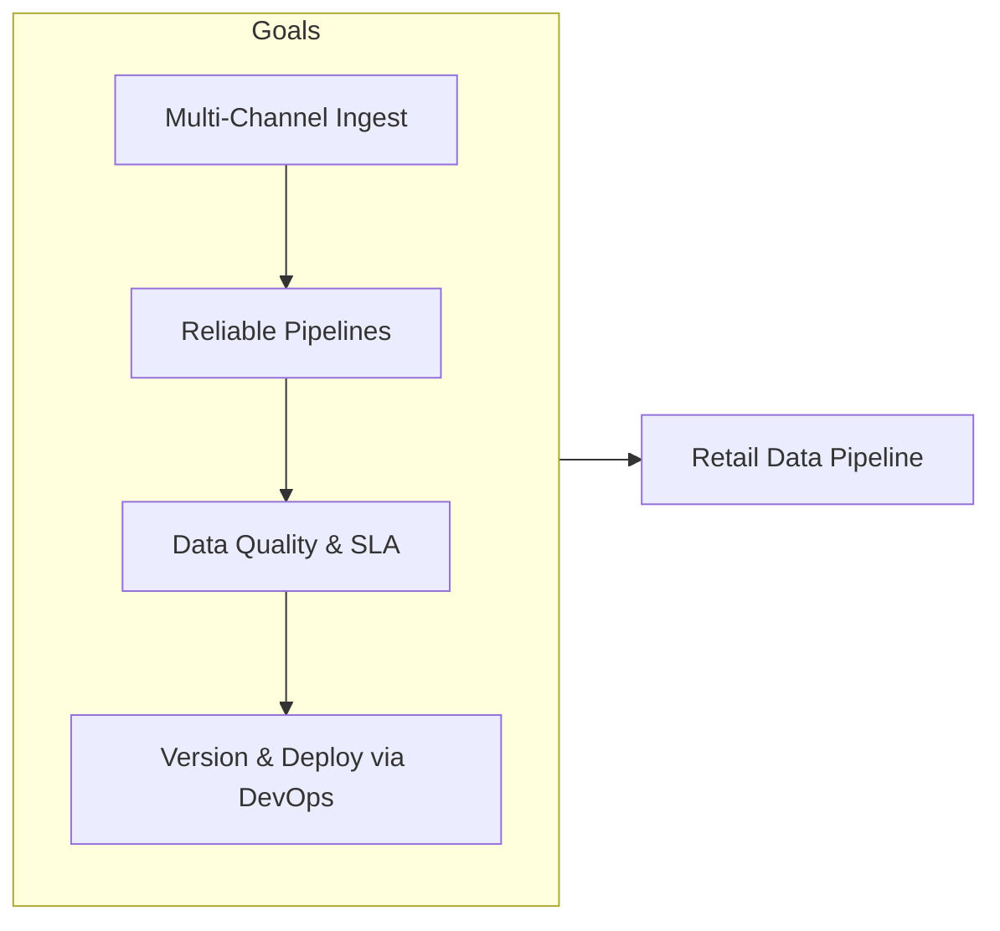
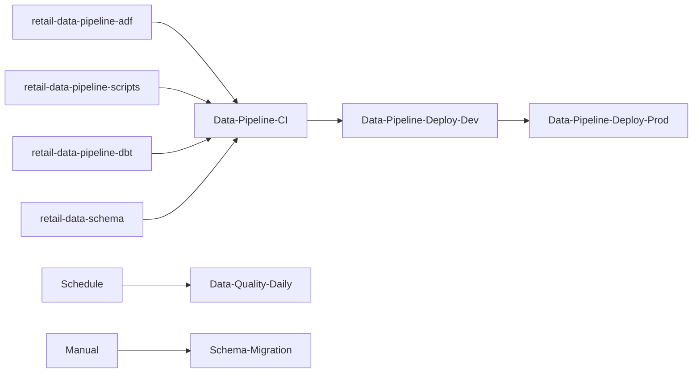
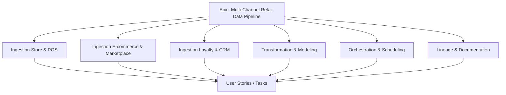
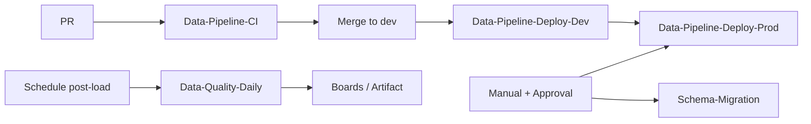
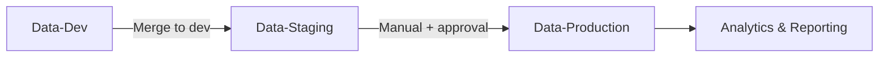
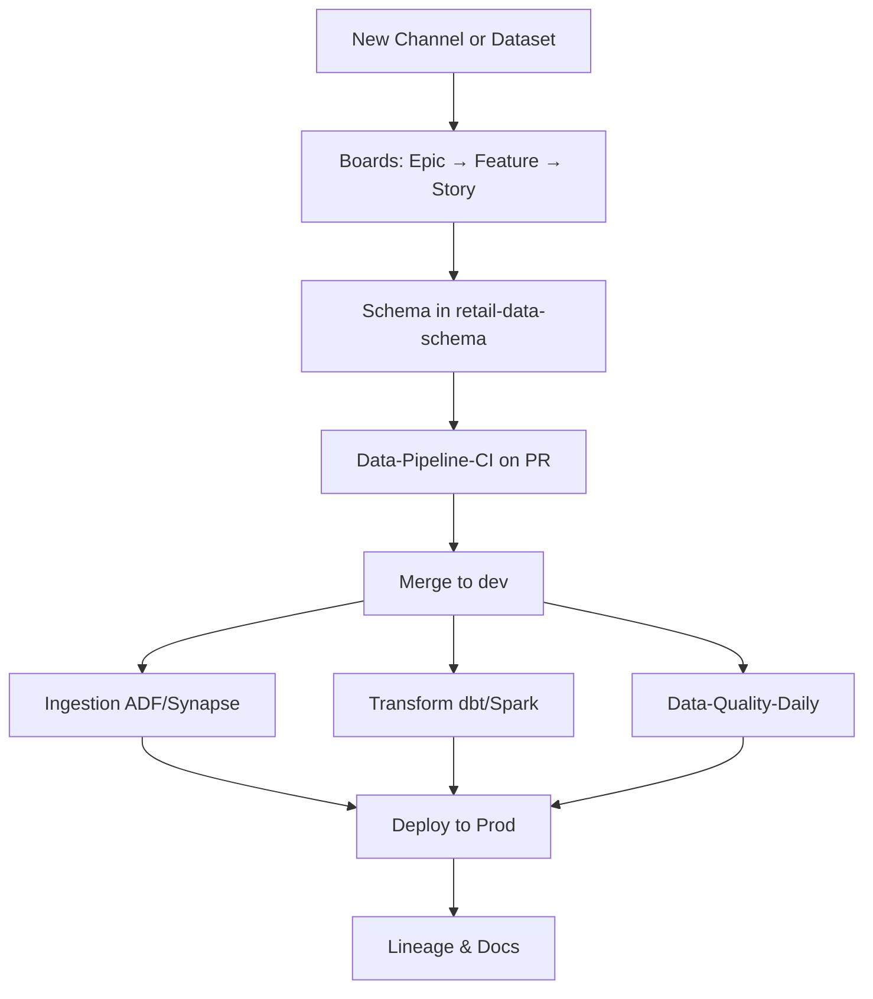
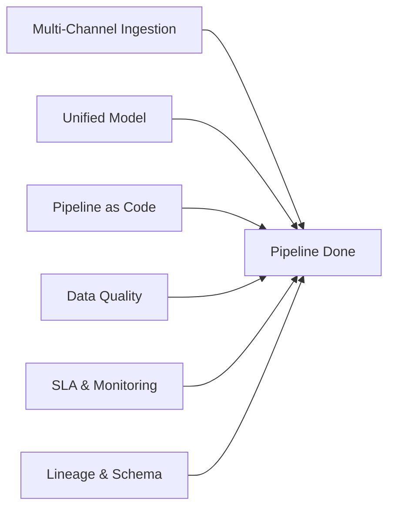
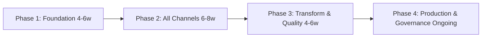
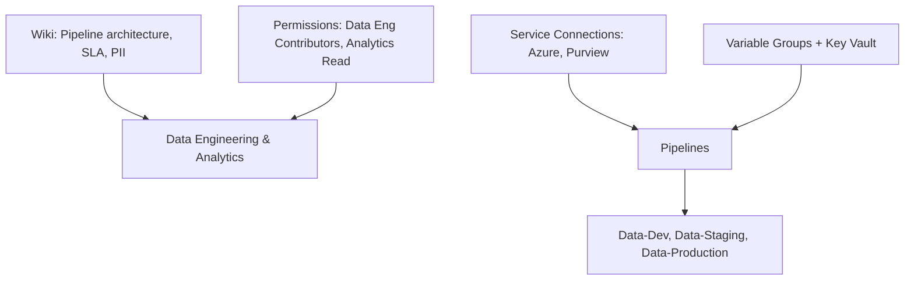

# Multi-Channel Retail Data Pipeline

## Azure DevOps Project Overview

| Attribute | Value |
|-----------|--------|
| **Project Type** | Data Engineering, ETL/ELT, Retail Analytics |
| **Organization** | Azure DevOps Org |
| **Area Path** | Retail / Data Pipeline |
| **Iteration** | Sprint-based (2 weeks) |

**What this project is:** This Azure DevOps project owns the **multi-channel retail data pipeline**: ingesting data from stores, e-commerce, marketplace, and loyalty into a central data lake/warehouse; transforming and modeling (dbt/Spark); ensuring data quality and SLA; and deploying pipeline code (ADF/Synapse, scripts) via Azure DevOps. Work is tracked in Boards under Retail/Data Pipeline; pipelines run CI, deploy to Data-Dev/Staging/Production, and run data quality checks.

---

## 1. Project Objectives

**Explanation:** Objectives define why the pipeline exists: multi-channel ingestion, reliable and scalable pipelines, data quality and SLA, versioned and deployable pipeline code, and incremental loads with failure handling. Each goal drives Features (ingestion per channel, transformation, orchestration, lineage) and pipelines (Data-Pipeline-CI, Deploy-Dev/Prod, Data-Quality-Daily).

**Detailed objectives flow (how goals connect):**

1. **Multi-channel ingest** → Features per channel (Store/POS, E-commerce/Marketplace, Loyalty/CRM); ADF/Synapse pipelines and scripts in repos. Outcome: all channels ingesting on schedule.
2. **Reliable, scalable pipelines** → Orchestration in ADF/Synapse; dependency order; retries; Data-Pipeline-Deploy-Dev/Prod. Outcome: pipelines in code; deployable and repeatable.
3. **Data quality and SLA** → Data-Quality-Daily pipeline; rules and quarantine; SLA monitoring. Outcome: quality checks and SLA visible; failures create work items or alerts.
4. **Version and deploy via DevOps** → Pipeline code in repos; Data-Pipeline-CI on PR; Deploy-Dev/Prod with approval on prod. Outcome: changes auditable and deployable.
5. **Incremental loads and failure handling** → Incremental load design in scripts/ADF; error handling and alerting; Schema-Migration pipeline for controlled DDL. Outcome: idempotent loads; failures handled and reported.

**Objectives flow**

- Ingest data from multiple retail channels (e.g., stores, e-commerce, marketplace, loyalty)
- Build reliable, scalable data pipelines (batch and/or streaming) into a central data lake/warehouse
- Ensure data quality, lineage, and SLA for downstream analytics and reporting
- Version and deploy pipeline code (SQL, PySpark, ADF/Synapse, etc.) via Azure DevOps
- Support incremental loads, idempotency, and failure handling with alerting

**Objectives flow**



---

## 2. Azure DevOps Structure

### Repositories

| Repo | Purpose |
|------|---------|
| `retail-data-pipeline-adf` | Azure Data Factory / Synapse pipelines (JSON or Git-backed) |
| `retail-data-pipeline-scripts` | Python/SQL scripts for transforms, quality checks |
| `retail-data-pipeline-dbt` | dbt models (if used) for warehouse layer |
| `retail-data-schema` | Schema definitions, contracts, migration scripts |

**Explanation:** Repos hold ADF/Synapse pipeline definitions, transform scripts (Python/SQL), dbt models, and schema definitions. Pipelines validate and deploy these to Data Factory/Synapse; data quality scripts run post-load. All pipeline and schema changes are versioned and deployable via Azure DevOps.

**Detailed repository flow (step-by-step):**

1. **retail-data-pipeline-adf** — ADF/Synapse pipeline JSON (or Git-backed). PR triggers Data-Pipeline-CI (validate JSON, lint). Merge to dev triggers Data-Pipeline-Deploy-Dev; manual + approval triggers Deploy-Prod. Outcome: pipelines deployed to Data Factory/Synapse.
2. **retail-data-pipeline-scripts** — Python/SQL for transforms and quality checks. CI runs lint and tests; deploy includes scripts in artifact or Synapse. Outcome: scripts versioned and deployed.
3. **retail-data-pipeline-dbt** — dbt models for warehouse layer. CI runs dbt compile/test; deploy runs dbt run in target. Outcome: models deployed and lineage in dbt.
4. **retail-data-schema** — Schema definitions and migration scripts. Schema-Migration pipeline runs DDL in controlled order (dev → staging → prod). Outcome: schema changes versioned and repeatable.
5. **Flow:** Change in repo → PR → Data-Pipeline-CI → Merge → Deploy-Dev → validate → Deploy-Prod (with approval). Data-Quality-Daily runs on schedule post-load.

**Repository flow**



### Boards (Work Item Hierarchy)

```
Epic: Multi-Channel Retail Data Pipeline
├── Feature: Ingestion – Store & POS
│   ├── User Story: Ingest store transactions, inventory, returns
│   └── Task: Incremental load; deduplication; error handling
├── Feature: Ingestion – E-commerce & Marketplace
│   ├── User Story: Ingest orders, clicks, catalog from e-commerce and marketplaces
│   └── Task: API/source-specific adapters; rate limiting
├── Feature: Ingestion – Loyalty & CRM
│   ├── User Story: Ingest loyalty and CRM data; PII handling
│   └── Task: Masking, consent flags in pipeline
├── Feature: Transformation & Modeling
│   ├── User Story: Unified product, customer, transaction dimensions/facts
│   ├── User Story: Data quality rules and quarantine
│   └── Task: dbt/Spark jobs; unit tests
├── Feature: Orchestration & Scheduling
│   ├── User Story: ADF/Synapse orchestration; dependency order; retries
│   └── Task: SLA monitoring and alerting
└── Feature: Lineage & Documentation
    ├── User Story: Lineage in Purview or custom; pipeline docs in Wiki
    └── Task: Schema registry and change process
```

**Explanation:** Boards organize pipeline work by channel and capability. Epic is the container; Features group ingestion (per channel), transformation, orchestration, and lineage. User Stories and Tasks are created for new channels, new models, or quality/orchestration improvements. Work flows from backlog → active → closed; data quality failures can create Tasks.

**Detailed board flow (step-by-step):**

1. **New channel or dataset** — Create User Story under appropriate Feature (e.g. Ingestion – E-commerce). Define schema and contract in retail-data-schema. Link to Epic.
2. **Development** — Implement ADF/Synapse pipeline and/or scripts in branch; open PR. Data-Pipeline-CI runs. Reviewer approves; merge to dev.
3. **Deploy Dev** — Data-Pipeline-Deploy-Dev runs; pipelines and scripts deployed to dev Data Factory/Synapse. Validate with sample/synthetic data.
4. **Deploy Prod** — When ready, request approval; run Data-Pipeline-Deploy-Prod. Link change request. Post-deploy: Data-Quality-Daily runs; failures create or update Tasks.
5. **Schema change** — Create Task; add migration script to retail-data-schema. Schema-Migration pipeline runs in order. Close when applied and documented.
6. **Lineage** — Update Purview or Wiki with pipeline docs. Close work item when deliverable is done.

**Board hierarchy flow**



### Pipelines

| Pipeline | Trigger | Purpose |
|----------|---------|---------|
| `Data-Pipeline-CI` | PR | Validate ADF/Synapse JSON; run script lint/tests |
| `Data-Pipeline-Deploy-Dev` | Merge to dev | Deploy ADF/Synapse + scripts to dev data factory/synapse |
| `Data-Pipeline-Deploy-Prod` | Manual + approval | Deploy to prod; link to change request |
| `Data-Quality-Daily` | Schedule (post-load) | Run data quality checks; publish results to artifact/Boards |
| `Schema-Migration` | Manual | Run schema migrations (e.g., new columns) in controlled order |

**Pipeline flow**



**Explanation:** Pipelines automate validation, deployment, data quality, and schema migration. Data-Pipeline-CI runs on every PR; Deploy-Dev/Prod deploy to Data Factory/Synapse; Data-Quality-Daily runs post-load and publishes results; Schema-Migration runs in controlled order. No manual deploy of pipeline code to production.

**Detailed pipeline flow (step-by-step):**

1. **Data-Pipeline-CI (on PR)** — Trigger: PR to pipeline or scripts repo. Steps: Validate ADF/Synapse JSON; run script lint and unit tests. Output: pass/fail. No deploy.
2. **Data-Pipeline-Deploy-Dev** — Trigger: merge to dev. Steps: Deploy ADF/Synapse pipelines and scripts to dev Data Factory/Synapse. Output: dev pipelines updated.
3. **Data-Pipeline-Deploy-Prod** — Trigger: manual + approval. Steps: Deploy to prod Data Factory/Synapse; link change request. Output: prod pipelines updated; audit trail.
4. **Data-Quality-Daily** — Trigger: schedule (e.g. after load). Steps: Run data quality rules; compare to baseline; publish results to artifact or Boards; optionally create Tasks for failures. Output: quality report; Board updated.
5. **Schema-Migration** — Trigger: manual. Steps: Run schema migration scripts in order (dev → staging → prod). Output: schema updated; log retained.

**Pipeline flow**

| Environment | Use |
|-------------|-----|
| **Data-Dev** | Develop and test new pipelines; sample/synthetic data |
| **Data-Staging** | Pre-production; full or sampled production-like data |
| **Data-Production** | Live pipelines; production data factory/synapse and warehouse |

**Environment promotion flow**



**Explanation:** Data-Dev is for developing and testing new pipelines with sample/synthetic data. Data-Staging uses full or sampled production-like data for pre-production validation. Data-Production is the live Data Factory/Synapse and warehouse; deploy only with approval. Promotion path: merge to dev → Deploy-Dev → validate → Deploy-Prod (with approval).

**Detailed environment flow (step-by-step):**

1. **Data-Dev** — Develop new pipelines and scripts; test with sample/synthetic data. Deploy-Dev targets here. Safe to fail.
2. **Data-Staging** — Pre-production; full or sampled production-like data. Validate pipeline and quality before prod. Optional approval before deploy.
3. **Data-Production** — Live pipelines and warehouse. Deploy-Prod requires approval and change request. Data-Quality-Daily runs against prod; results feed dashboard and Boards.
4. **Promotion path:** Code merge to dev → Deploy-Dev → validate → Deploy-Prod (manual + approval). Schema-Migration follows same order.

**Environment flow**

```
[New Channel or New Dataset]
        │
        ▼
┌─────────────────────────────────────────────────────────────────┐
│ Boards: Epic → Feature (per channel/model) → User Story → Task   │
│ Schema and contract defined in retail-data-schema                 │
└─────────────────────────────────────────────────────────────────┘
        │
        ▼
┌───────────────────┐     ┌─────────────────────┐
│ Data-Pipeline-CI   │────▶│ Validate ADF/       │
│ (on PR)            │     │ scripts; unit tests  │
└───────────────────┘     └──────────┬──────────┘
                                      │
                                      ▼
                        ┌────────────────────────┐
                        │ Merge to dev           │
                        │ Data-Pipeline-Deploy-  │
                        │ Dev                    │
                        └────────────┬───────────┘
                                     │
        ┌────────────────────────────┼────────────────────────────┐
        ▼                            ▼                            ▼
┌───────────────┐          ┌─────────────────┐          ┌─────────────────┐
│ Ingestion     │          │ Transform       │          │ Data Quality    │
│ (ADF/Synapse) │          │ (dbt/Spark)     │          │ (Daily pipeline) │
│ runs on       │          │ runs on schedule│          │ → Alerts/Boards  │
│ schedule      │          │ or trigger      │          │                 │
└───────────────┘          └─────────────────┘          └─────────────────┘
        │                            │                            │
        └────────────────────────────┼────────────────────────────┘
                                      ▼
                        ┌────────────────────────┐
                        │ Deploy to Prod          │
                        │ (approval); monitor SLA │
                        │ Lineage & docs updated  │
                        └────────────────────────┘
```

**End-to-end flow (Mermaid)**



**Detailed end-to-end flow (step-by-step):**

1. **Request** — New channel or new dataset. Create User Story in Boards; define schema and contract in retail-data-schema.
2. **Develop** — Implement ingestion and/or transform in ADF/Synapse and scripts; open PR. Data-Pipeline-CI runs (validate, lint, test).
3. **Merge to dev** — Data-Pipeline-Deploy-Dev runs; pipelines and scripts deployed to dev. Validate with sample data.
4. **Ingestion and transform** — Pipelines run on schedule (ADF/Synapse); dbt/Spark jobs run after ingestion. Data-Quality-Daily runs post-load.
5. **Deploy Prod** — When validated, request approval; run Data-Pipeline-Deploy-Prod. Link change request. Post-deploy: monitor SLA and quality.
6. **Lineage and docs** — Update Purview or Wiki with pipeline docs and lineage. Close work item.

---

## 4. Key Deliverables & Acceptance Criteria

| Deliverable | Acceptance Criteria |
|-------------|----------------------|
| Multi-channel ingestion | All defined channels (store, e-commerce, marketplace, loyalty) ingesting on schedule |
| Unified model | Dimensions/facts available in warehouse for reporting; documented in Wiki/schema repo |
| Pipeline as code | ADF/Synapse and scripts in repo; deployable via Azure DevOps |
| Data quality | Automated checks; failures create work items or alerts; quarantine process |
| SLA & monitoring | Pipeline run status, latency, row counts in dashboard; alerts on failure |
| Lineage & schema | Lineage visible (Purview or doc); schema changes versioned and migration repeatable |

**Deliverables flow**



**Explanation:** Deliverables are the concrete outputs: multi-channel ingestion, unified model, pipeline as code, data quality, SLA and monitoring, lineage and schema. Each has acceptance criteria so data engineering and analytics agree when the pipeline is “done” for a given scope.

**Detailed deliverables flow (how each is produced):**

1. **Multi-channel ingestion** — Implemented per channel in ADF/Synapse and scripts; deployed via pipeline. Acceptance: all defined channels ingesting on schedule; incremental and error handling in place.
2. **Unified model** — dbt or Synapse SQL models; dimensions/facts in warehouse. Acceptance: model in repo; deployed; documented in Wiki/schema.
3. **Pipeline as code** — ADF/Synapse and scripts in repo; deployable via Azure DevOps. Acceptance: all pipeline changes via repo and pipeline; no manual publish.
4. **Data quality** — Data-Quality-Daily pipeline; rules and quarantine; failures create work items or alerts. Acceptance: automated checks; failures visible; quarantine process documented.
5. **SLA and monitoring** — Pipeline run status, latency, row counts in dashboard; alerts on failure. Acceptance: SLA visible; alerts configured.
6. **Lineage and schema** — Lineage in Purview or doc; schema changes versioned and migration repeatable. Acceptance: lineage visible; schema change process documented.

---

## 5. Phases & Timeline (Example)

| Phase | Duration | Focus |
|-------|----------|--------|
| **Phase 1: Foundation** | 4–6 weeks | Repos, dev ADF/Synapse, first channel (e.g., e-commerce); CI/CD for pipelines |
| **Phase 2: All Channels** | 6–8 weeks | Store, marketplace, loyalty; incremental load; error handling |
| **Phase 3: Transformation & Quality** | 4–6 weeks | dbt/Spark models; data quality rules; SLA and alerting |
| **Phase 4: Production & Governance** | Ongoing | Prod deploy process; lineage; schema change process; documentation |

**Phases timeline flow**



**Explanation:** Phases order the work: foundation (repos, dev ADF/Synapse, first channel, CI/CD), then all channels and incremental load, then transformation and quality, then production and governance. Timelines are examples; adjust to channel count and org capacity.

**Detailed phase flow (what happens in each phase):**

1. **Phase 1: Foundation (4–6 weeks)** — Create repos; set up dev Data Factory/Synapse; implement first channel (e.g. e-commerce); Data-Pipeline-CI and Deploy-Dev. Outcome: one channel ingesting; deploy via pipeline.
2. **Phase 2: All Channels (6–8 weeks)** — Add Store, Marketplace, Loyalty; incremental load and error handling. Outcome: all channels ingesting; dependencies and retries in place.
3. **Phase 3: Transformation & Quality (4–6 weeks)** — dbt/Spark models; data quality rules; Data-Quality-Daily; SLA and alerting. Outcome: unified model; quality checks and SLA visible.
4. **Phase 4: Production & Governance (Ongoing)** — Deploy-Prod process; lineage; schema change process; documentation. Outcome: pipeline in BAU; governance and docs current.

---

## 6. Azure DevOps Artifacts & Links

- **Wiki:** Pipeline architecture, channel map, SLA definitions, PII handling
- **Service connections:** Azure (Data Factory/Synapse, storage, SQL); optional Purview
- **Variable groups:** Per environment (factory name, storage, DB); secrets in Key Vault
- **Permissions:** Data engineering (Contributors on pipeline repos); Analytics (read-only access to deploy history and docs)

**Artifacts & links flow**



**Explanation:** Wiki holds pipeline architecture, channel map, SLA definitions, and PII handling. Service connections (Azure, Purview) let pipelines deploy to Data Factory/Synapse and (if used) register lineage. Variable groups and Key Vault supply factory name, storage, DB, and secrets. Permissions: data engineering Contributors on pipeline repos; analytics read-only to deploy history and docs.

**Detailed artifacts flow (how they connect):**

1. **Wiki** — Pipeline architecture, channel map, SLA definitions, PII handling. Updated when pipeline or process changes. Linked from work items.
2. **Service connections** — Azure (Data Factory/Synapse, storage, SQL); optional Purview. Pipelines use these to deploy and run.
3. **Variable groups** — Per environment (factory name, storage, DB); secrets in Key Vault. Referenced by deploy and quality pipelines.
4. **Permissions** — Data engineering: Contributors on pipeline repos; run deploy and quality pipelines. Analytics: read-only to deploy history and docs. Ensures pipeline control while analytics can verify.

---

## 7. End-to-End Flow (Complete)

### 7.1 Flow Phases (Trigger → Closure)

| Phase | Name | Description |
|-------|------|-------------|
| 0 | **Prerequisites** | Repos (ADF/Synapse, scripts, dbt, schema); service connections; Data-Dev/Staging/Prod envs; variable groups. |
| 1 | **Trigger** | PR to pipeline or script repo; or new channel onboarding (User Story + schema contract). |
| 2 | **Triage / Plan** | Assign owner; define schema and SLA; link to Feature (ingestion/transform/quality). |
| 3 | **Build / Execute** | Data-Pipeline-CI (validate ADF, lint scripts); develop pipeline and transforms in dev. |
| 4 | **Validate** | Run pipeline in Data-Dev; run Data-Quality-Daily (or subset); fix failures. |
| 5 | **Approve** | Code review; data owner sign-off for schema/PII; optional approval for prod deploy. |
| 6 | **Release** | Data-Pipeline-Deploy-Dev → Staging → Prod; Schema-Migration if needed. |
| 7 | **Verify / Operate** | Monitor pipeline runs; SLA and quality dashboard; lineage updated. |
| 8 | **Close / Document** | Work item closed; pipeline doc and lineage updated; Wiki updated. |
| — | **Feedback** | Data-Quality failures → backlog; SLA breaches → pipeline optimization; new channel requests → onboarding. |

### 7.2 Roles & Responsibilities (RACI)

| Role | R | A | C | I |
|------|---|---|---|---|
| Data Engineer | Build pipelines; run deploys; fix quality issues | Pipeline correctness | Analytics, Security | Stakeholders |
| Data Owner / Analytics | Define schema; sign off PII and SLA | Data contract | Data Engineering | On pipeline status |
| Reviewer | Review pipeline and schema PRs | — | — | — |
| Approver (optional) | Approve prod pipeline deploy | Yes (if gate) | — | — |

### 7.3 Per-Phase Detail

| Phase | Trigger | Inputs | Actions | Outputs | Success criteria | Failure path |
|-------|---------|-------|--------|--------|------------------|--------------|
| **Trigger** | PR or new channel | Branch, or schema contract | Create work item; start Data-Pipeline-CI | Work item; CI run | CI triggered | Fix branch; re-run |
| **Triage** | New work item | Schema, SLA | Assign; define contract; link Feature | Assigned; contract | Ready for build | Clarify with owner |
| **Build** | Assignment | Repo content | Develop pipeline/scripts; run in Data-Dev | Pipeline runs in dev | Data flows; quality checks defined | Fix code; re-run |
| **Validate** | Build done | Dev output | Data-Quality-Daily (or subset); fix issues | Validation result | Quality pass | Fix data or logic; re-validate |
| **Approve** | Validation pass | PR, quality report | Code review; data owner sign-off | Approval | Approved | Address feedback; re-submit |
| **Release** | Approval | Pipeline version | Data-Pipeline-Deploy-Staging then Prod; Schema-Migration if needed | Deployed pipeline | Prod running; SLA met | Rollback deploy; fix and re-release |
| **Verify** | Post-deploy | Monitoring | Check run history; SLA dashboard; lineage | Updated lineage; dashboard | Runs green; SLA met | Fix pipeline; alert owner |
| **Close** | Verify OK | All above | Close work item; update Wiki and lineage | Closed item; docs | Done | Reopen if issue |

### 7.4 Decision Points & Approval Gates

| Gate | When | Who | Condition to proceed | If denied |
|------|------|-----|----------------------|-----------|
| **Prod pipeline deploy** | After staging validation | Data Owner or Approver | Schema and PII signed off; quality pass | Do not deploy; fix and re-submit |
| **Schema change** | Before Schema-Migration to prod | Data Owner | Migration script reviewed; backward compatibility | Do not run migration |
| **PR merge** | After Data-Pipeline-CI pass | Data Engineer (reviewer) | Lint and validation OK | PR feedback; fix and re-push |

### 7.5 Rollback & Escalation

- **Rollback:** Redeploy previous pipeline version from repo; revert schema migration if applicable (run reverse migration); notify data consumers.
- **Escalation:** Pipeline failure → Data Engineer; data quality incident → Data Owner + Engineering; SLA dispute → Data Owner and stakeholders.

### 7.6 Feedback Loops

- **Data-Quality-Daily** → Failures create or update work items; dashboard shows trend.
- **SLA breaches** → Backlog item; pipeline optimization or capacity review.
- **New channel request** → Onboarding Feature; schema and pipeline template reused.

### 7.7 Prerequisites (Before Starting)

- Repos: retail-data-pipeline-adf, scripts, dbt, schema; branch policies; Data-Pipeline-CI on PR.
- Service connections: Azure (Data Factory/Synapse, storage, SQL); Purview if used.
- Environments: Data-Dev, Data-Staging, Data-Production; approvals on Production if required.
- Variable groups per env; secrets in Key Vault; Wiki and lineage process.
- Permissions: Data Engineering (Contributors); Analytics (read; sign-off as data owner).

### 7.8 Definition of Done (Overall)

- Pipeline: Deployed to target env; quality checks passing; SLA met; lineage and Wiki updated.
- Channel onboarding: Schema defined; pipeline in repo and deployed; contract and SLA documented.
- Schema change: Migration run; consumers informed; lineage updated.
