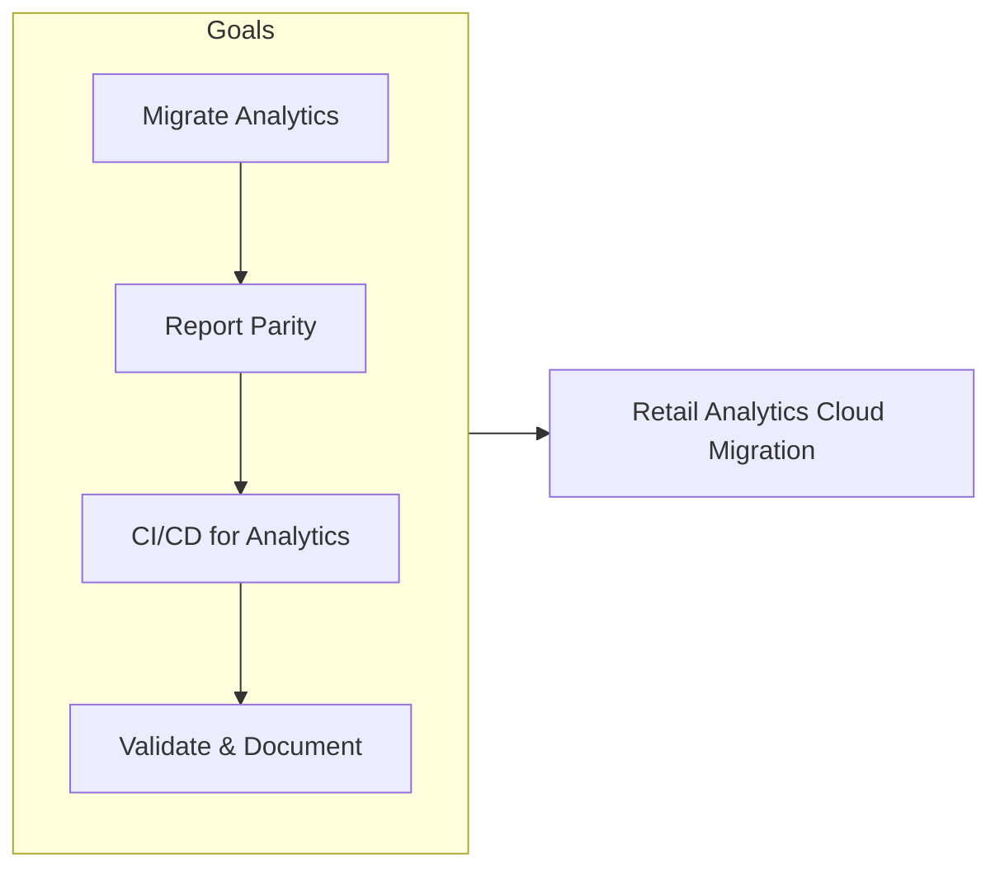
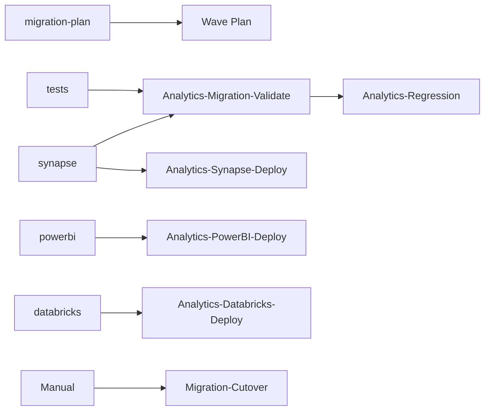
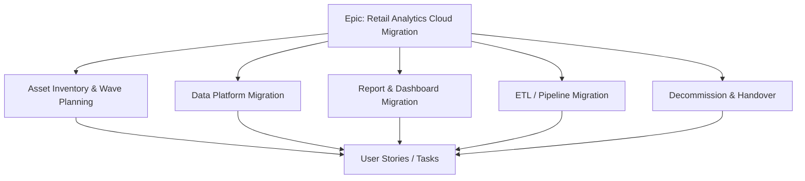
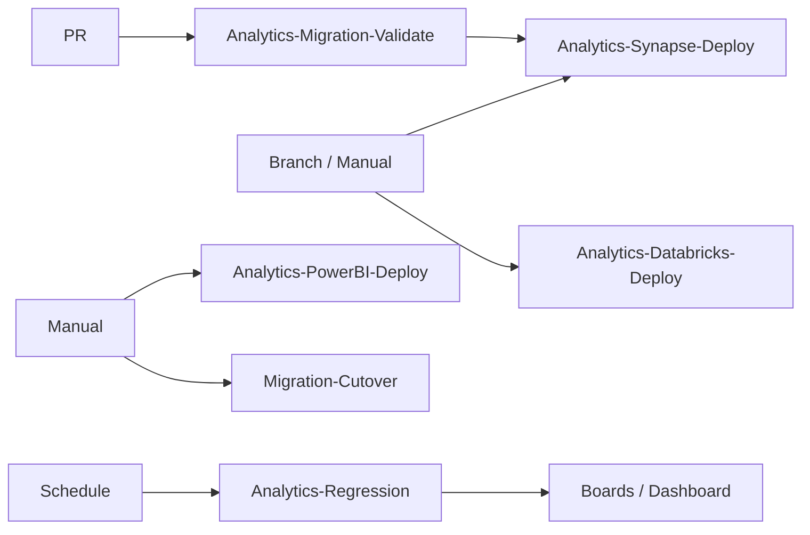
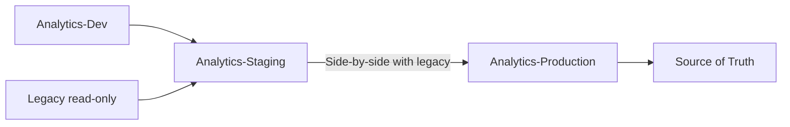
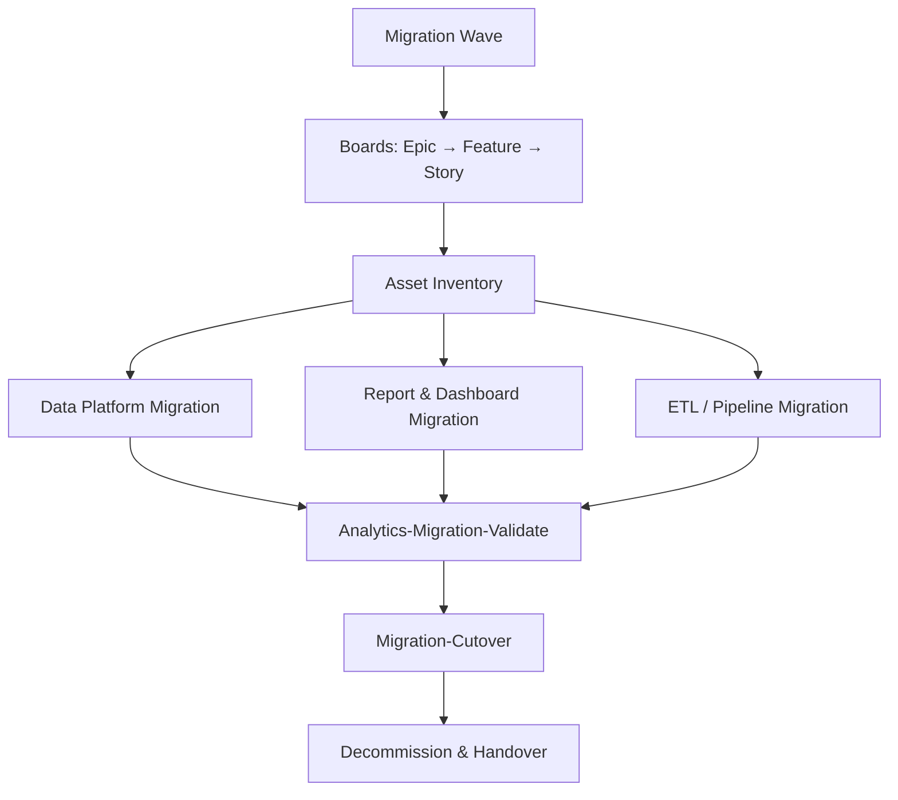
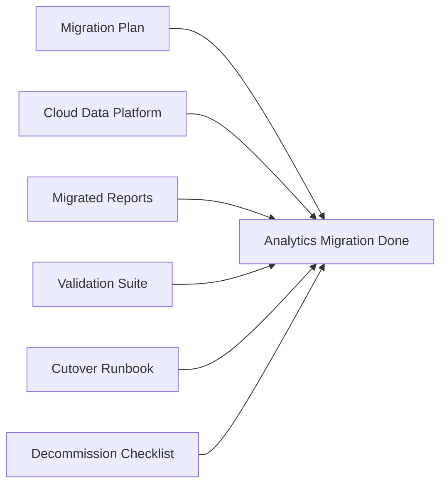
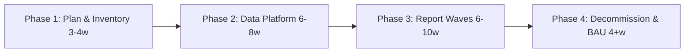
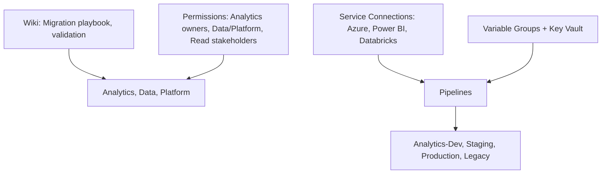

# Retail Analytics Cloud Migration

## Azure DevOps Project Overview

| Attribute | Value |
|-----------|--------|
| **Project Type** | Analytics Migration, Cloud Data & BI |
| **Organization** | Azure DevOps Org |
| **Area Path** | Retail / Analytics |
| **Iteration** | Sprint-based (2 weeks) |

**What this project is:** This Azure DevOps project runs the **retail analytics cloud migration**: moving existing reports, dashboards, and data/ETL from on-prem or legacy cloud to modern cloud (e.g. Synapse, Power BI, Databricks). Work is organized in waves; each wave has asset inventory, data platform migration, report/dashboard migration, ETL migration, and decommission. Pipelines validate, deploy Synapse/Power BI/Databricks assets, run regression, and execute cutover.

---

## 1. Project Objectives

**Explanation:** Objectives define why the migration exists: migrate analytics to modern cloud, preserve or improve report parity and performance, establish CI/CD for analytics assets, validate at each wave, and document cutover and ownership. Each goal drives Features (inventory, data platform, reports, ETL, decommission) and pipelines (Analytics-Migration-Validate, Synapse/PowerBI/Databricks-Deploy, Regression, Migration-Cutover).

**Detailed objectives flow (how goals connect):**

1. **Migrate analytics to modern cloud** → Asset inventory and wave plan; data platform and report migration Features; Synapse, Power BI, Databricks repos and pipelines. Outcome: analytics in Synapse/Power BI/Databricks.
2. **Preserve or improve report parity and performance** → Validation and regression pipelines; UAT per report. Outcome: reports match or exceed legacy; performance acceptable.
3. **CI/CD for analytics assets** → Pipelines deploy semantic models, reports, SQL/Spark. Outcome: changes versioned and deployable via Azure DevOps.
4. **Validate at each wave** → Analytics-Migration-Validate and Analytics-Regression; compare old vs new. Outcome: validation at each wave; failures block cutover.
5. **Document cutover and ownership** → Cutover runbook; Migration-Cutover pipeline; ownership in Boards. Outcome: cutover and rollback documented; owners clear.

**Objectives flow**

- Migrate existing retail analytics (reports, dashboards, models) from on-prem or legacy cloud to modern cloud (e.g., Azure Synapse, Power BI, Databricks)
- Preserve or improve report parity and performance during and after migration
- Establish CI/CD for analytics assets (semantic models, reports, datasets, SQL/Spark)
- Validate data and report correctness at each migration wave
- Document cutover, rollback, and ownership for each asset

**Objectives flow**



---

## 2. Azure DevOps Structure

### Repositories

| Repo | Purpose |
|------|---------|
| `retail-analytics-migration-plan` | Wave plan, asset inventory, dependency matrix, runbooks |
| `retail-analytics-synapse` | Synapse SQL scripts, Spark notebooks, pipelines |
| `retail-analytics-powerbi` | PBI dataset definitions, deployment config (if source-controlled) |
| `retail-analytics-tests` | Validation queries, snapshot comparisons, regression tests |
| `retail-analytics-databricks` | Databricks notebooks and jobs (if used) |

**Explanation:** Repos hold migration plan, Synapse SQL/notebooks, Power BI config (if source-controlled), validation tests, and Databricks assets. Pipelines validate, deploy to Synapse/Power BI/Databricks, run regression, and execute cutover. All analytics and migration assets are versioned and deployable via Azure DevOps.

**Detailed repository flow (step-by-step):**

1. **retail-analytics-migration-plan** — Wave plan, asset inventory, dependency matrix, runbooks. Updated per wave; cutover and rollback documented. Used by migration lead and engineers.
2. **retail-analytics-synapse** — Synapse SQL scripts, Spark notebooks, pipelines. Analytics-Synapse-Deploy runs on branch or manual; deploys to dev/prod. Outcome: Synapse assets deployed.
3. **retail-analytics-powerbi** — PBI dataset definitions and deployment config (if source-controlled). Analytics-PowerBI-Deploy runs manually or from pipeline. Outcome: PBI assets deployed.
4. **retail-analytics-tests** — Validation queries and regression tests. Analytics-Migration-Validate and Analytics-Regression run these; compare old vs new. Outcome: validation and regression automated.
5. **retail-analytics-databricks** — Databricks notebooks and jobs. Analytics-Databricks-Deploy runs on branch or manual. Outcome: Databricks assets deployed.
6. **Flow:** Plan → Inventory → Deploy data platform and reports → Validate → Regression → Cutover (Migration-Cutover) → Decommission.

**Repository flow**



### Boards (Work Item Hierarchy)

```
Epic: Retail Analytics Cloud Migration
├── Feature: Asset Inventory & Wave Planning
│   ├── User Story: Catalog all reports, datasets, ETL jobs, dependencies
│   ├── User Story: Wave assignment (wave-1, wave-2, …) and owners
│   └── Task: Migration plan doc and Board tags
├── Feature: Data Platform Migration
│   ├── User Story: Migrate data warehouse / data marts to Synapse/Databricks
│   ├── User Story: Data validation and reconciliation scripts
│   └── Task: Cutover and rollback steps
├── Feature: Report & Dashboard Migration
│   ├── User Story: Migrate report N to Power BI / cloud-native
│   ├── User Story: Semantic model and dataset in repo; deploy via pipeline
│   └── Task: UAT sign-off per report
├── Feature: ETL / Pipeline Migration
│   ├── User Story: Move ETL job to Synapse/ADF/Databricks
│   └── Task: Schedule and dependency alignment
└── Feature: Decommission & Handover
    ├── User Story: Decommission legacy system after wave sign-off
    └── Task: Update docs, lineage, support runbooks
```

**Explanation:** Boards organize migration by capability: inventory and wave planning, data platform, reports, ETL, decommission. Epic is the container; Features group work; User Stories and Tasks are created per report, dataset, or ETL job. Work flows from backlog → active → closed; UAT sign-off and cutover are explicit.

**Detailed board flow (step-by-step):**

1. **Wave planning** — Create Epic or use wave Epic; create Features (Asset Inventory, Data Platform, Report Migration, ETL, Decommission). Assign owners per asset.
2. **Asset inventory** — Create User Story per report/dataset/ETL; catalog dependencies; assign to wave. Link to migration plan.
3. **Data platform migration** — Tasks for data warehouse/mart migration; validation scripts; cutover and rollback. Link to Synapse/Databricks deploy.
4. **Report migration** — User Story per report; rebuild in Power BI or cloud-native; UAT sign-off. Close when report migrated and signed off.
5. **ETL migration** — Tasks for moving ETL to Synapse/ADF/Databricks; schedule and dependency alignment. Close when ETL migrated and validated.
6. **Decommission** — Task to decommission legacy after wave sign-off; update docs and lineage. Close when legacy retired and handover done.

**Board hierarchy flow**



### Pipelines

| Pipeline | Trigger | Purpose |
|----------|---------|---------|
| `Analytics-Migration-Validate` | PR | Run validation scripts; compare sample outputs (old vs new) |
| `Analytics-Synapse-Deploy` | Branch / manual | Deploy SQL/notebooks to Synapse dev/prod |
| `Analytics-PowerBI-Deploy` | Manual / pipeline | Deploy PBI datasets/reports (if automated) |
| `Analytics-Databricks-Deploy` | Branch / manual | Deploy notebooks/jobs to Databricks |
| `Analytics-Regression` | Schedule / post-deploy | Run regression tests; publish results to Boards or dashboard |
| `Migration-Cutover` | Manual | Execute cutover checklist; run final validation |

**Pipeline flow**



**Explanation:** Pipelines automate validation, deployment to Synapse/Power BI/Databricks, regression, and cutover. Analytics-Migration-Validate runs on PR; deploy pipelines run on branch or manual; Analytics-Regression runs on schedule or post-deploy; Migration-Cutover runs manually for cutover execution. No manual deploy of analytics assets to production.

**Detailed pipeline flow (step-by-step):**

1. **Analytics-Migration-Validate (on PR)** — Trigger: PR. Steps: Run validation scripts; compare sample outputs (old vs new). Output: pass/fail. No deploy.
2. **Analytics-Synapse-Deploy** — Trigger: branch or manual. Steps: Deploy SQL/notebooks to Synapse dev/prod. Output: Synapse assets updated.
3. **Analytics-PowerBI-Deploy** — Trigger: manual or pipeline. Steps: Deploy PBI datasets/reports (if automated). Output: PBI assets updated.
4. **Analytics-Databricks-Deploy** — Trigger: branch or manual. Steps: Deploy notebooks/jobs to Databricks. Output: Databricks assets updated.
5. **Analytics-Regression** — Trigger: schedule or post-deploy. Steps: Run regression tests; publish results to Boards or dashboard. Output: regression report.
6. **Migration-Cutover** — Trigger: manual. Steps: Execute cutover checklist; run final validation. Output: cutover executed; results documented.

**Pipeline flow**

| Environment | Use |
|-------------|-----|
| **Analytics-Dev** | Develop new cloud assets; no production data |
| **Analytics-Staging** | Side-by-side with legacy; validation and UAT |
| **Analytics-Production** | Post-migration production; source of truth |
| **Legacy (read-only)** | Reference for comparison during migration |

**Environment promotion flow**



**Explanation:** Analytics-Dev is for developing new cloud assets without production data. Analytics-Staging is side-by-side with legacy for validation and UAT. Analytics-Production is post-migration production; deploy only with approval. Legacy is read-only reference during migration. Promotion path: Dev → Staging (validate with legacy) → Production (after UAT and cutover).

**Detailed environment flow (step-by-step):**

1. **Analytics-Dev** — Develop new Synapse/Power BI/Databricks assets; no production data. Deploy pipelines target here first. Safe to fail.
2. **Analytics-Staging** — Side-by-side with legacy; full or sampled production-like data. Validate and UAT here before cutover. Optional approval before deploy.
3. **Analytics-Production** — Post-migration production; source of truth. Deploy requires approval. Regression runs against prod; results feed dashboard.
4. **Legacy** — Read-only reference during migration. Used for comparison in validation and regression. Decommissioned after wave sign-off.
5. **Promotion path:** Deploy to Dev → validate → Deploy to Staging → UAT sign-off → Cutover (Migration-Cutover) → Production is source of truth; legacy decommissioned.

**Environment flow**

```
[Migration Wave Defined]
        │
        ▼
┌─────────────────────────────────────────────────────────────────┐
│ Boards: Epic (Retail Analytics Migration) → Feature (per wave/   │
│ asset type) → User Story (per report/dataset/job) → Task          │
│ Migration plan: retail-analytics-migration-plan repo             │
└─────────────────────────────────────────────────────────────────┘
        │
        ▼
┌───────────────────┐     ┌─────────────────────┐
│ Asset Inventory   │────▶│ Wave assignment;     │
│ & Dependencies    │     │ Owner; validation   │
│                   │     │ criteria            │
└───────────────────┘     └──────────┬──────────┘
                                      │
        ┌─────────────────────────────┼─────────────────────────────┐
        ▼                             ▼                             ▼
┌───────────────┐           ┌─────────────────┐           ┌─────────────────┐
│ Data Platform │           │ Report/Dashboard │           │ ETL / Pipeline   │
│ Migration     │           │ Migration       │           │ Migration        │
│ (Synapse etc) │           │ (Power BI etc)  │           │ (Synapse/ADF)    │
└───────────────┘           └─────────────────┘           └─────────────────┘
        │                             │                             │
        └─────────────────────────────┼─────────────────────────────┘
                                      ▼
                        ┌────────────────────────┐
                        │ Analytics-Migration-   │
                        │ Validate & Regression  │
                        │ UAT sign-off           │
                        └────────────┬───────────┘
                                     │
                                     ▼
                        ┌────────────────────────┐
                        │ Migration-Cutover       │
                        │ Decommission legacy    │
                        │ Handover & docs        │
                        └────────────────────────┘
```

**End-to-end flow (Mermaid)**



**Detailed end-to-end flow (step-by-step):**

1. **Wave defined** — Create or use wave Epic in Boards; asset inventory and wave plan in migration-plan repo; assign owners.
2. **Asset inventory** — Catalog reports, datasets, ETL jobs, dependencies; wave assignment (wave-1, wave-2, …). Link to migration plan.
3. **Data platform migration** — Migrate data warehouse/marts to Synapse/Databricks; validation and reconciliation scripts; cutover and rollback steps. Deploy via pipeline.
4. **Report and dashboard migration** — Per report: rebuild in Power BI or cloud-native; semantic model in repo; deploy via pipeline; UAT sign-off. Close when signed off.
5. **ETL migration** — Move ETL jobs to Synapse/ADF/Databricks; schedule and dependency alignment. Deploy and validate.
6. **Validate** — Analytics-Migration-Validate and Analytics-Regression run; compare old vs new. Failures block cutover.
7. **Cutover** — Execute Migration-Cutover (checklist and final validation). Switch users to new reports; legacy deprecated.
8. **Decommission and handover** — Decommission legacy after wave sign-off; update docs, lineage, support runbooks. Close wave Epic.

---

## 4. Key Deliverables & Acceptance Criteria

| Deliverable | Acceptance Criteria |
|-------------|----------------------|
| Migration plan | Asset list, waves, owners, dependencies in repo; updated as waves complete |
| Cloud data platform | Warehouse/marts in Synapse (or target); data validation passed |
| Migrated reports/dashboards | Each report UAT sign-off; deployed via pipeline or documented process |
| Validation suite | Automated regression; old vs new comparison where applicable |
| Cutover runbook | Per-wave cutover and rollback steps; executed and signed off |
| Decommission checklist | Legacy assets retired; docs and support updated |

**Deliverables flow**



**Explanation:** Deliverables are the concrete outputs: migration plan, cloud data platform, migrated reports, validation suite, cutover runbook, decommission checklist. Each has acceptance criteria so analytics and stakeholders agree when the migration is “done” for a wave or overall.

**Detailed deliverables flow (how each is produced):**

1. **Migration plan** — In migration-plan repo; asset list, waves, owners, dependencies. Acceptance: plan in repo; updated as waves complete.
2. **Cloud data platform** — Synapse/Databricks deployed via pipeline; data validation passed. Acceptance: warehouse/marts in cloud; validation green.
3. **Migrated reports/dashboards** — Each report UAT sign-off; deployed via pipeline or documented process. Acceptance: reports in cloud; sign-off attached.
4. **Validation suite** — Analytics-Migration-Validate and Analytics-Regression; old vs new comparison. Acceptance: automated; failures block cutover.
5. **Cutover runbook** — Per-wave cutover and rollback steps; executed and signed off. Acceptance: runbook in repo; cutover executed at least once per wave.
6. **Decommission checklist** — Legacy assets retired; docs and support updated. Acceptance: legacy off; checklist complete.

---

## 5. Phases & Timeline (Example)

| Phase | Duration | Focus |
|-------|----------|--------|
| **Phase 1: Plan & Inventory** | 3–4 weeks | Asset inventory, wave plan, repo structure, validation approach |
| **Phase 2: Data Platform** | 6–8 weeks | Migrate core data; validation; first reports on cloud data |
| **Phase 3: Report Waves** | 6–10 weeks | Migrate reports/dashboards wave by wave; UAT and cutover |
| **Phase 4: Decommission & BAU** | 4+ weeks | Legacy off; CI/CD and ownership in place; steady state |

**Phases timeline flow**



**Explanation:** Phases order the work: plan and inventory, then data platform migration, then report waves, then decommission and BAU. Timelines are examples; adjust to asset count and org capacity.

**Detailed phase flow (what happens in each phase):**

1. **Phase 1: Plan & Inventory (3–4 weeks)** — Asset inventory; wave plan; repo structure; validation approach. Outcome: plan in repo; waves and owners defined.
2. **Phase 2: Data Platform (6–8 weeks)** — Migrate core data; validation; first reports on cloud data. Outcome: data in Synapse/Databricks; validation green.
3. **Phase 3: Report Waves (6–10 weeks)** — Migrate reports/dashboards wave by wave; UAT and cutover per wave. Outcome: reports in cloud; UAT signed off.
4. **Phase 4: Decommission & BAU (4+ weeks)** — Legacy off; CI/CD and ownership in place; steady state. Outcome: migration complete; BAU handover.

---

## 6. Azure DevOps Artifacts & Links

- **Wiki:** Migration playbook, wave calendar, report inventory, validation approach
- **Service connections:** Azure (Synapse, Storage, Power BI if automated), Databricks
- **Variable groups:** Per environment (workspace, database, report IDs); secrets in Key Vault
- **Permissions:** Analytics/Business (report owners); Data/Platform (pipeline and infra); Read-only for stakeholders

**Artifacts & links flow**



**Explanation:** Wiki holds migration playbook, wave calendar, report inventory, and validation approach. Service connections (Azure, Power BI, Databricks) let pipelines deploy and run. Variable groups and Key Vault supply workspace, database, report IDs, and secrets. Permissions: analytics/business as report owners; data/platform for pipeline and infra; read-only for stakeholders.

**Detailed artifacts flow (how they connect):**

1. **Wiki** — Migration playbook, wave calendar, report inventory, validation approach. Updated per wave. Linked from work items.
2. **Service connections** — Azure (Synapse, Storage, Power BI if automated), Databricks. Pipelines use these to deploy and run.
3. **Variable groups** — Per environment (workspace, database, report IDs); secrets in Key Vault. Referenced by deploy and regression pipelines.
4. **Permissions** — Analytics/Business: report owners; Data/Platform: pipeline and infra; Read-only: stakeholders. Ensures analytics own content; platform owns deploy and validation.

---

## 7. End-to-End Flow (Complete)

### 7.1 Flow Phases (Trigger → Closure)

| Phase | Name | Description |
|-------|------|-------------|
| 0 | **Prerequisites** | Migration plan repo; asset inventory; Synapse/Databricks/Power BI repos; validation scripts; Boards wave structure. |
| 1 | **Trigger** | Wave start (Epic); or PR to analytics repo (report/dataset migration). |
| 2 | **Triage / Plan** | Asset inventory; wave assignment; owner per report/dataset; success criteria and UAT plan. |
| 3 | **Build / Execute** | Data platform migration (Synapse/Databricks); report rebuild in Power BI; Analytics-Synapse-Deploy, Analytics-PowerBI-Deploy, etc. |
| 4 | **Validate** | Analytics-Migration-Validate (old vs new comparison); Analytics-Regression; UAT with business users. |
| 5 | **Approve** | UAT sign-off per report; migration lead approval for cutover. |
| 6 | **Release / Cutover** | Enable new reports for pilot; full cutover; update links/portals; Migration-Cutover pipeline if automated. |
| 7 | **Verify / Operate** | Monitor usage and performance; deprecate old reports; handover to BAU. |
| 8 | **Close / Document** | Wave Epic closed; report inventory updated; legacy decommissioned or planned. |
| — | **Feedback** | UAT issues → fix and re-validate; post-migration feedback → optimization backlog; wave retro → playbook update. |

### 7.2 Roles & Responsibilities (RACI)

| Role | R | A | C | I |
|------|---|---|---|---|
| Migration Lead | Wave plan; cutover approval | Wave success | Business, Data/Platform | Stakeholders |
| Report Owner / Business | UAT; sign-off; requirements | Report correctness | Data/Platform | On status |
| Data/Platform Engineer | Migrate data and reports; run pipelines; validation | Technical delivery | Report owners | Migration Lead |
| Analytics/Business | Consume reports; feedback | — | — | Cutover status |

### 7.3 Per-Phase Detail

| Phase | Trigger | Inputs | Actions | Outputs | Success criteria | Failure path |
|-------|---------|-------|--------|--------|------------------|--------------|
| **Trigger** | Wave or PR | Epic, or branch | Create wave Epic; asset list; or start pipeline | Work items; pipeline run | Scope clear | Refine scope |
| **Triage** | Epic or asset | Inventory, dependencies | Assign owners; set UAT and cutover date | Plan; UAT plan | Plan agreed | Re-plan with business |
| **Build** | Plan done | Legacy report/data | Migrate data platform; rebuild report; deploy to staging | Staging report; validation dataset | Report in staging; data validated | Fix migration; re-run |
| **Validate** | Build done | Staging report, legacy | Analytics-Migration-Validate; regression; UAT | Test results; UAT sign-off | Validation pass; UAT signed | Fix and re-validate |
| **Approve** | UAT pass | Sign-off, test results | Report owner sign-off; migration lead approval | Approval | Approved for cutover | Address gaps; re-UAT |
| **Release** | Approval | Cutover runbook | Pilot then full cutover; update links; Migration-Cutover | Go-live | Users on new report | Rollback links; fix and re-cutover |
| **Verify** | Cutover done | Usage, performance | Monitor; deprecate old; handover | Stable; old deprecated | No critical issues; BAU owns | Fix or rollback |
| **Close** | Stable | All above | Close Epic; update inventory; decommission legacy | Closed Epic; docs | Wave complete | Reopen if issue |

### 7.4 Decision Points & Approval Gates

| Gate | When | Who | Condition to proceed | If denied |
|------|------|-----|----------------------|-----------|
| **UAT sign-off** | After validation | Report Owner | UAT passed; acceptance criteria met | Re-validate after fix |
| **Cutover approval** | After UAT | Migration Lead | All reports in wave signed off; rollback clear | Postpone; address gaps |
| **Prod deploy (pipeline)** | Before deploy to prod | Data/Platform Lead | Validation and UAT OK | Do not run |

### 7.5 Rollback & Escalation

- **Rollback:** Revert links/portals to old reports; keep new in staging for fix; document in runbook.
- **Escalation:** Validation failure → Data/Platform + Report Owner; UAT dispute → Migration Lead + Business; technical blocker → Data/Platform Lead.

### 7.6 Feedback Loops

- **UAT feedback** → Report/dataset fix; re-validate; playbook updated for next wave.
- **Post-migration issues** → Optimization backlog; monitoring improved.
- **Wave completion** → Playbook and validation approach updated; next wave planned.

### 7.7 Prerequisites (Before Starting)

- Migration plan repo and asset inventory; Synapse/Databricks/Power BI repos; validation and regression pipelines.
- Service connections: Azure (Synapse, Storage, Power BI if automated), Databricks; variable groups and Key Vault.
- Boards: Epic per wave; Feature per asset type; UAT and sign-off process.
- Cutover runbook and rollback (link revert); permissions for Analytics and Data/Platform.
- Permissions: Migration/Data/Platform (run pipelines; deploy); Report owners (UAT; sign-off); Stakeholders (read).

### 7.8 Definition of Done (Overall)

- Wave: All reports in wave migrated and cut over; UAT signed; legacy deprecated or decommissioned; inventory and playbook updated.
- Report: Rebuilt and deployed; UAT signed; monitoring in place; owner and BAU handover done.
- Data platform: Migrated and validated; lineage and docs updated.
