# Retail Application CI/CD Automation

## Azure DevOps Project Overview

| Attribute | Value |
|-----------|--------|
| **Project Type** | CI/CD, Build & Release Automation |
| **Organization** | Azure DevOps Org |
| **Area Path** | Retail / CI-CD |
| **Iteration** | Sprint-based (2 weeks) |

**What this project is:** This Azure DevOps project owns **retail application CI/CD automation**: standardized build, test, and deployment for retail apps (web, API, services) using shared pipeline templates; quality gates (lint, test, scan) and approval gates for production; rollback and visibility. Work is tracked in Boards under Retail/CI-CD; pipelines run CI on PR/push and CD to Dev/Staging/Production with approval on prod.

---

## 1. Project Objectives

**Explanation:** Objectives define why the project exists: automate build and deploy, standardize pipelines and quality gates, reduce manual releases and errors, support multiple apps and environments, and integrate with ticketing and monitoring. Each goal drives Features (build standardization, test automation, deployment automation, security/compliance, visibility) and pipelines (retail-<app>-CI, CD-Dev/Staging/Prod).

**Detailed objectives flow (how goals connect):**

1. **Automate build and deploy** → retail-<app>-CI (build, lint, test, package); CD-Dev/Staging/Prod. Outcome: no manual build or deploy for in-scope apps.
2. **Standardize pipelines and quality gates** → Shared templates in retail-pipeline-templates; lint, unit test, scan gates. Outcome: all apps use same pattern; gates block merge/deploy when failed.
3. **Reduce manual releases and errors** → CD-Dev auto on merge; CD-Prod with approval and change request. Outcome: releases auditable and repeatable.
4. **Multiple apps and environments** → One pipeline pattern per app; envs Dev, Staging, Production. Outcome: same flow for all retail apps.
5. **Integrate with ticketing and monitoring** → Notify Teams/Jira/ServiceNow; release dashboard. Outcome: visibility and traceability.

**Objectives flow**

- Automate build, test, and deployment for retail applications (web, API, services)
- Standardize pipeline templates and quality gates (lint, test, scan, approval)
- Reduce manual releases and human error; achieve consistent, auditable deployments
- Support multiple apps and environments (dev, staging, production) from a single orchestration point
- Integrate with existing retail tooling (ticketing, monitoring) and provide release visibility

**Objectives flow**

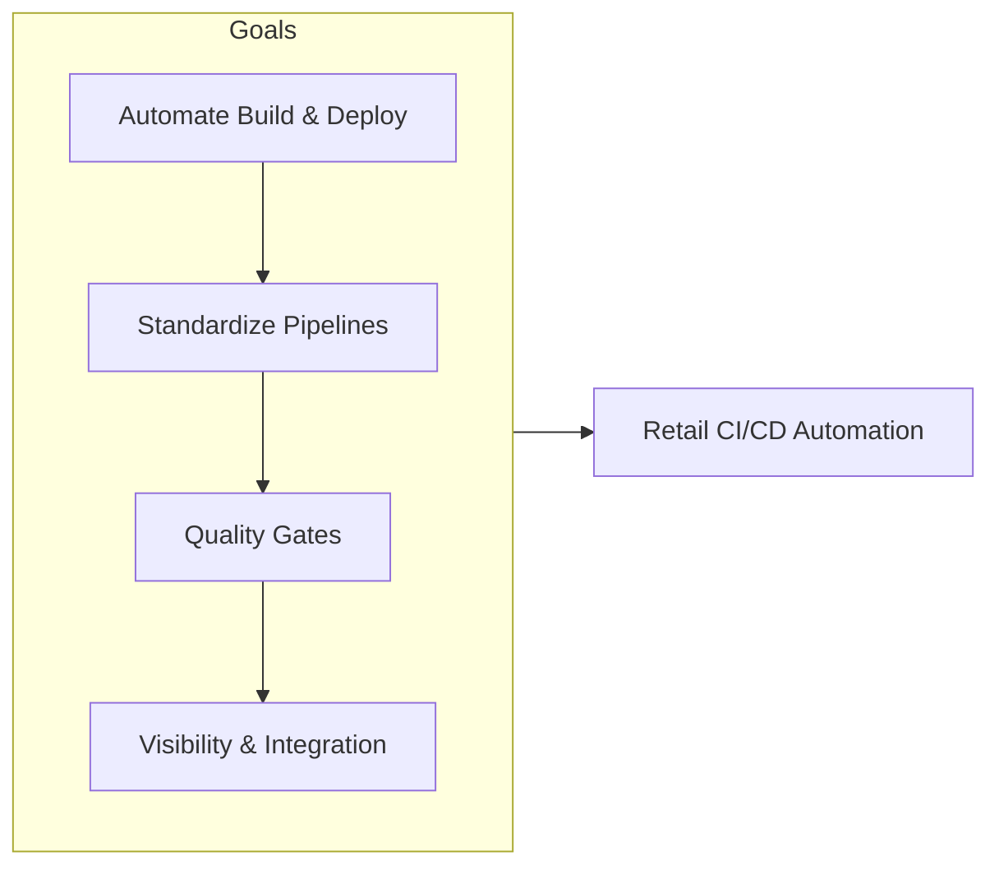

---

## 2. Azure DevOps Structure

### Repositories

| Repo | Purpose |
|------|---------|
| `retail-app-*` (per app) | Application source code (e.g., retail-web, retail-api, retail-cart) |
| `retail-pipeline-templates` | Shared YAML templates (build, test, deploy, gates) |
| `retail-pipeline-config` | Variable groups, service connection config, env definitions |
| `retail-deployment-scripts` | Post-deploy scripts, health checks, rollback scripts |

**Explanation:** App repos hold source code; retail-pipeline-templates holds shared YAML templates; retail-pipeline-config holds variable groups and env definitions; retail-deployment-scripts holds post-deploy and rollback scripts. Pipelines consume templates and config; CI runs on PR/push; CD deploys to envs. All changes versioned and deployable via Azure DevOps.

**Detailed repository flow (step-by-step):**

1. **retail-app-*** — Developer pushes code; PR triggers retail-<app>-CI (build, lint, test, package). Merge to dev triggers CD-Dev; release branch or manual triggers CD-Staging; manual + approval triggers CD-Prod. Outcome: app built and deployed via pipeline.
2. **retail-pipeline-templates** — Platform or lead edits templates; PR triggers retail-templates-CI (validate syntax; test consumer pipeline). Merge publishes template; consuming app pipelines use new version. Outcome: templates versioned and shared.
3. **retail-pipeline-config** — Variable groups and service connection config; referenced by pipelines. Updated when env or connection changes. Outcome: config centralized and auditable.
4. **retail-deployment-scripts** — Post-deploy health checks and rollback scripts; used by CD stages. Outcome: post-deploy and rollback repeatable.
5. **Flow:** Code change → PR → CI → merge → CD-Dev (auto) → CD-Staging (manual/release) → CD-Prod (manual + approval). Rollback runs same CD with previous artifact or rollback script.

**Repository flow**

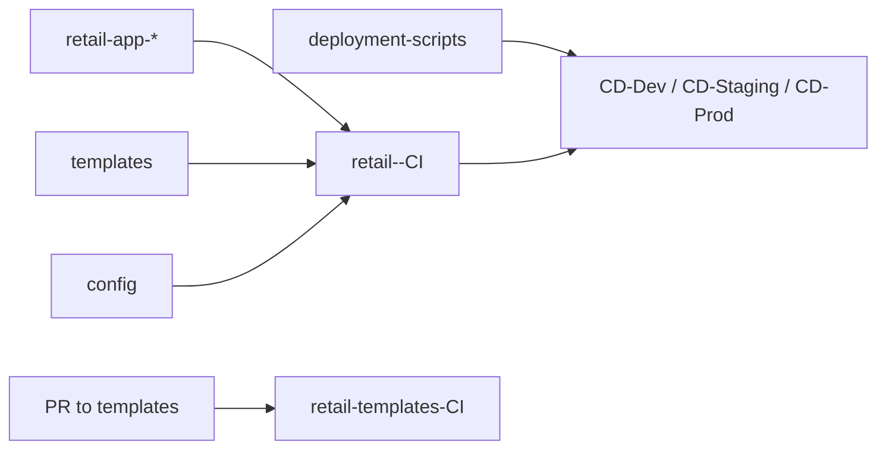

### Boards (Work Item Hierarchy)

```
Epic: Retail Application CI/CD Automation
├── Feature: Build Standardization
│   ├── User Story: Single build template (compile, test, package) for all retail apps
│   ├── User Story: Code quality gates (SonarQube, lint, unit test threshold)
│   └── Task: Template parameters; branch policies (main, release/*)
├── Feature: Test Automation in Pipeline
│   ├── User Story: Unit and integration tests in CI; fail fast
│   ├── User Story: Optional UI/smoke tests in staging
│   └── Task: Test reporting and trend in pipeline
├── Feature: Deployment Automation
│   ├── User Story: Deploy to dev on merge; staging on release branch
│   ├── User Story: Production deploy with approval and change request link
│   └── Task: Rollback runbook and pipeline job
├── Feature: Security & Compliance in Pipeline
│   ├── User Story: Dependency scan, container scan, secret scan
│   └── Task: Block deploy on critical findings; exception process
└── Feature: Visibility & Integration
    ├── User Story: Release dashboard and deployment history
    └── Task: Notify Teams/Slack; update Jira/ServiceNow with release info
```

**Explanation:** Boards organize CI/CD work: build standardization, test automation, deployment automation, security/compliance, visibility. Epic is the container; Features group work; User Stories and Tasks are created for new app onboarding, template changes, or quality/visibility improvements. Work flows from backlog → active → closed; release and change request are linked.

**Detailed board flow (step-by-step):**

1. **New app or template change** — Create User Story under appropriate Feature (e.g. Build Standardization). Link to Epic. Describe acceptance criteria (e.g. template params, quality gates).
2. **Development** — Branch in app repo or templates repo; implement; open PR. CI runs (retail-<app>-CI or retail-templates-CI). Reviewer approves; merge.
3. **Deploy Dev** — CD-Dev runs on merge to dev (or manual). Health check optional. State: Resolved when dev deploy successful.
4. **Deploy Staging** — Run CD-Staging (release branch or manual). Integration/UI tests optional. State: Resolved when staging deploy successful.
5. **Deploy Production** — Create or link change request; request approval. Run CD-Prod after approval. State: Closed when prod deploy successful and CR closed.
6. **Rollback** — If prod fails, run rollback pipeline or runbook; create incident if needed. Post-incident review may create Tasks for fix or template improvement.

**Board hierarchy flow**

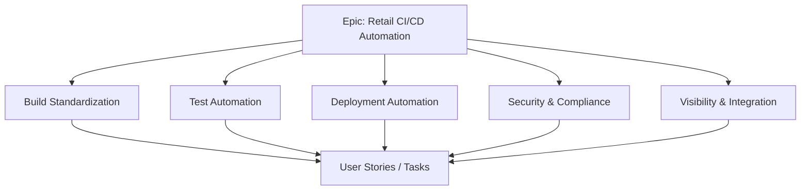

### Pipelines

| Pipeline | Trigger | Purpose |
|----------|---------|---------|
| `retail-<app>-CI` | PR, push to main/dev | Build, lint, test, package; no deploy |
| `retail-<app>-CD-Dev` | Merge to dev / CI success | Deploy to dev; optional smoke test |
| `retail-<app>-CD-Staging` | Release branch / manual | Deploy to staging; approval optional |
| `retail-<app>-CD-Prod` | Manual + approval | Deploy to production; link change request |
| `retail-templates-CI` | PR to retail-pipeline-templates | Validate template syntax; test consumer pipeline |

**Pipeline flow**

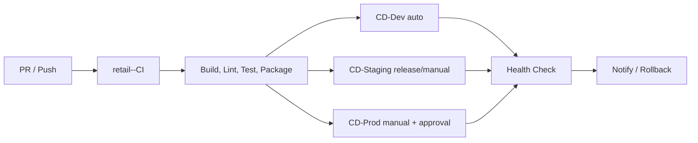

**Explanation:** Pipelines automate CI (build, lint, test, package) and CD (deploy to Dev/Staging/Prod). CI runs on every PR/push; CD-Dev runs on merge; CD-Staging and CD-Prod require manual trigger; CD-Prod requires approval and change request. No manual deploy to production outside pipeline.

**Detailed pipeline flow (step-by-step):**

1. **retail-<app>-CI (on PR/push)** — Trigger: PR or push to main/dev. Steps: Restore dependencies; build; lint; unit tests; package (artifact or container image); publish. Quality gates: fail if tests fail or critical scan findings. Output: artifact or image; no deploy.
2. **retail-<app>-CD-Dev** — Trigger: merge to dev or CI success (if branch policy). Steps: Deploy artifact/image to Dev environment; optional smoke test. Output: app running in Dev.
3. **retail-<app>-CD-Staging** — Trigger: release branch or manual. Steps: Deploy to Staging; optional integration/UI tests. Output: app running in Staging.
4. **retail-<app>-CD-Prod** — Trigger: manual; approval required (Release Manager); change request must be linked. Steps: Approval gate → deploy to Production → post-deploy health check. Output: app running in Prod; audit trail.
5. **retail-templates-CI (on PR to templates)** — Trigger: PR to retail-pipeline-templates. Steps: Lint YAML; run consumer pipeline (test template). Output: pass/fail; no deploy.
6. **Rollback** — Manual run of CD with previous artifact or dedicated rollback stage/runbook. Output: previous version deployed; incident if prod impact.

**Pipeline flow**

| Environment | Use |
|-------------|-----|
| **Dev** | Auto-deploy on merge; fast feedback |
| **Staging** | Pre-production; UAT and integration tests |
| **Production** | Manual approval; CAB/change request; rollback ready |

**Environment promotion flow**

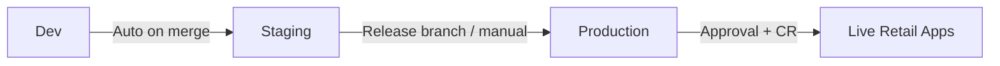

**Explanation:** Dev is for fast feedback; auto-deploy on merge. Staging is for pre-production validation; deploy on release branch or manual. Production requires manual trigger, approval, and change request; rollback ready. Promotion path: merge to dev → CD-Dev (auto) → CD-Staging (manual/release) → CD-Prod (manual + approval).

**Detailed environment flow (step-by-step):**

1. **Dev** — Auto-deploy on merge to dev (or on CI success if policy). No approval. Fast feedback for developers. Low-cost or shared resources.
2. **Staging** — Deploy on release branch or manual. Optional approval. Pre-production; UAT and integration tests. Production-like config.
3. **Production** — Deploy only with approval (Release Manager or CAB) and linked change request. Post-deploy health check; rollback pipeline or runbook ready. Strict change control.
4. **Promotion path:** Code merge to dev → CD-Dev runs → validate → CD-Staging (manual/release) → validate → CD-Prod (manual + approval + CR). Rollback: run rollback pipeline or deploy previous artifact.

**Environment flow**

```
[Developer: Push / PR]
        │
        ▼
┌───────────────────┐     ┌─────────────────────┐
│ retail-<app>-CI   │────▶│ Build, Lint, Test,   │
│ (on PR / push)    │     │ Package; quality     │
│                   │     │ gates                │
└───────────────────┘     └──────────┬──────────┘
                                      │
                                      ▼
                        ┌────────────────────────┐
                        │ Branch policy: PR      │
                        │ required; CI must pass │
                        └────────────┬───────────┘
                                     │
        ┌────────────────────────────┼────────────────────────────┐
        ▼                            ▼                            ▼
┌───────────────┐          ┌─────────────────┐          ┌─────────────────┐
│ CD-Dev        │          │ CD-Staging      │          │ CD-Prod         │
│ (auto on      │          │ (release branch │          │ (manual +       │
│ merge)        │          │ or manual)      │          │ approval)       │
└───────────────┘          └─────────────────┘          └─────────────────┘
        │                            │                            │
        └────────────────────────────┼────────────────────────────┘
                                      ▼
                        ┌────────────────────────┐
                        │ Post-deploy: health     │
                        │ check; notify; update   │
                        │ ticket; rollback ready  │
                        └────────────────────────┘
```

**End-to-end flow (Mermaid)**

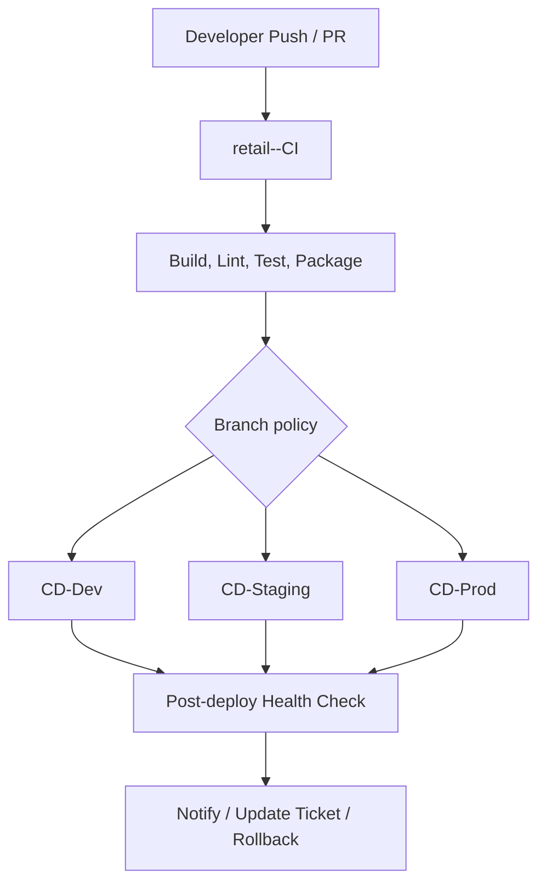

**Detailed end-to-end flow (step-by-step):**

1. **Request** — Developer or product requests change. Create User Story or Task in Boards; link to Epic/Feature. For prod, create change request and link.
2. **Develop** — Branch in app repo; implement; open PR. retail-<app>-CI runs (build, lint, test, package). Fix failures; get code review.
3. **Merge** — Merge to dev (or target branch). CD-Dev may run automatically. Validate in Dev (smoke test optional).
4. **Deploy Staging** — Run CD-Staging (release branch or manual). Run integration/UI tests. Validate before prod.
5. **Deploy Production** — Link change request; request approval (Release Manager). After approval, run CD-Prod. Post-deploy health check; notify Teams/Jira; update ticket.
6. **Verify** — Confirm health and monitoring; close work item and change request. If failure, run rollback; create incident; PIR and backlog item for fix.
7. **Feedback** — Failed deploy → rollback and PIR; quality gate failure → developer fixes; release metrics → dashboard and process improvement backlog.

---

## 4. Key Deliverables & Acceptance Criteria

| Deliverable | Acceptance Criteria |
|-------------|----------------------|
| Build template | All retail apps use shared template; build time and success rate tracked |
| Quality gates | Lint, unit test, and scan gates block merge/deploy when failed |
| Deployment automation | Dev/staging/prod deploy via pipeline; no manual copy/paste |
| Approval & audit | Production requires approval; deployment and change request linked |
| Rollback | One-click or runbook-based rollback; tested in staging |
| Visibility | Release dashboard shows last deploy per app/env; notifications working |

**Deliverables flow**

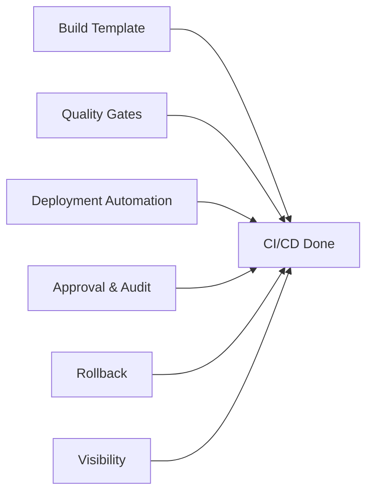

**Explanation:** Deliverables are the concrete outputs: build template, quality gates, deployment automation, approval and audit, rollback, visibility. Each has acceptance criteria so dev, release managers, and stakeholders agree when CI/CD is “done” for a given scope.

**Detailed deliverables flow (how each is produced):**

1. **Build template** — In retail-pipeline-templates; consumed by all retail app pipelines. Acceptance: all apps use shared template; build time and success rate tracked.
2. **Quality gates** — Lint, unit test, scan gates in CI; block merge/deploy when failed. Acceptance: gates enforced; exceptions documented.
3. **Deployment automation** — CD-Dev/Staging/Prod pipelines; no manual copy/paste. Acceptance: dev/staging/prod deploy via pipeline.
4. **Approval and audit** — Production requires approval; deployment and change request linked. Acceptance: prod deploy auditable; CR linked.
5. **Rollback** — One-click or runbook-based rollback; tested in staging. Acceptance: rollback pipeline or runbook; tested at least once.
6. **Visibility** — Release dashboard shows last deploy per app/env; notifications working. Acceptance: dashboard and notifications in place.

---

## 5. Phases & Timeline (Example)

| Phase | Duration | Focus |
|-------|----------|--------|
| **Phase 1: Build & CI** | 4–6 weeks | Templates; CI for all apps; branch policies; quality gates |
| **Phase 2: CD Dev & Staging** | 3–4 weeks | Auto-deploy to dev; staging pipeline; smoke tests |
| **Phase 3: CD Production** | 3–4 weeks | Prod pipeline; approvals; change request integration; rollback |
| **Phase 4: Hardening & Scale** | Ongoing | More apps onboarded; security scans; dashboard and alerts |

**Phases timeline flow**

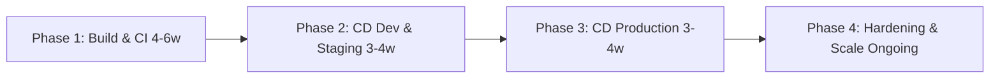

**Explanation:** Phases order the work: build and CI first, then CD to dev and staging, then CD to production with approval and rollback, then hardening and scale. Timelines are examples; adjust to app count and org capacity.

**Detailed phase flow (what happens in each phase):**

1. **Phase 1: Build & CI (4–6 weeks)** — Implement templates; CI for all apps; branch policies (PR + CI required); quality gates. Outcome: all apps build via pipeline; gates block bad changes.
2. **Phase 2: CD Dev & Staging (3–4 weeks)** — Auto-deploy to dev on merge; staging pipeline; smoke tests. Outcome: dev and staging deploy via pipeline.
3. **Phase 3: CD Production (3–4 weeks)** — Prod pipeline with approval and change request link; rollback pipeline or runbook. Outcome: prod deploy via pipeline; rollback tested.
4. **Phase 4: Hardening & Scale (Ongoing)** — More apps onboarded; security scans; dashboard and alerts. Outcome: CI/CD BAU; continuous improvement.

---

## 6. Azure DevOps Artifacts & Links

- **Wiki:** Pipeline usage, branch strategy, approval process, rollback runbook
- **Service connections:** Azure, container registry, optional Jira/ServiceNow
- **Variable groups:** Per app/env (connection names, resource groups); secrets in Key Vault
- **Permissions:** Dev teams (run CI/CD for their app); Release managers (approve prod); Platform (edit templates)

**Artifacts & links flow**

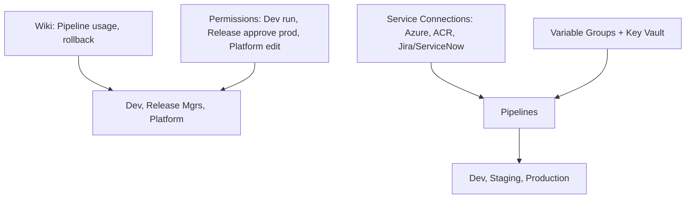

**Explanation:** Wiki holds pipeline usage, branch strategy, approval process, and rollback runbook. Service connections (Azure, ACR, Jira/ServiceNow) let pipelines deploy and notify. Variable groups and Key Vault supply connection names, resource groups, and secrets. Permissions: dev teams run CI/CD for their app; release managers approve prod; platform edits templates.

**Detailed artifacts flow (how they connect):**

1. **Wiki** — Pipeline usage, branch strategy, approval process, rollback runbook. Updated when process or template changes. Linked from work items and onboarding.
2. **Service connections** — Azure (subscriptions for deploy); ACR (container registry); Jira/ServiceNow (notifications). Pipelines use these to deploy and update tickets.
3. **Variable groups** — Per app/env (connection names, resource groups); secrets in Key Vault. Referenced by CI and CD pipelines.
4. **Permissions** — Dev teams: run CI/CD for their app; Release managers: approve Production environment; Platform: edit templates and pipeline config. Ensures prod protected; templates controlled.

---

## 7. End-to-End Flow (Complete)

### 7.1 Flow Phases (Trigger → Closure)

| Phase | Name | Description |
|-------|------|-------------|
| 0 | **Prerequisites** | App repo; pipeline templates; branch policies (PR + CI); envs (Dev, Staging, Prod); service connections; variable groups. |
| 1 | **Trigger** | PR or push to app repo (main/dev/release branch). |
| 2 | **Triage / Plan** | Branch policy requires PR; link work item; assign reviewer; for prod deploy: change request. |
| 3 | **Build / Execute** | retail-&lt;app&gt;-CI: restore, build, lint, test, package/image; publish artifact. |
| 4 | **Validate** | CI quality gates (unit test, coverage, scan); optional CD-Dev smoke test; CD-Staging integration tests. |
| 5 | **Approve** | Code review for PR; Release Manager approval for CD-Prod; change request linked. |
| 6 | **Release** | CD-Dev (auto on merge); CD-Staging (manual/release branch); CD-Prod (manual + approval). |
| 7 | **Verify / Operate** | Post-deploy health check; monitoring; notify Teams/Jira; rollback pipeline ready. |
| 8 | **Close / Document** | Work item closed; release notes; change request closed. |
| — | **Feedback** | Failed deploy → rollback; incident → PIR and pipeline improvement; metrics → dashboard. |

**Complete flow phases diagram**

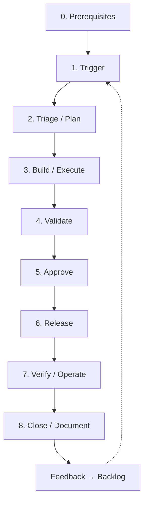

**Explanation (complete flow):** The complete flow runs from prerequisites (repos, templates, branch policies, envs, service connections) through trigger (PR/push), triage/plan, build/execute (CI), validate, approve (code review and prod approval), release (CD), verify/operate, and close. Feedback (failed deploy, quality gate failure, release metrics) feeds rollback, PIR, and process improvement backlog.

**Detailed complete flow (step-by-step):**

1. **Prerequisites** — App repo with branch policies (PR + CI required); pipeline templates; retail-<app>-CI and CD-* pipelines; envs Dev, Staging, Production; service connections and variable groups; rollback runbook and notifications. Without these, CI/CD cannot run or deploy.
2. **Trigger** — PR or push to app repo (main/dev/release branch). Creates pipeline run (CI).
3. **Triage/Plan** — Branch policy requires PR; link work item; assign reviewer; for prod deploy, create and link change request. Ensures path to deploy is clear.
4. **Build/Execute** — retail-<app>-CI: restore, build, lint, test, package; publish artifact or image. Output: artifact or image; test report.
5. **Validate** — CI quality gates (unit test, coverage, scan); optional CD-Dev smoke test; CD-Staging integration tests. Failure blocks merge or promotion.
6. **Approve** — Code review for PR; Release Manager approval for CD-Prod; change request linked. If denied, address feedback and re-submit.
7. **Release** — CD-Dev (auto on merge); CD-Staging (manual/release branch); CD-Prod (manual + approval). Pipeline deploys to target env. Output: deploy log; app running.
8. **Verify/Operate** — Post-deploy health check; monitoring; notify Teams/Jira; rollback pipeline ready. If failure, rollback and create incident.
9. **Close/Document** — Work item and change request closed; release notes if needed. Done.
10. **Feedback** — Failed deploy → rollback and PIR; quality gate failure → developer fixes; release metrics → dashboard and process improvement backlog. Feeds new triggers.

### 7.2 Roles & Responsibilities (RACI)

| Role | R | A | C | I |
|------|---|---|---|---|
| Developer | Push code; create PR; fix failures | Code quality | Reviewer | On build/deploy status |
| Reviewer | Code review | — | — | — |
| Release Manager | Approve prod deploy; link CR | Prod release | Dev Lead | On release |
| Platform | Maintain templates; fix pipeline | Template correctness | Dev teams | On template change |

### 7.3 Per-Phase Detail

| Phase | Trigger | Inputs | Actions | Outputs | Success criteria | Failure path |
|-------|---------|-------|--------|--------|------------------|--------------|
| **Trigger** | Push/PR | Branch, code | Start retail-&lt;app&gt;-CI | Pipeline run | CI triggered | Fix branch policy; re-push |
| **Triage** | PR created | Work item | Link work item; assign reviewer; add CR for prod if applicable | PR ready | Ready for build | Complete linking |
| **Build** | CI triggered | Repo content | Build, test, package, publish | Artifact; test report | CI green; artifact published | Fix code; re-run CI |
| **Validate** | CI success (dev) or manual (staging) | Artifact | CD-Dev deploy + smoke; CD-Staging deploy + integration tests | Validation result | Tests pass | Fix and re-run; do not promote |
| **Approve** | Validation pass (for prod) | CR, test results | Code review; Release Manager approval | Approval | Approved | Address feedback; re-submit |
| **Release** | Merge (dev) or approval (prod) | Artifact, env | CD-Dev/CD-Staging/CD-Prod | Deploy log; live app | Deploy succeeded | Rollback pipeline; fix and re-release |
| **Verify** | Post-deploy | Health check, monitoring | Run health check; alert if fail; notify | Notification; dashboard | Health green | Rollback; incident |
| **Close** | Verify OK | All above | Close work item; close CR | Closed items | Done | Reopen if issue |

### 7.4 Decision Points & Approval Gates

| Gate | When | Who | Condition to proceed | If denied |
|------|------|-----|----------------------|-----------|
| **PR merge** | After CI pass | Reviewer | Code review; CI green; no critical scan findings | PR feedback; fix and re-push |
| **Prod deploy** | Before CD-Prod | Release Manager | Change request linked; staging passed; approval given | Do not run; requester updates |
| **Quality gate** | In CI | Pipeline | Unit test pass; coverage threshold; no critical vulnerabilities | Block merge; fix and re-run |

**Decision points flow**

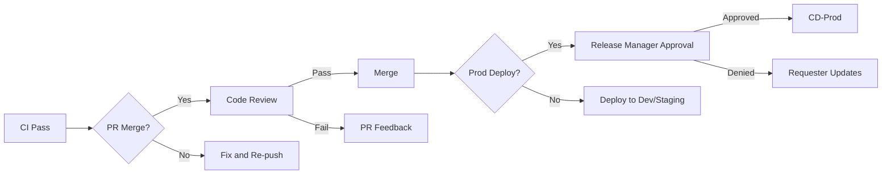

### 7.5 Rollback & Escalation

- **Rollback:** Run rollback pipeline or runbook (redeploy previous artifact/version); create incident if prod impact; post-incident review.
- **Escalation:** CI failure → Developer; prod deploy failure → Release Manager + On-call; pipeline bug → Platform.

### 7.6 Feedback Loops

- **Failed deploy** → Rollback; PIR; backlog item for fix.
- **Quality gate failure** → Developer fixes; trend in dashboard.
- **Release metrics** → Dashboard; process improvement backlog.

### 7.7 Prerequisites (Before Starting)

- App repo with branch policies (PR required; CI required); pipeline templates in retail-pipeline-templates; retail-&lt;app&gt;-CI and CD-* pipelines.
- Environments: Dev (no approval), Staging (optional approval), Production (approval required); service connections and variable groups; Key Vault for secrets.
- Rollback runbook and pipeline; notifications (Teams/Jira/ServiceNow) configured.
- Permissions: Dev team (run CI/CD for their app); Release Manager (approve Prod); Platform (edit templates).

### 7.8 Definition of Done (Overall)

- Code change: Merged; CI passed; deployed to target env(s); health check green; work item and CR closed.
- Release: Prod deploy completed; change request closed; stakeholders informed; rollback tested or documented.
