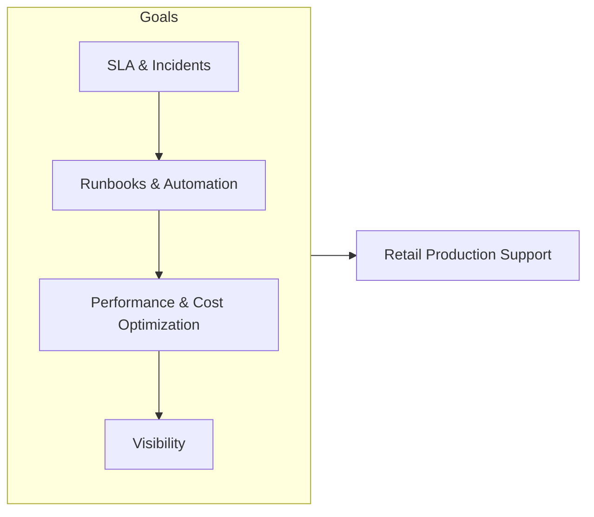
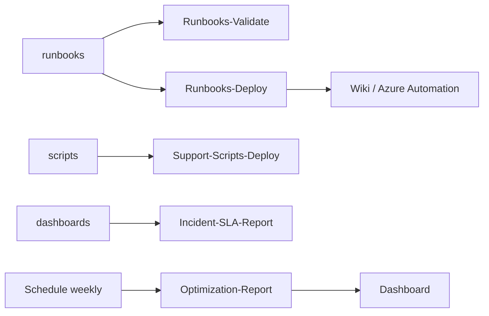
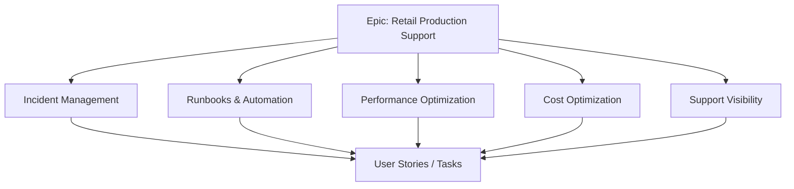
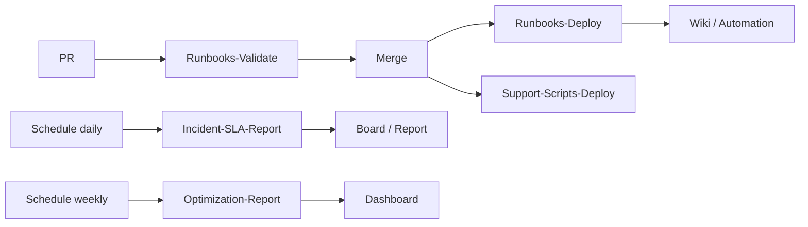
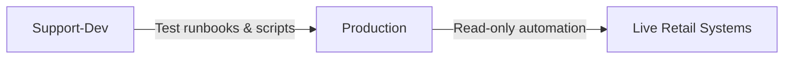
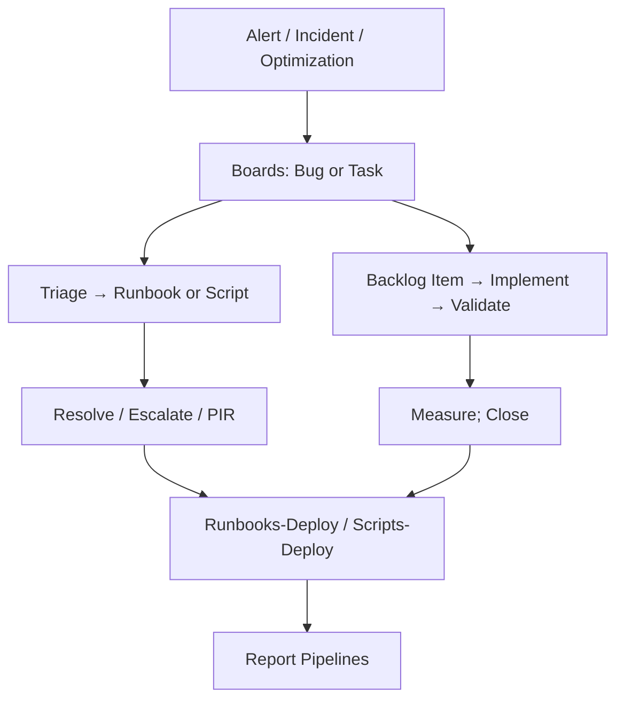
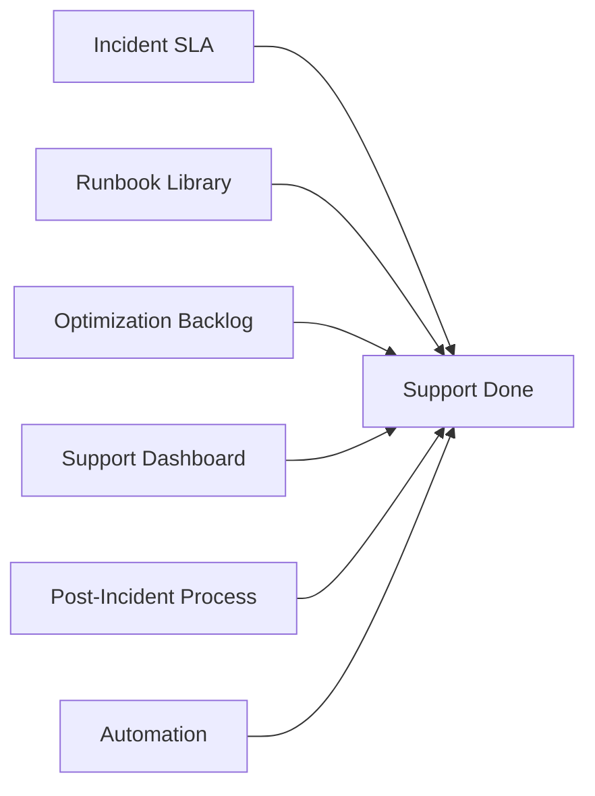
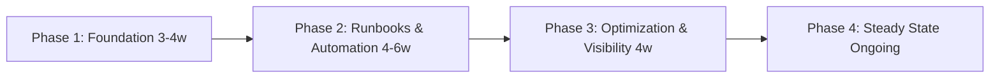
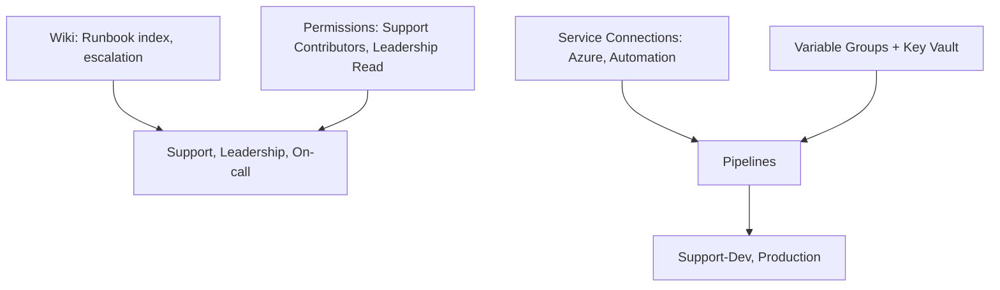

# Retail Production Support & Optimization

## Azure DevOps Project Overview

| Attribute | Value |
|-----------|--------|
| **Project Type** | Production Support, SRE, Performance Optimization |
| **Organization** | Azure DevOps Org |
| **Area Path** | Retail / Production Support |
| **Iteration** | Sprint-based (2 weeks) |

**What this project is:** This Azure DevOps project owns **retail production support and optimization**: ensuring retail systems meet SLA (uptime, latency, throughput); triaging and resolving incidents within SLAs; optimizing performance and cost; maintaining runbooks and automation; and providing visibility (dashboards, reports). Work is tracked in Boards under Retail/Production Support; pipelines deploy runbooks and scripts and run SLA and optimization reports.

---

## 1. Project Objectives

**Explanation:** Objectives define why the project exists: meet SLA, resolve incidents within SLA, optimize performance and cost, maintain runbooks and automation, and provide visibility. Each goal drives Features (incident management, runbooks and automation, performance optimization, cost optimization, support visibility) and pipelines (Runbooks-Validate, Runbooks-Deploy, Support-Scripts-Deploy, Optimization-Report, Incident-SLA-Report).

**Detailed objectives flow (how goals connect):**

1. **Meet SLA (uptime, latency, throughput)** → Incident management Feature; P1/P2 SLA tracking; runbooks for fast resolution; monitoring and alerting. Outcome: SLA visible and breaches tracked.
2. **Resolve incidents within SLA** → Runbooks and automation; integration with PagerDuty/Teams; create Bug from alert; post-incident review. Outcome: incidents resolved and documented.
3. **Optimize performance and cost** → Performance and cost optimization Features; Optimization-Report pipeline; backlog items per fix. Outcome: optimization backlog and measured improvements.
4. **Maintain runbooks and automation** → Runbooks in repo; Runbooks-Deploy and Support-Scripts-Deploy; versioning and review cycle. Outcome: runbooks executable and versioned.
5. **Provide visibility** → Support dashboard (uptime, open incidents, SLA); Incident-SLA-Report and Optimization-Report; weekly report automation. Outcome: support and leadership have visibility.

**Objectives flow**

- Ensure retail production systems meet SLA (uptime, latency, throughput)
- Triage and resolve incidents within defined SLAs; document root cause and actions
- Optimize performance (application, database, infra) and cost without degrading UX
- Maintain runbooks, playbooks, and automation for common incidents and maintenance
- Provide visibility (dashboards, reports) for support and leadership

**Objectives flow**



---

## 2. Azure DevOps Structure

### Repositories

| Repo | Purpose |
|------|---------|
| `retail-support-runbooks` | Step-by-step runbooks for incidents, restarts, scale, DR |
| `retail-support-scripts` | Automation scripts (restart, scale, backup, cleanup) |
| `retail-support-dashboards` | Dashboard definitions, alert rules (exportable to Azure/App Insights) |
| `retail-optimization-backlog` | Performance and cost optimization proposals and results |

**Explanation:** Repos hold runbooks, scripts, dashboard definitions, and optimization backlog. Runbooks-Validate and Runbooks-Deploy publish runbooks to Wiki or Azure Automation; Support-Scripts-Deploy deploys scripts; Incident-SLA-Report and Optimization-Report run on schedule and publish to Board or dashboard. All support and optimization assets are versioned and deployable via Azure DevOps.

**Detailed repository flow (step-by-step):**

1. **retail-support-runbooks** — Runbooks for incidents, restarts, scale, DR. PR triggers Runbooks-Validate (lint, link check). Merge triggers Runbooks-Deploy (publish to Wiki or Azure Automation). Outcome: runbooks available to on-call and support.
2. **retail-support-scripts** — Automation scripts (restart, scale, backup, cleanup). Merge triggers Support-Scripts-Deploy (deploy to automation account or shared location). Outcome: scripts versioned and executable.
3. **retail-support-dashboards** — Dashboard definitions and alert rules (exportable to Azure/App Insights). Updated when dashboards or alerts change. Outcome: dashboards and alerts in Azure or App Insights.
4. **retail-optimization-backlog** — Optimization proposals and results (or linked from Boards). Optimization-Report pipeline aggregates backlog; export to artifact or dashboard. Outcome: optimization backlog visible and prioritized.
5. **Flow:** Change in repo → PR (runbooks) or merge → Validate/Deploy pipeline → Wiki/Automation or shared location. Schedule: Incident-SLA-Report (daily); Optimization-Report (weekly).

**Repository flow**



### Boards (Work Item Hierarchy)

```
Epic: Retail Production Support & Optimization
├── Feature: Incident Management
│   ├── User Story: P1/P2 incident triage and resolution within SLA
│   ├── User Story: Post-incident review and action items in Boards
│   └── Task: Integration with PagerDuty/Teams; create Bug from alert
├── Feature: Runbooks & Automation
│   ├── User Story: Runbook for "High CPU / Memory" – scale or restart
│   ├── User Story: Runbook for "DB slow" – index, stats, failover
│   ├── User Story: Execute runbook from Azure DevOps / Azure Automation
│   └── Task: Runbook versioning and review cycle
├── Feature: Performance Optimization
│   ├── User Story: Identify slow APIs/queries; backlog item per fix
│   ├── User Story: Load test and baseline before/after
│   └── Task: Optimization tracked in Boards (link to app work items)
├── Feature: Cost Optimization
│   ├── User Story: Right-size underused resources; reserved capacity
│   └── Task: Cost report and approval workflow for changes
└── Feature: Support Visibility
    ├── User Story: Support dashboard (uptime, open incidents, SLA)
    └── Task: Weekly report automation from Boards and monitoring
```

**Explanation:** Boards organize support and optimization work. Epic is the container; Features group incidents, runbooks, performance optimization, cost optimization, and visibility. Bugs and Tasks are created from alerts or optimization ideas; work flows from New → Active → Resolved → Closed. Post-incident reviews create action items as Tasks.

**Detailed board flow (step-by-step):**

1. **Incident** — Alert or user report creates Bug (or Task) in Boards; linked to Epic/Feature (e.g. Incident Management). Severity P1/P2 set; SLA timer starts. Assigned to on-call or L2.
2. **Triage** — Owner selects runbook or escalates; may create Problem for RCA. State: Active.
3. **Resolution** — Run runbook or script; fix applied. State: Resolved. Post-incident review creates action items (Tasks) for runbook update or fix.
4. **Optimization** — Performance or cost idea creates Task under Performance or Cost Optimization. Implement → validate → measure; close when done. Outcome: optimization backlog and measured improvements.
5. **Runbook or script change** — Create Task under Runbooks & Automation; implement in repo; PR and deploy. Close when runbook/script deployed and validated.
6. **Closure** — Work item closed; PIR or runbook updated; evidence attached if needed. SLA and optimization reports feed dashboard.

**Board hierarchy flow**



### Pipelines

| Pipeline | Trigger | Purpose |
|----------|---------|---------|
| `Runbooks-Validate` | PR to retail-support-runbooks | Lint, link check; no deploy |
| `Runbooks-Deploy` | Merge to main | Publish runbooks to wiki or Azure Automation |
| `Support-Scripts-Deploy` | Merge to main | Deploy scripts to automation account / shared location |
| `Optimization-Report` | Schedule (weekly) | Aggregate optimization backlog; export to artifact/dashboard |
| `Incident-SLA-Report` | Schedule (daily) | Pull incident resolution times; update Board or report |

**Pipeline flow**



**Explanation:** Pipelines automate runbook and script deployment and reporting. Runbooks-Validate runs on PR; Runbooks-Deploy and Support-Scripts-Deploy run on merge; Optimization-Report and Incident-SLA-Report run on schedule. No manual deployment of runbooks or scripts to production outside pipeline.

**Detailed pipeline flow (step-by-step):**

1. **Runbooks-Validate (on PR)** — Trigger: PR to retail-support-runbooks. Steps: Lint runbook markdown; check links. Output: pass/fail. No deploy.
2. **Runbooks-Deploy (on merge)** — Trigger: merge to main. Steps: Publish runbooks to Wiki or Azure Automation account. Output: runbooks available; version tracked.
3. **Support-Scripts-Deploy (on merge)** — Trigger: merge to main (scripts repo). Steps: Deploy scripts to automation account or shared location. Output: scripts available for execution.
4. **Optimization-Report (weekly)** — Trigger: schedule. Steps: Aggregate optimization backlog from Boards or data source; export to artifact or dashboard. Output: optimization report visible.
5. **Incident-SLA-Report (daily)** — Trigger: schedule. Steps: Pull incident resolution times from Boards or ITSM; update Board or report. Output: SLA report visible.

**Pipeline flow**

| Environment | Use |
|-------------|-----|
| **Support-Dev** | Test runbooks and scripts (non-production) |
| **Production** | Read-only for automation; changes via change process |

**Environment flow**



---

## 3. End-to-End Project Flow

```
[Alert / Incident / Optimization Idea]
        │
        ▼
┌─────────────────────────────────────────────────────────────────┐
│ Boards: Bug (incident) or Task (optimization)                    │
│ Tag: P1/P2, component, optimization                              │
│ Link to Epic: Retail Production Support & Optimization           │
└─────────────────────────────────────────────────────────────────┘
        │
        ├── Incident path ─────────────────────────────────────────┐
        │   ▼                                                        │
        │   ┌───────────────────┐     ┌─────────────────────┐       │
        │   │ Triage → Runbook  │────▶│ Resolve / Escalate  │       │
        │   │ or script         │     │ Post-mortem; action │       │
        │   └───────────────────┘     └─────────────────────┘       │
        │                                                             │
        └── Optimization path ──────────────────────────────────────┤
            ▼                                                         │
            ┌───────────────────┐     ┌─────────────────────┐       │
            │ Backlog item      │────▶│ Implement → Validate │       │
            │ (perf/cost)       │     │ Measure; close       │       │
            └───────────────────┘     └─────────────────────┘       │
                                      │
                                      ▼
                        ┌────────────────────────┐
                        │ Runbooks-Deploy /      │
                        │ Scripts-Deploy         │
                        │ Report pipelines       │
                        └────────────────────────┘
```

**End-to-end flow (Mermaid)**



**Detailed end-to-end flow (step-by-step):**

1. **Trigger** — Alert, incident, or optimization idea. Creates Bug or Task in Boards; linked to Epic (Retail Production Support & Optimization). Tag P1/P2, component, optimization.
2. **Incident path** — Triage → assign runbook or script → execute runbook/script → resolve or escalate. Post-incident review; action items (runbook update, fix) as Tasks. Close Bug when resolved.
3. **Optimization path** — Backlog item (performance or cost) → implement (code or config change) → validate (measure before/after) → close when measured improvement or documented.
4. **Runbook/script change** — Task in Boards → branch in repo → PR → Runbooks-Validate or equivalent → merge → Runbooks-Deploy or Support-Scripts-Deploy. Outcome: runbooks or scripts updated in production or shared location.
5. **Reporting** — Incident-SLA-Report runs daily; Optimization-Report runs weekly. Results feed dashboard and Board. Leadership and support use for visibility.
6. **Feedback** — Incidents → runbook improvements and PIR actions; optimization → backlog and measured improvements; SLA breaches → process and tooling improvements.

---

## 4. Key Deliverables & Acceptance Criteria

| Deliverable | Acceptance Criteria |
|-------------|----------------------|
| Incident SLA | P1/P2 resolution within defined time; tracked in Boards or report |
| Runbook library | Critical scenarios covered; runbooks in repo; executable or documented |
| Optimization backlog | Performance and cost items in Boards; prioritized and measured |
| Support dashboard | Uptime, open incidents, SLA trend visible to support and leadership |
| Post-incident process | PIR template; action items created as work items; linked to incident |
| Automation | At least N runbooks automated (e.g., scale, restart) via pipeline/automation |

**Deliverables flow**



**Explanation:** Deliverables are the concrete outputs: incident SLA, runbook library, optimization backlog, support dashboard, post-incident process, automation. Each has acceptance criteria so support and leadership agree when the project is “done” for a given scope.

**Detailed deliverables flow (how each is produced):**

1. **Incident SLA** — P1/P2 resolution times tracked in Boards or ITSM; Incident-SLA-Report aggregates; dashboard shows SLA and breaches. Acceptance: SLA visible; breaches tracked.
2. **Runbook library** — Runbooks in repo; Runbooks-Deploy publishes to Wiki or Azure Automation. Acceptance: critical scenarios covered; runbooks in repo; executable or documented.
3. **Optimization backlog** — Performance and cost items in Boards; prioritized and measured; Optimization-Report feeds dashboard. Acceptance: backlog visible; items prioritized and measured.
4. **Support dashboard** — Uptime, open incidents, SLA trend visible to support and leadership. Acceptance: dashboard in place and updated.
5. **Post-incident process** — PIR template; action items created as work items; linked to incident. Acceptance: PIR done for significant incidents; actions tracked.
6. **Automation** — At least N runbooks automated (e.g. scale, restart) via pipeline or Azure Automation. Acceptance: automation in place and used.

---

## 5. Phases & Timeline (Example)

| Phase | Duration | Focus |
|-------|----------|--------|
| **Phase 1: Foundation** | 3–4 weeks | Repos, Boards structure, incident work item flow, first runbooks |
| **Phase 2: Runbooks & Automation** | 4–6 weeks | Runbooks for top 5 incidents; script deployment pipeline |
| **Phase 3: Optimization & Visibility** | 4 weeks | Optimization backlog; dashboard; SLA and weekly report |
| **Phase 4: Steady State** | Ongoing | Sprint cadence; runbook reviews; continuous optimization |

**Phases timeline flow**



**Explanation:** Phases order the work: foundation (repos, Boards, incident flow, first runbooks), then runbooks and automation, then optimization and visibility, then steady state. Timelines are examples; adjust to org capacity.

**Detailed phase flow (what happens in each phase):**

1. **Phase 1: Foundation (3–4 weeks)** — Create repos and Boards structure; define incident work item flow; set up first runbooks and basic pipelines (Runbooks-Deploy, Support-Scripts-Deploy). Outcome: support work tracked; runbooks deployable.
2. **Phase 2: Runbooks & Automation (4–6 weeks)** — Runbooks for top 5 incidents; script deployment pipeline; Azure Automation or equivalent for execution. Outcome: critical runbooks in place and executable.
3. **Phase 3: Optimization & Visibility (4 weeks)** — Optimization backlog; support dashboard; Incident-SLA-Report and Optimization-Report; weekly report automation. Outcome: optimization and SLA visible.
4. **Phase 4: Steady State (Ongoing)** — Sprint cadence; runbook reviews; continuous optimization; SLA and report automation. Outcome: support BAU; continuous improvement.

---

## 6. Azure DevOps Artifacts & Links

- **Wiki:** Runbook index, escalation matrix, optimization playbook
- **Service connections:** Azure (read + automation account for scripts)
- **Variable groups:** Alert webhook URLs, automation account; secrets in Key Vault
- **Permissions:** Support team (Contributors); Leadership (read dashboard/reports); On-call (run runbooks)

**Artifacts & links flow**



**Explanation:** Wiki holds runbook index, escalation matrix, and optimization playbook. Service connections (Azure, automation account) let pipelines deploy runbooks and scripts. Variable groups and Key Vault hold alert webhook URLs, automation account details, and secrets. Permissions: support team Contributors; leadership read dashboard/reports; on-call can run runbooks.

**Detailed artifacts flow (how they connect):**

1. **Wiki** — Runbook index, escalation matrix, optimization playbook. Updated when runbooks or process change. Linked from work items and notifications.
2. **Service connections** — Azure (read + automation account for scripts). Pipelines use these to deploy runbooks and scripts.
3. **Variable groups** — Alert webhook URLs, automation account; secrets in Key Vault. Referenced by Runbooks-Deploy, Support-Scripts-Deploy, and report pipelines.
4. **Permissions** — Support team: Contributors on support repos; run runbooks and scripts. Leadership: read dashboard and reports. On-call: run runbooks (via Automation or pipeline). Ensures support can update runbooks; leadership has visibility; on-call can execute.
