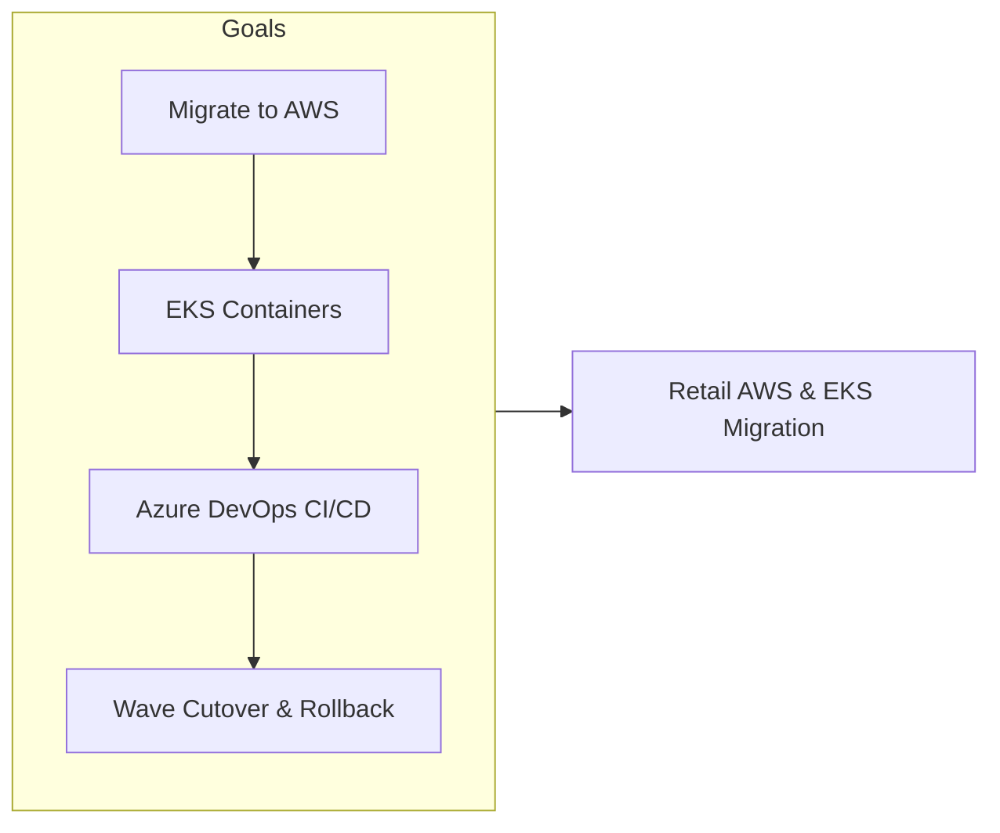
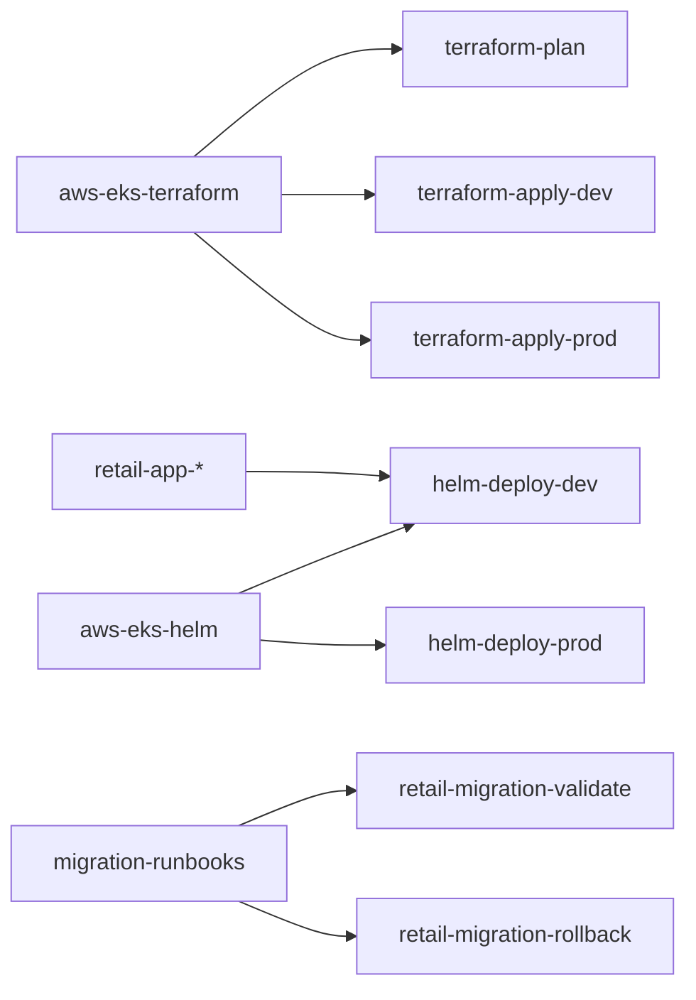
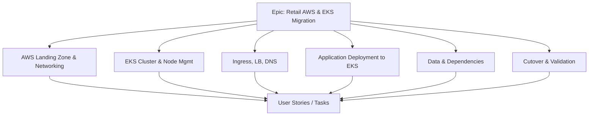
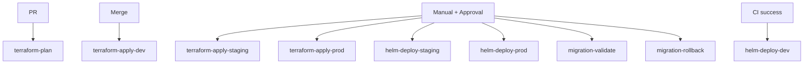
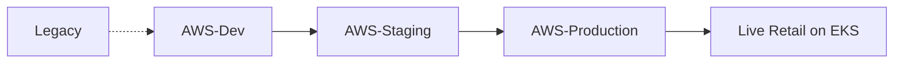
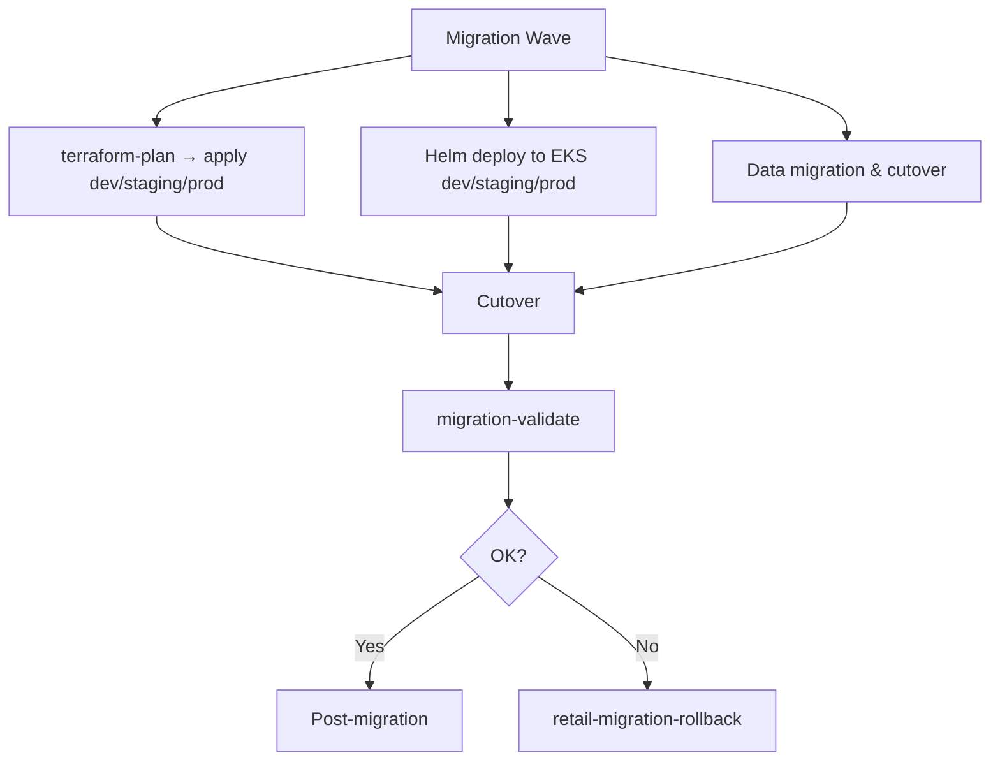
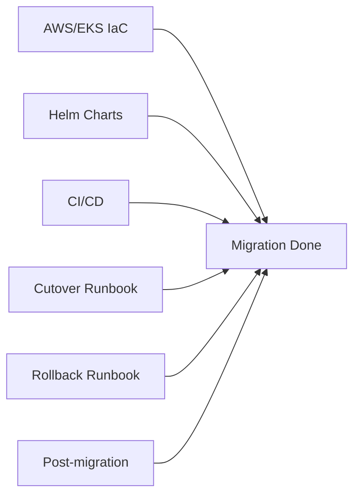
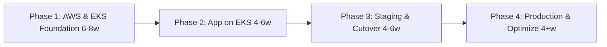
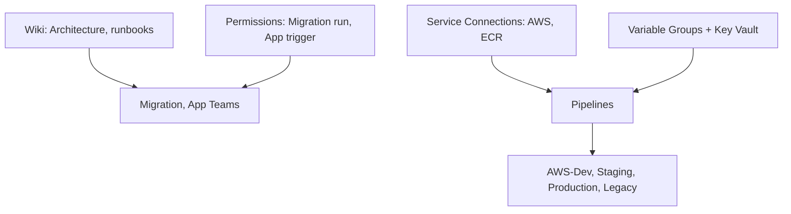

# Retail Platform Migration to AWS & EKS

## Azure DevOps Project Overview

| Attribute | Value |
|-----------|--------|
| **Project Type** | Cloud Migration, Kubernetes (EKS), AWS |
| **Organization** | Azure DevOps Org |
| **Area Path** | Retail / Migration / AWS-EKS |
| **Iteration** | Sprint-based (2–4 weeks per wave) |

**What this project is:** This Azure DevOps project runs **retail platform migration to AWS and EKS**: moving workloads from current hosting to AWS and running containerized applications on Amazon EKS. Azure DevOps is the orchestration layer (build in Azure DevOps, deploy to EKS). IaC (Terraform) and Helm charts are in repos; pipelines deploy Terraform and Helm. Work is organized in waves with cutover, validation, and rollback.

**Scope and boundaries**

- **In scope:** Terraform for VPC, EKS cluster, node groups, IAM, ALB, optional RDS; Helm charts for retail apps; CI/CD from Azure DevOps to ECR and EKS; migration runbooks (cutover, validation, rollback); wave-based cutover and post-migration optimization.
- **Out of scope (unless explicitly added):** Application feature development (owned by app teams); legacy system decommission details (may be separate project); non-retail workloads in the same AWS accounts.
- **Boundaries:** Migration/Platform team owns Terraform and Helm deploy pipelines; app teams build app code and trigger app pipeline; Migration approves prod infra and cutover; app teams do not change Terraform or run migration-apply-prod.

**Stakeholders**

- **Migration/Platform team** — Implement and maintain Terraform and Helm; run pipelines; maintain runbooks; approve or execute cutover and rollback.
- **App teams** — Build app code; consume EKS dev/staging/prod; report issues; no direct infra change.
- **CAB / Release Manager** — Approve production Terraform and Helm deploy; ensure change request is linked and cutover plan reviewed.
- **Security / Compliance** — Review AWS and EKS security baseline; sign off on evidence pack.
- **Business / Product** — Define wave scope and cutover calendar; sign off on go-live and rollback criteria.

**Success criteria (project level)**

- AWS/EKS infra and retail apps deployable from repo with no manual resource creation for in-scope components.
- Production Terraform and Helm deploy require approval and change request.
- Cutover and rollback runbooks executed per wave; migration-validate and migration-rollback pipelines tested.
- Post-migration monitoring and cost baseline; optimization backlog in Boards.

**Key principles**

- **Everything as code:** No one-off AWS console changes for in-scope resources; all changes via PR and pipeline.
- **Wave-based cutover:** Cutover and rollback per wave; validation and rollback tested before go-live.
- **Approval and audit:** Prod deploy and cutover gated; change request and pipeline run history retained for audit.
- **Runbooks and validation:** Cutover, validation, and rollback in repo; migration-validate and migration-rollback pipelines execute or document steps.

---

## 1. Project Objectives

**Explanation:** Objectives define why the migration exists: migrate to AWS, run containers on EKS with HA and scaling, use Azure DevOps for CI/CD targeting AWS, implement IaC and deploy via pipelines, and achieve wave-based cutover with validation and rollback. Each goal drives Features (AWS landing zone, EKS cluster, ingress/LB/DNS, app deployment, data, cutover) and pipelines (terraform-plan/apply, helm-deploy, migration-validate/rollback).

**Detailed objectives flow (how goals connect):**

1. **Migrate to AWS** → Terraform for VPC, EKS, node groups, IAM, ALB; Deploy-Azure replaced by Deploy-AWS (terraform-apply). Outcome: target state in AWS.
2. **EKS with HA and scaling** → EKS cluster and node groups in Terraform; Helm for app deploy; HPA and node autoscaling. Outcome: containers on EKS; scalable.
3. **Azure DevOps as orchestrator** → Build in Azure DevOps; push image to ECR; deploy via Helm from Azure DevOps to EKS. Outcome: one place for CI/CD and audit.
4. **IaC and pipelines** → Terraform and Helm in repos; terraform-plan on PR; terraform-apply and helm-deploy per env. Outcome: infra and app deployable via pipeline.
5. **Wave-based cutover and rollback** → Cutover runbook; migration-validate pipeline; migration-rollback pipeline. Outcome: cutover and rollback tested and documented.

**Objectives flow**

- Migrate retail platform workloads from current hosting (on-prem or other cloud) to AWS
- Run containerized applications on Amazon EKS with high availability and scaling
- Use Azure DevOps as the orchestration layer for CI/CD targeting AWS (build in Azure DevOps, deploy to EKS)
- Implement IaC (Terraform/CloudFormation) for AWS and EKS; version and deploy via pipelines
- Achieve wave-based cutover with validation, rollback, and post-migration optimization

**Objectives flow**



---

## 2. Azure DevOps Structure

### Repositories

| Repo | Purpose |
|------|---------|
| `retail-aws-eks-terraform` | Terraform for VPC, EKS cluster, node groups, IAM, ALB, RDS (if used) |
| `retail-aws-eks-helm` | Helm charts for retail apps on EKS |
| `retail-app-*` (existing) | Application code; CI unchanged; CD extended for EKS deploy |
| `retail-migration-runbooks` | Cutover, rollback, validation runbooks for AWS/EKS |
| `retail-aws-eks-pipelines` | Pipeline YAML for Terraform and Helm deploy |

**Explanation:** Repos hold Terraform for AWS/EKS, Helm charts for retail apps, app code (existing), migration runbooks, and pipeline YAML. Terraform and Helm are deployed via pipelines; runbooks drive cutover and rollback. All migration and app assets are versioned and deployable via Azure DevOps.

**Detailed repository flow (step-by-step):** (1) Terraform branch → terraform-plan on PR → terraform-apply-dev/staging/prod on merge or manual. (2) Helm branch → helm-deploy-dev/staging/prod on CI success or manual. (3) Runbooks updated when cutover/rollback steps change; migration-validate and migration-rollback pipelines execute or document runbook steps. (4) App repos (retail-app-*) build images; push to ECR; Helm deploy to EKS. Flow: Discovery → IaC and app changes → Pipelines deploy → Cutover-Validation → Go-live or rollback.

**Repository flow**



### Boards (Work Item Hierarchy)

```
Epic: Retail Platform Migration to AWS & EKS
├── Feature: AWS Landing Zone & Networking
│   ├── User Story: VPC, subnets, NAT, security groups via Terraform
│   ├── User Story: Private EKS endpoint; public/private node groups
│   └── Task: Terraform module reuse; pipeline for apply
├── Feature: EKS Cluster & Node Management
│   ├── User Story: EKS cluster (version, add-ons); node groups (ARM/x86)
│   ├── User Story: IRSA, OIDC for Azure DevOps or app identities
│   └── Task: Upgrade and scaling runbook
├── Feature: Ingress, Load Balancing, DNS
│   ├── User Story: ALB Ingress Controller or Gateway API; TLS
│   ├── User Story: Route53 and DNS cutover steps
│   └── Task: Health check and failover
├── Feature: Application Deployment to EKS
│   ├── User Story: Helm deploy from Azure DevOps to EKS (dev/staging/prod)
│   ├── User Story: Secrets (AWS Secrets Manager / Parameter Store); configmaps
│   └── Task: Rollback and canary strategy
├── Feature: Data & Dependencies
│   ├── User Story: RDS/Aurora or other data store in Terraform
│   ├── User Story: Migration of data; sync and cutover
│   └── Task: Backup and restore validation
└── Feature: Cutover & Validation
    ├── User Story: Cutover checklist; DNS switch; smoke tests
    ├── User Story: Rollback procedure
    └── Task: Post-migration monitoring and optimization backlog
```

**Explanation:** Boards organize migration work hierarchically. The **Epic** is the top-level container (Retail Platform Migration to AWS & EKS). **Features** group related capabilities (AWS landing zone, EKS cluster, ingress, app deployment, data, cutover). **User Stories** and **Tasks** are the work items that teams pull into waves or sprints. Every infra, app, or runbook change should be linked to an Epic or Feature so progress and scope are visible. Boards drive reporting: burndown, velocity, and "work completed per wave" for stakeholders.

**Work item types and states**

- **Epic** — State: New → In Progress → Done. Used for the migration initiative or per-wave (e.g. "Wave 1: Core Retail"). Child Features and Stories roll up.
- **Feature** — State: New → In Progress → Done. Groups User Stories and Tasks (e.g. "EKS Cluster & Node Management", "Cutover & Validation").
- **User Story** — State: New → Active → Resolved → Closed. Represents a capability outcome (e.g. "VPC, subnets, NAT via Terraform"). May have child Tasks.
- **Task** — State: New → Active → Resolved → Closed. Concrete work (e.g. "Terraform module for EKS"; "Update cutover runbook"). Linked to parent Story or Feature.

**Detailed board flow (how work moves):**

1. **New work** → Create a User Story or Task under the appropriate Feature (e.g. "ALB Ingress Controller" under Ingress, LB, DNS). Link to Epic. **Who:** Migration or app engineer. **Inputs:** Requirement (from business or wave plan). **Outputs:** Work item in New or Active state.
2. **Wave planning** → Move items into the wave iteration; assign owner. **Who:** Migration lead. **Inputs:** Backlog; wave scope; priority. **Outputs:** Wave backlog populated.
3. **Development** → Owner creates branch in Terraform/Helm/runbook repo; implements; opens PR; links work item (AB#&lt;id&gt;). **Outputs:** PR linked; terraform-plan or helm lint runs.
4. **Review & merge** → Reviewer approves; merge triggers deploy pipeline (dev) or enables manual deploy. Work item moves to Resolved when deploy and validation are done.
5. **Cutover/Prod** → For prod Terraform or Helm deploy: link change request; approval gate. **Outputs:** CR linked; CAB approval recorded.
6. **Closure** → When cutover validation or post-migration checks are complete, close work item; attach pipeline run or runbook evidence if needed for audit.

**Board hierarchy flow**



### Pipelines

| Pipeline | Trigger | Purpose |
|----------|---------|---------|
| `retail-aws-terraform-plan` | PR | Terraform plan; no apply |
| `retail-aws-terraform-apply-dev` | Merge to dev / manual | Apply Terraform to dev AWS account |
| `retail-aws-terraform-apply-staging` | Manual + approval | Apply to staging |
| `retail-aws-terraform-apply-prod` | Manual + approval | Apply to prod; link change request |
| `retail-eks-helm-deploy-dev` | CI success or manual | Deploy Helm to EKS dev |
| `retail-eks-helm-deploy-staging` | Manual / release branch | Deploy to EKS staging |
| `retail-eks-helm-deploy-prod` | Manual + approval | Deploy to EKS prod |
| `retail-migration-validate` | Manual | Post-cutover validation (smoke, load sample) |
| `retail-migration-rollback` | Manual | Runbook automation for rollback |

**Explanation:** Pipelines automate Terraform plan/apply and Helm deploy to AWS/EKS. No one applies Terraform or deploys Helm by hand for in-scope changes; every change goes through a pipeline. Plan runs on every PR to catch errors early; apply and Helm deploy are gated by environment (dev looser, prod strict with approval and change request). Failure in a step fails the job; pipeline can be retried or fixed and re-run.

**Pipeline anatomy (typical)**

- **terraform-plan (on PR)** — Checkout → Terraform init/validate → terraform plan (no apply). No deployment. Output: plan in log for reviewers.
- **terraform-apply-*** — Checkout → Terraform init → terraform apply to target AWS account/region. Approval gate for staging/prod; prod links change request.
- **helm-deploy-*** — Checkout Helm repo or use artifact → kubectl/helm to EKS (dev/staging/prod). Uses ECR image from app CI. Approval for prod.
- **migration-validate** — Run smoke/load sample per runbook; report pass/fail. Manual after cutover.
- **migration-rollback** — Execute rollback runbook steps (e.g. DNS revert, traffic switch back). Manual when cutover fails.

**Failure handling:** terraform-plan fails → do not merge; fix Terraform or variables. terraform-apply fails → check log (quota, IAM, state); fix and re-run. helm-deploy fails → check image, EKS connectivity, resource limits. Approval denied → update CR or work item; re-request.

**Detailed pipeline flow (step-by-step):**

1. **terraform-plan (on PR)** — Trigger: PR to retail-aws-eks-terraform. Steps: checkout → terraform init/validate → plan (no apply). Output: plan in log. Failure: fix Terraform and re-push.
2. **terraform-apply-dev** — Trigger: merge to dev branch or manual. Steps: checkout → apply to dev AWS account. Output: dev AWS/EKS updated. No approval.
3. **terraform-apply-staging / prod** — Trigger: manual; staging optional approval; prod mandatory approval + CR link. Steps: approval gate → checkout → apply to target account. Output: staging/prod infra updated. Failure: fix and re-run; if prod partial, consider rollback and incident.
4. **helm-deploy-dev** — Trigger: CI success (app image in ECR) or manual. Steps: deploy Helm to EKS dev. Output: apps running on EKS dev.
5. **helm-deploy-staging / prod** — Trigger: manual; prod approval + CR. Steps: deploy Helm to EKS staging/prod. Output: apps on EKS staging/prod.
6. **migration-validate** — Trigger: manual after cutover. Steps: run smoke/load sample per runbook; record result. Output: pass/fail report.
7. **migration-rollback** — Trigger: manual when cutover fails. Steps: execute rollback runbook (DNS, traffic, data if applicable). Output: traffic reverted; post-rollback review.

**Pipeline flow**



### Environments

| Environment | Use |
|-------------|-----|
| **AWS-Dev** | Dev AWS account; EKS dev; low cost |
| **AWS-Staging** | Staging account; production-like EKS |
| **AWS-Production** | Production account; EKS prod; strict approvals |
| **Legacy** | Source systems; read-only during migration |

**Explanation:** Environments in Azure DevOps represent deployment targets (AWS accounts and EKS clusters) and carry approval and protection rules. AWS-Dev is for daily changes with minimal gates; AWS-Staging mirrors production for pre-cutover validation; AWS-Production has strict approvals; Legacy is the source system (read-only). Pipeline stages target these environments so promotions are explicit and auditable.

**Approval configuration (recommended)**

- **AWS-Dev:** No approval; fast iteration for Terraform and Helm.
- **AWS-Staging:** Optional approval (e.g. Migration lead) before staging apply/deploy.
- **AWS-Production:** Mandatory approval (e.g. CAB, Release Manager); change request must be linked. Ensures no prod deploy without review and CR.
- **Legacy:** No deploy from this project; used for documentation and runbook references only.

**Detailed environment flow (step-by-step):**

1. **AWS-Dev** — Used for all initial Terraform and Helm work. Low-cost resources; single AZ if acceptable. **Inputs:** Merged dev branch or manual run. **Outputs:** Dev AWS account and EKS dev updated. **Failure:** Fix and re-run.
2. **AWS-Staging** — Production-like EKS and networking. Manual trigger; optional approval. Used for cutover rehearsal and validation. **Inputs:** Branch (e.g. main); staging variable group. **Outputs:** Staging AWS/EKS updated.
3. **AWS-Production** — Deploy only after staging sign-off. Approval required; CR linked. Same IaC and Helm, prod variable group. **Inputs:** Branch/commit; prod variable group; approval; change request. **Outputs:** Production AWS/EKS updated; audit trail.
4. **Legacy** — Source systems; no deploy. Runbooks reference Legacy for data sync and cutover steps.
5. **Promotion path:** Code merge → AWS-Dev (auto or manual) → AWS-Staging (manual + optional approval) → AWS-Production (manual + mandatory approval). No skip: do not deploy to prod without staging unless emergency (document and PIR).

**Environment promotion flow**



---

## 3. End-to-End Project Flow

```
[Migration Wave]
        │
        ▼
┌─────────────────────────────────────────────────────────────────┐
│ Boards: Epic (Wave N) → Feature (infra / app / cutover) → Stories│
│ Repos: retail-aws-eks-terraform, retail-aws-eks-helm, apps       │
└─────────────────────────────────────────────────────────────────┘
        │
        ▼
┌───────────────────┐     ┌─────────────────────┐
│ retail-aws-       │────▶│ Plan → Review       │
│ terraform-plan    │     │ Apply (dev/stage/   │
│ (on PR)           │     │ prod)               │
└───────────────────┘     └──────────┬──────────┘
                                      │
        ┌─────────────────────────────┼─────────────────────────────┐
        ▼                             ▼                             ▼
┌───────────────┐           ┌─────────────────┐           ┌─────────────────┐
│ EKS cluster   │           │ Helm deploy     │           │ Data migration  │
│ + VPC + IAM   │           │ (from Azure     │           │ & cutover       │
│ (Terraform)   │           │ DevOps to EKS)  │           │ runbook         │
└───────────────┘           └─────────────────┘           └─────────────────┘
        │                             │                             │
        └─────────────────────────────┼─────────────────────────────┘
                                      ▼
                        ┌────────────────────────┐
                        │ retail-migration-       │
                        │ validate → cutover      │
                        │ → rollback if needed    │
                        └────────────────────────┘
```

**End-to-end flow (Mermaid)**



**Detailed end-to-end flow (step-by-step):**

1. **Wave definition** — Migration wave (e.g. Wave 1: Core Retail) defined in Boards; Epic/Features/Stories created. Terraform and Helm changes in repos; runbooks updated as needed.
2. **Terraform** — Branch in retail-aws-eks-terraform → PR → terraform-plan runs (no apply). After review and merge, terraform-apply-dev, then staging, then prod (with approval and CR for prod). Outcome: VPC, EKS, node groups, IAM, ALB (and optional RDS) in AWS.
3. **Helm deploy** — Branch in retail-aws-eks-helm or app repos; CI builds images and pushes to ECR. Helm deploy to EKS dev (on CI success or manual), then staging, then prod (manual + approval for prod). Outcome: retail apps running on EKS in each environment.
4. **Data migration** — Per runbook: data sync from Legacy to AWS (e.g. RDS/Aurora); validation; cutover steps documented and executed.
5. **Cutover** — Execute cutover runbook: final data sync; DNS/traffic switch to AWS/EKS; run migration-validate pipeline (smoke, load sample).
6. **Go-live or rollback** — If migration-validate passes → go-live; monitor; post-migration optimization backlog. If it fails → run migration-rollback pipeline and runbook; revert DNS/traffic; post-incident review.
7. **Post-migration** — Monitor production; cost and performance optimization; decommission Legacy when stable; close wave work items.

---

## 4. Key Deliverables & Acceptance Criteria

| Deliverable | Acceptance Criteria |
|-------------|----------------------|
| AWS/EKS IaC | VPC, EKS, node groups, ingress, optional RDS in Terraform; deployable via pipeline |
| Helm charts | Retail apps deployable to EKS from Azure DevOps; env-specific values |
| CI/CD | Build in Azure DevOps; push image to ECR; deploy to EKS via pipeline with approvals |
| Cutover runbook | Steps for DNS, traffic switch, validation; executed per wave |
| Rollback runbook | Steps and pipeline to revert; tested in drill |
| Post-migration | Monitoring, cost baseline, optimization backlog in Boards |

**Explanation:** Deliverables are the concrete outputs that define "done" for the migration. Each has clear acceptance criteria so the team and stakeholders agree when a deliverable is complete. They feed into go-live, operations, and audit.

**Detailed deliverables flow (how each is produced):**

1. **AWS/EKS IaC** — Produced by implementing Terraform in retail-aws-eks-terraform; acceptance: VPC, EKS, node groups, ingress, optional RDS deployable via pipeline. Verified by terraform-plan on PR and apply runs per env.
2. **Helm charts** — Produced in retail-aws-eks-helm; acceptance: retail apps deployable to EKS from Azure DevOps with env-specific values. Verified by helm-deploy to dev/staging/prod.
3. **CI/CD** — Build in Azure DevOps; push image to ECR; deploy to EKS via pipeline with approvals. Acceptance: no manual deploy for in-scope apps; prod requires approval and CR.
4. **Cutover runbook** — Written in retail-migration-runbooks; acceptance: steps for DNS, traffic switch, validation; executed per wave. Verified by migration-validate pipeline and cutover execution.
5. **Rollback runbook** — Steps and pipeline (migration-rollback) to revert; acceptance: tested in drill. Verified by rollback drill and pipeline run.
6. **Post-migration** — Monitoring dashboards; cost baseline; optimization backlog in Boards. Acceptance: monitoring in place; backlog items for tuning and decommission.

**Deliverables flow**



---

## 5. Phases & Timeline (Example)

| Phase | Duration | Focus |
|-------|----------|--------|
| **Phase 1: AWS & EKS Foundation** | 6–8 weeks | Terraform for VPC, EKS, node groups; pipeline for plan/apply; dev only |
| **Phase 2: App on EKS** | 4–6 weeks | Helm charts; deploy from Azure DevOps to EKS dev/staging |
| **Phase 3: Staging & Cutover** | 4–6 weeks | Staging full deploy; data migration; cutover and validation runbook |
| **Phase 4: Production & Optimize** | 4+ weeks | Prod cutover; monitoring; cost and performance optimization |

**Explanation:** Phases break the migration into ordered stages so that AWS and EKS foundation is built first, then apps on EKS, then staging and cutover, then production and optimization. Each phase has a duration and focus; timelines are examples and should be adjusted to org capacity and wave scope.

**Detailed phase flow (what happens in each phase):**

1. **Phase 1: AWS & EKS Foundation (6–8 weeks)** — Set up Terraform for VPC, EKS cluster, node groups, IAM, ALB; pipeline for plan (on PR) and apply to dev only. Outcome: dev AWS account and EKS dev deployable from code; team can iterate safely.
2. **Phase 2: App on EKS (4–6 weeks)** — Helm charts for retail apps; deploy from Azure DevOps to EKS dev and staging (CI success or manual). Outcome: apps running on EKS dev/staging; CD path validated.
3. **Phase 3: Staging & Cutover (4–6 weeks)** — Full staging deploy; data migration and cutover runbook; migration-validate and migration-rollback pipelines; cutover rehearsal. Outcome: cutover and rollback tested and documented.
4. **Phase 4: Production & Optimize (4+ weeks)** — Production cutover (approval + CR); monitoring; cost and performance optimization; post-migration backlog; decommission Legacy when stable. Outcome: live retail on AWS/EKS; steady state and optimization.

**Phases timeline flow**



---

## 6. Azure DevOps Artifacts & Links

- **Wiki:** Architecture (AWS/EKS), runbooks, cutover calendar, rollback steps
- **Service connections:** AWS (OIDC or access key for Terraform and EKS deploy); ACR/ECR for images
- **Variable groups:** Per environment (AWS account, region, EKS name, Helm release); secrets in Key Vault
- **Permissions:** Migration/Platform (run Terraform and Helm); App teams (trigger app pipeline; no infra change)

**Explanation:** Wiki, service connections, variable groups, and permissions support the migration. Wiki holds architecture, runbooks, and cutover calendar; service connections allow pipelines to deploy to AWS and push to ECR; variable groups provide per-env config and secrets from Key Vault; permissions separate Migration (infra and Helm) from App teams (app pipeline only).

**Detailed artifacts flow (how they are used):**

1. **Wiki** — Architecture (VPC, EKS, ALB, DNS); runbooks (cutover, rollback, validation); cutover calendar; post-migration checklist. Updated via PR to retail-migration-runbooks or direct Wiki edit per org policy.
2. **Service connections** — AWS (OIDC or access key) for Terraform and Helm to EKS; ECR for image push from app CI. Configured in Azure DevOps project settings; used by pipeline YAML.
3. **Variable groups** — Per environment: AWS account ID, region, EKS cluster name, Helm release name; secrets (e.g. AWS credentials if not OIDC) in Key Vault linked to variable group. Pipelines resolve at run time.
4. **Permissions** — Migration/Platform: run Terraform and Helm pipelines; approve prod. App teams: run app build pipeline and trigger Helm deploy (no direct Terraform or infra change). Configured via Azure DevOps security.

**Artifacts & links flow**


