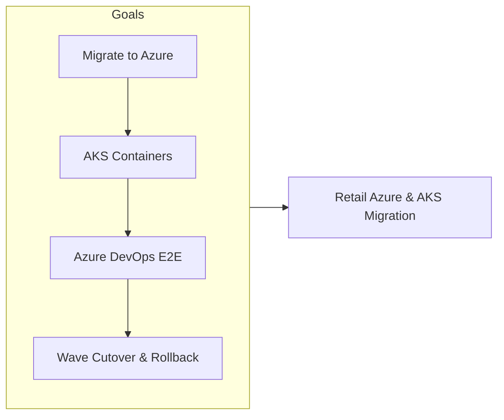
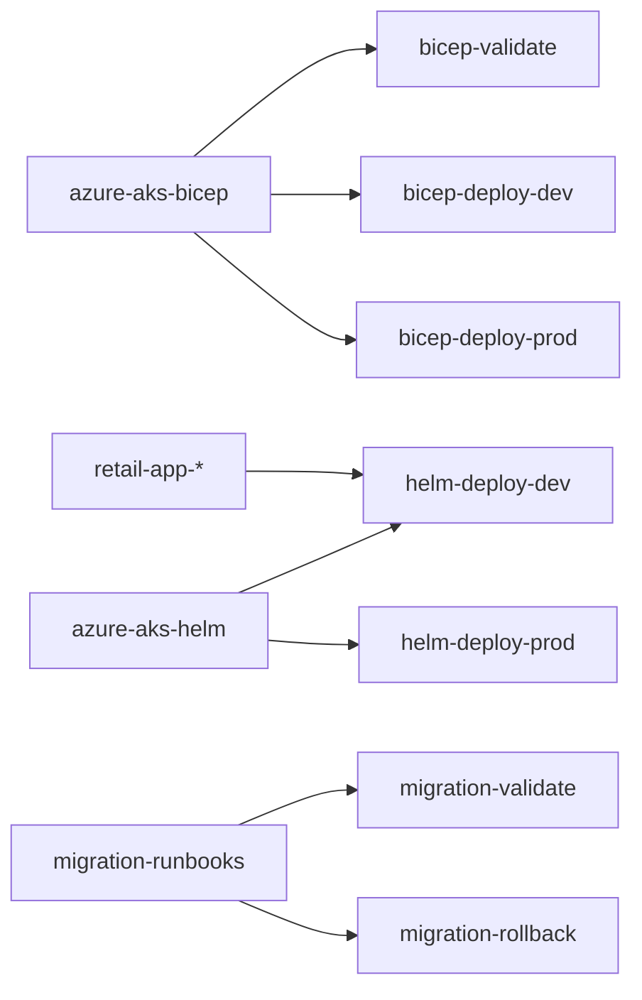
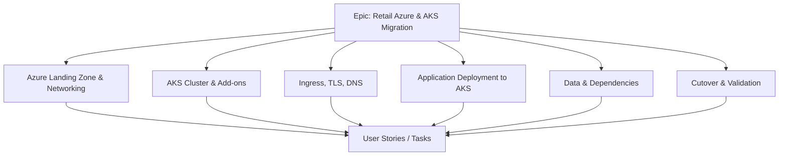
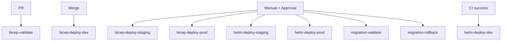
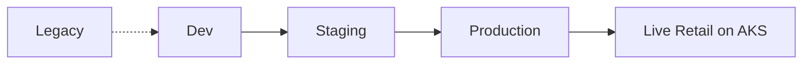
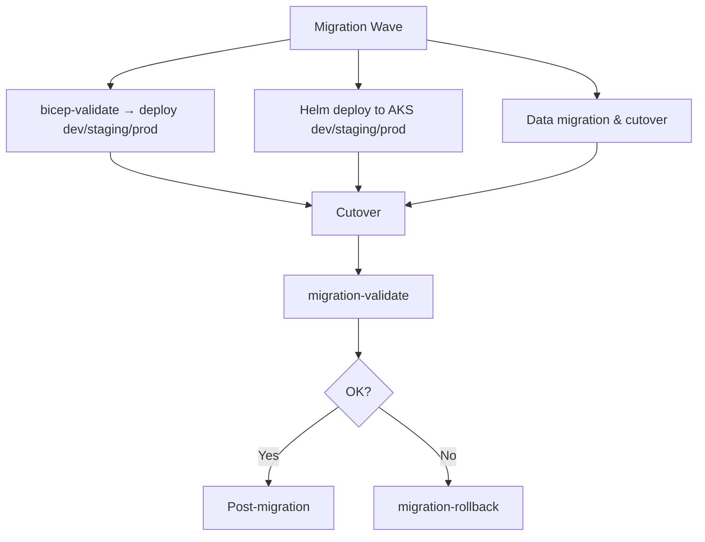
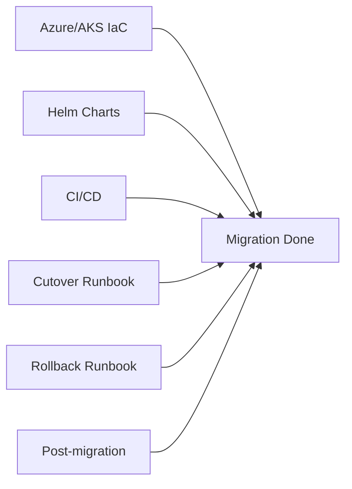
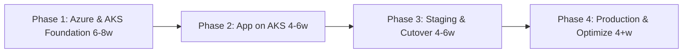
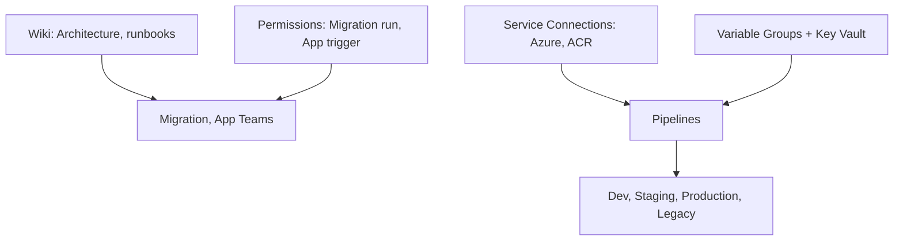

# Retail Platform Migration to Azure DevOps & AKS

## Azure DevOps Project Overview

| Attribute | Value |
|-----------|--------|
| **Project Type** | Cloud Migration, Kubernetes (AKS), Azure-Native DevOps |
| **Organization** | Azure DevOps Org |
| **Area Path** | Retail / Migration / Azure-AKS |
| **Iteration** | Sprint-based (2–4 weeks per wave) |

**What this project is:** This Azure DevOps project runs **retail platform migration to Azure DevOps and AKS**: moving workloads to Azure and running containerized applications on Azure Kubernetes Service (AKS). Azure DevOps is used end-to-end (repos, pipelines, boards, Azure service connections). IaC (Bicep) and Helm charts are in repos; pipelines deploy Bicep and Helm. Work is organized in waves with cutover, validation, and rollback.

**Scope and boundaries**

- **In scope:** Bicep for VNet, AKS, ACR, managed identity, ingress; Helm charts for retail apps; CI/CD from Azure DevOps to ACR and AKS; migration runbooks (cutover, validation, rollback); wave-based cutover and post-migration optimization.
- **Out of scope (unless explicitly added):** Application feature development (owned by app teams); legacy system decommission details (may be separate project); non-retail workloads in the same Azure subscriptions.
- **Boundaries:** Migration/Platform team owns Bicep and Helm deploy pipelines; app teams build app code and trigger app pipeline; Migration approves prod infra and cutover; app teams do not change Bicep or run bicep-deploy-prod.

**Stakeholders**

- **Migration/Platform team** — Implement and maintain Bicep and Helm; run pipelines; maintain runbooks; approve or execute cutover and rollback.
- **App teams** — Build app code; consume AKS dev/staging/prod; report issues; no direct infra change.
- **CAB / Release Manager** — Approve production Bicep and Helm deploy; ensure change request is linked and cutover plan reviewed.
- **Security / Compliance** — Review Azure and AKS security baseline; sign off on evidence pack.
- **Business / Product** — Define wave scope and cutover calendar; sign off on go-live and rollback criteria.

**Success criteria (project level)**

- Azure/AKS infra and retail apps deployable from repo with no manual resource creation for in-scope components.
- Production Bicep and Helm deploy require approval and change request.
- Cutover and rollback runbooks executed per wave; migration-validate and migration-rollback pipelines tested.
- Post-migration monitoring (App Insights, Log Analytics) and cost baseline; optimization backlog in Boards.

**Key principles**

- **Everything as code:** No one-off Azure portal changes for in-scope resources; all changes via PR and pipeline.
- **Wave-based cutover:** Cutover and rollback per wave; validation and rollback tested before go-live.
- **Approval and audit:** Prod deploy and cutover gated; change request and pipeline run history retained for audit.
- **Runbooks and validation:** Cutover, validation, and rollback in repo; migration-validate and migration-rollback pipelines execute or document steps.

---

## 1. Project Objectives

**Explanation:** Objectives define why the migration exists: migrate to Azure, run containers on AKS, use Azure DevOps end-to-end, implement IaC and deploy via pipelines, establish CI/CD to AKS with approval gates, and achieve wave-based cutover with validation and rollback. Each goal drives Features (Azure landing zone, AKS cluster, ingress/TLS/DNS, app deployment, data, cutover) and pipelines (bicep-validate/deploy, helm-deploy, migration-validate/rollback).

**Detailed objectives flow (how goals connect):**

1. **Migrate to Azure** → Bicep for VNet, AKS, ACR, managed identity, ingress; bicep-deploy per env. Outcome: target state in Azure.
2. **AKS with HA and scaling** → AKS cluster and node pools in Bicep; Helm for app deploy; ACR integration; workload identity. Outcome: containers on AKS; scalable.
3. **Azure DevOps end-to-end** → Repos, pipelines, boards, Azure service connections; build in Azure DevOps; push to ACR; deploy to AKS via pipeline. Outcome: native Azure DevOps experience.
4. **IaC and CI/CD with approval gates** → Bicep and Helm in repos; bicep-validate on PR; bicep-deploy and helm-deploy per env; approval on prod. Outcome: infra and app deployable via pipeline; prod protected.
5. **Wave-based cutover and rollback** → Cutover runbook; migration-validate pipeline; migration-rollback pipeline. Outcome: cutover and rollback tested and documented.

**Objectives flow**

- Migrate retail platform workloads to Azure and run containerized applications on Azure Kubernetes Service (AKS)
- Use Azure DevOps end-to-end: repos, pipelines, boards, and Azure service connections for a native experience
- Implement IaC (Bicep/Terraform) for Azure and AKS; deploy via Azure DevOps pipelines
- Establish CI/CD from Azure DevOps to AKS (ACR, Helm or manifest deploy) with approval gates
- Execute wave-based cutover with validation, rollback, and post-migration optimization

**Objectives flow**



---

## 2. Azure DevOps Structure

### Repositories

| Repo | Purpose |
|------|---------|
| `retail-azure-aks-bicep` | Bicep for VNet, AKS, ACR, managed identity, ingress (App Gateway or NGINX) |
| `retail-azure-aks-helm` | Helm charts for retail apps on AKS |
| `retail-app-*` (existing) | Application code; CI in Azure DevOps; CD to AKS |
| `retail-migration-runbooks` | Cutover, rollback, validation runbooks for Azure/AKS |
| `retail-azure-pipelines` | Pipeline YAML for Bicep and Helm deploy |

**Explanation:** Repos hold Bicep for Azure/AKS, Helm charts for retail apps, app code (existing), migration runbooks, and pipeline YAML. Bicep and Helm are deployed via pipelines; runbooks drive cutover and rollback. All migration and app assets are versioned and deployable via Azure DevOps.

**Detailed repository flow (step-by-step):** (1) Bicep branch → bicep-validate on PR → bicep-deploy-dev/staging/prod on merge or manual. (2) Helm branch → helm-deploy-dev/staging/prod on CI success or manual. (3) Runbooks updated when cutover/rollback steps change; migration-validate and migration-rollback pipelines execute or document runbook steps. (4) App repos (retail-app-*) build images; push to ACR; Helm deploy to AKS. Flow: Discovery → IaC and app changes → Pipelines deploy → Cutover-Validation → Go-live or rollback.

**Repository flow**



### Boards (Work Item Hierarchy)

```
Epic: Retail Platform Migration to Azure DevOps & AKS
├── Feature: Azure Landing Zone & Networking
│   ├── User Story: VNet, subnets, private AKS, NSGs via Bicep
│   ├── User Story: Azure Firewall or App Gateway for ingress
│   └── Task: Bicep modules; pipeline for deploy
├── Feature: AKS Cluster & Add-ons
│   ├── User Story: AKS cluster (version, node pools, auto-scale)
│   ├── User Story: ACR integration; workload identity (OIDC)
│   └── Task: Upgrade and scaling runbook
├── Feature: Ingress, TLS, DNS
│   ├── User Story: Application Gateway Ingress Controller or NGINX; TLS
│   ├── User Story: Azure DNS and cutover steps
│   └── Task: Health check and failover
├── Feature: Application Deployment to AKS
│   ├── User Story: Build in Azure DevOps; push to ACR; Helm deploy to AKS
│   ├── User Story: Key Vault integration; configmaps and secrets
│   └── Task: Rollback and canary strategy
├── Feature: Data & Dependencies
│   ├── User Story: Azure SQL / Cosmos / Storage in Bicep
│   ├── User Story: Data migration and cutover
│   └── Task: Backup and restore validation
└── Feature: Cutover & Validation
    ├── User Story: Cutover checklist; DNS switch; smoke tests
    ├── User Story: Rollback procedure
    └── Task: Post-migration monitoring and optimization backlog
```

**Explanation:** Boards organize migration work hierarchically. The **Epic** is the top-level container (Retail Platform Migration to Azure DevOps & AKS). **Features** group related capabilities (Azure landing zone, AKS cluster, ingress, app deployment, data, cutover). **User Stories** and **Tasks** are the work items that teams pull into waves or sprints. Every infra, app, or runbook change should be linked to an Epic or Feature so progress and scope are visible. Boards drive reporting: burndown, velocity, and "work completed per wave" for stakeholders.

**Work item types and states**

- **Epic** — State: New → In Progress → Done. Used for the migration initiative or per-wave (e.g. "Wave 1: Core Retail"). Child Features and Stories roll up.
- **Feature** — State: New → In Progress → Done. Groups User Stories and Tasks (e.g. "AKS Cluster & Add-ons", "Cutover & Validation").
- **User Story** — State: New → Active → Resolved → Closed. Represents a capability outcome (e.g. "VNet, subnets, private AKS via Bicep"). May have child Tasks.
- **Task** — State: New → Active → Resolved → Closed. Concrete work (e.g. "Bicep module for AKS"; "Update cutover runbook"). Linked to parent Story or Feature.

**Detailed board flow (how work moves):**

1. **New work** → Create a User Story or Task under the appropriate Feature (e.g. "Application Gateway Ingress Controller" under Ingress, TLS, DNS). Link to Epic. **Who:** Migration or app engineer. **Inputs:** Requirement (from business or wave plan). **Outputs:** Work item in New or Active state.
2. **Wave planning** → Move items into the wave iteration; assign owner. **Who:** Migration lead. **Inputs:** Backlog; wave scope; priority. **Outputs:** Wave backlog populated.
3. **Development** → Owner creates branch in Bicep/Helm/runbook repo; implements; opens PR; links work item (AB#&lt;id&gt;). **Outputs:** PR linked; bicep-validate or helm lint runs.
4. **Review & merge** → Reviewer approves; merge triggers deploy pipeline (dev) or enables manual deploy. Work item moves to Resolved when deploy and validation are done.
5. **Cutover/Prod** → For prod Bicep or Helm deploy: link change request; approval gate. **Outputs:** CR linked; CAB approval recorded.
6. **Closure** → When cutover validation or post-migration checks are complete, close work item; attach pipeline run or runbook evidence if needed for audit.

**Board hierarchy flow**



### Pipelines

| Pipeline | Trigger | Purpose |
|----------|---------|---------|
| `retail-azure-bicep-validate` | PR | Bicep validate; what-if; no deploy |
| `retail-azure-bicep-deploy-dev` | Merge to dev / manual | Deploy Bicep to dev subscription |
| `retail-azure-bicep-deploy-staging` | Manual + approval | Deploy to staging |
| `retail-azure-bicep-deploy-prod` | Manual + approval | Deploy to prod; link change request |
| `retail-aks-helm-deploy-dev` | CI success or manual | Deploy Helm to AKS dev |
| `retail-aks-helm-deploy-staging` | Manual / release branch | Deploy to AKS staging |
| `retail-aks-helm-deploy-prod` | Manual + approval | Deploy to AKS prod |
| `retail-migration-validate` | Manual | Post-cutover validation |
| `retail-migration-rollback` | Manual | Rollback runbook automation |

**Explanation:** Pipelines automate Bicep validate/deploy and Helm deploy to Azure/AKS. No one deploys Bicep or Helm by hand for in-scope changes; every change goes through a pipeline. Validate runs on every PR to catch errors early; deploy pipelines are gated by environment (dev looser, prod strict with approval and change request). Failure in a step fails the job; pipeline can be retried or fixed and re-run.

**Pipeline anatomy (typical)**

- **bicep-validate (on PR)** — Checkout → Bicep build/validate → what-if (no deploy). No deployment. Output: what-if in log for reviewers.
- **bicep-deploy-*** — Checkout → Bicep deploy to target Azure subscription/resource group. Approval gate for staging/prod; prod links change request.
- **helm-deploy-*** — Checkout Helm repo or use artifact → deploy to AKS (dev/staging/prod). Uses ACR image from app CI. Approval for prod.
- **migration-validate** — Run smoke/validation per runbook; report pass/fail. Manual after cutover.
- **migration-rollback** — Execute rollback runbook steps (e.g. DNS revert, traffic switch back). Manual when cutover fails.

**Failure handling:** bicep-validate fails → do not merge; fix Bicep or variables. bicep-deploy fails → check log (quota, permissions); fix and re-run. helm-deploy fails → check image, AKS connectivity, resource limits. Approval denied → update CR or work item; re-request.

**Detailed pipeline flow (step-by-step):**

1. **bicep-validate (on PR)** — Trigger: PR to retail-azure-aks-bicep. Steps: checkout → Bicep build/validate → what-if (no deploy). Output: what-if in log. Failure: fix Bicep and re-push.
2. **bicep-deploy-dev** — Trigger: merge to dev branch or manual. Steps: checkout → deploy to dev subscription. Output: dev Azure/AKS updated. No approval.
3. **bicep-deploy-staging / prod** — Trigger: manual; staging optional approval; prod mandatory approval + CR link. Steps: approval gate → checkout → deploy to target subscription. Output: staging/prod infra updated. Failure: fix and re-run; if prod partial, consider rollback and incident.
4. **helm-deploy-dev** — Trigger: CI success (app image in ACR) or manual. Steps: deploy Helm to AKS dev. Output: apps running on AKS dev.
5. **helm-deploy-staging / prod** — Trigger: manual; prod approval + CR. Steps: deploy Helm to AKS staging/prod. Output: apps on AKS staging/prod.
6. **migration-validate** — Trigger: manual after cutover. Steps: run smoke/validation per runbook; record result. Output: pass/fail report.
7. **migration-rollback** — Trigger: manual when cutover fails. Steps: execute rollback runbook (DNS, traffic, data if applicable). Output: traffic reverted; post-rollback review.

**Pipeline flow**



### Environments

| Environment | Use |
|-------------|-----|
| **Dev** | Dev subscription; AKS dev; ACR; low cost |
| **Staging** | Staging subscription; production-like AKS |
| **Production** | Production subscription; AKS prod; strict approvals |
| **Legacy** | Source systems; read-only during migration |

**Explanation:** Environments in Azure DevOps represent deployment targets (Azure subscriptions and AKS clusters) and carry approval and protection rules. Dev is for daily changes with minimal gates; Staging mirrors production for pre-cutover validation; Production has strict approvals; Legacy is the source system (read-only). Pipeline stages target these environments so promotions are explicit and auditable.

**Approval configuration (recommended)**

- **Dev:** No approval; fast iteration for Bicep and Helm.
- **Staging:** Optional approval (e.g. Migration lead) before staging deploy.
- **Production:** Mandatory approval (e.g. CAB, Release Manager); change request must be linked. Ensures no prod deploy without review and CR.
- **Legacy:** No deploy from this project; used for documentation and runbook references only.

**Detailed environment flow (step-by-step):**

1. **Dev** — Used for all initial Bicep and Helm work. Low-cost resources; dev subscription. **Inputs:** Merged dev branch or manual run. **Outputs:** Dev subscription and AKS dev updated. **Failure:** Fix and re-run.
2. **Staging** — Production-like AKS and networking. Manual trigger; optional approval. Used for cutover rehearsal and validation. **Inputs:** Branch (e.g. main); staging variable group. **Outputs:** Staging Azure/AKS updated.
3. **Production** — Deploy only after staging sign-off. Approval required; CR linked. Same IaC and Helm, prod variable group. **Inputs:** Branch/commit; prod variable group; approval; change request. **Outputs:** Production Azure/AKS updated; audit trail.
4. **Legacy** — Source systems; no deploy. Runbooks reference Legacy for data sync and cutover steps.
5. **Promotion path:** Code merge → Dev (auto or manual) → Staging (manual + optional approval) → Production (manual + mandatory approval). No skip: do not deploy to prod without staging unless emergency (document and PIR).

**Environment promotion flow**



---

## 3. End-to-End Project Flow

```
[Migration Wave]
        │
        ▼
┌─────────────────────────────────────────────────────────────────┐
│ Boards: Epic (Wave N) → Feature (infra / app / cutover) → Stories│
│ Repos: retail-azure-aks-bicep, retail-azure-aks-helm, apps       │
└─────────────────────────────────────────────────────────────────┘
        │
        ▼
┌───────────────────┐     ┌─────────────────────┐
│ retail-azure-     │────▶│ Validate → Deploy   │
│ bicep-validate    │     │ (dev/staging/prod)  │
│ (on PR)           │     │                     │
└───────────────────┘     └──────────┬──────────┘
                                      │
        ┌─────────────────────────────┼─────────────────────────────┐
        ▼                             ▼                             ▼
┌───────────────┐           ┌─────────────────┐           ┌─────────────────┐
│ AKS + VNet    │           │ Helm deploy     │           │ Data migration   │
│ + ACR (Bicep) │           │ (Azure DevOps   │           │ & cutover        │
│               │           │ → AKS)          │           │ runbook          │
└───────────────┘           └─────────────────┘           └─────────────────┘
        │                             │                             │
        └─────────────────────────────┼─────────────────────────────┘
                                      ▼
                        ┌────────────────────────┐
                        │ retail-migration-       │
                        │ validate → cutover      │
                        │ → rollback if needed    │
                        └────────────────────────┘
```

**End-to-end flow (Mermaid)**



**Detailed end-to-end flow (step-by-step):**

1. **Wave definition** — Migration wave (e.g. Wave 1: Core Retail) defined in Boards; Epic/Features/Stories created. Bicep and Helm changes in repos; runbooks updated as needed.
2. **Bicep** — Branch in retail-azure-aks-bicep → PR → bicep-validate runs (no deploy). After review and merge, bicep-deploy-dev, then staging, then prod (with approval and CR for prod). Outcome: VNet, AKS, ACR, ingress (App Gateway or NGINX) in Azure.
3. **Helm deploy** — Branch in retail-azure-aks-helm or app repos; CI builds images and pushes to ACR. Helm deploy to AKS dev (on CI success or manual), then staging, then prod (manual + approval for prod). Outcome: retail apps running on AKS in each environment.
4. **Data migration** — Per runbook: data sync from Legacy to Azure (e.g. Azure SQL, Cosmos, Storage); validation; cutover steps documented and executed.
5. **Cutover** — Execute cutover runbook: final data sync; DNS/traffic switch to Azure/AKS; run migration-validate pipeline (smoke, validation).
6. **Go-live or rollback** — If migration-validate passes → go-live; monitor; post-migration optimization backlog. If it fails → run migration-rollback pipeline and runbook; revert DNS/traffic; post-incident review.
7. **Post-migration** — Monitor production; cost and performance optimization; decommission Legacy when stable; close wave work items.

---

## 4. Key Deliverables & Acceptance Criteria

| Deliverable | Acceptance Criteria |
|-------------|----------------------|
| Azure/AKS IaC | VNet, AKS, ACR, ingress, optional DB in Bicep; deployable via pipeline |
| Helm charts | Retail apps deployable to AKS from Azure DevOps; env-specific values |
| CI/CD | Build in Azure DevOps; push to ACR; deploy to AKS with approvals |
| Cutover runbook | Steps for DNS, traffic switch, validation; executed per wave |
| Rollback runbook | Steps and pipeline to revert; tested in drill |
| Post-migration | Monitoring (App Insights, Log Analytics), cost baseline, optimization backlog |

**Explanation:** Deliverables are the concrete outputs that define "done" for the migration. Each has clear acceptance criteria so the team and stakeholders agree when a deliverable is complete. They feed into go-live, operations, and audit.

**Detailed deliverables flow (how each is produced):**

1. **Azure/AKS IaC** — Produced by implementing Bicep in retail-azure-aks-bicep; acceptance: VNet, AKS, ACR, ingress, optional DB deployable via pipeline. Verified by bicep-validate on PR and deploy runs per env.
2. **Helm charts** — Produced in retail-azure-aks-helm; acceptance: retail apps deployable to AKS from Azure DevOps with env-specific values. Verified by helm-deploy to dev/staging/prod.
3. **CI/CD** — Build in Azure DevOps; push to ACR; deploy to AKS via pipeline with approvals. Acceptance: no manual deploy for in-scope apps; prod requires approval and CR.
4. **Cutover runbook** — Written in retail-migration-runbooks; acceptance: steps for DNS, traffic switch, validation; executed per wave. Verified by migration-validate pipeline and cutover execution.
5. **Rollback runbook** — Steps and pipeline (migration-rollback) to revert; acceptance: tested in drill. Verified by rollback drill and pipeline run.
6. **Post-migration** — Monitoring (App Insights, Log Analytics); cost baseline; optimization backlog in Boards. Acceptance: monitoring in place; backlog items for tuning and decommission.

**Deliverables flow**



---

## 5. Phases & Timeline (Example)

| Phase | Duration | Focus |
|-------|----------|--------|
| **Phase 1: Azure & AKS Foundation** | 6–8 weeks | Bicep for VNet, AKS, ACR; pipeline for deploy; dev only |
| **Phase 2: App on AKS** | 4–6 weeks | Helm charts; full CI/CD from Azure DevOps to AKS dev/staging |
| **Phase 3: Staging & Cutover** | 4–6 weeks | Staging full deploy; data migration; cutover and validation runbook |
| **Phase 4: Production & Optimize** | 4+ weeks | Prod cutover; monitoring; cost and performance optimization |

**Explanation:** Phases break the migration into ordered stages so that Azure and AKS foundation is built first, then apps on AKS, then staging and cutover, then production and optimization. Each phase has a duration and focus; timelines are examples and should be adjusted to org capacity and wave scope.

**Detailed phase flow (what happens in each phase):**

1. **Phase 1: Azure & AKS Foundation (6–8 weeks)** — Set up Bicep for VNet, AKS, ACR, managed identity, ingress; pipeline for validate (on PR) and deploy to dev only. Outcome: dev subscription and AKS dev deployable from code; team can iterate safely.
2. **Phase 2: App on AKS (4–6 weeks)** — Helm charts for retail apps; full CI/CD from Azure DevOps to AKS dev and staging (CI success or manual). Outcome: apps running on AKS dev/staging; CD path validated.
3. **Phase 3: Staging & Cutover (4–6 weeks)** — Full staging deploy; data migration and cutover runbook; migration-validate and migration-rollback pipelines; cutover rehearsal. Outcome: cutover and rollback tested and documented.
4. **Phase 4: Production & Optimize (4+ weeks)** — Production cutover (approval + CR); monitoring (App Insights, Log Analytics); cost and performance optimization; post-migration backlog; decommission Legacy when stable. Outcome: live retail on Azure/AKS; steady state and optimization.

**Phases timeline flow**



---

## 6. Azure DevOps Artifacts & Links

- **Wiki:** Architecture (Azure/AKS), runbooks, cutover calendar, rollback steps
- **Service connections:** Azure (subscriptions for dev/staging/prod); ACR
- **Variable groups:** Per environment (subscription, resource group, AKS name, Helm release); secrets in Key Vault
- **Permissions:** Migration/Platform (run Bicep and Helm); App teams (trigger app pipeline; no infra change)

**Explanation:** Wiki, service connections, variable groups, and permissions support the migration. Wiki holds architecture, runbooks, and cutover calendar; service connections allow pipelines to deploy to Azure and push to ACR; variable groups provide per-env config and secrets from Key Vault; permissions separate Migration (infra and Helm) from App teams (app pipeline only).

**Detailed artifacts flow (how they are used):**

1. **Wiki** — Architecture (VNet, AKS, ACR, ingress); runbooks (cutover, rollback, validation); cutover calendar; post-migration checklist. Updated via PR to retail-migration-runbooks or direct Wiki edit per org policy.
2. **Service connections** — Azure (subscriptions for dev/staging/prod); ACR for image push from app CI. Configured in Azure DevOps project settings; used by pipeline YAML.
3. **Variable groups** — Per environment: subscription ID, resource group, AKS name, Helm release name; secrets in Key Vault linked to variable group. Pipelines resolve at run time.
4. **Permissions** — Migration/Platform: run Bicep and Helm pipelines; approve prod. App teams: run app build pipeline and trigger Helm deploy (no direct Bicep or infra change). Configured via Azure DevOps security.

**Artifacts & links flow**


