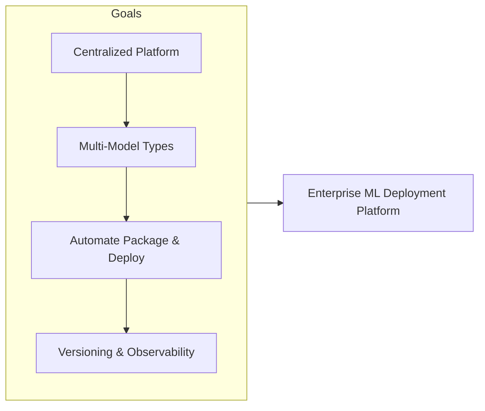
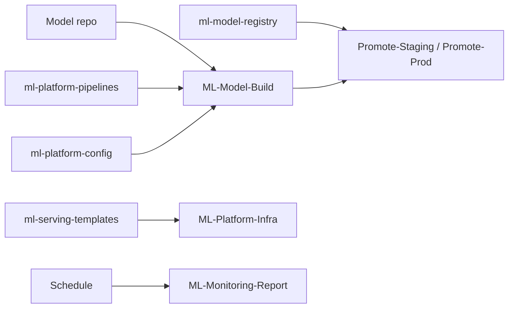
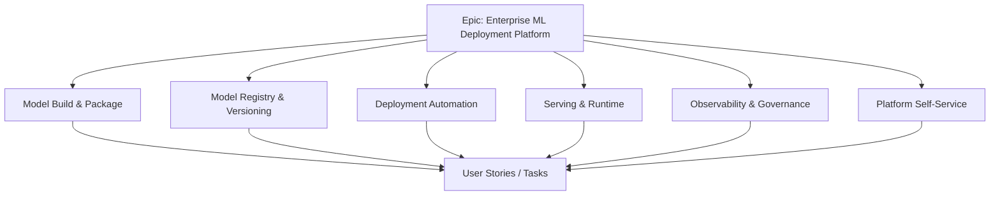
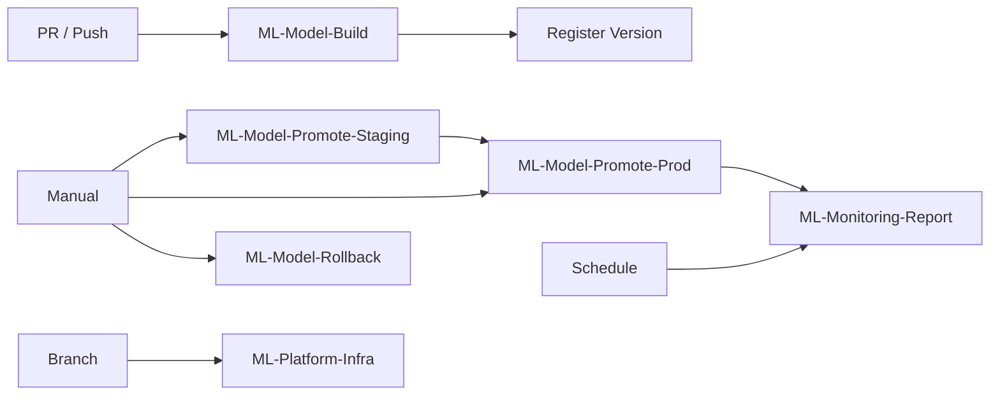
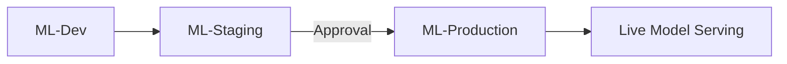
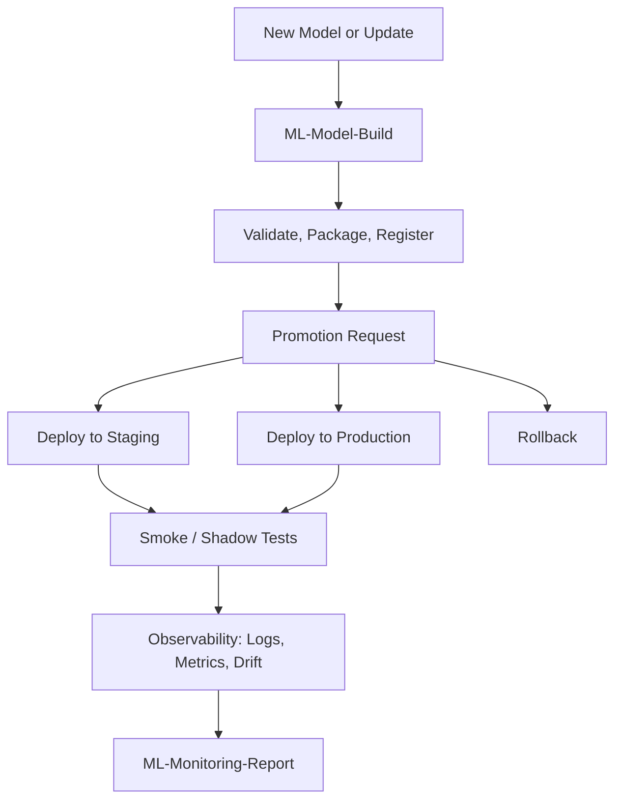
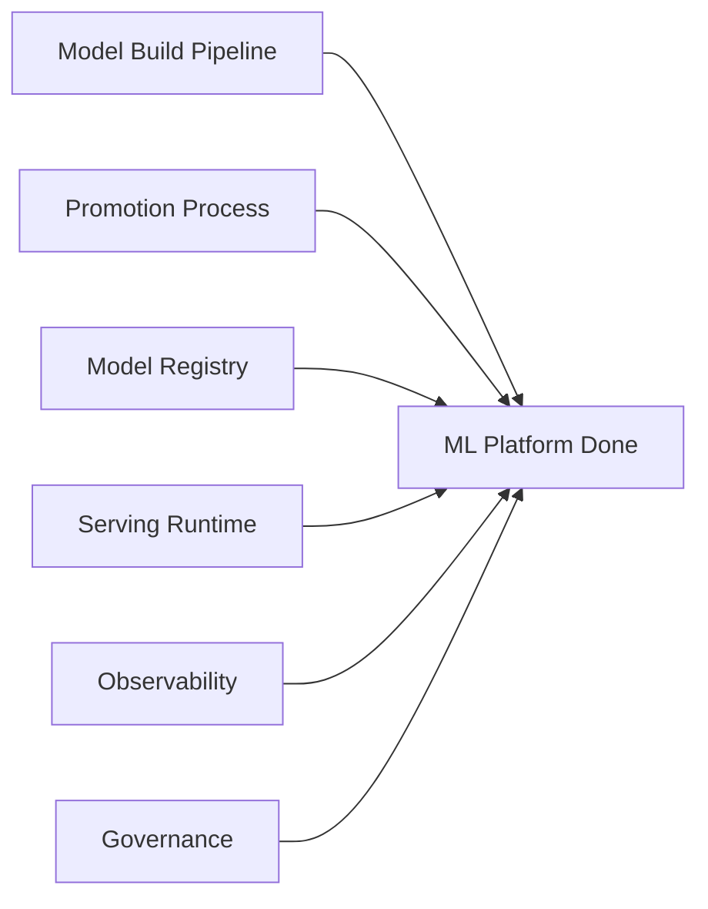
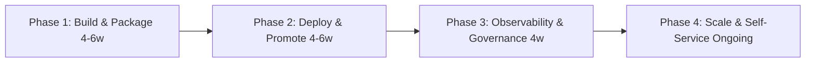
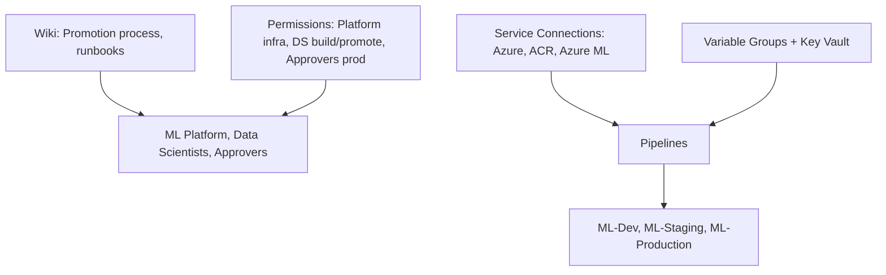

# Enterprise ML Model Deployment Platform

## Azure DevOps Project Overview

| Attribute | Value |
|-----------|--------|
| **Project Type** | ML Operations (MLOps), Model Deployment, Enterprise Platform |
| **Organization** | Azure DevOps Org |
| **Area Path** | ML Platform / Deployment |
| **Iteration** | Sprint-based (2 weeks) |

**What this project is:** This Azure DevOps project owns the **enterprise ML model deployment platform**: a centralized, governed platform for deploying ML models into production. It supports multiple model types (sklearn, TensorFlow, PyTorch, ONNX) and serving options (real-time API, batch); automates packaging, validation, promotion, and deployment via Azure DevOps pipelines; ensures versioning, lineage, and rollback; and enables data scientists to promote models through dev → staging → production with approval gates.

**Scope and boundaries**

- **In scope:** Model build pipeline (validate, package, register); promotion pipelines (staging, production with approval); model registry and versioning; serving runtime (real-time/batch); observability (logs, metrics, drift); rollback pipeline; platform docs and self-service guide.
- **Out of scope (unless explicitly added):** Training pipeline and data pipelines (may be separate projects); model research and experimentation tooling; non-ML application deployments.
- **Boundaries:** ML platform team owns pipelines and serving infra; data scientists build and request promotion; approvers approve prod deploy only; data scientists do not approve prod or change platform infra.

**Stakeholders**

- **ML platform team** — Implement and maintain pipelines and serving infra; run platform pipelines; maintain docs and runbooks; approve or execute platform changes.
- **Data scientists / ML engineers** — Build models; trigger build and request promotion; consume dev/staging/prod serving; report issues.
- **CAB / Approvers** — Approve production model deploy; ensure change request is linked and staging sign-off done.
- **Security / Compliance** — Review model and serving security; sign off on audit trail and evidence pack.
- **Business / Product** — Define model SLA and promotion policy; sign off on observability and governance.

**Success criteria (project level)**

- All models built and promoted via pipeline; no ad-hoc prod deploy.
- Production model deploy requires approval and change request; audit trail for every promotion and rollback.
- Staging and production serving with health checks and observability; drift and SLO alerts in place.
- Documentation and self-service guide enable data scientists to onboard and promote models.

**Key principles**

- **Centralized governed platform:** One place for model deployment; all promotions via pipeline with approval for prod.
- **Versioning and rollback:** Every model version in registry; rollback repeatable from pipeline.
- **Observability and governance:** Logs, metrics, drift; audit trail for promotions; documentation versioned.
- **Self-service with gates:** Data scientists trigger build and request promotion; approvers gate prod only.

---

## 1. Project Objectives

**Explanation:** Objectives define why the platform exists: centralized governed deployment, multi-model types and serving options, automated packaging and promotion via pipelines, versioning and rollback, enterprise security and monitoring, and self-service promotion with approval gates. Each goal drives Features (model build & package, registry & versioning, deployment automation, serving & runtime, observability & governance, platform self-service) and pipelines (ML-Model-Build, Promote-Staging/Prod, Rollback, Platform-Infra, Monitoring-Report).

**Detailed objectives flow (how goals connect):**

1. **Centralized governed platform** → Pipelines and config in ml-platform-* repos; approval gates for prod; audit trail. Outcome: one place for model deployment and governance.
2. **Multi-model types and serving** → Build pipeline supports multiple frameworks; serving templates (FastAPI/Flask, Docker, Helm). Outcome: real-time and batch serving.
3. **Automated packaging and promotion** → ML-Model-Build (validate, package, register); Promote-Staging/Prod with approval. Outcome: models promoted via pipeline; no ad-hoc deploy.
4. **Versioning and rollback** → Model registry (Azure ML/MLflow/custom); ML-Model-Rollback pipeline. Outcome: versions tracked; rollback repeatable.
5. **Enterprise security and monitoring** → Logging, metrics, alerts; drift monitoring; audit trail. Outcome: observability and compliance.
6. **Self-service promotion with gates** → Data scientists trigger build and request promotion; approvers approve prod. Outcome: self-service with governance.

**Objectives flow**

- Provide a centralized, governed platform for deploying ML models into production
- Support multiple model types (e.g., sklearn, TensorFlow, PyTorch, ONNX) and serving options (real-time API, batch)
- Automate model packaging, validation, promotion, and deployment via Azure DevOps pipelines
- Ensure versioning, lineage, and rollback for models and dependencies
- Integrate with enterprise security, compliance, and monitoring (logging, metrics, alerts)
- Enable data scientists and ML engineers to promote models through dev → staging → production with approval gates

**Objectives flow**



---

## 2. Azure DevOps Structure

### Repositories

| Repo | Purpose |
|------|---------|
| `ml-platform-pipelines` | Pipeline templates for model build, test, package, deploy |
| `ml-platform-config` | Environment configs, variable groups, service connection references |
| `ml-model-registry` | Model metadata, version manifests (or link to MLflow/Azure ML registry) |
| `ml-serving-templates` | Serving stack templates (e.g., FastAPI/Flask wrapper, Docker, Helm) |
| `ml-platform-docs` | Runbooks, model promotion process, SLA, troubleshooting |
| Per-model or per-team repos | Model code, training scripts, inference code (consumed by platform pipelines) |

**Explanation:** Repos hold platform pipelines and config, model registry metadata, serving templates, platform docs, and per-model or per-team model code. Pipelines build, validate, register, promote, and rollback models; platform infra is deployed via ML-Platform-Infra. All platform and model assets are versioned and deployable via Azure DevOps.

**Detailed repository flow (step-by-step):** (1) Model repo change → ML-Model-Build (validate, package, register). (2) Promotion request → ML-Model-Promote-Staging then Promote-Prod (with approval). (3) Rollback → ML-Model-Rollback (previous version). (4) Platform infra change → ML-Platform-Infra. (5) ML-Monitoring-Report runs on schedule; publishes metrics to dashboard or Boards. Flow: Code/PR → Build → Register → Promote Staging → Promote Prod (approval) or Rollback; Monitoring feeds backlog.

**Repository flow**



### Boards (Work Item Hierarchy)

```
Epic: Enterprise ML Model Deployment Platform
├── Feature: Model Build & Package
│   ├── User Story: Build pipeline (train artifact or pre-built model → package)
│   ├── User Story: Validation gates (accuracy, bias, performance regression)
│   └── Task: Container/image build; push to registry; version tagging
├── Feature: Model Registry & Versioning
│   ├── User Story: Register model versions with metadata (metrics, lineage)
│   ├── User Story: Promote model (dev → staging → prod) with approval
│   └── Task: Integration with Azure ML / MLflow / custom registry
├── Feature: Deployment Automation
│   ├── User Story: Deploy model to staging (A/B or shadow); run smoke tests
│   ├── User Story: Deploy to production with approval and change request
│   └── Task: Rollback to previous model version from pipeline
├── Feature: Serving & Runtime
│   ├── User Story: Real-time API (REST/gRPC); batch inference job
│   ├── User Story: Auto-scaling and resource limits
│   └── Task: Health check and readiness probe
├── Feature: Observability & Governance
│   ├── User Story: Logging, metrics, alerts for model serving
│   ├── User Story: Drift and performance monitoring; trigger retrain or rollback
│   └── Task: Audit trail for model promotions and deployments
└── Feature: Platform Self-Service
    ├── User Story: Data scientists can trigger promotion via pipeline or UI
    └── Task: Documentation and onboarding for new models
```

**Explanation:** Boards organize platform work hierarchically. The **Epic** is the top-level container (Enterprise ML Model Deployment Platform). **Features** group related capabilities (model build & package, registry & versioning, deployment automation, serving & runtime, observability & governance, platform self-service). **User Stories** and **Tasks** are the work items that teams pull into sprints. Every pipeline, config, or doc change should be linked to an Epic or Feature so progress and scope are visible. Boards drive reporting: burndown, velocity, and "work completed per Feature" for stakeholders.

**Work item types and states**

- **Epic** — State: New → In Progress → Done. Used for the platform initiative or per-release. Child Features and Stories roll up.
- **Feature** — State: New → In Progress → Done. Groups User Stories and Tasks (e.g. "Model Registry & Versioning", "Observability & Governance").
- **User Story** — State: New → Active → Resolved → Closed. Represents a capability outcome (e.g. "Deploy model to staging with smoke tests"). May have child Tasks.
- **Task** — State: New → Active → Resolved → Closed. Concrete work (e.g. "Implement Promote-Prod approval gate"; "Add drift metric to dashboard"). Linked to parent Story or Feature.

**Detailed board flow (how work moves):**

1. **New work** → Create a User Story or Task under the appropriate Feature (e.g. "Rollback to previous version from pipeline" under Deployment Automation). Link to Epic. **Who:** ML platform engineer or data scientist. **Inputs:** Requirement (from business or model owner). **Outputs:** Work item in New or Active state.
2. **Sprint planning** → Move items into the current iteration; assign owner. **Who:** ML platform lead. **Inputs:** Backlog; capacity; priority. **Outputs:** Sprint backlog populated.
3. **Development** → Owner implements in pipeline/config/model repo; opens PR; links work item (AB#&lt;id&gt;). **Outputs:** PR linked; ML-Model-Build or platform pipeline runs.
4. **Review & merge** → Reviewer approves; merge triggers build or enables promotion. Work item moves to Resolved when deploy and validation are done.
5. **Promotion/Prod** → For prod model deploy: link change request; approval gate. **Outputs:** CR linked; approver recorded.
6. **Closure** → When model is in prod and observability confirms health, close work item; attach pipeline run or registry version if needed for audit.

**Board hierarchy flow**



### Pipelines

| Pipeline | Trigger | Purpose |
|----------|---------|---------|
| `ML-Model-Build` | PR / push to model repo | Validate code; build package/image; run validation tests |
| `ML-Model-Promote-Staging` | Manual (after build) | Deploy model to staging; run smoke and shadow tests |
| `ML-Model-Promote-Prod` | Manual + approval | Deploy model to production; link change request |
| `ML-Model-Rollback` | Manual | Deploy previous approved version; audit log |
| `ML-Platform-Infra` | Branch / manual | Deploy serving infra (e.g., AKS, Azure ML endpoint) if IaC |
| `ML-Monitoring-Report` | Schedule | Aggregate model metrics; publish to dashboard or Boards |

**Explanation:** Pipelines automate model build, package, promotion, rollback, and platform infra. No one deploys models by hand for in-scope flows; every promotion goes through a pipeline. Build runs on PR/push to validate and register; Promote-Staging and Promote-Prod are gated (prod requires approval and change request). Failure in a step fails the job; pipeline can be retried or fixed and re-run.

**Pipeline anatomy (typical)**

- **ML-Model-Build** — Checkout model repo → validate code → build package/image → run validation tests (accuracy, bias, performance) → push to registry; register version with metadata. No deploy.
- **ML-Model-Promote-Staging** — Deploy model to staging (A/B or shadow); run smoke and shadow tests. Manual trigger after build.
- **ML-Model-Promote-Prod** — Approval gate → deploy model to production; link change request. Manual + approval.
- **ML-Model-Rollback** — Deploy previous approved version; audit log. Manual when prod model fails.
- **ML-Platform-Infra** — Deploy serving infra (e.g. AKS, Azure ML endpoint) if IaC. Branch or manual.
- **ML-Monitoring-Report** — Aggregate model metrics (latency, error rate, drift); publish to dashboard or Boards. Schedule (e.g. daily).

**Failure handling:** Build fails → do not promote; fix code or validation and re-run. Promote-Staging fails → fix config or serving; re-run. Promote-Prod denied → update CR or work item; re-request. Rollback → use when prod model has issues; document in audit.

**Detailed pipeline flow (step-by-step):**

1. **ML-Model-Build (on PR/push)** — Trigger: PR or push to model repo. Steps: checkout → validate → build package/image → validation tests → push to registry; register version. Output: version in registry; no deploy. Failure: fix code or tests and re-push.
2. **ML-Model-Promote-Staging** — Trigger: manual after build. Steps: deploy model to staging; run smoke and shadow tests. Output: model on staging. Failure: fix config or serving; re-run.
3. **ML-Model-Promote-Prod** — Trigger: manual; approval required; CR link. Steps: approval gate → deploy model to production. Output: model in prod; audit trail. Failure: rollback via ML-Model-Rollback if needed.
4. **ML-Model-Rollback** — Trigger: manual when prod model fails. Steps: deploy previous approved version; log in audit. Output: prod reverted to previous version.
5. **ML-Platform-Infra** — Trigger: branch or manual. Steps: deploy serving infra (IaC). Output: AKS/Azure ML endpoint updated.
6. **ML-Monitoring-Report** — Trigger: schedule (e.g. daily). Steps: aggregate metrics; publish to dashboard or Boards. Output: metrics and drift visibility; may create backlog items for retrain/rollback.

**Pipeline flow**



### Environments

| Environment | Use |
|-------------|-----|
| **ML-Dev** | Develop and test new models; low traffic |
| **ML-Staging** | Pre-production; shadow or A/B; validation |
| **ML-Production** | Live model serving; strict approvals and monitoring |

**Explanation:** Environments in Azure DevOps represent deployment targets for model serving (e.g. dev AKS, staging, production). ML-Dev is for developing and testing new models with low traffic; ML-Staging is for pre-production validation (shadow or A/B); ML-Production has strict approvals and monitoring. Pipeline stages target these environments so promotions are explicit and auditable.

**Approval configuration (recommended)**

- **ML-Dev:** No approval; data scientists and ML engineers iterate freely.
- **ML-Staging:** Optional approval (e.g. ML platform lead) before staging deploy if org requires.
- **ML-Production:** Mandatory approval (e.g. CAB, Release Manager); change request must be linked. Ensures no prod model deploy without review and CR.

**Detailed environment flow (step-by-step):**

1. **ML-Dev** — Used for all new model development and testing. Low traffic; fast iteration. **Inputs:** Model build output; manual or CI trigger. **Outputs:** Model deployed to dev serving. **Failure:** Fix and re-run.
2. **ML-Staging** — Pre-production; shadow or A/B; validation and smoke tests. Manual trigger; optional approval. **Inputs:** Build version; staging config. **Outputs:** Model on staging; smoke/shadow results.
3. **ML-Production** — Deploy only after staging sign-off. Approval required; CR linked. **Inputs:** Build version; prod config; approval; change request. **Outputs:** Model in production; audit trail. **Failure:** Use ML-Model-Rollback; document and PIR.
4. **Promotion path:** Build → Register → ML-Dev (optional) → ML-Staging (manual + optional approval) → ML-Production (manual + mandatory approval). No skip: do not deploy to prod without staging unless emergency (document and PIR).

**Environment promotion flow**



---

## 3. End-to-End Project Flow

```
[New Model or Model Update]
        │
        ▼
┌─────────────────────────────────────────────────────────────────┐
│ Model repo: code + config → PR → ML-Model-Build                   │
│ Boards: Epic (Platform) or Feature (per model) → Story → Task     │
└─────────────────────────────────────────────────────────────────┘
        │
        ▼
┌───────────────────┐     ┌─────────────────────┐
│ ML-Model-Build    │────▶│ Validate, package,   │
│ (on PR / push)    │     │ register version     │
│                   │     │ (registry)            │
└───────────────────┘     └──────────┬──────────┘
                                      │
                                      ▼
                        ┌────────────────────────┐
                        │ Promotion request       │
                        │ (manual / approval)     │
                        └────────────┬───────────┘
                                     │
        ┌────────────────────────────┼────────────────────────────┐
        ▼                            ▼                            ▼
┌───────────────┐          ┌─────────────────┐          ┌─────────────────┐
│ Deploy to     │          │ Deploy to       │          │ Rollback        │
│ Staging       │          │ Production      │          │ (previous       │
│ (smoke/shadow)│          │ (approval)      │          │ version)        │
└───────────────┘          └─────────────────┘          └─────────────────┘
        │                            │                            │
        └────────────────────────────┼────────────────────────────┘
                                      ▼
                        ┌────────────────────────┐
                        │ Observability: logs,    │
                        │ metrics, drift;        │
                        │ ML-Monitoring-Report    │
                        └────────────────────────┘
```

**End-to-end flow (Mermaid)**



**Detailed end-to-end flow (step-by-step):**

1. **New model or update** — Data scientist or ML engineer updates model repo (code, config); opens PR. ML-Model-Build runs on PR/push: validate code, build package/image, run validation tests (accuracy, bias, performance), push to registry, register version with metadata.
2. **Promotion request** — Requester triggers ML-Model-Promote-Staging (manual). Pipeline deploys model to staging; runs smoke and shadow tests. Outcome: model on staging; validation results.
3. **Staging sign-off** — Team reviews staging results. If pass, requester requests production promotion; links change request; approval gate (CAB or Release Manager).
4. **Production deploy** — After approval, ML-Model-Promote-Prod runs. Model is deployed to production serving. Audit trail records approver, CR, and version.
5. **Rollback (if needed)** — If prod model fails (errors, drift, performance), trigger ML-Model-Rollback to deploy previous approved version. Document in audit; post-incident review.
6. **Observability** — Logs, metrics (latency, error rate), drift monitoring; ML-Monitoring-Report runs on schedule and publishes to dashboard or Boards. Alerts on SLO breach; drift or failures feed backlog (retrain or rollback).
7. **Feedback** — Drift or failures create backlog items; data scientists retrain or platform team rolls back. Documentation and self-service guide updated as platform evolves.

---

## 4. Key Deliverables & Acceptance Criteria

| Deliverable | Acceptance Criteria |
|-------------|----------------------|
| Model build pipeline | All models built and packaged via pipeline; version in registry |
| Promotion process | Staging and production deploy with approval; change request linked |
| Model registry | Versions with metadata; promote/rollback from pipeline |
| Serving runtime | Real-time and/or batch; health checks; auto-scale |
| Observability | Logs, latency, error rate, drift; alerts and dashboard |
| Governance | Audit trail for promotions; documentation and self-service guide |

**Explanation:** Deliverables are the concrete outputs that define "done" for the ML deployment platform. Each has clear acceptance criteria so the team and stakeholders agree when a deliverable is complete. They feed into operations, compliance, and self-service.

**Detailed deliverables flow (how each is produced):**

1. **Model build pipeline** — Produced in ml-platform-pipelines and model repos; acceptance: all models built and packaged via pipeline; version in registry. Verified by ML-Model-Build runs and registry metadata.
2. **Promotion process** — Staging and production deploy with approval; change request linked for prod. Acceptance: no ad-hoc prod deploy; CR and approver recorded. Verified by Promote-Staging/Prod runs and audit trail.
3. **Model registry** — Versions with metadata (metrics, lineage); promote/rollback from pipeline. Acceptance: registry integrated; rollback repeatable. Verified by registry UI and ML-Model-Rollback.
4. **Serving runtime** — Real-time and/or batch; health checks; auto-scale. Acceptance: serving stack deployed; health and scale verified. Verified by staging/prod serving and load tests.
5. **Observability** — Logs, latency, error rate, drift; alerts and dashboard. Acceptance: metrics visible; alerts on SLO breach; drift triggers backlog. Verified by ML-Monitoring-Report and dashboard.
6. **Governance** — Audit trail for promotions; documentation and self-service guide. Acceptance: every promotion auditable; data scientists can onboard and promote via docs. Verified by pipeline history and Wiki.

**Deliverables flow**



---

## 5. Phases & Timeline (Example)

| Phase | Duration | Focus |
|-------|----------|--------|
| **Phase 1: Build & Package** | 4–6 weeks | Build pipeline; container/service template; registry integration |
| **Phase 2: Deploy & Promote** | 4–6 weeks | Staging and prod deploy; approval gates; rollback pipeline |
| **Phase 3: Observability & Governance** | 4 weeks | Monitoring, drift, alerts; audit and docs |
| **Phase 4: Scale & Self-Service** | Ongoing | More models onboarded; platform SLA; onboarding runbook |

**Explanation:** Phases break the platform into ordered stages: build & package first, then deploy & promote with gates, then observability & governance, then scale & self-service. Each phase has a duration and focus; timelines are examples and should be adjusted to org capacity.

**Detailed phase flow (what happens in each phase):**

1. **Phase 1: Build & Package (4–6 weeks)** — Build pipeline (validate, package, register); container/service template; registry integration (Azure ML/MLflow/custom). Outcome: models build and register via pipeline; team can promote manually.
2. **Phase 2: Deploy & Promote (4–6 weeks)** — Staging and prod deploy pipelines; approval gates; change request link for prod; rollback pipeline. Outcome: promotion path dev → staging → prod with audit trail; rollback repeatable.
3. **Phase 3: Observability & Governance (4 weeks)** — Monitoring (latency, error rate, drift); alerts and dashboard; audit trail and docs. Outcome: observability in place; governance documented.
4. **Phase 4: Scale & Self-Service (Ongoing)** — More models onboarded; platform SLA; onboarding runbook; data scientists self-serve promotion via pipeline or UI. Outcome: platform scales; self-service and SLA maintained.

**Phases timeline flow**



---

## 6. Azure DevOps Artifacts & Links

- **Wiki:** Model promotion process, serving architecture, runbooks, troubleshooting
- **Service connections:** Azure (ACR, AKS, Azure ML if used); container registry
- **Variable groups:** Per environment (registry, endpoint URL, resource limits); secrets in Key Vault
- **Permissions:** ML platform team (pipeline and infra); Data scientists (run build and request promotion); Approvers (prod deploy only)

**Explanation:** Wiki, service connections, variable groups, and permissions support the ML platform. Wiki holds promotion process, serving architecture, runbooks, and troubleshooting; service connections allow pipelines to deploy to Azure (ACR, AKS, Azure ML); variable groups provide per-env config and secrets from Key Vault; permissions separate platform (pipeline and infra) from data scientists (build and request promotion) and approvers (prod deploy only).

**Detailed artifacts flow (how they are used):**

1. **Wiki** — Model promotion process; serving architecture; runbooks (rollback, troubleshooting); SLA and onboarding. Updated via PR to ml-platform-docs or direct Wiki edit per org policy.
2. **Service connections** — Azure (ACR, AKS, Azure ML if used); container registry. Configured in Azure DevOps project settings; used by pipeline YAML.
3. **Variable groups** — Per environment: registry URL, endpoint URL, resource limits; secrets in Key Vault linked to variable group. Pipelines resolve at run time.
4. **Permissions** — ML platform team: edit pipelines and infra; run all pipelines. Data scientists: run build and request promotion; no prod approve. Approvers: approve prod deploy only. Configured via Azure DevOps security.

**Artifacts & links flow**


