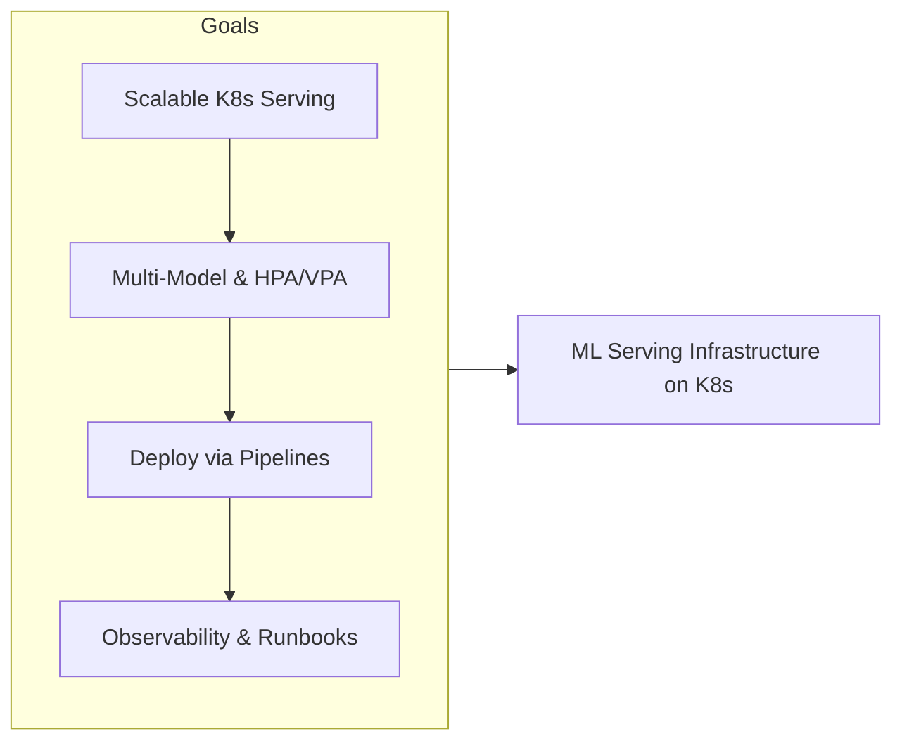
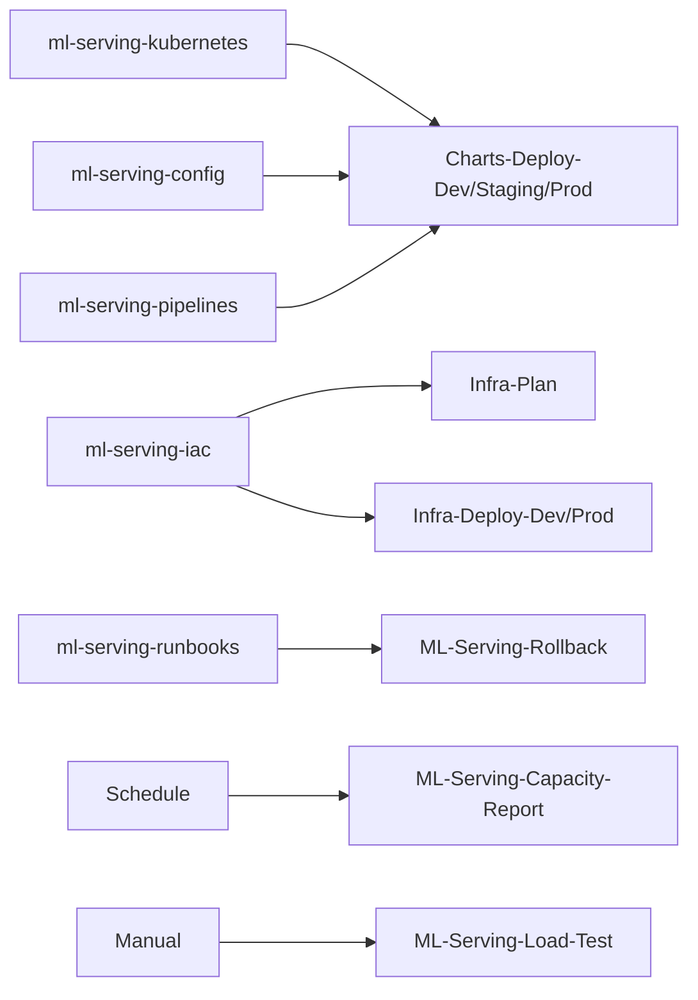
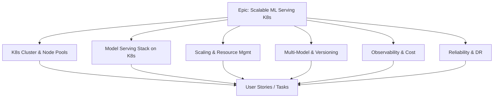
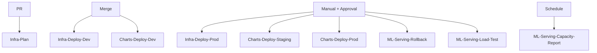
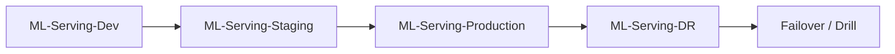
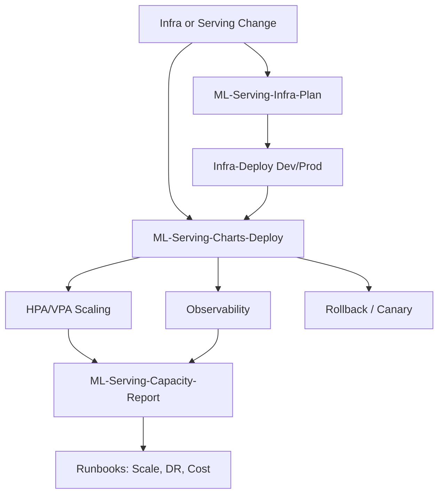
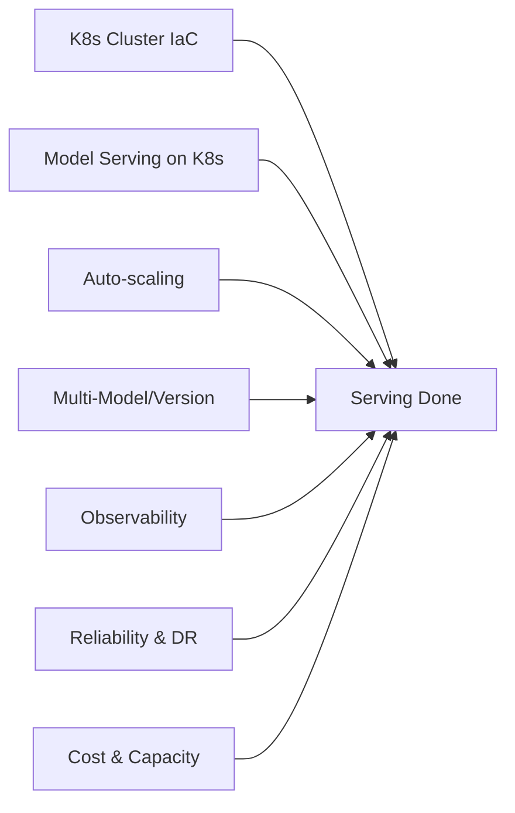
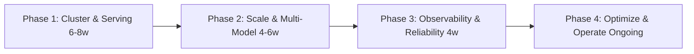
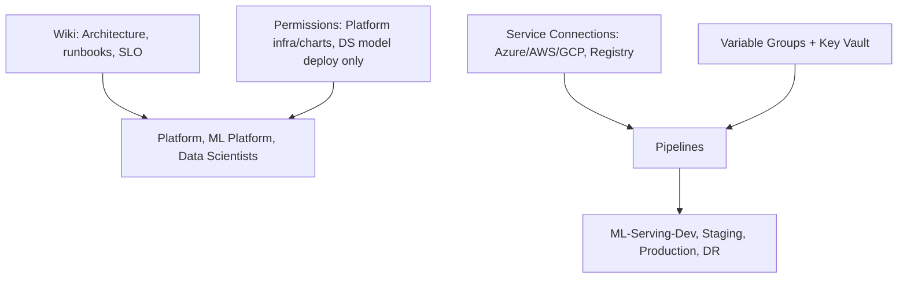

# Scalable ML Model Serving Infrastructure with Kubernetes

## Azure DevOps Project Overview

| Attribute | Value |
|-----------|--------|
| **Project Type** | ML Serving, Kubernetes, Scalability & Reliability |
| **Organization** | Azure DevOps Org |
| **Area Path** | ML Platform / Serving / Kubernetes |
| **Iteration** | Sprint-based (2 weeks) |

**What this project is:** This Azure DevOps project owns **scalable ML model serving infrastructure on Kubernetes**: a highly available, scalable serving layer for ML models on AKS/EKS/GKE. It supports multiple models and versions with isolation, resource limits, and auto-scaling (HPA/VPA); uses industry patterns (multi-model serving, canary/blue-green, GPU node pools); deploys and updates the serving stack (Helm/Kustomize) via Azure DevOps pipelines; and ensures observability, cost control, and runbooks for scaling and DR.

**Scope and boundaries**

- **In scope:** IaC for K8s cluster and node pools (CPU/GPU); Helm/Kustomize for model serving stack; scaling (HPA/VPA) and resource limits; multi-model routing and versioning; observability (metrics, alerts, dashboard); rollback and load-test pipelines; runbooks (scale, failover, capacity); DR cluster/region and failover runbook.
- **Out of scope (unless explicitly added):** Model training and model deployment platform (may be separate projects); application code of consuming services; non-ML workloads on the same cluster.
- **Boundaries:** Platform/ML platform team owns infra and chart pipelines; data scientists or model platform trigger model deploy to serving (no cluster or chart change); platform team approves prod infra and chart deploy.

**Stakeholders**

- **Platform / ML platform team** — Implement and maintain IaC and Helm/Kustomize; run infra and chart pipelines; maintain runbooks; approve or execute prod deploy and DR.
- **Data scientists / Model platform** — Trigger model deploy to serving; consume serving dev/staging/prod; report issues; no cluster or chart change.
- **CAB / Release Manager** — Approve production infra and chart deploy; ensure change request and load-test baseline where required.
- **Security / Compliance** — Review K8s and serving security; sign off on evidence pack.
- **Business / Product** — Define SLO and capacity requirements; sign off on cost and DR strategy.

**Success criteria (project level)**

- K8s cluster and serving stack deployable from repo with no manual resource creation for in-scope components.
- Production infra and chart deploy require approval; rollback and load-test pipelines in place.
- Observability (latency, throughput, errors, GPU%); capacity report and runbooks updated; DR runbook and optional DR cluster.
- Cost and capacity visible; capacity planning process and load-test cadence.

**Key principles**

- **Everything as code:** No one-off cluster or chart changes for in-scope resources; all changes via PR and pipeline.
- **Scalable and observable:** HPA/VPA and resource limits; metrics, alerts, dashboard; capacity report on schedule.
- **Approval and audit:** Prod deploy gated; change request and pipeline run history retained for audit.
- **Runbooks and DR:** Scaling, failover, and capacity runbooks in repo; DR drill and failover procedure documented.

---

## 1. Project Objectives

**Explanation:** Objectives define why the serving infra exists: scalable HA serving on K8s, multi-model and versioning with HPA/VPA, industry patterns (canary, blue-green, GPU), deploy via pipelines, observability and cost control, and runbooks for scaling and DR. Each goal drives Features (K8s cluster & node pools, model serving stack, scaling & resource mgmt, multi-model & versioning, observability & cost, reliability & DR) and pipelines (Infra-Plan/Deploy, Charts-Deploy, Rollback, Load-Test, Capacity-Report).

**Detailed objectives flow (how goals connect):**

1. **Scalable HA serving on K8s** → IaC for cluster and node pools (CPU/GPU); multi-replica; PDB; health checks. Outcome: serving layer scales and is highly available.
2. **Multi-model and HPA/VPA** → Multiple models/versions on cluster; isolation; HPA/VPA; resource requests/limits. Outcome: multi-tenant serving with quotas.
3. **Industry patterns** → Canary/blue-green deploy; GPU node pools for heavy models. Outcome: safe rollouts and GPU support.
4. **Deploy via pipelines** → Helm/Kustomize in repo; ML-Serving-Charts-Deploy per env; rollback pipeline. Outcome: serving stack deployable and rollback repeatable.
5. **Observability and cost** → Metrics (latency, throughput, errors, GPU%); dashboards; alerts; cost per model/version. Outcome: SLO and cost visible.
6. **Runbooks for scaling and DR** → Runbooks for scaling, failover, capacity; DR cluster/region; capacity report pipeline. Outcome: operations and DR documented and automated.

**Objectives flow**

- Build a scalable, highly available ML model serving layer on Kubernetes (AKS, EKS, or GKE)
- Support multiple models and versions with isolation, resource limits, and auto-scaling (HPA/VPA)
- Use industry patterns: multi-model serving, canary/blue-green, GPU node pools where needed
- Deploy and update serving stack (Helm/Kustomize) via Azure DevOps pipelines
- Ensure observability (latency, throughput, errors, GPU utilization) and cost control
- Provide runbooks for scaling, failure recovery, and capacity planning

**Objectives flow**



---

## 2. Azure DevOps Structure

### Repositories

| Repo | Purpose |
|------|---------|
| `ml-serving-kubernetes` | Kubernetes manifests, Helm charts, or Kustomize for model servers |
| `ml-serving-config` | ConfigMaps, scaling params, resource limits per model/env |
| `ml-serving-iac` | Bicep/Terraform for K8s cluster, node pools (CPU/GPU), ACR/ECR |
| `ml-serving-pipelines` | Pipelines for infra and Helm/Kustomize deploy |
| `ml-serving-runbooks` | Scaling, failover, capacity, troubleshooting |
| Optional: `ml-inference-code` | Inference server code (e.g., Triton, KServe, custom FastAPI) |

**Explanation:** Repos hold K8s manifests/Helm/Kustomize for model servers, config (ConfigMaps, scaling params), IaC for cluster and node pools, pipelines for infra and chart deploy, and runbooks for scaling, failover, and capacity. Pipelines deploy infra and charts; rollback and load-test pipelines support operations. All serving infra and runbooks are versioned and deployable via Azure DevOps.

**Detailed repository flow (step-by-step):** (1) IaC branch → Infra-Plan on PR → Infra-Deploy-Dev/Prod on merge or manual. (2) Charts branch → Charts-Deploy-Dev/Staging/Prod on merge or manual. (3) Rollback → ML-Serving-Rollback (previous chart/revision). (4) Load-Test and Capacity-Report run on schedule or manual. Flow: Infra/Chart change → Plan/Validate → Deploy → Verify; Rollback and Capacity-Report support operations.

**Repository flow**



### Boards (Work Item Hierarchy)

```
Epic: Scalable ML Model Serving Infrastructure with Kubernetes
├── Feature: Kubernetes Cluster & Node Pools
│   ├── User Story: Cluster (AKS/EKS/GKE) with CPU and GPU node pools
│   ├── User Story: Autoscale node pools; spot/preemptible for batch
│   └── Task: IaC and pipeline for cluster lifecycle
├── Feature: Model Serving Stack on K8s
│   ├── User Story: Deploy model server (e.g., Triton, KServe, Seldon, custom)
│   ├── User Story: Ingress (path-based or header-based routing per model)
│   ├── User Story: TLS and auth (API key, OAuth, mTLS)
│   └── Task: Helm chart; ConfigMap for model config
├── Feature: Scaling & Resource Management
│   ├── User Story: HPA based on RPS or CPU/memory; VPA for memory-heavy models
│   ├── User Story: Resource requests/limits per model; quota per namespace
│   └── Task: Burst and baseline capacity runbook
├── Feature: Multi-Model & Versioning
│   ├── User Story: Multiple models/versions on same cluster; isolation
│   ├── User Story: Canary or blue-green deploy for model updates
│   └── Task: Routing and rollback from pipeline
├── Feature: Observability & Cost
│   ├── User Story: Metrics (latency, throughput, errors, GPU%); dashboards
│   ├── User Story: Alerts on SLO breach; cost per model/version
│   └── Task: Export to Prometheus/Grafana or cloud native
└── Feature: Reliability & DR
    ├── User Story: Multi-replica; pod disruption budget; health checks
    ├── User Story: DR region or cluster; failover runbook
    └── Task: Capacity planning and load test process
```

**Explanation:** Boards organize serving-infra work hierarchically. The **Epic** is the top-level container (Scalable ML Model Serving Infrastructure with Kubernetes). **Features** group related capabilities (K8s cluster & node pools, model serving stack, scaling & resource mgmt, multi-model & versioning, observability & cost, reliability & DR). **User Stories** and **Tasks** are the work items that teams pull into sprints. Every infra, chart, or runbook change should be linked to an Epic or Feature so progress and scope are visible. Boards drive reporting: burndown, velocity, and "work completed per Feature" for stakeholders.

**Work item types and states**

- **Epic** — State: New → In Progress → Done. Used for the serving-infra initiative or per-release. Child Features and Stories roll up.
- **Feature** — State: New → In Progress → Done. Groups User Stories and Tasks (e.g. "Scaling & Resource Management", "Reliability & DR").
- **User Story** — State: New → Active → Resolved → Closed. Represents a capability outcome (e.g. "HPA based on RPS or CPU/memory"). May have child Tasks.
- **Task** — State: New → Active → Resolved → Closed. Concrete work (e.g. "Helm chart for Triton"; "Update capacity runbook"). Linked to parent Story or Feature.

**Detailed board flow (how work moves):**

1. **New work** → Create a User Story or Task under the appropriate Feature (e.g. "Canary deploy for model updates" under Multi-Model & Versioning). Link to Epic. **Who:** Platform or ML platform engineer. **Inputs:** Requirement (from business or SLO). **Outputs:** Work item in New or Active state.
2. **Sprint planning** → Move items into the current iteration; assign owner. **Who:** Platform lead. **Inputs:** Backlog; capacity; priority. **Outputs:** Sprint backlog populated.
3. **Development** → Owner creates branch in ml-serving-iac or ml-serving-kubernetes; implements; opens PR; links work item (AB#&lt;id&gt;). **Outputs:** PR linked; Infra-Plan or Charts-Deploy runs.
4. **Review & merge** → Reviewer approves; merge triggers deploy (dev) or enables manual deploy. Work item moves to Resolved when deploy and validation are done.
5. **Prod deploy** → For prod infra or charts: approval gate; change request if required. **Outputs:** CR linked; approver recorded.
6. **Closure** → When serving stack is in prod and observability/capacity report confirm health, close work item; attach pipeline run or runbook evidence if needed for audit.

**Board hierarchy flow**



### Pipelines

| Pipeline | Trigger | Purpose |
|----------|---------|---------|
| `ML-Serving-Infra-Plan` | PR | Terraform/Bicep plan; no apply |
| `ML-Serving-Infra-Deploy-Dev` | Merge / manual | Deploy K8s cluster (dev); node pools |
| `ML-Serving-Infra-Deploy-Prod` | Manual + approval | Deploy prod cluster |
| `ML-Serving-Charts-Deploy-Dev` | PR merge / manual | Deploy Helm/Kustomize to dev K8s |
| `ML-Serving-Charts-Deploy-Staging` | Manual | Deploy to staging |
| `ML-Serving-Charts-Deploy-Prod` | Manual + approval | Deploy to prod; canary/blue-green option |
| `ML-Serving-Rollback` | Manual | Rollback to previous chart/revision |
| `ML-Serving-Load-Test` | Manual / schedule | Run load test; record baseline; optional gate |
| `ML-Serving-Capacity-Report` | Schedule | Report usage, cost, recommendation; update Wiki or Board |

**Explanation:** Pipelines automate infra plan/deploy and Helm/Kustomize deploy for the ML serving stack. No one deploys cluster or charts by hand for in-scope changes; every change goes through a pipeline. Infra-Plan runs on PR to catch errors early; Infra-Deploy and Charts-Deploy are gated by environment (dev looser, prod strict with approval). Rollback, Load-Test, and Capacity-Report support operations. Failure in a step fails the job; pipeline can be retried or fixed and re-run.

**Pipeline anatomy (typical)**

- **Infra-Plan (on PR)** — Terraform/Bicep plan; no apply. Output: plan in log for reviewers.
- **Infra-Deploy-Dev/Prod** — Deploy K8s cluster and node pools (CPU/GPU). Approval for prod.
- **Charts-Deploy-Dev/Staging/Prod** — Deploy Helm/Kustomize to target K8s. Approval for prod; canary/blue-green option.
- **ML-Serving-Rollback** — Rollback to previous chart/revision. Manual when deploy fails.
- **ML-Serving-Load-Test** — Run load test; record baseline; optional gate. Manual or schedule.
- **ML-Serving-Capacity-Report** — Report usage, cost, recommendation; update Wiki or Board. Schedule.

**Failure handling:** Infra-Plan fails → do not merge; fix IaC and re-push. Infra-Deploy fails → check log (quota, permissions); fix and re-run. Charts-Deploy fails → check image, K8s connectivity, resource limits. Rollback → use when prod deploy has issues; document.

**Detailed pipeline flow (step-by-step):**

1. **Infra-Plan (on PR)** — Trigger: PR to ml-serving-iac. Steps: checkout → terraform/bicep plan (no apply). Output: plan in log. Failure: fix IaC and re-push.
2. **Infra-Deploy-Dev** — Trigger: merge or manual. Steps: deploy K8s cluster (dev); node pools (CPU/GPU). Output: dev cluster updated. No approval.
3. **Infra-Deploy-Prod** — Trigger: manual; approval required. Steps: approval gate → deploy prod cluster. Output: prod cluster updated. Failure: fix and re-run; if partial, consider rollback and incident.
4. **Charts-Deploy-Dev** — Trigger: PR merge or manual. Steps: deploy Helm/Kustomize to dev K8s. Output: serving stack on dev.
5. **Charts-Deploy-Staging/Prod** — Trigger: manual; prod approval. Steps: deploy to staging/prod; optional canary/blue-green. Output: serving stack on staging/prod.
6. **ML-Serving-Rollback** — Trigger: manual when prod deploy fails. Steps: rollback to previous chart/revision. Output: prod reverted.
7. **ML-Serving-Load-Test** — Trigger: manual or schedule. Steps: run load test; record baseline; optional gate. Output: baseline and pass/fail.
8. **ML-Serving-Capacity-Report** — Trigger: schedule. Steps: aggregate usage, cost, recommendation; update Wiki or Board. Output: capacity and cost visibility; may create backlog items.

**Pipeline flow**



### Environments

| Environment | Use |
|-------------|-----|
| **ML-Serving-Dev** | Dev K8s; low node count; test chart and config changes |
| **ML-Serving-Staging** | Staging K8s; production-like scale; load and failover tests |
| **ML-Serving-Production** | Production K8s; HA; strict approvals and monitoring |
| **ML-Serving-DR** | DR cluster/region; used in drills and real failover |

**Explanation:** Environments in Azure DevOps represent deployment targets (K8s clusters: dev, staging, production, DR). ML-Serving-Dev is for testing chart and config changes with low node count; ML-Serving-Staging is for production-like scale and load/failover tests; ML-Serving-Production has strict approvals and monitoring; ML-Serving-DR is used only for drills and real failover. Pipeline stages target these environments so promotions are explicit and auditable.

**Approval configuration (recommended)**

- **ML-Serving-Dev:** No approval; fast iteration for charts and config.
- **ML-Serving-Staging:** Optional approval (e.g. Platform lead) before staging deploy.
- **ML-Serving-Production:** Mandatory approval (e.g. CAB, Release Manager); change request if required. Ensures no prod deploy without review.
- **ML-Serving-DR:** Mandatory approval for drill or failover; prevents accidental DR deploy.

**Detailed environment flow (step-by-step):**

1. **ML-Serving-Dev** — Used for all chart and config changes. Low node count; low cost. **Inputs:** Merged branch or manual run. **Outputs:** Dev K8s and serving stack updated. **Failure:** Fix and re-run.
2. **ML-Serving-Staging** — Production-like scale; load and failover tests. Manual trigger; optional approval. **Inputs:** Branch; staging variable group. **Outputs:** Staging K8s and serving stack updated.
3. **ML-Serving-Production** — Deploy only after staging sign-off. Approval required; CR if required. **Inputs:** Branch/commit; prod variable group; approval. **Outputs:** Production K8s and serving stack updated; audit trail. **Failure:** Use ML-Serving-Rollback; document and PIR.
4. **ML-Serving-DR** — DR cluster/region; used by failover runbook and drills. Not used for normal feature deploys. **Inputs:** Runbook; DR cluster; approval for drill. **Outputs:** Drill report or failover executed.
5. **Promotion path:** Code merge → ML-Serving-Dev (auto or manual) → ML-Serving-Staging (manual + optional approval) → ML-Serving-Production (manual + mandatory approval). DR is independent (drill or failover only).

**Environment promotion flow**



---

## 3. End-to-End Project Flow

```
[Infra or Serving Change]
        │
        ▼
┌─────────────────────────────────────────────────────────────────┐
│ Boards: Epic → Feature (cluster / serving / scaling / observability)│
│ Repos: ml-serving-iac, ml-serving-kubernetes                     │
└─────────────────────────────────────────────────────────────────┘
        │
        ▼
┌───────────────────┐     ┌─────────────────────┐
│ ML-Serving-Infra   │────▶│ Plan → Deploy        │
│ Plan (PR)          │     │ (dev/staging/prod)   │
│ or Deploy          │     │ K8s + node pools     │
└───────────────────┘     └──────────┬──────────┘
                                      │
                                      ▼
                        ┌────────────────────────┐
                        │ ML-Serving-Charts-     │
                        │ Deploy (Helm/Kustomize)│
                        │ Dev → Staging → Prod   │
                        └────────────┬───────────┘
                                     │
        ┌────────────────────────────┼────────────────────────────┐
        ▼                            ▼                            ▼
┌───────────────┐          ┌─────────────────┐          ┌─────────────────┐
│ HPA/VPA       │          │ Observability    │          │ Rollback /      │
│ scaling       │          │ metrics, alerts  │          │ canary          │
│ (runtime)     │          │ dashboard        │          │ (pipeline)      │
└───────────────┘          └─────────────────┘          └─────────────────┘
        │                            │                            │
        └────────────────────────────┼────────────────────────────┘
                                      ▼
                        ┌────────────────────────┐
                        │ ML-Serving-Capacity-    │
                        │ Report; runbooks        │
                        │ (scaling, DR, cost)     │
                        └────────────────────────┘
```

**End-to-end flow (Mermaid)**



**Detailed end-to-end flow (step-by-step):**

1. **Infra or serving change** — Platform engineer updates ml-serving-iac or ml-serving-kubernetes; opens PR. Infra-Plan runs on PR (terraform/bicep plan; no apply). After review and merge, Infra-Deploy-Dev or Infra-Deploy-Prod (manual + approval for prod). Outcome: K8s cluster and node pools (CPU/GPU) in target env.
2. **Charts deploy** — Branch in ml-serving-kubernetes or ml-serving-config; Charts-Deploy-Dev on merge or manual; Charts-Deploy-Staging and Charts-Deploy-Prod (manual; prod approval). Outcome: model serving stack (Helm/Kustomize) on K8s in each env.
3. **Runtime** — HPA/VPA scaling (configured in charts or cluster); observability (metrics, alerts, dashboard) via Prometheus/Grafana or cloud native. Outcome: serving scales and is observable.
4. **Rollback or canary** — If prod deploy fails or canary shows issues, run ML-Serving-Rollback to previous chart/revision. Canary/blue-green option in Charts-Deploy-Prod. Outcome: safe rollouts and rollback repeatable.
5. **Capacity and runbooks** — ML-Serving-Capacity-Report runs on schedule; reports usage, cost, recommendation; updates Wiki or Board. Runbooks (scale, failover, capacity) in ml-serving-runbooks; updated when steps change. Outcome: capacity and cost visible; runbooks versioned.
6. **Feedback** — Capacity and cost feed backlog (scale-up, optimize); DR drill results update runbook. Load test (ML-Serving-Load-Test) run on schedule or before release; baseline recorded.

---

## 4. Key Deliverables & Acceptance Criteria

| Deliverable | Acceptance Criteria |
|-------------|----------------------|
| K8s cluster IaC | Cluster and node pools (CPU/GPU) deployable via pipeline |
| Model serving on K8s | One or more model servers deployed via Helm/Kustomize; ingress and TLS |
| Auto-scaling | HPA (and optionally VPA) configured; tested under load |
| Multi-model/version | Multiple models or versions served; routing and rollback from pipeline |
| Observability | Latency, throughput, errors, GPU%; alerts and dashboard |
| Reliability | Replicas, PDB, health checks; DR runbook and optional DR cluster |
| Cost & capacity | Report and runbook; capacity planning process |

**Explanation:** Deliverables are the concrete outputs that define "done" for the ML serving infrastructure. Each has clear acceptance criteria so the team and stakeholders agree when a deliverable is complete. They feed into operations, SLO, and cost control.

**Detailed deliverables flow (how each is produced):**

1. **K8s cluster IaC** — Produced in ml-serving-iac; acceptance: cluster and node pools (CPU/GPU) deployable via pipeline. Verified by Infra-Plan on PR and Infra-Deploy runs per env.
2. **Model serving on K8s** — Produced in ml-serving-kubernetes (Helm/Kustomize); acceptance: one or more model servers deployed; ingress and TLS. Verified by Charts-Deploy to dev/staging/prod.
3. **Auto-scaling** — HPA (and optionally VPA) configured in charts or cluster; acceptance: tested under load. Verified by load test and ML-Serving-Load-Test.
4. **Multi-model/version** — Multiple models or versions served; routing and rollback from pipeline. Acceptance: routing and rollback repeatable. Verified by Charts-Deploy and ML-Serving-Rollback.
5. **Observability** — Latency, throughput, errors, GPU%; alerts and dashboard. Acceptance: metrics visible; alerts on SLO breach. Verified by Prometheus/Grafana or cloud native and ML-Serving-Capacity-Report.
6. **Reliability** — Replicas, PDB, health checks; DR runbook and optional DR cluster. Acceptance: runbook versioned; DR drill run. Verified by runbook and drill.
7. **Cost & capacity** — Report and runbook; capacity planning process. Acceptance: ML-Serving-Capacity-Report runs; capacity runbook updated. Verified by Capacity-Report and Wiki.

**Deliverables flow**



---

## 5. Phases & Timeline (Example)

| Phase | Duration | Focus |
|-------|----------|--------|
| **Phase 1: Cluster & Base Serving** | 6–8 weeks | IaC for K8s; deploy one model server via Helm; dev/staging |
| **Phase 2: Scale & Multi-Model** | 4–6 weeks | HPA/VPA; multi-model routing; resource limits; prod deploy |
| **Phase 3: Observability & Reliability** | 4 weeks | Metrics, alerts, dashboard; PDB; DR runbook |
| **Phase 4: Optimize & Operate** | Ongoing | Cost report; capacity planning; load test cadence; runbook updates |

**Explanation:** Phases break the serving-infra project into ordered stages: cluster and base serving first, then scale and multi-model, then observability and reliability, then optimize and operate. Each phase has a duration and focus; timelines are examples and should be adjusted to org capacity.

**Detailed phase flow (what happens in each phase):**

1. **Phase 1: Cluster & Base Serving (6–8 weeks)** — IaC for K8s cluster and node pools (CPU/GPU); deploy one model server via Helm to dev/staging. Outcome: dev and staging K8s and serving stack deployable from code; team can iterate.
2. **Phase 2: Scale & Multi-Model (4–6 weeks)** — HPA/VPA; multi-model routing; resource limits per model; prod deploy with approval. Outcome: serving scales and multi-model; prod in place.
3. **Phase 3: Observability & Reliability (4 weeks)** — Metrics, alerts, dashboard (latency, throughput, errors, GPU%); PDB and health checks; DR runbook and optional DR cluster. Outcome: observability and reliability in place.
4. **Phase 4: Optimize & Operate (Ongoing)** — ML-Serving-Capacity-Report; capacity planning process; load test cadence; runbook updates (scale, failover, cost). Outcome: cost and capacity visible; runbooks maintained; load test baseline.

**Phases timeline flow**



---

## 6. Azure DevOps Artifacts & Links

- **Wiki:** Architecture (K8s, ingress, scaling), runbooks (scale, failover, capacity), cost and SLO
- **Service connections:** Azure/AWS/GCP (for K8s and registry); container registry
- **Variable groups:** Per environment (cluster name, node pool, Helm values); secrets in Key Vault
- **Permissions:** Platform/ML platform (infra and chart deploy); Data scientists (trigger model deploy only; no cluster change)

**Explanation:** Wiki, service connections, variable groups, and permissions support the ML serving infrastructure. Wiki holds architecture (K8s, ingress, scaling), runbooks (scale, failover, capacity), cost and SLO; service connections allow pipelines to deploy to Azure/AWS/GCP and push to container registry; variable groups provide per-env config and secrets from Key Vault; permissions separate Platform (infra and chart deploy) from Data scientists (trigger model deploy only; no cluster change).

**Detailed artifacts flow (how they are used):**

1. **Wiki** — Architecture (K8s, ingress, scaling); runbooks (scale, failover, capacity); cost and SLO. Updated via PR to ml-serving-runbooks or direct Wiki edit per org policy.
2. **Service connections** — Azure/AWS/GCP (for K8s and registry); container registry. Configured in Azure DevOps project settings; used by pipeline YAML.
3. **Variable groups** — Per environment: cluster name, node pool, Helm values; secrets in Key Vault linked to variable group. Pipelines resolve at run time.
4. **Permissions** — Platform/ML platform: run infra and chart pipelines; approve prod. Data scientists: trigger model deploy pipeline only; no cluster or chart change. Configured via Azure DevOps security.

**Artifacts & links flow**


